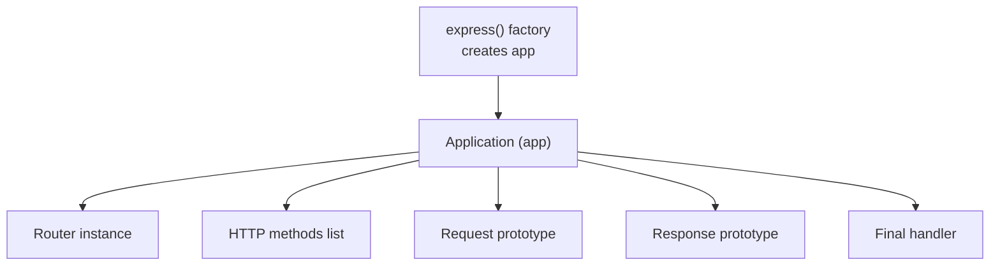
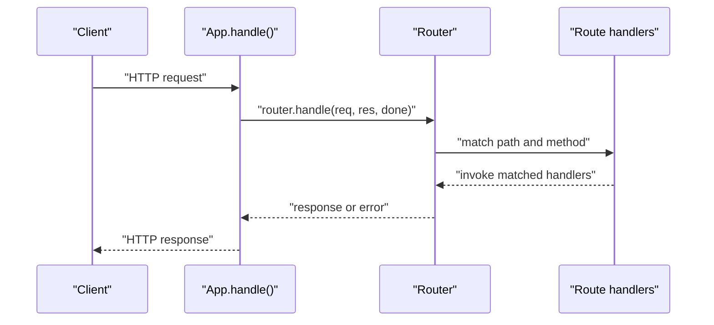
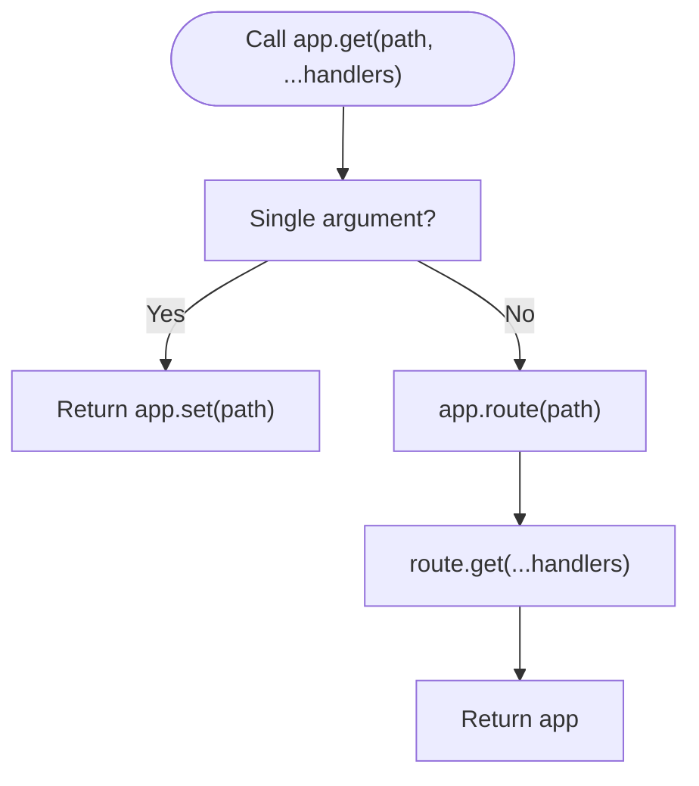
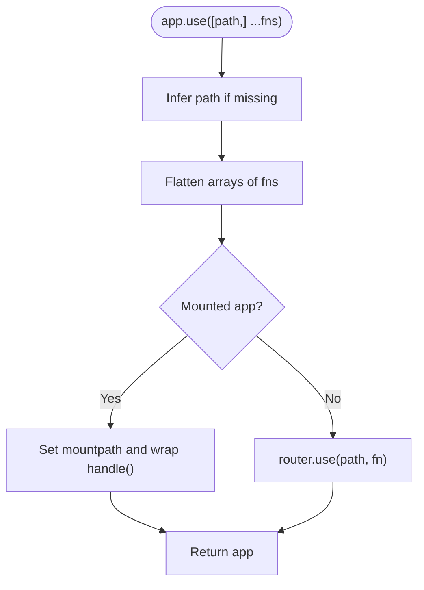
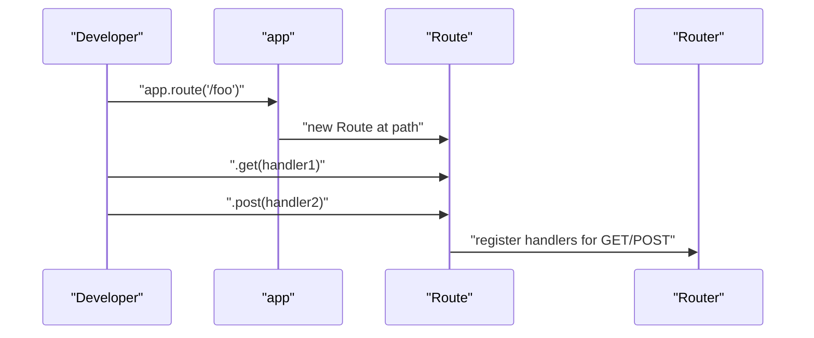
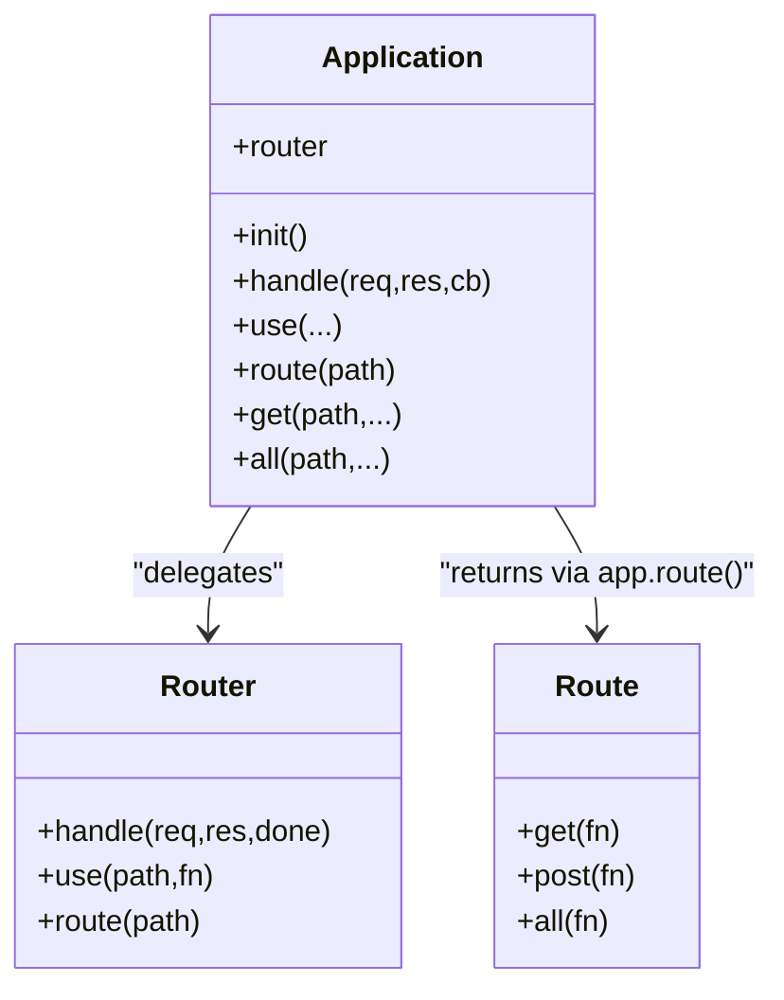
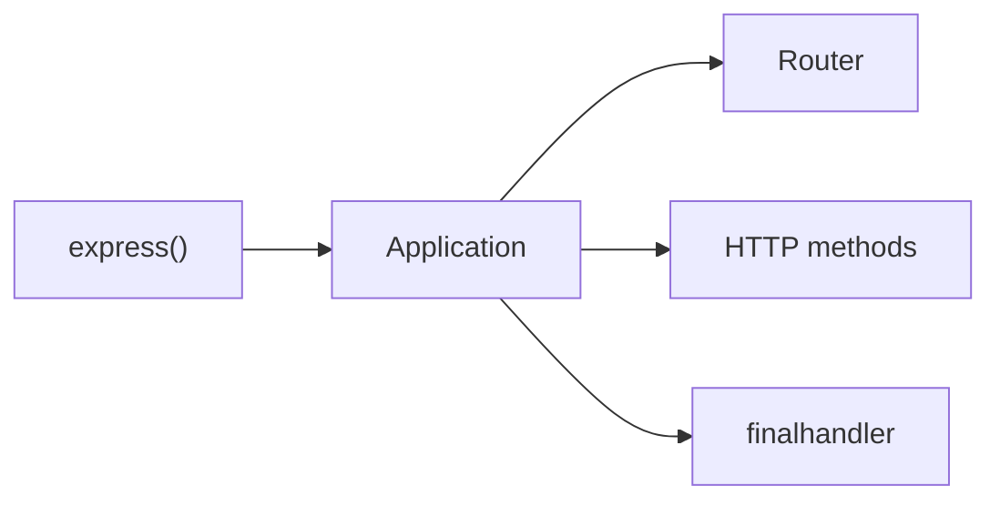

# Route Definition

<cite>
**Referenced Files in This Document**
- [lib/application.js](file://lib/application.js)
- [lib/express.js](file://lib/express.js)
- [lib/utils.js](file://lib/utils.js)
- [test/app.route.js](file://test/app.route.js)
- [test/app.use.js](file://test/app.use.js)
- [examples/hello-world/index.js](file://examples/hello-world/index.js)
- [examples/resource/index.js](file://examples/resource/index.js)
- [examples/route-separation/index.js](file://examples/route-separation/index.js)
- [examples/route-separation/user.js](file://examples/route-separation/user.js)
- [examples/multi-router/controllers/api_v1.js](file://examples/multi-router/controllers/api_v1.js)
- [examples/multi-router/controllers/api_v2.js](file://examples/multi-router/controllers/api_v2.js)
- [examples/route-map/index.js](file://examples/route-map/index.js)
- [examples/params/index.js](file://examples/params/index.js)
</cite>

## Table of Contents
1. [Introduction](#introduction)
2. [Project Structure](#project-structure)
3. [Core Components](#core-components)
4. [Architecture Overview](#architecture-overview)
5. [Detailed Component Analysis](#detailed-component-analysis)
6. [Dependency Analysis](#dependency-analysis)
7. [Performance Considerations](#performance-considerations)
8. [Troubleshooting Guide](#troubleshooting-guide)
9. [Conclusion](#conclusion)

## Introduction
This document explains how to define routes in Express.js, focusing on the app.method() pattern for HTTP verbs (GET, POST, PUT, DELETE, etc.), route path specification, registration via app.use(), and the relationship between app.route() and individual method calls. It also covers route path patterns, dynamic segments, middleware integration, and how the internal Router stores and processes routes. Practical examples are referenced from the repository’s examples and tests to demonstrate syntax, method chaining, and organizational strategies.

## Project Structure
Express exposes a factory that creates an application with routing capabilities. The application delegates HTTP verb routing to a Router instance and supports middleware registration via app.use(). Utility helpers define supported HTTP methods. Examples and tests illustrate route patterns, middleware, and advanced routing strategies.

**Diagram sources**
- [lib/express.js:36-56](file://lib/express.js#L36-L56)
- [lib/application.js:59-83](file://lib/application.js#L59-L83)
- [lib/utils.js:29](file://lib/utils.js#L29)

**Section sources**
- [lib/express.js:36-56](file://lib/express.js#L36-L56)
- [lib/application.js:59-83](file://lib/application.js#L59-L83)
- [lib/utils.js:29](file://lib/utils.js#L29)

## Core Components
- Application (app): Initializes a lazy Router, proxies HTTP verb methods, and handles requests/responses.
- Router: Underlying routing engine that stores routes and matches incoming requests.
- Methods list: Derived from Node’s HTTP methods, enabling app.get, app.post, etc.
- app.use(): Registers middleware and nested applications at specific paths.

Key behaviors:
- app.get(path) returns a setting when called with a single argument; otherwise it registers a route.
- app.method(path, ...handlers) delegates to app.route(path)[method](...handlers).
- app.route(path) returns a Route instance for chaining verb methods.
- app.use([path,] ...fns) mounts middleware or nested apps.

**Section sources**
- [lib/application.js:468-503](file://lib/application.js#L468-L503)
- [lib/application.js:256-258](file://lib/application.js#L256-L258)
- [lib/application.js:190-244](file://lib/application.js#L190-L244)
- [lib/utils.js:29](file://lib/utils.js#L29)

## Architecture Overview
Express routes are processed through the application’s request handler, which delegates to the Router. The Router maintains route definitions and executes matching handlers in order. Middleware registered via app.use() runs before route handlers and can modify request/response or short-circuit the chain.

**Diagram sources**
- [lib/application.js:152-178](file://lib/application.js#L152-L178)

**Section sources**
- [lib/application.js:152-178](file://lib/application.js#L152-L178)

## Detailed Component Analysis

### HTTP Verb Routing with app.method()
- Dynamic delegation: app[method] is generated for each HTTP method in utils.methods.
- Behavior differentiation:
  - app.get(path) with a single argument reads a setting.
  - app.get(path, ...handlers) registers a GET route via app.route(path).
- Method chaining: app.route(path) returns a Route object supporting .get(), .post(), etc.

**Diagram sources**
- [lib/application.js:468-482](file://lib/application.js#L468-L482)
- [lib/application.js:256-258](file://lib/application.js#L256-L258)
- [lib/utils.js:29](file://lib/utils.js#L29)

**Section sources**
- [lib/application.js:468-482](file://lib/application.js#L468-L482)
- [lib/application.js:256-258](file://lib/application.js#L256-L258)
- [lib/utils.js:29](file://lib/utils.js#L29)

### Route Registration via app.use()
- Path inference: If the first argument is not a function, it is treated as a path with default '/'.
- Flattening: Accepts arrays and nested arrays of middleware, flattening into a single list.
- Express app mounting: When a mounted app is provided, app.use() sets mountpath and parent, and wraps handle() to restore prototypes.

**Diagram sources**
- [lib/application.js:190-244](file://lib/application.js#L190-L244)

**Section sources**
- [lib/application.js:190-244](file://lib/application.js#L190-L244)

### Relationship Between app.route() and Individual Method Calls
- app.route(path) returns a Route instance.
- Each verb call (e.g., .get, .post) adds handlers to that Route for the given method.
- Tests demonstrate chaining multiple verbs on the same route and dynamic segment handling.

**Diagram sources**
- [lib/application.js:256-258](file://lib/application.js#L256-L258)
- [test/app.route.js:10-21](file://test/app.route.js#L10-L21)

**Section sources**
- [lib/application.js:256-258](file://lib/application.js#L256-L258)
- [test/app.route.js:10-21](file://test/app.route.js#L10-L21)

### Route Path Patterns, Wildcards, and Dynamic Segments
- Dynamic segments: Paths like '/:foo' capture parameters via req.params.
- Arrays of paths: app.use(['/foo/', '/bar'], ...) applies middleware to multiple prefixes.
- Regular expressions: app.use(/^\/[a-z]oo/, ...) matches arbitrary patterns.
- Empty string path: app.use('', ...) applies to all requests.

Practical examples:
- Dynamic route: [examples/params/index.js:55-68](file://examples/params/index.js#L55-L68)
- Multiple paths: [test/app.use.js:448-467](file://test/app.use.js#L448-L467)
- RegExp path: [test/app.use.js:505-528](file://test/app.use.js#L505-L528)
- Empty string path: [test/app.use.js:530-540](file://test/app.use.js#L530-L540)

**Section sources**
- [test/app.use.js:448-467](file://test/app.use.js#L448-L467)
- [test/app.use.js:505-528](file://test/app.use.js#L505-L528)
- [test/app.use.js:530-540](file://test/app.use.js#L530-L540)
- [examples/params/index.js:55-68](file://examples/params/index.js#L55-L68)

### Basic Route Structure and Method Chaining
- Single verb: app.get('/path', handler).
- Chained verbs: app.route('/path').get(...).post(...).
- All methods: app.all('/path', ...handlers) registers the same middleware for all HTTP methods.

References:
- Chained verbs: [test/app.route.js:10-21](file://test/app.route.js#L10-L21)
- app.all(): [lib/application.js:494-503](file://lib/application.js#L494-L503)

**Section sources**
- [test/app.route.js:10-21](file://test/app.route.js#L10-L21)
- [lib/application.js:494-503](file://lib/application.js#L494-L503)

### Route Precedence, Path Resolution, and Organization Strategies
- Middleware ordering: app.use(...) registers middleware globally or at a prefix; order matters.
- Nested apps: Mounting sub-apps at specific paths allows modular organization.
- Route separation: Split routes into separate modules and compose them in a central app.
- Resource-style helpers: Define convenience methods (e.g., app.resource) to generate CRUD-like routes.

References:
- Middleware ordering and global middleware: [test/app.use.js:125-171](file://test/app.use.js#L125-L171)
- Mounting nested apps: [test/app.use.js:21-123](file://test/app.use.js#L21-L123)
- Route separation: [examples/route-separation/index.js:36-46](file://examples/route-separation/index.js#L36-L46)
- Multi-router composition: [examples/multi-router/controllers/api_v1.js:5-15](file://examples/multi-router/controllers/api_v1.js#L5-L15), [examples/multi-router/controllers/api_v2.js:5-15](file://examples/multi-router/controllers/api_v2.js#L5-L15)
- Resource helper: [examples/resource/index.js:13-26](file://examples/resource/index.js#L13-L26)

**Section sources**
- [test/app.use.js:125-171](file://test/app.use.js#L125-L171)
- [test/app.use.js:21-123](file://test/app.use.js#L21-L123)
- [examples/route-separation/index.js:36-46](file://examples/route-separation/index.js#L36-L46)
- [examples/multi-router/controllers/api_v1.js:5-15](file://examples/multi-router/controllers/api_v1.js#L5-L15)
- [examples/multi-router/controllers/api_v2.js:5-15](file://examples/multi-router/controllers/api_v2.js#L5-L15)
- [examples/resource/index.js:13-26](file://examples/resource/index.js#L13-L26)

### Underlying Router Implementation and Internal Storage
- Lazy initialization: app.router is created on first access with options like case-sensitive and strict routing.
- Delegation: app.handle delegates to router.handle, which matches paths/methods and invokes handlers.
- Route storage: Router manages route definitions and middleware stacks; app.route() returns a Route object that registers handlers per method.

**Diagram sources**
- [lib/application.js:59-83](file://lib/application.js#L59-L83)
- [lib/application.js:152-178](file://lib/application.js#L152-L178)
- [lib/application.js:256-258](file://lib/application.js#L256-L258)

**Section sources**
- [lib/application.js:59-83](file://lib/application.js#L59-L83)
- [lib/application.js:152-178](file://lib/application.js#L152-L178)
- [lib/application.js:256-258](file://lib/application.js#L256-L258)

### Practical Examples and Patterns
- Hello world: [examples/hello-world/index.js:7-9](file://examples/hello-world/index.js#L7-L9)
- Route separation: [examples/route-separation/index.js:36-46](file://examples/route-separation/index.js#L36-L46), [examples/route-separation/user.js:14-24](file://examples/route-separation/user.js#L14-L24)
- Multi-router composition: [examples/multi-router/controllers/api_v1.js:5-15](file://examples/multi-router/controllers/api_v1.js#L5-L15), [examples/multi-router/controllers/api_v2.js:5-15](file://examples/multi-router/controllers/api_v2.js#L5-L15)
- Route map generator: [examples/route-map/index.js:14-29](file://examples/route-map/index.js#L14-L29)
- Parameter parsing: [examples/params/index.js:23-41](file://examples/params/index.js#L23-L41)
- Resource helper: [examples/resource/index.js:13-26](file://examples/resource/index.js#L13-L26)

**Section sources**
- [examples/hello-world/index.js:7-9](file://examples/hello-world/index.js#L7-L9)
- [examples/route-separation/index.js:36-46](file://examples/route-separation/index.js#L36-L46)
- [examples/route-separation/user.js:14-24](file://examples/route-separation/user.js#L14-L24)
- [examples/multi-router/controllers/api_v1.js:5-15](file://examples/multi-router/controllers/api_v1.js#L5-L15)
- [examples/multi-router/controllers/api_v2.js:5-15](file://examples/multi-router/controllers/api_v2.js#L5-L15)
- [examples/route-map/index.js:14-29](file://examples/route-map/index.js#L14-L29)
- [examples/params/index.js:23-41](file://examples/params/index.js#L23-L41)
- [examples/resource/index.js:13-26](file://examples/resource/index.js#L13-L26)

## Dependency Analysis
Express depends on:
- Router (external) for route matching and handler invocation.
- Node’s HTTP methods list for supported HTTP verbs.
- Final handler for default error responses.

**Diagram sources**
- [lib/express.js:19](file://lib/express.js#L19)
- [lib/utils.js:29](file://lib/utils.js#L29)
- [lib/application.js:16](file://lib/application.js#L16)

**Section sources**
- [lib/express.js:19](file://lib/express.js#L19)
- [lib/utils.js:29](file://lib/utils.js#L29)
- [lib/application.js:16](file://lib/application.js#L16)

## Performance Considerations
- Keep route order efficient: place more specific paths before general ones to minimize matching overhead.
- Prefer app.use() for shared middleware to avoid duplicating logic inside route handlers.
- Use app.route() to group related handlers for the same path, reducing repeated path parsing.
- Avoid overly broad regular expressions; prefer explicit paths or constrained regex patterns.

## Troubleshooting Guide
Common issues and diagnostics:
- No route matched: Ensure the path and method match; verify middleware does not block the request prematurely.
- Incorrect parameter extraction: Confirm dynamic segment names and types align with route definitions.
- Middleware not invoked: Check app.use() path prefix and order; confirm next() is called or an error is passed.
- Mounted app not responding: Verify mount path and that the child app is emitting the mount event and has routes registered.

Relevant references:
- Middleware invocation and path stripping: [test/app.use.js:284-294](file://test/app.use.js#L284-L294)
- Multiple arrays and nested arrays: [test/app.use.js:229-255](file://test/app.use.js#L229-L255)
- Mounted app behavior: [test/app.use.js:21-123](file://test/app.use.js#L21-L123)

**Section sources**
- [test/app.use.js:284-294](file://test/app.use.js#L284-L294)
- [test/app.use.js:229-255](file://test/app.use.js#L229-L255)
- [test/app.use.js:21-123](file://test/app.use.js#L21-L123)

## Conclusion
Express route definition centers on the app.method() pattern for HTTP verbs, with app.route() enabling method chaining and app.use() registering middleware and nested applications. The Router instance stores and matches routes, honoring path specificity and middleware order. By organizing routes into modules, leveraging dynamic segments, and composing middleware thoughtfully, you can build scalable and maintainable APIs and web applications.