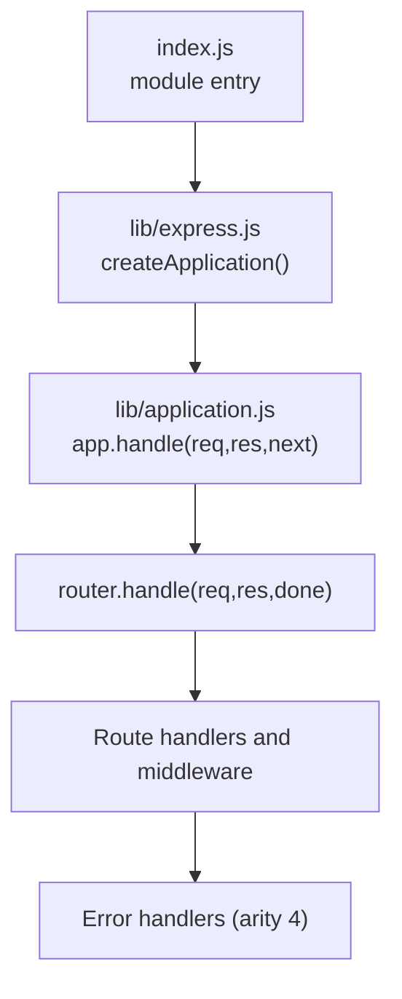
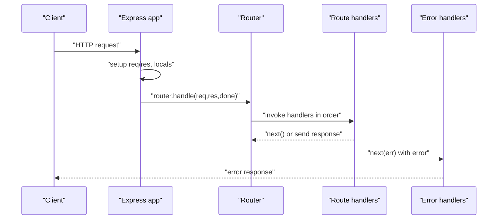
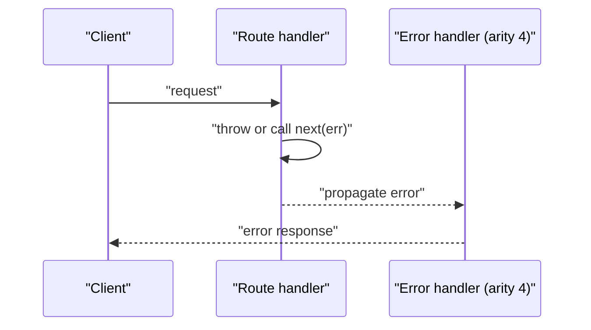
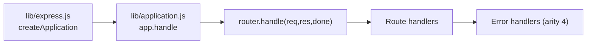

# Route Handlers

<cite>
**Referenced Files in This Document**
- [index.js](file://index.js)
- [lib/express.js](file://lib/express.js)
- [lib/application.js](file://lib/application.js)
- [examples/hello-world/index.js](file://examples/hello-world/index.js)
- [examples/params/index.js](file://examples/params/index.js)
- [examples/resource/index.js](file://examples/resource/index.js)
- [examples/route-middleware/index.js](file://examples/route-middleware/index.js)
- [examples/route-separation/index.js](file://examples/route-separation/index.js)
- [examples/multi-router/index.js](file://examples/multi-router/index.js)
- [examples/error/index.js](file://examples/error/index.js)
- [examples/error-pages/index.js](file://examples/error-pages/index.js)
- [test/app.router.js](file://test/app.router.js)
- [test/app.route.js](file://test/app.route.js)
- [test/app.routes.error.js](file://test/app.routes.error.js)
</cite>

## Table of Contents
1. [Introduction](#introduction)
2. [Project Structure](#project-structure)
3. [Core Components](#core-components)
4. [Architecture Overview](#architecture-overview)
5. [Detailed Component Analysis](#detailed-component-analysis)
6. [Dependency Analysis](#dependency-analysis)
7. [Performance Considerations](#performance-considerations)
8. [Troubleshooting Guide](#troubleshooting-guide)
9. [Conclusion](#conclusion)

## Introduction
This document explains how Express.js route handlers work, focusing on handler function signatures, parameter structure (req, res, next), asynchronous patterns, execution order, chaining, and error handling. It synthesizes implementation details from the core application and router plumbing with practical examples and tests that demonstrate handler behavior, middleware integration, and error propagation.

## Project Structure
Express exposes a factory that creates an application function. That function delegates HTTP request handling to an internal router. Route handlers are attached to routes and executed in the order they are registered. Error-handling middleware intercepts errors thrown or passed via next(err).

**Diagram sources**
- [index.js:11](file://index.js#L11)
- [lib/express.js:36-56](file://lib/express.js#L36-L56)
- [lib/application.js:152-178](file://lib/application.js#L152-L178)

**Section sources**
- [index.js:11](file://index.js#L11)
- [lib/express.js:36-56](file://lib/express.js#L36-L56)
- [lib/application.js:152-178](file://lib/application.js#L152-L178)

## Core Components
- Handler signature: req, res, next. The next function advances to the next handler or completes the request.
- Handler types:
  - Synchronous: return directly or call next() synchronously.
  - Asynchronous with callbacks: call next(err) or next() after async completion.
  - Promise-based: return a Promise that may reject to propagate errors.
  - Async/await: write async functions; errors propagate via next(err) or unhandled rejections.
- Execution order: handlers are invoked in registration order until an error is encountered or a response is sent.
- Error propagation: call next(err) with an error object or throw; Express routes to the nearest error handler.

Practical examples and tests demonstrate these patterns across the repository.

**Section sources**
- [examples/hello-world/index.js:7-9](file://examples/hello-world/index.js#L7-L9)
- [examples/params/index.js:23-41](file://examples/params/index.js#L23-L41)
- [examples/route-middleware/index.js:25-84](file://examples/route-middleware/index.js#L25-L84)
- [examples/error/index.js:14-47](file://examples/error/index.js#L14-L47)
- [examples/error-pages/index.js:63-97](file://examples/error-pages/index.js#L63-L97)
- [test/app.router.js:965-976](file://test/app.router.js#L965-L976)
- [test/app.route.js:151-194](file://test/app.route.js#L151-L194)
- [test/app.routes.error.js:33-55](file://test/app.routes.error.js#L33-L55)

## Architecture Overview
The application function delegates to app.handle, which sets up request/response prototypes, locals, and then invokes the router. The router executes the matched route’s handlers in order. If an error occurs, Express routes to error-handling middleware.

**Diagram sources**
- [lib/application.js:152-178](file://lib/application.js#L152-L178)
- [lib/application.js:190-244](file://lib/application.js#L190-L244)
- [examples/error/index.js:29-47](file://examples/error/index.js#L29-L47)
- [examples/error-pages/index.js:91-97](file://examples/error-pages/index.js#L91-L97)

## Detailed Component Analysis

### Handler Signatures and Parameter Structure
- req: IncomingMessage wrapper with additional properties and helpers.
- res: ServerResponse wrapper with convenience methods.
- next: Function to advance to the next handler. Passing an argument to next(err) triggers error handling.

These wrappers are attached to the application’s request and response prototypes during initialization.

**Section sources**
- [lib/express.js:44-52](file://lib/express.js#L44-L52)
- [lib/application.js:169-170](file://lib/application.js#L169-L170)

### Synchronous Handlers
- Typical pattern: read from req, compute, and send via res. If no response is sent, call next() to continue the chain.
- Demonstrated in basic route definitions and parameter parsing.

**Section sources**
- [examples/hello-world/index.js:7-9](file://examples/hello-world/index.js#L7-L9)
- [examples/params/index.js:47-68](file://examples/params/index.js#L47-L68)

### Asynchronous Handlers with Callbacks
- Call next(err) or next() after asynchronous operations complete.
- Useful for I/O-bound tasks like database reads or HTTP requests.

**Section sources**
- [examples/error/index.js:34-42](file://examples/error/index.js#L34-L42)

### Promise-Based Handlers
- Returning a rejected Promise propagates an error to the error handler.
- Tests confirm that rejected promises are treated as errors and handled by error handlers.

**Section sources**
- [test/app.router.js:965-976](file://test/app.router.js#L965-L976)
- [test/app.route.js:151-194](file://test/app.route.js#L151-L194)

### Async/Await Handlers
- Writing async functions allows natural error propagation via next(err) or unhandled rejections.
- Tests demonstrate Promise rejection semantics apply to async functions returning rejected Promises.

**Section sources**
- [test/app.router.js:965-976](file://test/app.router.js#L965-L976)
- [test/app.route.js:151-194](file://test/app.route.js#L151-L194)

### Handler Chaining and Execution Order
- Handlers are executed in the order registered on a route or middleware stack.
- A route can have multiple handlers; each can call next() or send a response.
- Tests show that calling next("router") can exit the current router and resume in the parent app.

**Section sources**
- [test/app.router.js:872-901](file://test/app.router.js#L872-L901)
- [test/app.routes.error.js:33-55](file://test/app.routes.error.js#L33-L55)

### Error Propagation and Error Handlers
- Throwables and next(err) both propagate errors.
- Error handlers are identified by arity 4: (err, req, res, next).
- Tests demonstrate that errors are caught by the nearest error handler and that route-level error handlers can intercept errors from earlier handlers in the same route.

**Diagram sources**
- [examples/error/index.js:29-47](file://examples/error/index.js#L29-L47)
- [examples/error-pages/index.js:91-97](file://examples/error-pages/index.js#L91-L97)
- [test/app.routes.error.js:33-55](file://test/app.routes.error.js#L33-L55)

### Middleware Integration and Composition
- app.use registers middleware globally or at a path.
- Route-specific middleware can be composed by passing multiple functions to route methods.
- Examples show composing parameter loaders, role checks, and CRUD-like handlers.

**Section sources**
- [lib/application.js:190-244](file://lib/application.js#L190-L244)
- [examples/route-middleware/index.js:25-84](file://examples/route-middleware/index.js#L25-L84)
- [examples/route-separation/index.js:36-46](file://examples/route-separation/index.js#L36-L46)

### Handler Scope and Variable Access
- Handlers can mutate req and res (e.g., attaching user objects, status codes).
- Middleware can prepare data for downstream handlers (e.g., authentication, user loading).
- Parameter parsing middleware populates req.params and req.query.

**Section sources**
- [examples/route-middleware/index.js:25-68](file://examples/route-middleware/index.js#L25-L68)
- [examples/params/index.js:23-41](file://examples/params/index.js#L23-L41)

### Practical Patterns and Examples
- Basic GET handler: [examples/hello-world/index.js:7-9](file://examples/hello-world/index.js#L7-L9)
- Parameter parsing and validation: [examples/params/index.js:23-41](file://examples/params/index.js#L23-L41)
- Resource-style routes: [examples/resource/index.js:13-26](file://examples/resource/index.js#L13-L26)
- Route middleware composition: [examples/route-middleware/index.js:25-84](file://examples/route-middleware/index.js#L25-L84)
- Multi-router composition: [examples/multi-router/index.js:7-8](file://examples/multi-router/index.js#L7-L8)
- Separated routers and controllers: [examples/route-separation/index.js:13-15](file://examples/route-separation/index.js#L13-L15)

## Dependency Analysis
Express’s handler execution depends on:
- Application initialization and prototype attachment.
- Router invocation and handler dispatch.
- Error handler registration and arity detection.

**Diagram sources**
- [lib/express.js:36-56](file://lib/express.js#L36-L56)
- [lib/application.js:152-178](file://lib/application.js#L152-L178)

**Section sources**
- [lib/express.js:36-56](file://lib/express.js#L36-L56)
- [lib/application.js:152-178](file://lib/application.js#L152-L178)

## Performance Considerations
- Minimize synchronous blocking work in handlers; prefer streaming and non-blocking I/O.
- Avoid heavy computations in hot paths; offload to background workers when possible.
- Keep handler chains short and focused to reduce latency and improve maintainability.

## Troubleshooting Guide
Common issues and resolutions:
- Unhandled errors: Ensure an error handler with arity 4 is registered after all routes and middleware.
- Forgetting next(): If a handler does not send a response and does not call next(), the request hangs.
- Promise rejections: Return rejected promises or await async operations properly; ensure error handlers catch them.
- Route vs error handler ordering: Place error handlers after routes; otherwise they will not receive thrown or next(err) errors.

**Section sources**
- [examples/error/index.js:14-47](file://examples/error/index.js#L14-L47)
- [examples/error-pages/index.js:63-97](file://examples/error-pages/index.js#L63-L97)
- [test/app.router.js:965-976](file://test/app.router.js#L965-L976)
- [test/app.routes.error.js:9-23](file://test/app.routes.error.js#L9-L23)

## Conclusion
Express route handlers follow a consistent pattern: req, res, next. They can be synchronous, callback-based, Promise-based, or async/await. Execution proceeds in registration order, with next() advancing the chain and next(err) triggering error handling. Proper composition, clear error handling, and mindful middleware placement lead to robust and maintainable APIs.