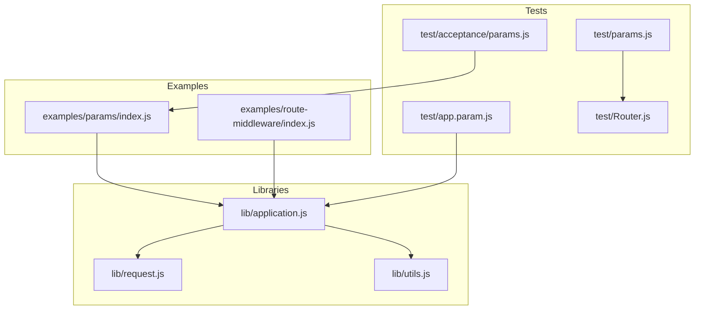
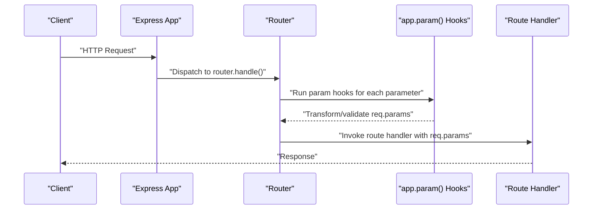
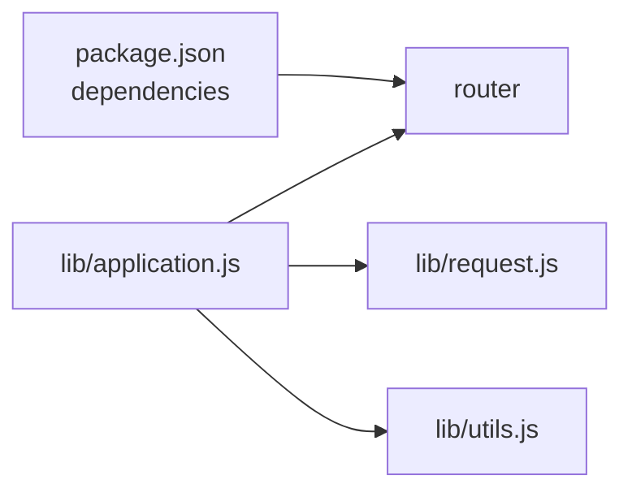

# Route Parameters

<cite>
**Referenced Files in This Document**
- [examples/params/index.js](file://examples/params/index.js)
- [examples/route-middleware/index.js](file://examples/route-middleware/index.js)
- [lib/application.js](file://lib/application.js)
- [lib/request.js](file://lib/request.js)
- [lib/utils.js](file://lib/utils.js)
- [test/acceptance/params.js](file://test/acceptance/params.js)
- [test/app.param.js](file://test/app.param.js)
- [test/params.js](file://test/params.js)
- [test/Router.js](file://test/Router.js)
- [package.json](file://package.json)
</cite>

## Table of Contents
1. [Introduction](#introduction)
2. [Project Structure](#project-structure)
3. [Core Components](#core-components)
4. [Architecture Overview](#architecture-overview)
5. [Detailed Component Analysis](#detailed-component-analysis)
6. [Dependency Analysis](#dependency-analysis)
7. [Performance Considerations](#performance-considerations)
8. [Troubleshooting Guide](#troubleshooting-guide)
9. [Conclusion](#conclusion)
10. [Appendices](#appendices)

## Introduction
This document explains how Express.js handles route parameters extracted from URL paths. It covers how parameters are captured, stored in req.params, how app.param() enables custom processing and validation, and how to apply transformations and validations. It also documents optional parameters, wildcard segments, and how parameters relate to query parameters. Practical examples and security considerations are included to help you build robust APIs.

## Project Structure
The repository organizes route parameter behavior across:
- Example applications demonstrating parameter extraction and middleware-driven parameter loading
- Core libraries that implement parameter handling and request helpers
- Comprehensive tests validating parameter behavior, transformations, and edge cases

**Diagram sources**
- [examples/params/index.js:1-75](file://examples/params/index.js#L1-L75)
- [examples/route-middleware/index.js:1-91](file://examples/route-middleware/index.js#L1-L91)
- [lib/application.js:322-334](file://lib/application.js#L322-L334)
- [lib/request.js:230-241](file://lib/request.js#L230-L241)
- [lib/utils.js:162-184](file://lib/utils.js#L162-L184)
- [test/acceptance/params.js:1-45](file://test/acceptance/params.js#L1-L45)
- [test/app.param.js:1-324](file://test/app.param.js#L1-L324)
- [test/params.js:1-200](file://test/params.js#L1-L200)
- [test/Router.js:500-597](file://test/Router.js#L500-L597)

**Section sources**
- [package.json:1-100](file://package.json#L1-L100)

## Core Components
- Route parameter extraction: Express captures named segments from the URL path and exposes them in req.params.
- Parameter middleware: app.param() registers handlers that run when a route parameter is encountered, enabling transformation, validation, and preloading resources.
- Parameter types and conversions: Parameters are strings by default; you can convert them to numbers, booleans, or objects.
- Optional and wildcard parameters: Express supports optional segments and wildcard segments for flexible routing.
- Relationship to query parameters: req.query holds parsed query string values; parameters are separate from query parameters.

**Section sources**
- [examples/params/index.js:23-41](file://examples/params/index.js#L23-L41)
- [lib/application.js:322-334](file://lib/application.js#L322-L334)
- [lib/request.js:230-241](file://lib/request.js#L230-L241)
- [test/acceptance/params.js:1-45](file://test/acceptance/params.js#L1-L45)

## Architecture Overview
Express routes parameters through the router and application layers. When a request arrives, the router extracts path segments into req.params. app.param() hooks can transform or validate these values before route handlers execute.

**Diagram sources**
- [lib/application.js:152-178](file://lib/application.js#L152-L178)
- [lib/application.js:322-334](file://lib/application.js#L322-L334)
- [test/Router.js:511-525](file://test/Router.js#L511-L525)

## Detailed Component Analysis

### Parameter Extraction from URL Paths
- Named parameters: Colon-prefixed tokens in the path become keys in req.params.
- Multiple parameters: Multiple named segments are supported.
- Literal segments: Non-parameter parts of the path must match exactly.
- Regular expressions and arrays of paths: Advanced patterns and multiple paths are supported.

Practical examples:
- Single parameter: GET /user/:id
- Multiple parameters: GET /user/:id/action/:op
- Optional parameter: GET /user/:user{/:op}
- Wildcards: GET /user/*path
- Arrays of paths: GET ['/user/:user/poke','/user/:user/pokes']

Validation and behavior are covered in tests for arrays, optional segments, wildcards, and regex-based paths.

**Section sources**
- [test/acceptance/params.js:1-45](file://test/acceptance/params.js#L1-L45)
- [test/Router.js:618-769](file://test/Router.js#L618-L769)

### req.params Object Structure and Types
- req.params is a plain object keyed by parameter names.
- Values are strings by default; you can convert them in parameter middleware.
- Numeric indices are used for unnamed capture groups in regular expressions.
- Merging parameters across nested routers is supported when configured.

Key behaviors validated by tests:
- req.params contains expected keys and values
- Numeric indices for regex capture groups
- Merging parameters across nested routers with mergeParams

**Section sources**
- [lib/request.js:230-241](file://lib/request.js#L230-L241)
- [test/Router.js:339-349](file://test/Router.js#L339-L349)
- [test/Router.js:351-381](file://test/Router.js#L351-L381)
- [test/Router.js:383-400](file://test/Router.js#L383-L400)
- [test/Router.js:402-416](file://test/Router.js#L402-L416)

### Parameter Validation and Transformation
- app.param() allows you to register a function that runs whenever a parameter is encountered.
- Inside the hook, you can:
  - Transform values (e.g., parseInt)
  - Validate values (e.g., check existence)
  - Preload resources (e.g., fetch user by ID)
  - Short-circuit with errors or defer to next route

Examples from the repository:
- Converting numeric parameters to integers and returning 400 on failure
- Loading a user by ID and returning 404 if not found
- Altering req.params across routes

**Section sources**
- [examples/params/index.js:23-41](file://examples/params/index.js#L23-L41)
- [test/app.param.js:8-37](file://test/app.param.js#L8-L37)
- [test/app.param.js:116-134](file://test/app.param.js#L116-L134)
- [test/app.param.js:161-177](file://test/app.param.js#L161-L177)

### Optional Parameters and Wildcards
- Optional segments: Use {/:optional} to make a segment optional; req.params.key is undefined when omitted.
- Wildcards:
  - :name* matches one or more path segments (stored as an array)
  - :name+ matches one or more segments (alias to *)
  - :name? matches zero or one segment (alias to optional)
- Regex patterns: You can use regular expressions for flexible matching.

Behavior verified by tests:
- Optional segments populate or omit the parameter
- Wildcards join multiple segments appropriately
- Regex patterns capture numeric indices and merge parameters across routers

**Section sources**
- [test/Router.js:676-702](file://test/Router.js#L676-L702)
- [test/Router.js:704-740](file://test/Router.js#L704-L740)
- [test/Router.js:742-769](file://test/Router.js#L742-L769)
- [test/Router.js:339-349](file://test/Router.js#L339-L349)
- [test/Router.js:351-381](file://test/Router.js#L351-L381)

### Parameter Middleware Using app.param()
- Signature: app.param(name, fn(req, res, next, value))
- Can be registered for multiple parameters at once
- Runs once per unique parameter value per request
- Can throw errors, call next('route'), or modify req.params

Behavior validated by tests:
- Single and array registrations
- Single invocation per unique value
- Invocation differences when values change
- Defer to next route and error propagation
- Encoded values are handled correctly

**Section sources**
- [lib/application.js:322-334](file://lib/application.js#L322-L334)
- [test/app.param.js:7-37](file://test/app.param.js#L7-L37)
- [test/app.param.js:60-86](file://test/app.param.js#L60-L86)
- [test/app.param.js:88-114](file://test/app.param.js#L88-L114)
- [test/app.param.js:116-134](file://test/app.param.js#L116-L134)
- [test/app.param.js:136-159](file://test/app.param.js#L136-L159)
- [test/app.param.js:161-177](file://test/app.param.js#L161-L177)
- [test/app.param.js:179-215](file://test/app.param.js#L179-L215)
- [test/app.param.js:217-261](file://test/app.param.js#L217-L261)
- [test/app.param.js:263-292](file://test/app.param.js#L263-L292)
- [test/app.param.js:294-321](file://test/app.param.js#L294-L321)

### Relationship Between Route Parameters and Query Parameters
- Route parameters: req.params — derived from the URL path
- Query parameters: req.query — derived from the query string using the configured query parser

The query parser can be:
- Disabled (returns empty object)
- Simple (node:querystring.parse)
- Extended (qs.parse)

**Section sources**
- [lib/request.js:230-241](file://lib/request.js#L230-L241)
- [lib/utils.js:162-184](file://lib/utils.js#L162-L184)

### Practical Examples
- Parameter extraction and transformation:
  - Convert numeric parameters to integers and return 400 on failure
  - Load a user by ID and return 404 if not found
- Validation patterns:
  - Throw errors for invalid values
  - Defer to next route for special cases
- Parameter transformation:
  - Modify req.params to normalize values across routes

These patterns are demonstrated in the examples and tests.

**Section sources**
- [examples/params/index.js:23-41](file://examples/params/index.js#L23-L41)
- [test/acceptance/params.js:1-45](file://test/acceptance/params.js#L1-L45)
- [test/app.param.js:179-215](file://test/app.param.js#L179-L215)

### Security Considerations
- Parameter encoding: app.param() tests confirm that encoded values are handled correctly; ensure your handlers decode values appropriately if needed.
- Parameter validation: Always validate and sanitize parameter values before using them in database queries or external services.
- Parameter middleware: Use app.param() to centralize validation and transformation logic to avoid duplication.
- Avoid exposing internal IDs directly: Consider using surrogate keys and permission checks.

**Section sources**
- [test/app.param.js:161-177](file://test/app.param.js#L161-L177)

## Dependency Analysis
Express depends on the router package for routing and parameter handling. The application layer proxies app.param() to the router and sets up the base router.

**Diagram sources**
- [package.json:57-62](file://package.json#L57-L62)
- [lib/application.js:26-26](file://lib/application.js#L26-L26)
- [lib/application.js:322-334](file://lib/application.js#L322-L334)

**Section sources**
- [package.json:34-62](file://package.json#L34-L62)
- [lib/application.js:26-26](file://lib/application.js#L26-L26)

## Performance Considerations
- app.param() hooks run once per unique parameter value per request; avoid heavy synchronous work in these hooks.
- Prefer asynchronous operations (e.g., database lookups) and cache results when possible.
- Keep parameter validation lightweight; delegate complex logic to dedicated middleware.

[No sources needed since this section provides general guidance]

## Troubleshooting Guide
Common issues and resolutions:
- Parameter not found: Verify the route path matches the URL and that the parameter name is correct.
- Type conversion errors: Ensure your app.param() converts strings to numbers safely and returns appropriate errors.
- Optional parameter undefined: Check for missing segments and provide defaults in your route handler.
- Wildcard parameter mismatch: Confirm whether you expect a single string or an array of segments.
- Encoded values: Ensure your handlers account for percent-encoded values.

Validation and behavior are covered by tests for arrays, optional segments, wildcards, and encoded values.

**Section sources**
- [test/Router.js:618-769](file://test/Router.js#L618-L769)
- [test/Router.js:339-349](file://test/Router.js#L339-L349)
- [test/Router.js:351-381](file://test/Router.js#L351-L381)
- [test/Router.js:383-400](file://test/Router.js#L383-L400)
- [test/Router.js:402-416](file://test/Router.js#L402-L416)
- [test/app.param.js:161-177](file://test/app.param.js#L161-L177)

## Conclusion
Express route parameters provide a powerful mechanism for extracting and transforming data from URLs. Use app.param() to centralize validation and transformation, leverage optional and wildcard segments for flexible routing, and keep security and performance in mind. The examples and tests in this repository demonstrate robust patterns for building reliable APIs.

[No sources needed since this section summarizes without analyzing specific files]

## Appendices

### Best Practices for Parameter Naming and Validation
- Use descriptive parameter names that clearly indicate intent.
- Validate early with app.param() to fail fast.
- Normalize values in parameter middleware (e.g., lowercase usernames, integers).
- Avoid exposing internal identifiers; consider UUIDs or slugs.
- Document parameter constraints and examples in your API documentation.

[No sources needed since this section provides general guidance]