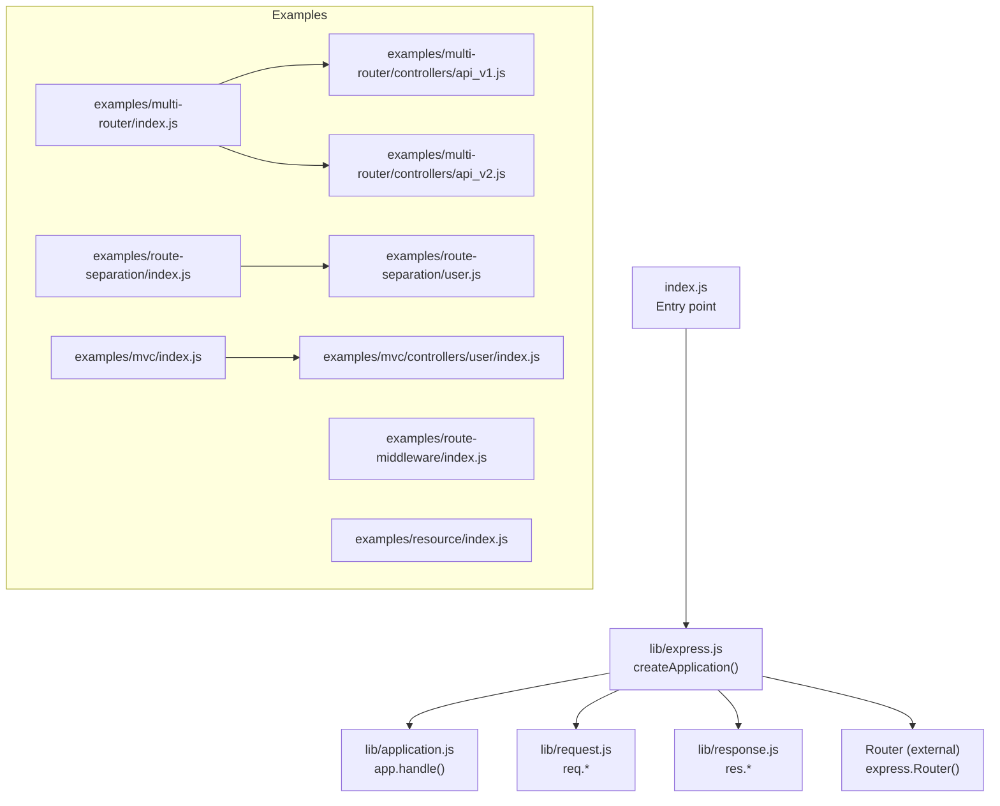
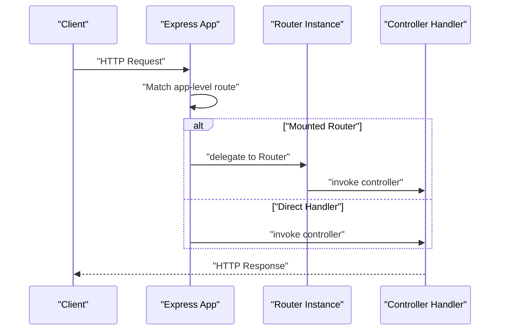
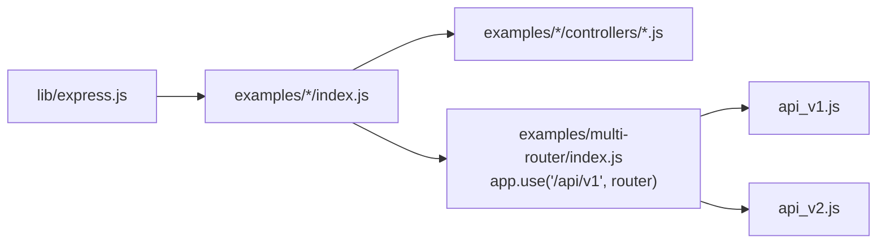

# Routing and Controllers

<cite>
**Referenced Files in This Document**
- [index.js](file://index.js)
- [express.js](file://lib/express.js)
- [application.js](file://lib/application.js)
- [request.js](file://lib/request.js)
- [response.js](file://lib/response.js)
- [multi-router/index.js](file://examples/multi-router/index.js)
- [multi-router/controllers/api_v1.js](file://examples/multi-router/controllers/api_v1.js)
- [multi-router/controllers/api_v2.js](file://examples/multi-router/controllers/api_v2.js)
- [route-separation/index.js](file://examples/route-separation/index.js)
- [route-separation/site.js](file://examples/route-separation/site.js)
- [route-separation/user.js](file://examples/route-separation/user.js)
- [route-separation/post.js](file://examples/route-separation/post.js)
- [route-middleware/index.js](file://examples/route-middleware/index.js)
- [resource/index.js](file://examples/resource/index.js)
- [mvc/index.js](file://examples/mvc/index.js)
- [mvc/lib/boot.js](file://examples/mvc/lib/boot.js)
- [mvc/controllers/main/index.js](file://examples/mvc/controllers/main/index.js)
- [mvc/controllers/user/index.js](file://examples/mvc/controllers/user/index.js)
- [mvc/controllers/pet/index.js](file://examples/mvc/controllers/pet/index.js)
</cite>

## Table of Contents
1. [Introduction](#introduction)
2. [Project Structure](#project-structure)
3. [Core Components](#core-components)
4. [Architecture Overview](#architecture-overview)
5. [Detailed Component Analysis](#detailed-component-analysis)
6. [Dependency Analysis](#dependency-analysis)
7. [Performance Considerations](#performance-considerations)
8. [Troubleshooting Guide](#troubleshooting-guide)
9. [Conclusion](#conclusion)
10. [Appendices](#appendices)

## Introduction
This document explains routing and controller implementation in Express.js using concrete examples from the repository. It covers route definition patterns, HTTP method handling, route parameters, route handlers, parameter extraction, middleware integration, nested routing, router composition, modular route organization, RESTful and resource-based routing, and dynamic route matching. Practical examples demonstrate how to organize routes, integrate middleware, and implement controllers effectively.

## Project Structure
The repository organizes routing and controllers across:
- Core Express internals under lib/, exposing application, request, response, and Router.
- Examples demonstrating modular routing, middleware, MVC separation, and resource-style routing.

**Diagram sources**
- [index.js:1-12](file://index.js#L1-L12)
- [express.js:36-56](file://lib/express.js#L36-L56)
- [express.js:18-21](file://lib/express.js#L18-L21)
- [express.js:19](file://lib/express.js#L19)
- [multi-router/index.js:7-8](file://examples/multi-router/index.js#L7-L8)
- [multi-router/controllers/api_v1.js:5](file://examples/multi-router/controllers/api_v1.js#L5)
- [multi-router/controllers/api_v2.js:5](file://examples/multi-router/controllers/api_v2.js#L5)
- [route-separation/index.js:13-15](file://examples/route-separation/index.js#L13-L15)
- [route-separation/user.js:14-24](file://examples/route-separation/user.js#L14-L24)
- [route-middleware/index.js:25-34](file://examples/route-middleware/index.js#L25-L34)
- [resource/index.js:13-26](file://examples/resource/index.js#L13-L26)
- [mvc/index.js:76](file://examples/mvc/index.js#L76)
- [mvc/controllers/user/index.js:11-22](file://examples/mvc/controllers/user/index.js#L11-L22)

**Section sources**
- [index.js:1-12](file://index.js#L1-L12)
- [express.js:36-56](file://lib/express.js#L36-L56)

## Core Components
- Application creation and request/response prototypes are established in the Express entry point and exposed via lib/express.js.
- Router is imported from the external router package and exposed as express.Router().
- Request and response helpers are attached to the application’s request/response prototypes.

Key responsibilities:
- createApplication(): Initializes the Express app, mixes in EventEmitter, and sets up request/response prototypes.
- Expose Router and middleware helpers (json, raw, text, urlencoded, static).

**Section sources**
- [express.js:36-56](file://lib/express.js#L36-L56)
- [express.js:19](file://lib/express.js#L19)
- [express.js:77-81](file://lib/express.js#L77-L81)

## Architecture Overview
Express composes routing through:
- app-level routes defined with app.METHOD(path, ...handlersOrMiddlewares).
- Router instances mounted at prefixes (nested routing).
- Modular controllers exported as functions receiving (req, res, next).

**Diagram sources**
- [express.js:36-56](file://lib/express.js#L36-L56)
- [multi-router/index.js:7-8](file://examples/multi-router/index.js#L7-L8)
- [multi-router/controllers/api_v1.js:7-13](file://examples/multi-router/controllers/api_v1.js#L7-L13)

## Detailed Component Analysis

### Route Definition Patterns and HTTP Methods
- Define routes with app.METHOD(path, ...handlersOrMiddlewares).
- Methods include get, post, put, delete, all, and others.
- Handlers receive (req, res, next) and can render, redirect, or send responses.

Practical examples:
- Root and nested routes in multi-router.
- Mixed GET/PUT routes and dynamic segments in route-separation.
- Method-specific handlers and middleware chaining in route-middleware.

**Section sources**
- [multi-router/index.js:10-12](file://examples/multi-router/index.js#L10-L12)
- [multi-router/index.js:7-8](file://examples/multi-router/index.js#L7-L8)
- [route-separation/index.js:36-46](file://examples/route-separation/index.js#L36-L46)
- [route-middleware/index.js:74-84](file://examples/route-middleware/index.js#L74-L84)

### Route Parameters and Parameter Extraction
- Dynamic segments like :id and :user_id populate req.params.
- Controllers extract parameters and often load resources (e.g., users, pets).

Patterns:
- Extract id from req.params and resolve entities.
- Use next('route') to skip to next matching route when a parameter does not match expectations.

**Section sources**
- [route-separation/user.js:14-24](file://examples/route-separation/user.js#L14-L24)
- [mvc/controllers/user/index.js:11-22](file://examples/mvc/controllers/user/index.js#L11-L22)
- [mvc/controllers/pet/index.js:11-16](file://examples/mvc/controllers/pet/index.js#L11-L16)

### Route Handlers and Controller Implementation
Controllers are plain functions exported by modules. They:
- Render views or send JSON.
- Modify res.locals or attach messages.
- Redirect after updates.
- Integrate with middleware via next().

Examples:
- MVC main controller redirects to users.
- User controller loads a user, renders show/edit templates, and updates fields.
- Pet controller mirrors user behavior with pet resources.

**Section sources**
- [mvc/controllers/main/index.js:3-5](file://examples/mvc/controllers/main/index.js#L3-L5)
- [mvc/controllers/user/index.js:24-41](file://examples/mvc/controllers/user/index.js#L24-L41)
- [mvc/controllers/pet/index.js:18-31](file://examples/mvc/controllers/pet/index.js#L18-L31)

### Middleware Integration
Middleware can be:
- Mounted globally with app.use(...).
- Applied to specific routes as additional arguments.
- Used for authentication, parsing, sessions, and logging.

Patterns:
- Authentication middleware sets req.authenticatedUser.
- Parameter loading middleware sets req.user and calls next or next(error).
- Role-based restrictions return next(error) for unauthorized access.

**Section sources**
- [route-middleware/index.js:65-68](file://examples/route-middleware/index.js#L65-L68)
- [route-middleware/index.js:25-34](file://examples/route-middleware/index.js#L25-L34)
- [route-middleware/index.js:50-58](file://examples/route-middleware/index.js#L50-L58)
- [route-middleware/index.js:74-84](file://examples/route-middleware/index.js#L74-L84)

### Nested Routing and Router Composition
Express supports composing routers:
- Create routers with express.Router().
- Mount routers at a prefix with app.use(prefix, router).
- Keep route definitions modular and reusable.

Example:
- Two API versions mounted at /api/v1 and /api/v2.
- Each router defines its own routes independently.

**Section sources**
- [multi-router/index.js:7-8](file://examples/multi-router/index.js#L7-L8)
- [multi-router/controllers/api_v1.js:5](file://examples/multi-router/controllers/api_v1.js#L5)
- [multi-router/controllers/api_v2.js:5](file://examples/multi-router/controllers/api_v2.js#L5)

### Modular Route Organization
Organize routes by domain or feature:
- Separate concerns into site.js, user.js, post.js.
- Export controller functions from modules and attach them to app routes.
- Combine middleware and route definitions cleanly.

**Section sources**
- [route-separation/index.js:13-15](file://examples/route-separation/index.js#L13-L15)
- [route-separation/user.js:10-47](file://examples/route-separation/user.js#L10-L47)
- [route-separation/post.js:11-13](file://examples/route-separation/post.js#L11-L13)

### RESTful and Resource-Based Routing
RESTful patterns:
- Standard CRUD endpoints mapped to controller actions.
- Use app.METHOD(path, handler) per action.

Resource-style helpers:
- A custom app.resource(path, controller) maps index, show, destroy, and custom range/format endpoints.

**Section sources**
- [resource/index.js:13-26](file://examples/resource/index.js#L13-L26)
- [resource/index.js:42-67](file://examples/resource/index.js#L42-L67)

### Dynamic Route Matching
Dynamic segments and optional parts:
- Use :param to capture identifiers.
- Use regex-like patterns like :id{/:op} to constrain matches.
- Combine with middleware to enforce constraints.

**Section sources**
- [route-separation/index.js:41](file://examples/route-separation/index.js#L41)
- [route-separation/user.js:14-24](file://examples/route-separation/user.js#L14-L24)

### MVC Bootstrapping Pattern
The MVC example demonstrates:
- Centralized middleware setup (logging, static, sessions, method override, parsers).
- A boot module that loads controllers and attaches them to app routes.
- Global error and 404 handlers.

**Section sources**
- [mvc/index.js:34-89](file://examples/mvc/index.js#L34-L89)
- [mvc/index.js:76](file://examples/mvc/index.js#L76)

## Dependency Analysis
Express exposes Router and integrates middleware helpers. Applications compose routing through:
- app-level routes.
- mounted routers.
- controller modules exporting handler functions.

**Diagram sources**
- [express.js:70-71](file://lib/express.js#L70-L71)
- [multi-router/index.js:7-8](file://examples/multi-router/index.js#L7-L8)
- [multi-router/controllers/api_v1.js:5](file://examples/multi-router/controllers/api_v1.js#L5)
- [multi-router/controllers/api_v2.js:5](file://examples/multi-router/controllers/api_v2.js#L5)

**Section sources**
- [express.js:70-71](file://lib/express.js#L70-L71)
- [multi-router/index.js:7-8](file://examples/multi-router/index.js#L7-L8)

## Performance Considerations
- Prefer early exits and minimal work inside middleware to reduce overhead.
- Use mounted routers to keep route matching scoped and maintainable.
- Avoid overly complex regex-like patterns in routes; prefer clear segment names.
- Cache expensive computations in middleware and reuse across handlers.
- Keep controller logic thin; delegate heavy tasks to services or libraries.

## Troubleshooting Guide
Common issues and remedies:
- Route not matched: Verify path specificity and order; ensure middleware calls next() or returns a response.
- Parameter errors: Validate req.params presence and type; use next('route') to gracefully skip to fallback routes.
- Middleware not applied: Confirm app.use(...) is placed before route definitions or pass middleware directly to routes.
- 404 handling: Add a catch-all route last; ensure it does not block other routes.
- Error propagation: Use next(error) to trigger error-handling middleware; ensure error handlers render appropriate status pages.

**Section sources**
- [route-separation/user.js:14-24](file://examples/route-separation/user.js#L14-L24)
- [route-middleware/index.js:25-34](file://examples/route-middleware/index.js#L25-L34)
- [mvc/index.js:78-89](file://examples/mvc/index.js#L78-L89)

## Conclusion
Express routing and controllers are modular and composable. By organizing routes into mounted routers, separating controllers into modules, integrating middleware thoughtfully, and adopting RESTful patterns, applications remain scalable and maintainable. The examples demonstrate practical patterns for nested routing, parameter handling, middleware integration, and MVC bootstrapping.

## Appendices
- Route definition patterns: Use app.METHOD(path, ...handlersOrMiddlewares) for clarity and modularity.
- Parameter handling: Extract req.params in middleware or controllers; validate and load resources before handlers.
- Middleware integration: Apply global or route-specific middleware; propagate errors with next(error).
- Router composition: Use express.Router() and app.use(prefix, router) for nested routing.
- MVC organization: Centralize middleware, bootstrap controllers, and centralize error/404 handling.