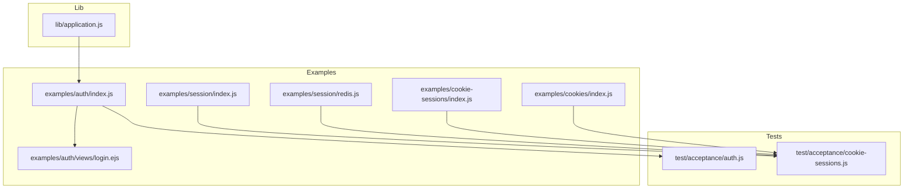
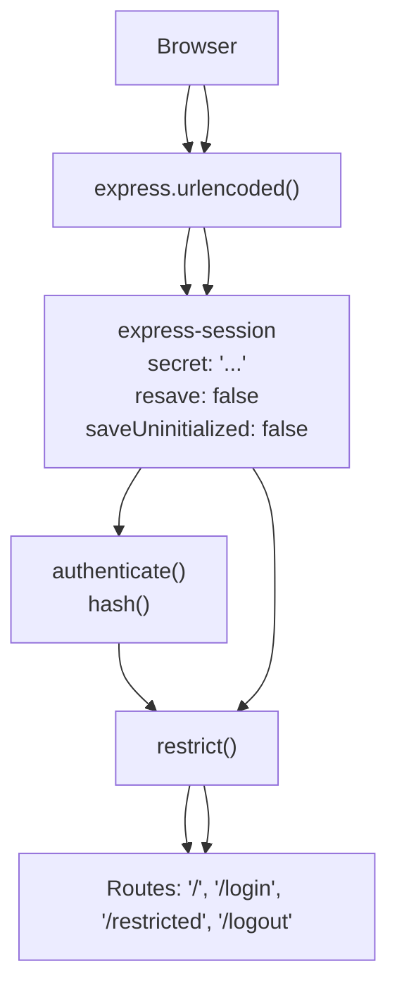
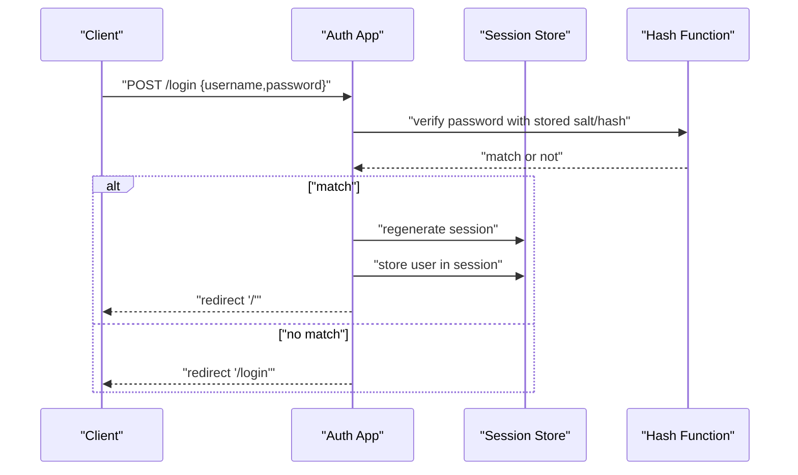
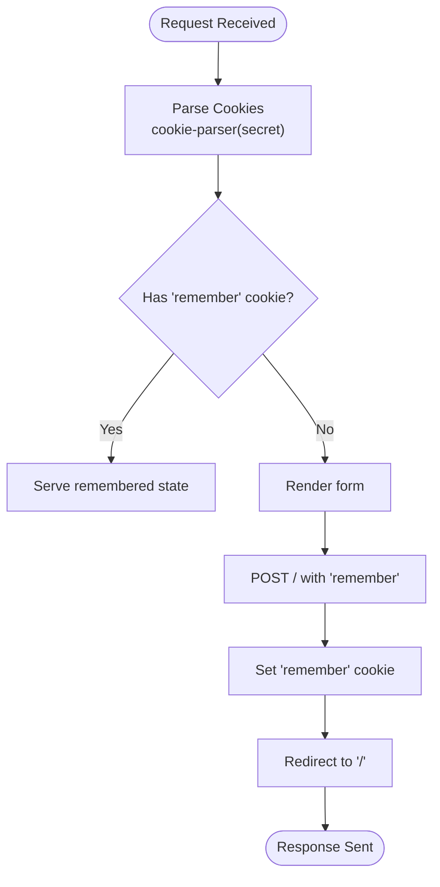
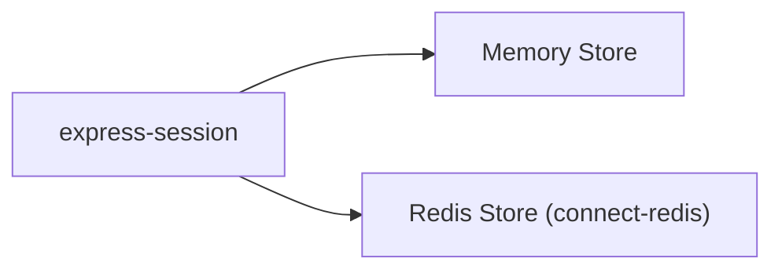
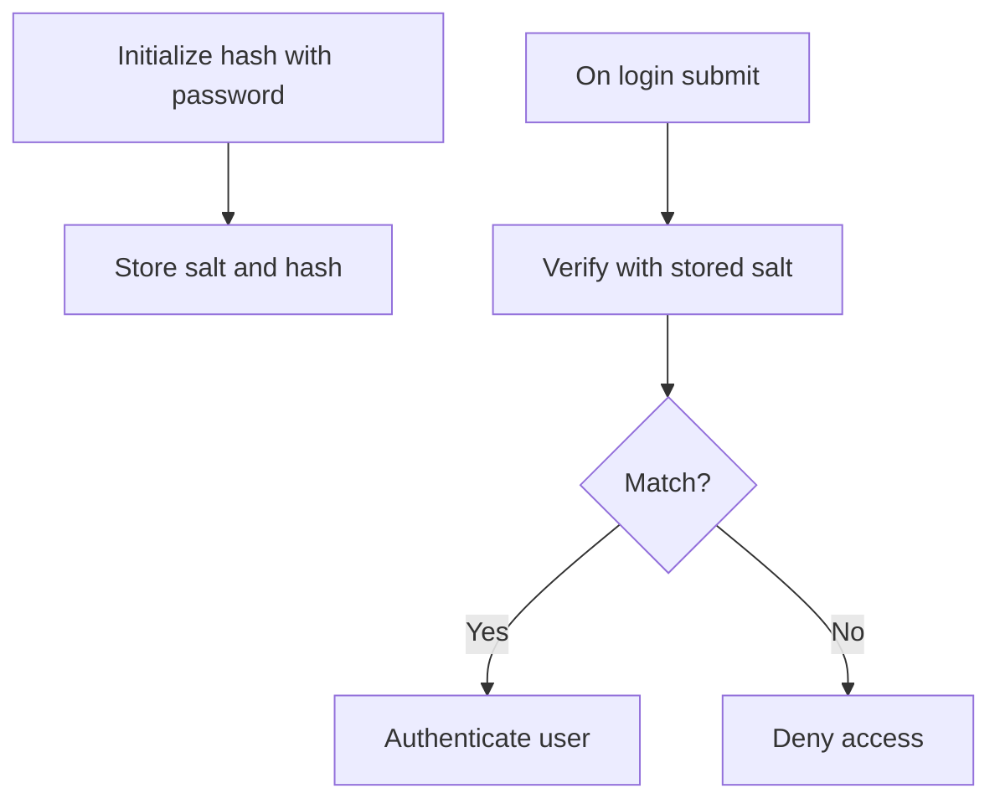
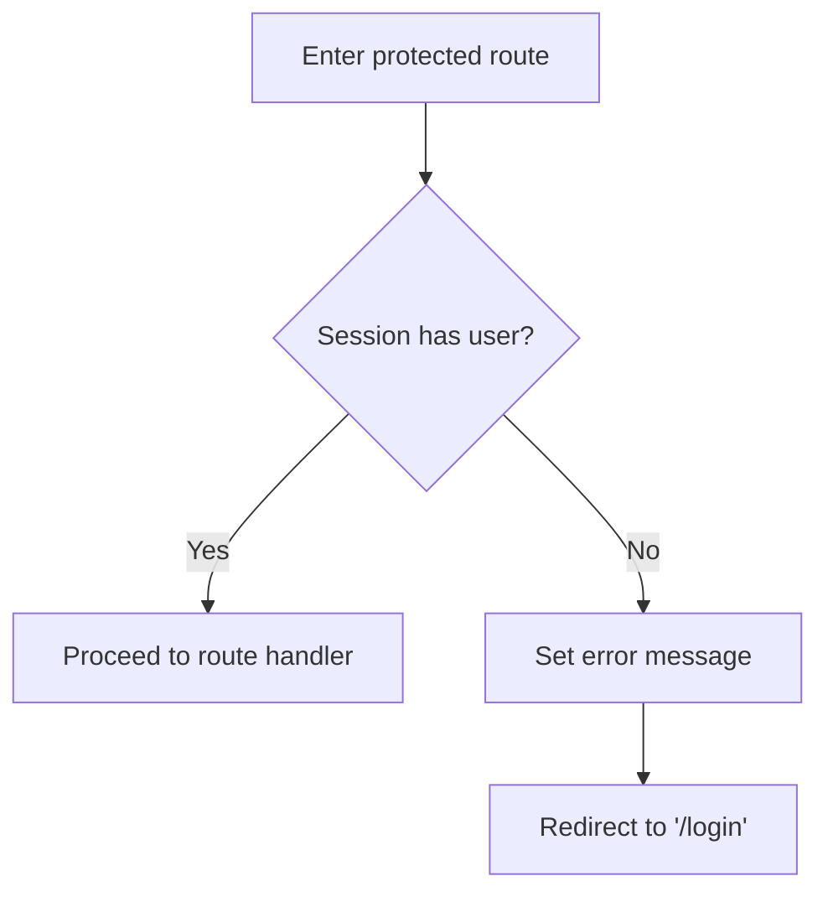
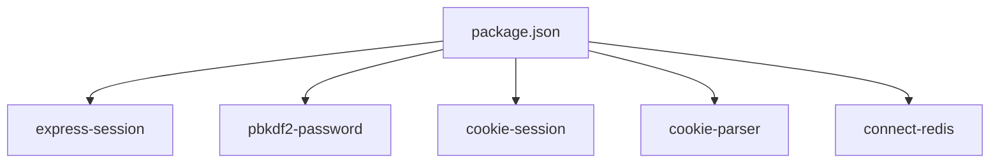

# Authentication and Authorization Security

<cite>
**Referenced Files in This Document**
- [examples/auth/index.js](file://examples/auth/index.js)
- [examples/auth/views/login.ejs](file://examples/auth/views/login.ejs)
- [examples/session/index.js](file://examples/session/index.js)
- [examples/session/redis.js](file://examples/session/redis.js)
- [examples/cookie-sessions/index.js](file://examples/cookie-sessions/index.js)
- [examples/cookies/index.js](file://examples/cookies/index.js)
- [test/acceptance/auth.js](file://test/acceptance/auth.js)
- [test/acceptance/cookie-sessions.js](file://test/acceptance/cookie-sessions.js)
- [package.json](file://package.json)
- [lib/application.js](file://lib/application.js)
</cite>

## Table of Contents
1. [Introduction](#introduction)
2. [Project Structure](#project-structure)
3. [Core Components](#core-components)
4. [Architecture Overview](#architecture-overview)
5. [Detailed Component Analysis](#detailed-component-analysis)
6. [Dependency Analysis](#dependency-analysis)
7. [Performance Considerations](#performance-considerations)
8. [Troubleshooting Guide](#troubleshooting-guide)
9. [Conclusion](#conclusion)

## Introduction
This document provides a comprehensive guide to authentication and authorization security in Express.js applications, grounded in the repository’s examples and tests. It covers session-based authentication, cookie security settings, session store configuration, password hashing, and basic authorization patterns. It also highlights areas where the repository demonstrates secure practices and outlines recommended enhancements for production-grade security, including CSRF protection, token-based authentication, OAuth integration, and robust error handling.

## Project Structure
The repository includes focused examples and acceptance tests that demonstrate:
- Session-based authentication with express-session and optional Redis-backed stores
- Cookie-based sessions via cookie-session
- Password hashing using pbkdf2-password
- Basic authorization guards and restricted routes
- Cookie parsing and manipulation using cookie-parser
- Acceptance tests validating authentication flows and session behavior

**Diagram sources**
- [examples/auth/index.js:1-135](file://examples/auth/index.js#L1-L135)
- [examples/auth/views/login.ejs:1-22](file://examples/auth/views/login.ejs#L1-L22)
- [examples/session/index.js:1-38](file://examples/session/index.js#L1-L38)
- [examples/session/redis.js:1-40](file://examples/session/redis.js#L1-L40)
- [examples/cookie-sessions/index.js:1-26](file://examples/cookie-sessions/index.js#L1-L26)
- [examples/cookies/index.js:1-54](file://examples/cookies/index.js#L1-L54)
- [test/acceptance/auth.js:1-118](file://test/acceptance/auth.js#L1-L118)
- [test/acceptance/cookie-sessions.js:1-39](file://test/acceptance/cookie-sessions.js#L1-L39)
- [lib/application.js:1-632](file://lib/application.js#L1-L632)

**Section sources**
- [examples/auth/index.js:1-135](file://examples/auth/index.js#L1-L135)
- [examples/session/index.js:1-38](file://examples/session/index.js#L1-L38)
- [examples/session/redis.js:1-40](file://examples/session/redis.js#L1-L40)
- [examples/cookie-sessions/index.js:1-26](file://examples/cookie-sessions/index.js#L1-L26)
- [examples/cookies/index.js:1-54](file://examples/cookies/index.js#L1-L54)
- [test/acceptance/auth.js:1-118](file://test/acceptance/auth.js#L1-L118)
- [test/acceptance/cookie-sessions.js:1-39](file://test/acceptance/cookie-sessions.js#L1-L39)
- [lib/application.js:1-632](file://lib/application.js#L1-L632)

## Core Components
- Session-based authentication with express-session and a memory store
- Password hashing using pbkdf2-password
- Basic authorization guard middleware restricting access to protected routes
- Cookie parsing and manipulation using cookie-parser
- Optional Redis-backed session store via connect-redis
- Cookie-based sessions via cookie-session

Key implementation references:
- Session configuration and middleware: [examples/auth/index.js:21-26](file://examples/auth/index.js#L21-L26)
- Password hashing initialization: [examples/auth/index.js:50-55](file://examples/auth/index.js#L50-L55)
- Authentication function: [examples/auth/index.js:60-73](file://examples/auth/index.js#L60-L73)
- Authorization guard: [examples/auth/index.js:75-82](file://examples/auth/index.js#L75-L82)
- Login route and session regeneration: [examples/auth/index.js:104-127](file://examples/auth/index.js#L104-L127)
- Logout route and session destruction: [examples/auth/index.js:92-98](file://examples/auth/index.js#L92-L98)
- Cookie parsing setup: [examples/cookies/index.js:19](file://examples/cookies/index.js#L19)
- Memory session example: [examples/session/index.js:16-20](file://examples/session/index.js#L16-L20)
- Redis-backed session example: [examples/session/redis.js:20-25](file://examples/session/redis.js#L20-L25)
- Cookie-session example: [examples/cookie-sessions/index.js:13](file://examples/cookie-sessions/index.js#L13)

**Section sources**
- [examples/auth/index.js:21-26](file://examples/auth/index.js#L21-L26)
- [examples/auth/index.js:50-55](file://examples/auth/index.js#L50-L55)
- [examples/auth/index.js:60-73](file://examples/auth/index.js#L60-L73)
- [examples/auth/index.js:75-82](file://examples/auth/index.js#L75-L82)
- [examples/auth/index.js:104-127](file://examples/auth/index.js#L104-L127)
- [examples/auth/index.js:92-98](file://examples/auth/index.js#L92-L98)
- [examples/cookies/index.js:19](file://examples/cookies/index.js#L19)
- [examples/session/index.js:16-20](file://examples/session/index.js#L16-L20)
- [examples/session/redis.js:20-25](file://examples/session/redis.js#L20-L25)
- [examples/cookie-sessions/index.js:13](file://examples/cookie-sessions/index.js#L13)

## Architecture Overview
The authentication architecture centers around:
- A session middleware that persists user identity across requests
- A password hashing module for secure credential storage
- An authorization guard that checks session state before granting access
- Optional Redis-backed session store for distributed environments
- Cookie parsing and optional cookie-session for lightweight stateless scenarios

**Diagram sources**
- [examples/auth/index.js:21-26](file://examples/auth/index.js#L21-L26)
- [examples/auth/index.js:60-73](file://examples/auth/index.js#L60-L73)
- [examples/auth/index.js:75-82](file://examples/auth/index.js#L75-L82)
- [examples/auth/index.js:84-127](file://examples/auth/index.js#L84-L127)

## Detailed Component Analysis

### Session-Based Authentication
This example demonstrates a complete session-based login flow:
- Parses form data and initializes a session
- Hashes passwords using pbkdf2-password and compares with stored hash
- Regenerates the session upon successful login to prevent fixation
- Stores user identity in the session and redirects to a restricted area
- Destroys the session on logout to invalidate the user’s authenticated state

**Diagram sources**
- [examples/auth/index.js:104-127](file://examples/auth/index.js#L104-L127)
- [examples/auth/index.js:60-73](file://examples/auth/index.js#L60-L73)

Practical implementation references:
- Session initialization and middleware chain: [examples/auth/index.js:21-26](file://examples/auth/index.js#L21-L26)
- Password hashing and storage: [examples/auth/index.js:50-55](file://examples/auth/index.js#L50-L55)
- Authentication logic: [examples/auth/index.js:60-73](file://examples/auth/index.js#L60-L73)
- Login route and session regeneration: [examples/auth/index.js:104-127](file://examples/auth/index.js#L104-L127)
- Logout and session destruction: [examples/auth/index.js:92-98](file://examples/auth/index.js#L92-L98)

**Section sources**
- [examples/auth/index.js:21-26](file://examples/auth/index.js#L21-L26)
- [examples/auth/index.js:50-55](file://examples/auth/index.js#L50-L55)
- [examples/auth/index.js:60-73](file://examples/auth/index.js#L60-L73)
- [examples/auth/index.js:104-127](file://examples/auth/index.js#L104-L127)
- [examples/auth/index.js:92-98](file://examples/auth/index.js#L92-L98)

### Cookie Security Settings
The repository includes examples for cookie parsing and manipulation:
- Using cookie-parser to sign cookies with a secret
- Setting and clearing cookies on the client
- Demonstrating session cookies via express-session and cookie-session

**Diagram sources**
- [examples/cookies/index.js:19](file://examples/cookies/index.js#L19)
- [examples/cookies/index.js:24-47](file://examples/cookies/index.js#L24-L47)

Practical implementation references:
- Cookie parsing setup: [examples/cookies/index.js:19](file://examples/cookies/index.js#L19)
- Cookie setting and clearing: [examples/cookies/index.js:40-46](file://examples/cookies/index.js#L40-L46)
- Session cookie presence: [test/acceptance/cookie-sessions.js:13-18](file://test/acceptance/cookie-sessions.js#L13-L18)

**Section sources**
- [examples/cookies/index.js:19](file://examples/cookies/index.js#L19)
- [examples/cookies/index.js:40-46](file://examples/cookies/index.js#L40-L46)
- [test/acceptance/cookie-sessions.js:13-18](file://test/acceptance/cookie-sessions.js#L13-L18)

### Session Store Configuration
The repository provides examples for both memory and Redis-backed session stores:
- Memory store via express-session
- Redis-backed store via connect-redis

**Diagram sources**
- [examples/session/index.js:16-20](file://examples/session/index.js#L16-L20)
- [examples/session/redis.js:20-25](file://examples/session/redis.js#L20-L25)

Practical implementation references:
- Memory store configuration: [examples/session/index.js:16-20](file://examples/session/index.js#L16-L20)
- Redis store configuration: [examples/session/redis.js:20-25](file://examples/session/redis.js#L20-L25)

**Section sources**
- [examples/session/index.js:16-20](file://examples/session/index.js#L16-L20)
- [examples/session/redis.js:20-25](file://examples/session/redis.js#L20-L25)

### Password Hashing
The example uses pbkdf2-password to hash and compare passwords:
- Generates salt and hash during user creation
- Verifies submitted passwords against stored hash

**Diagram sources**
- [examples/auth/index.js:50-55](file://examples/auth/index.js#L50-L55)
- [examples/auth/index.js:60-73](file://examples/auth/index.js#L60-L73)

Practical implementation references:
- Hash initialization and storage: [examples/auth/index.js:50-55](file://examples/auth/index.js#L50-L55)
- Authentication verification: [examples/auth/index.js:60-73](file://examples/auth/index.js#L60-L73)

**Section sources**
- [examples/auth/index.js:50-55](file://examples/auth/index.js#L50-L55)
- [examples/auth/index.js:60-73](file://examples/auth/index.js#L60-L73)

### Authorization Patterns
The example includes a simple authorization guard that checks for a session-stored user identity:
- Protects routes by ensuring a valid session exists
- Redirects unauthenticated users to the login page

**Diagram sources**
- [examples/auth/index.js:75-82](file://examples/auth/index.js#L75-L82)

Practical implementation references:
- Authorization guard: [examples/auth/index.js:75-82](file://examples/auth/index.js#L75-L82)
- Restricted route: [examples/auth/index.js:88](file://examples/auth/index.js#L88)

**Section sources**
- [examples/auth/index.js:75-82](file://examples/auth/index.js#L75-L82)
- [examples/auth/index.js:88](file://examples/auth/index.js#L88)

### Token-Based Authentication and OAuth Integration
- The repository does not include JWT token handling or OAuth integration examples.
- Production systems should implement token-based authentication with short-lived access tokens, refresh tokens, and secure token storage.
- OAuth integration should enforce PKCE for public clients, validate scopes, and use HTTPS with secure cookies.

[No sources needed since this section provides general guidance]

### CSRF Protection Implementation
- The repository does not include CSRF protection middleware.
- Recommended approach: Use CSRF tokens per form and validate them server-side, or rely on SameSite cookies for modern browsers.

[No sources needed since this section provides general guidance]

### Secure Authentication Middleware
- The examples demonstrate essential middleware order and session configuration.
- Additional middleware commonly used in production:
  - Helmet for security headers
  - Rate limiting to prevent brute force attacks
  - HTTPS enforcement and secure cookie flags

[No sources needed since this section provides general guidance]

## Dependency Analysis
The repository’s authentication and session examples rely on the following packages:
- express-session for session management
- pbkdf2-password for password hashing
- cookie-session for cookie-based sessions
- cookie-parser for cookie parsing and signing
- connect-redis for Redis-backed sessions

**Diagram sources**
- [package.json:34-81](file://package.json#L34-L81)

**Section sources**
- [package.json:34-81](file://package.json#L34-L81)

## Performance Considerations
- Use Redis-backed session stores in clustered deployments to avoid sticky sessions and improve scalability.
- Prefer resave: false and saveUninitialized: false to minimize unnecessary writes.
- Offload password hashing to background jobs when creating accounts to reduce latency.
- Cache frequently accessed user roles/permissions to reduce repeated lookups.

[No sources needed since this section provides general guidance]

## Troubleshooting Guide
Common issues and mitigations:
- Authentication failures due to incorrect credentials:
  - Ensure the password hashing algorithm and salt are correctly applied and compared.
  - Validate that the login form submits username and password fields.
- Session fixation:
  - Always regenerate the session upon successful login.
- Session not persisting:
  - Confirm session middleware is loaded before route handlers.
  - Verify cookie settings and SameSite/Secure flags in production.
- CSRF-related errors:
  - Implement CSRF protection or ensure SameSite cookies are effective.

Practical references:
- Login failure handling and redirects: [examples/auth/index.js:104-127](file://examples/auth/index.js#L104-L127)
- Session regeneration on login: [examples/auth/index.js:111](file://examples/auth/index.js#L111)
- Session destruction on logout: [examples/auth/index.js:95](file://examples/auth/index.js#L95)
- Cookie presence in session tests: [test/acceptance/cookie-sessions.js:13-18](file://test/acceptance/cookie-sessions.js#L13-L18)

**Section sources**
- [examples/auth/index.js:104-127](file://examples/auth/index.js#L104-L127)
- [examples/auth/index.js:111](file://examples/auth/index.js#L111)
- [examples/auth/index.js:95](file://examples/auth/index.js#L95)
- [test/acceptance/cookie-sessions.js:13-18](file://test/acceptance/cookie-sessions.js#L13-L18)

## Conclusion
The repository provides solid foundations for session-based authentication, password hashing, and basic authorization in Express.js. To achieve production-grade security, integrate CSRF protection, implement token-based authentication and OAuth securely, enforce strong cookie policies, and adopt rate limiting and secure headers. The included examples serve as a starting point for building robust authentication and authorization systems.