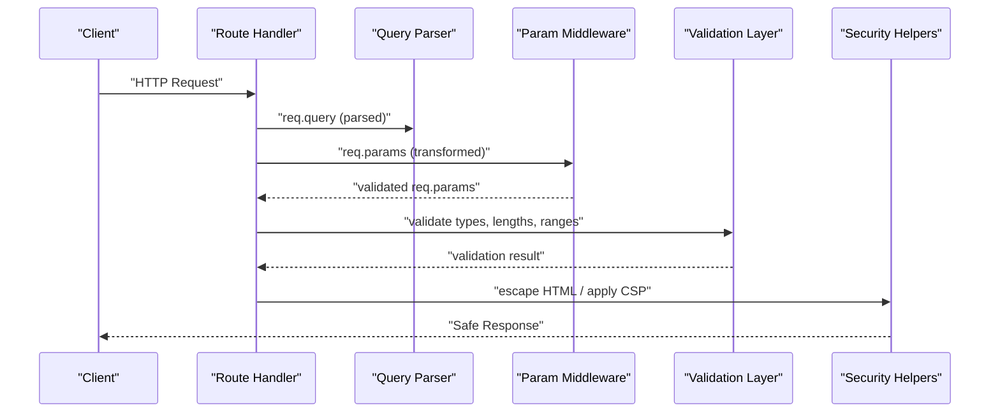
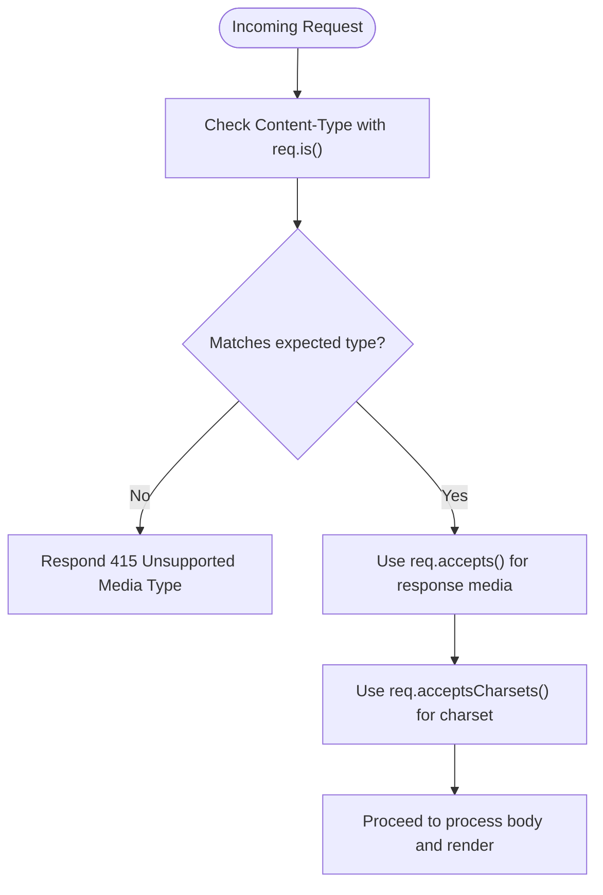
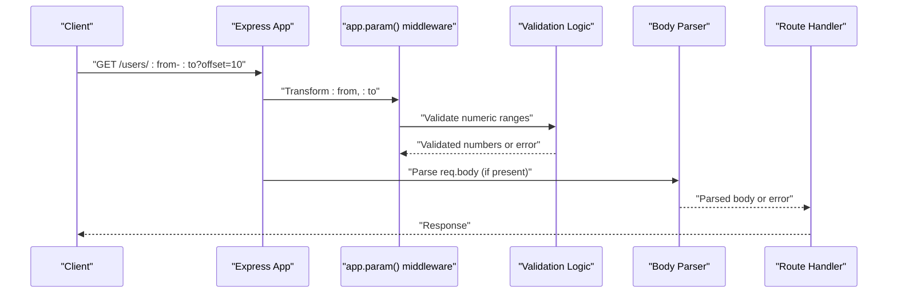
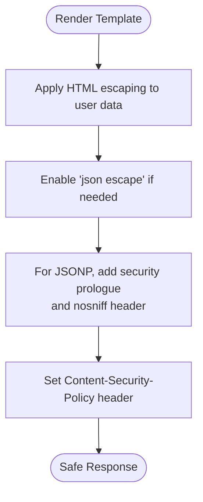
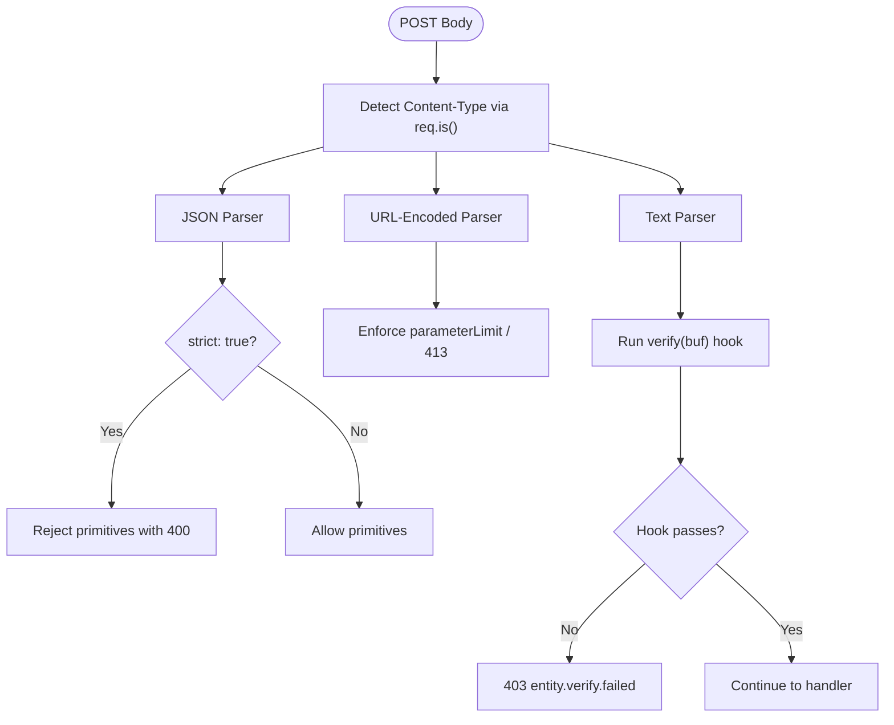
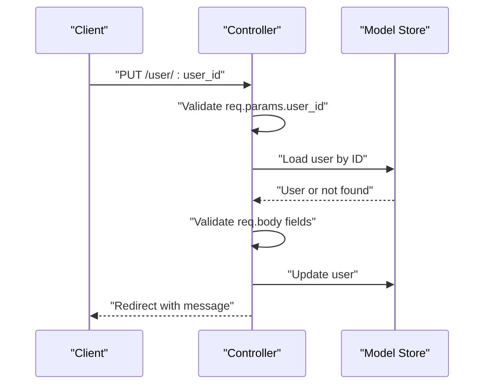
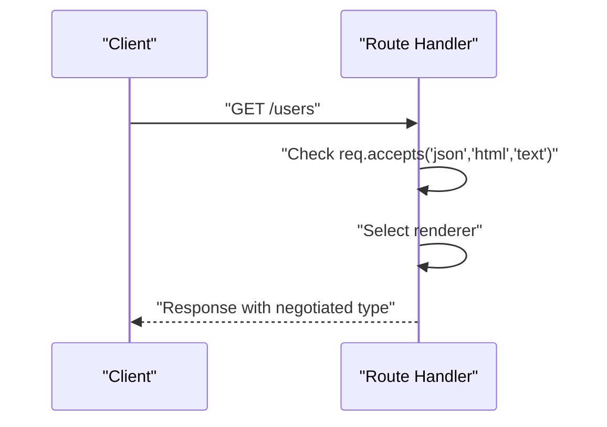
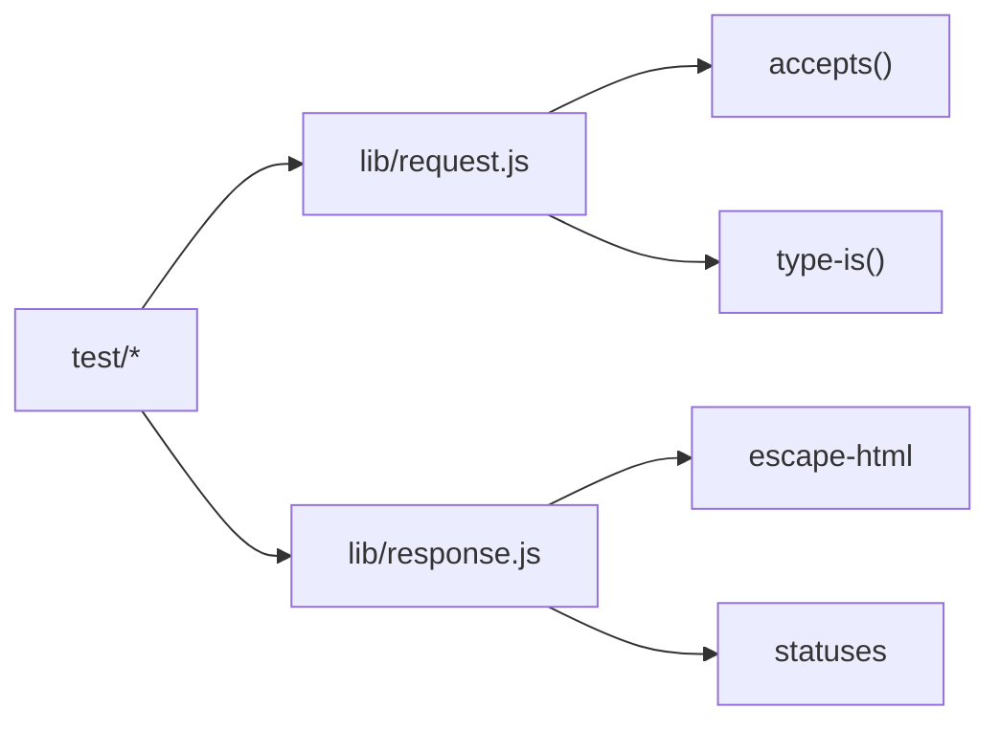

# Input Validation and Sanitization

<cite>
**Referenced Files in This Document**
- [lib/request.js](file://lib/request.js)
- [lib/response.js](file://lib/response.js)
- [examples/content-negotiation/index.js](file://examples/content-negotiation/index.js)
- [examples/params/index.js](file://examples/params/index.js)
- [examples/markdown/index.js](file://examples/markdown/index.js)
- [examples/route-map/index.js](file://examples/route-map/index.js)
- [examples/mvc/controllers/user/index.js](file://examples/mvc/controllers/user/index.js)
- [examples/mvc/controllers/pet/index.js](file://examples/mvc/controllers/pet/index.js)
- [test/req.accepts.js](file://test/req.accepts.js)
- [test/req.acceptsCharsets.js](file://test/req.acceptsCharsets.js)
- [test/req.is.js](file://test/req.is.js)
- [test/req.query.js](file://test/req.query.js)
- [test/express.json.js](file://test/express.json.js)
- [test/express.urlencoded.js](file://test/express.urlencoded.js)
- [test/express.text.js](file://test/express.text.js)
- [test/express.static.js](file://test/express.static.js)
- [test/res.json.js](file://test/res.json.js)
- [test/res.jsonp.js](file://test/res.jsonp.js)
</cite>

## Table of Contents
1. [Introduction](#introduction)
2. [Project Structure](#project-structure)
3. [Core Components](#core-components)
4. [Architecture Overview](#architecture-overview)
5. [Detailed Component Analysis](#detailed-component-analysis)
6. [Dependency Analysis](#dependency-analysis)
7. [Performance Considerations](#performance-considerations)
8. [Troubleshooting Guide](#troubleshooting-guide)
9. [Conclusion](#conclusion)

## Introduction
This document explains how to validate and sanitize input in Express.js applications using built-in request helpers and proven patterns from the repository. It covers:
- Content type validation via req.is(), req.accepts(), and req.acceptsCharsets()
- Parameter extraction and validation using req.params, req.query, and req.body
- XSS prevention through HTML escaping and Content Security Policy
- Form validation strategies, data type checks, and malicious input detection
- Practical examples from the codebase showing secure parameter handling, input filtering middleware, and validation error responses
- Mitigations for common injection attack vectors

## Project Structure
The repository provides:
- Core request/response prototypes under lib/
- Example apps demonstrating validation and sanitization patterns under examples/
- Comprehensive tests validating behavior under various inputs and configurations under test/

```mermaid
graph TB
subgraph "Core"
REQ["lib/request.js"]
RES["lib/response.js"]
end
subgraph "Examples"
CN["examples/content-negotiation/index.js"]
PARAMS["examples/params/index.js"]
MARK["examples/markdown/index.js"]
ROUTE["examples/route-map/index.js"]
MVC_USER["examples/mvc/controllers/user/index.js"]
MVC_PET["examples/mvc/controllers/pet/index.js"]
end
subgraph "Tests"
T_REQ_IS["test/req.is.js"]
T_REQ_ACCEPTS["test/req.accepts.js"]
T_REQ_CHARS["test/req.acceptsCharsets.js"]
T_REQ_QUERY["test/req.query.js"]
T_JSON["test/express.json.js"]
T_URL["test/express.urlencoded.js"]
T_TEXT["test/express.text.js"]
T_STATIC["test/express.static.js"]
T_RES_JSON["test/res.json.js"]
T_RES_JSONP["test/res.jsonp.js"]
end
REQ --> CN
REQ --> PARAMS
REQ --> ROUTE
RES --> MARK
RES --> MVC_USER
RES --> MVC_PET
REQ --> T_REQ_IS
REQ --> T_REQ_ACCEPTS
REQ --> T_REQ_CHARS
REQ --> T_REQ_QUERY
RES --> T_RES_JSON
RES --> T_RES_JSONP
RES --> T_STATIC
REQ --> T_JSON
REQ --> T_URL
REQ --> T_TEXT
```

**Diagram sources**
- [lib/request.js:127-174](file://lib/request.js#L127-L174)
- [lib/response.js:1-200](file://lib/response.js#L1-L200)
- [examples/content-negotiation/index.js:1-47](file://examples/content-negotiation/index.js#L1-L47)
- [examples/params/index.js:1-75](file://examples/params/index.js#L1-L75)
- [examples/markdown/index.js:1-45](file://examples/markdown/index.js#L1-L45)
- [examples/route-map/index.js:1-76](file://examples/route-map/index.js#L1-L76)
- [examples/mvc/controllers/user/index.js:1-42](file://examples/mvc/controllers/user/index.js#L1-L42)
- [examples/mvc/controllers/pet/index.js:1-32](file://examples/mvc/controllers/pet/index.js#L1-L32)
- [test/req.is.js:1-170](file://test/req.is.js#L1-L170)
- [test/req.accepts.js:1-126](file://test/req.accepts.js#L1-L126)
- [test/req.acceptsCharsets.js:1-64](file://test/req.acceptsCharsets.js#L1-L64)
- [test/req.query.js:1-107](file://test/req.query.js#L1-L107)
- [test/express.json.js:92-485](file://test/express.json.js#L92-L485)
- [test/express.urlencoded.js:200-563](file://test/express.urlencoded.js#L200-L563)
- [test/express.text.js:286-334](file://test/express.text.js#L286-L334)
- [test/express.static.js:515-520](file://test/express.static.js#L515-L520)
- [test/res.json.js:105-129](file://test/res.json.js#L105-L129)
- [test/res.jsonp.js:116-128](file://test/res.jsonp.js#L116-L128)

**Section sources**
- [lib/request.js:127-174](file://lib/request.js#L127-L174)
- [lib/response.js:1-200](file://lib/response.js#L1-L200)

## Core Components
- Content negotiation and type validation:
  - req.accepts(): negotiates media types based on Accept header
  - req.acceptsCharsets(): negotiates charsets based on Accept-Charset header
  - req.is(): validates Content-Type against expected types
- Parameter extraction and parsing:
  - req.params: validated and transformed via app.param() middleware
  - req.query: parsed according to the configured query parser
- Body parsing and verification:
  - JSON, URL-encoded, and text parsers with strictness, limits, and verify hooks
- Output sanitization:
  - HTML escaping in templates and response rendering
  - JSON/JSONP safety and Content Security Policy defaults

**Section sources**
- [lib/request.js:127-174](file://lib/request.js#L127-L174)
- [lib/request.js:229-241](file://lib/request.js#L229-L241)
- [lib/request.js:269-281](file://lib/request.js#L269-L281)
- [test/req.accepts.js:1-126](file://test/req.accepts.js#L1-L126)
- [test/req.acceptsCharsets.js:1-64](file://test/req.acceptsCharsets.js#L1-L64)
- [test/req.is.js:1-170](file://test/req.is.js#L1-L170)
- [test/req.query.js:1-107](file://test/req.query.js#L1-L107)
- [test/express.json.js:92-485](file://test/express.json.js#L92-L485)
- [test/express.urlencoded.js:200-563](file://test/express.urlencoded.js#L200-L563)
- [test/express.text.js:286-334](file://test/express.text.js#L286-L334)
- [lib/response.js:1-200](file://lib/response.js#L1-L200)
- [examples/markdown/index.js:17-25](file://examples/markdown/index.js#L17-L25)
- [examples/route-map/index.js:36-52](file://examples/route-map/index.js#L36-L52)

## Architecture Overview
The validation and sanitization pipeline integrates request parsing, middleware-driven parameter validation, and response-safe rendering.

**Diagram sources**
- [lib/request.js:229-241](file://lib/request.js#L229-L241)
- [examples/params/index.js:23-41](file://examples/params/index.js#L23-L41)
- [examples/markdown/index.js:17-25](file://examples/markdown/index.js#L17-L25)
- [examples/route-map/index.js:36-52](file://examples/route-map/index.js#L36-L52)
- [test/express.json.js:92-485](file://test/express.json.js#L92-L485)
- [test/express.urlencoded.js:200-563](file://test/express.urlencoded.js#L200-L563)
- [test/express.static.js:515-520](file://test/express.static.js#L515-L520)

## Detailed Component Analysis

### Content Type Validation with req.is(), req.accepts(), and req.acceptsCharsets()
- req.is(types): Matches Content-Type against MIME types, wildcards, or extensions; ignores charset.
- req.accepts(types): Negotiates response media types based on Accept header, honoring quality values.
- req.acceptsCharsets(charsets): Negotiates charsets based on Accept-Charset header.

**Diagram sources**
- [lib/request.js:269-281](file://lib/request.js#L269-L281)
- [lib/request.js:127-130](file://lib/request.js#L127-L130)
- [lib/request.js:171-174](file://lib/request.js#L171-L174)
- [test/req.is.js:1-170](file://test/req.is.js#L1-L170)
- [test/req.accepts.js:1-126](file://test/req.accepts.js#L1-L126)
- [test/req.acceptsCharsets.js:1-64](file://test/req.acceptsCharsets.js#L1-L64)

Practical usage patterns:
- Enforce JSON-only endpoints using req.is('application/json').
- Negotiate response formats with req.accepts('json', 'html', 'text').
- Validate charset preferences with req.acceptsCharsets('utf-8', 'ascii').

**Section sources**
- [lib/request.js:127-174](file://lib/request.js#L127-L174)
- [test/req.is.js:1-170](file://test/req.is.js#L1-L170)
- [test/req.accepts.js:1-126](file://test/req.accepts.js#L1-L126)
- [test/req.acceptsCharsets.js:1-64](file://test/req.acceptsCharsets.js#L1-L64)

### Parameter Extraction and Validation Patterns (req.params, req.query, req.body)
- req.params:
  - Use app.param() to transform and validate route parameters (e.g., casting to int, existence checks).
  - On failure, call next() with an error to trigger error handlers.

- req.query:
  - Controlled by the "query parser" setting: simple, extended, a custom function, or disabled.
  - Complex nested structures and dot-notation are supported with "extended".

- req.body:
  - JSON, URL-encoded, and text parsers support strict mode, size limits, parameter limits, inflate, and verify hooks.

**Diagram sources**
- [examples/params/index.js:23-41](file://examples/params/index.js#L23-L41)
- [lib/request.js:229-241](file://lib/request.js#L229-L241)
- [test/req.query.js:1-107](file://test/req.query.js#L1-L107)
- [test/express.json.js:92-485](file://test/express.json.js#L92-L485)
- [test/express.urlencoded.js:200-563](file://test/express.urlencoded.js#L200-L563)
- [test/express.text.js:286-334](file://test/express.text.js#L286-L334)

Secure handling examples:
- Numeric parameter validation and error propagation in params example.
- Query parser modes and behavior in req.query tests.
- Body parser strictness and verify hooks in JSON/URL-encoded/text tests.

**Section sources**
- [examples/params/index.js:23-41](file://examples/params/index.js#L23-L41)
- [lib/request.js:229-241](file://lib/request.js#L229-L241)
- [test/req.query.js:1-107](file://test/req.query.js#L1-L107)
- [test/express.json.js:92-485](file://test/express.json.js#L92-L485)
- [test/express.urlencoded.js:200-563](file://test/express.urlencoded.js#L200-L563)
- [test/express.text.js:286-334](file://test/express.text.js#L286-L334)

### XSS Prevention: HTML Escaping and Content Security Policy
- HTML escaping:
  - Use escape-html during template rendering to prevent script injection in dynamic content.
  - Verified in markdown and route-map examples.

- JSON/JSONP safety:
  - JSON responses escape Unicode line/paragraph separators when "json escape" is enabled.
  - JSONP responses include a security prologue and X-Content-Type-Options: nosniff.

- Content Security Policy:
  - Static assets middleware sets a default restrictive CSP header.

**Diagram sources**
- [examples/markdown/index.js:17-25](file://examples/markdown/index.js#L17-L25)
- [examples/route-map/index.js:36-52](file://examples/route-map/index.js#L36-L52)
- [lib/response.js:1012-1029](file://lib/response.js#L1012-L1029)
- [test/res.json.js:105-129](file://test/res.json.js#L105-L129)
- [test/res.jsonp.js:116-128](file://test/res.jsonp.js#L116-L128)
- [test/express.static.js:515-520](file://test/express.static.js#L515-L520)

**Section sources**
- [examples/markdown/index.js:17-25](file://examples/markdown/index.js#L17-L25)
- [examples/route-map/index.js:36-52](file://examples/route-map/index.js#L36-L52)
- [lib/response.js:1012-1029](file://lib/response.js#L1012-L1029)
- [test/res.json.js:105-129](file://test/res.json.js#L105-L129)
- [test/res.jsonp.js:116-128](file://test/res.jsonp.js#L116-L128)
- [test/express.static.js:515-520](file://test/express.static.js#L515-L520)

### Form Validation Strategies, Data Type Checking, and Malicious Input Detection
- Strict JSON parsing prevents primitive-only bodies unless allowed.
- URL-encoded parsers enforce parameter limits and optional inflate behavior.
- Text parsers support a verify hook to reject unwanted leading bytes or patterns.
- Body parsers return structured errors with standardized codes for invalid or oversized requests.

**Diagram sources**
- [lib/request.js:269-281](file://lib/request.js#L269-L281)
- [test/express.json.js:238-446](file://test/express.json.js#L238-L446)
- [test/express.urlencoded.js:402-426](file://test/express.urlencoded.js#L402-L426)
- [test/express.text.js:295-334](file://test/express.text.js#L295-L334)

**Section sources**
- [lib/request.js:269-281](file://lib/request.js#L269-L281)
- [test/express.json.js:238-446](file://test/express.json.js#L238-L446)
- [test/express.urlencoded.js:402-426](file://test/express.urlencoded.js#L402-L426)
- [test/express.text.js:295-334](file://test/express.text.js#L295-L334)

### Secure Parameter Handling in MVC Controllers
- Controllers extract req.body and req.params, then update model state safely.
- Use app.param() to ensure IDs are valid before loading resources.

**Diagram sources**
- [examples/mvc/controllers/user/index.js:11-41](file://examples/mvc/controllers/user/index.js#L11-L41)
- [examples/mvc/controllers/pet/index.js:11-31](file://examples/mvc/controllers/pet/index.js#L11-L31)
- [examples/params/index.js:23-41](file://examples/params/index.js#L23-L41)

**Section sources**
- [examples/mvc/controllers/user/index.js:11-41](file://examples/mvc/controllers/user/index.js#L11-L41)
- [examples/mvc/controllers/pet/index.js:11-31](file://examples/mvc/controllers/pet/index.js#L11-L31)
- [examples/params/index.js:23-41](file://examples/params/index.js#L23-L41)

### Content Negotiation for Secure Responses
- Use res.format() to render appropriate representations based on req.accepts().
- Avoid echoing arbitrary Accept headers; delegate to res.format() mapping.

**Diagram sources**
- [examples/content-negotiation/index.js:9-27](file://examples/content-negotiation/index.js#L9-L27)

**Section sources**
- [examples/content-negotiation/index.js:9-27](file://examples/content-negotiation/index.js#L9-L27)

## Dependency Analysis
- Request helpers depend on external libraries for content negotiation and type checking.
- Response helpers depend on escape-html and other utilities for safe rendering.
- Tests validate parser behavior, error codes, and security headers.

**Diagram sources**
- [lib/request.js:16-23](file://lib/request.js#L16-L23)
- [lib/response.js:15-35](file://lib/response.js#L15-L35)
- [test/req.is.js:1-10](file://test/req.is.js#L1-L10)
- [test/express.json.js:1-10](file://test/express.json.js#L1-L10)

**Section sources**
- [lib/request.js:16-23](file://lib/request.js#L16-L23)
- [lib/response.js:15-35](file://lib/response.js#L15-L35)
- [test/req.is.js:1-10](file://test/req.is.js#L1-L10)
- [test/express.json.js:1-10](file://test/express.json.js#L1-L10)

## Performance Considerations
- Prefer simple query parser for low-complexity queries to reduce CPU overhead.
- Tune parameterLimit and body size limits to prevent memory exhaustion.
- Enable strict JSON parsing to avoid expensive primitive parsing attempts.
- Use early req.is() checks to short-circuit unsupported content types.

## Troubleshooting Guide
Common validation and sanitization issues:
- 415 Unsupported Media Type: caused by mismatched Content-Type; verify req.is() expectations.
- 400 Bad Request: malformed JSON/primitives or invalid body; review strict mode and verify hooks.
- 413 Payload Too Large: body exceeds configured limit; adjust limit or compress payload.
- 414 URI Too Long: excessive query parameters; enforce parameterLimit.
- 415 Unsupported Encoding: inflate disabled for compressed payloads; enable inflate or reject compression.
- Missing or weak CSP: ensure static middleware or custom headers apply a restrictive policy.
- XSS in templates: confirm escape-html is applied to user-supplied content.

**Section sources**
- [test/express.json.js:92-130](file://test/express.json.js#L92-L130)
- [test/express.json.js:238-274](file://test/express.json.js#L238-L274)
- [test/express.urlencoded.js:402-426](file://test/express.urlencoded.js#L402-L426)
- [test/express.text.js:295-334](file://test/express.text.js#L295-L334)
- [test/express.static.js:515-520](file://test/express.static.js#L515-L520)
- [examples/markdown/index.js:17-25](file://examples/markdown/index.js#L17-L25)
- [examples/route-map/index.js:36-52](file://examples/route-map/index.js#L36-L52)

## Conclusion
Express provides robust primitives for input validation and sanitization:
- Use req.is(), req.accepts(), and req.acceptsCharsets() to constrain content types and negotiate responses.
- Validate and transform req.params with app.param() and enforce strict body parsing with verify hooks.
- Apply HTML escaping and configure JSON/JSONP safety and CSP to mitigate XSS and injection risks.
- Leverage the included tests and examples as references for secure handling patterns.