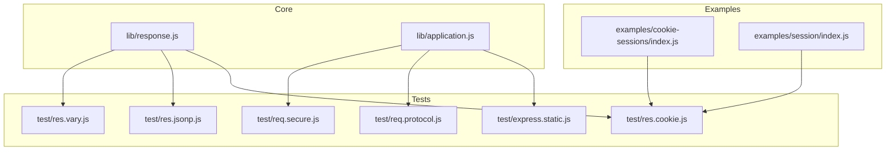
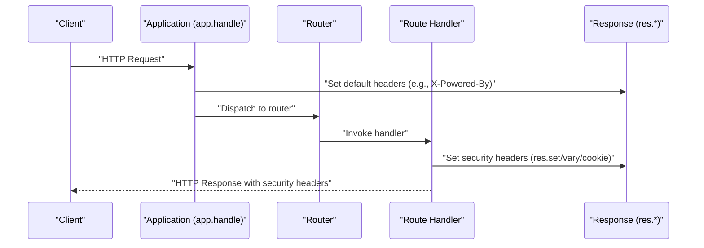
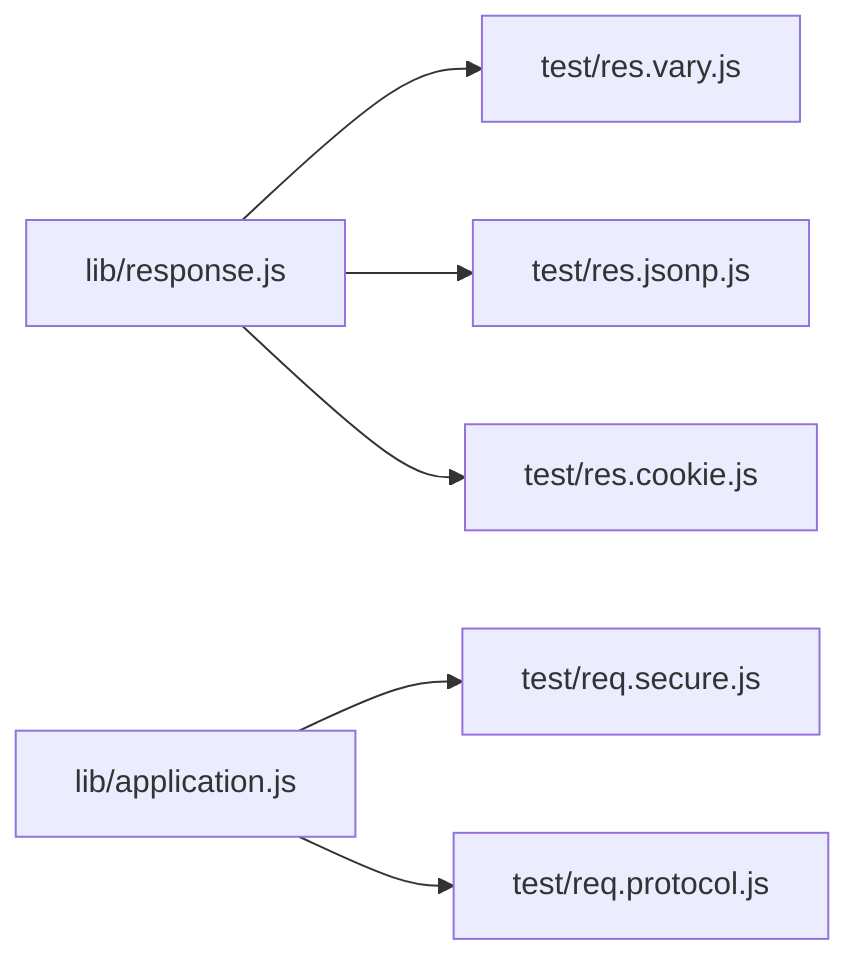

# Secure Headers and Configuration

<cite>
**Referenced Files in This Document**
- [lib/response.js](file://lib/response.js)
- [lib/application.js](file://lib/application.js)
- [test/res.vary.js](file://test/res.vary.js)
- [test/res.jsonp.js](file://test/res.jsonp.js)
- [test/express.static.js](file://test/express.static.js)
- [test/res.cookie.js](file://test/res.cookie.js)
- [test/req.secure.js](file://test/req.secure.js)
- [test/req.protocol.js](file://test/req.protocol.js)
- [examples/cookie-sessions/index.js](file://examples/cookie-sessions/index.js)
- [examples/session/index.js](file://examples/session/index.js)
</cite>

## Table of Contents
1. [Introduction](#introduction)
2. [Project Structure](#project-structure)
3. [Core Components](#core-components)
4. [Architecture Overview](#architecture-overview)
5. [Detailed Component Analysis](#detailed-component-analysis)
6. [Dependency Analysis](#dependency-analysis)
7. [Performance Considerations](#performance-considerations)
8. [Troubleshooting Guide](#troubleshooting-guide)
9. [Conclusion](#conclusion)
10. [Appendices](#appendices)

## Introduction
This document explains how to configure and enforce HTTP security headers in Express.js applications using built-in response methods and patterns. It focuses on:
- Security-related response methods: res.set(), res.vary(), and custom header-setting patterns
- Essential security headers: Content-Security-Policy, X-Frame-Options, X-Content-Type-Options, and Strict-Transport-Security
- HTTPS enforcement, HSTS implementation, and secure cookie configuration
- Cross-Origin Resource Sharing (CORS) policy setup, Referrer Policy configuration, and frame busting techniques
- Practical examples from the codebase demonstrating security middleware implementation, header injection prevention, and production-ready configurations
- Browser compatibility and security header best practices

## Project Structure
The repository provides:
- Core response and application logic under lib/
- Test suites validating behavior under lib/application.js and lib/response.js
- Example applications demonstrating cookies and sessions

**Diagram sources**
- [lib/response.js:664-686](file://lib/response.js#L664-L686)
- [lib/application.js:152-178](file://lib/application.js#L152-L178)
- [test/res.vary.js:1-90](file://test/res.vary.js#L1-L90)
- [test/res.jsonp.js:116-128](file://test/res.jsonp.js#L116-L128)
- [test/express.static.js:515-520](file://test/express.static.js#L515-L520)
- [test/res.cookie.js:54-98](file://test/res.cookie.js#L54-L98)
- [test/req.secure.js:1-101](file://test/req.secure.js#L1-L101)
- [test/req.protocol.js:1-55](file://test/req.protocol.js#L1-L55)
- [examples/cookie-sessions/index.js:1-26](file://examples/cookie-sessions/index.js#L1-L26)
- [examples/session/index.js:1-38](file://examples/session/index.js#L1-L38)

**Section sources**
- [lib/response.js:664-686](file://lib/response.js#L664-L686)
- [lib/application.js:152-178](file://lib/application.js#L152-L178)
- [test/res.vary.js:1-90](file://test/res.vary.js#L1-L90)
- [test/res.jsonp.js:116-128](file://test/res.jsonp.js#L116-L128)
- [test/express.static.js:515-520](file://test/express.static.js#L515-L520)
- [test/res.cookie.js:54-98](file://test/res.cookie.js#L54-L98)
- [test/req.secure.js:1-101](file://test/req.secure.js#L1-L101)
- [test/req.protocol.js:1-55](file://test/req.protocol.js#L1-L55)
- [examples/cookie-sessions/index.js:1-26](file://examples/cookie-sessions/index.js#L1-L26)
- [examples/session/index.js:1-38](file://examples/session/index.js#L1-L38)

## Core Components
This section documents the security-relevant response methods and how they are used in tests and examples.

- res.set(field, val) and res.header(field, val)
  - Purpose: Set a single header or multiple headers at once
  - Behavior: Expands Content-Type with charset when applicable; otherwise sets raw header values
  - Usage patterns validated in tests for JSONP and cookie serialization

- res.vary(field)
  - Purpose: Add entries to the Vary header without duplicates
  - Behavior: Normalizes and deduplicates values; throws when called without arguments

- res.cookie(name, value, options)
  - Purpose: Serialize and append a Set-Cookie header with options such as httpOnly, secure, partitioned, priority, and expires/maxAge
  - Behavior: Supports signed cookies when a secret is configured; enforces safe defaults (e.g., default path)

- Application-level header behavior
  - X-Powered-By is set by default when enabled; can be removed in production

**Section sources**
- [lib/response.js:664-686](file://lib/response.js#L664-L686)
- [lib/response.js:875-879](file://lib/response.js#L875-L879)
- [lib/response.js:742-775](file://lib/response.js#L742-L775)
- [lib/application.js:159-162](file://lib/application.js#L159-L162)
- [test/res.vary.js:1-90](file://test/res.vary.js#L1-L90)
- [test/res.jsonp.js:116-128](file://test/res.jsonp.js#L116-L128)
- [test/res.cookie.js:54-98](file://test/res.cookie.js#L54-L98)

## Architecture Overview
The Express application pipeline sets the stage for security headers:
- app.handle initializes the request/response and applies default headers (e.g., X-Powered-By)
- Middleware and route handlers can set additional security headers via res.set()/res.vary()/res.cookie()

**Diagram sources**
- [lib/application.js:152-178](file://lib/application.js#L152-L178)
- [lib/response.js:664-686](file://lib/response.js#L664-L686)
- [lib/response.js:875-879](file://lib/response.js#L875-L879)
- [lib/response.js:742-775](file://lib/response.js#L742-L775)

## Detailed Component Analysis

### Security Header Methods and Patterns
- res.set() and res.header()
  - Single-header assignment and bulk assignment are supported
  - Content-Type expansion with charset is handled automatically
  - Used to set X-Content-Type-Options and other security headers

- res.vary()
  - Prevents caching artifacts by signaling cache keys (e.g., Accept, Accept-Language)
  - Ensures correct header composition without duplication

- res.cookie()
  - Produces serialized Set-Cookie values with options such as httpOnly, secure, partitioned, priority, and expires/maxAge
  - Supports signed cookies when a secret is configured

**Section sources**
- [lib/response.js:664-686](file://lib/response.js#L664-L686)
- [lib/response.js:875-879](file://lib/response.js#L875-L879)
- [lib/response.js:742-775](file://lib/response.js#L742-L775)
- [test/res.vary.js:1-90](file://test/res.vary.js#L1-L90)
- [test/res.jsonp.js:116-128](file://test/res.jsonp.js#L116-L128)
- [test/res.cookie.js:54-98](file://test/res.cookie.js#L54-L98)

### Essential Security Headers

#### Content-Security-Policy (CSP)
- Default CSP behavior observed in tests for static serving
- Production guidance:
  - Define a restrictive default-src directive
  - Whitelist trusted script and style sources
  - Use report-uri/report-to for violation reporting

Evidence from tests:
- Static serving responds with a default CSP header during directory redirection

**Section sources**
- [test/express.static.js:515-520](file://test/express.static.js#L515-L520)

#### X-Frame-Options
- Purpose: Prevent clickjacking by controlling whether a page can be embedded in frames
- Implementation pattern:
  - Set X-Frame-Options via res.set()
  - Consider DENY or SAMEORIGIN depending on embedding needs

Note: The repository does not include explicit X-Frame-Options tests; apply via res.set() in handlers or middleware.

#### X-Content-Type-Options: nosniff
- Purpose: Prevent MIME type sniffing
- Observed behavior:
  - JSONP responses set X-Content-Type-Options: nosniff when switching Content-Type to text/javascript
  - Non-JSONP responses preserve existing Content-Type without adding nosniff

**Section sources**
- [lib/response.js:270-283](file://lib/response.js#L270-L283)
- [test/res.jsonp.js:116-128](file://test/res.jsonp.js#L116-L128)

#### Strict-Transport-Security (HSTS)
- Purpose: Enforce HTTPS and signal long-term HTTPS usage
- Implementation patterns:
  - Set Strict-Transport-Security via res.set()
  - Configure max-age, includeSubDomains, preload flags appropriately
  - Combine with HTTPS enforcement at the reverse proxy or load balancer

Note: The repository does not include explicit HSTS tests; apply via res.set() in production middleware.

### HTTPS Enforcement and Trust Proxy
- req.secure and req.protocol behavior depends on trust proxy configuration
- When trust proxy is enabled, X-Forwarded-Proto is respected to determine HTTPS
- Guidance:
  - Enable trust proxy in environments behind proxies/load balancers
  - Use trust proxy with hop counts when appropriate
  - Redirect HTTP to HTTPS at the proxy/load balancer level for strong enforcement

**Section sources**
- [test/req.secure.js:1-101](file://test/req.secure.js#L1-L101)
- [test/req.protocol.js:1-55](file://test/req.protocol.js#L1-L55)
- [lib/application.js:99-105](file://lib/application.js#L99-L105)

### Secure Cookie Configuration
- Use res.cookie() with secure: true for HTTPS-only cookies
- Prefer httpOnly: true to mitigate XSS risks
- Consider partitioned: true for privacy-preserving cookies
- Use priority options (low, medium, high) for modern browsers
- Set expires or maxAge explicitly; avoid passing invalid values

Evidence from tests:
- Multiple cookie options validated, including httpOnly, secure, partitioned, priority, maxAge, and invalid option handling

**Section sources**
- [lib/response.js:742-775](file://lib/response.js#L742-L775)
- [test/res.cookie.js:54-98](file://test/res.cookie.js#L54-L98)
- [test/res.cookie.js:100-186](file://test/res.cookie.js#L100-L186)
- [test/res.cookie.js:188-243](file://test/res.cookie.js#L188-L243)

### CORS Policy Setup
- Use res.set() to set Access-Control-* headers as needed
- Typical headers: Access-Control-Allow-Origin, Access-Control-Allow-Methods, Access-Control-Allow-Headers, Access-Control-Allow-Credentials
- Apply per-route or globally via middleware

Note: The repository does not include explicit CORS tests; implement via res.set() in middleware or route handlers.

### Referrer Policy Configuration
- Use res.set('Referrer-Policy', ...) to control referrer leakage
- Common policies: no-referrer, no-referrer-when-downgrade, origin, origin-when-cross-origin, same-origin, strict-origin, strict-origin-when-cross-origin, unsafe-url

Note: The repository does not include explicit Referrer-Policy tests; apply via res.set().

### Frame Busting Techniques
- Use X-Frame-Options or CSP frame-ancestors to prevent framing
- Alternatively, implement client-side frame busting scripts (not recommended over server controls)

Note: The repository does not include explicit frame-busting tests; apply via res.set().

### Practical Examples from the Codebase
- Cookie sessions example demonstrates session cookie creation via res.cookie()
- Session example shows session management with express-session middleware
- Tests demonstrate Vary header behavior, JSONP security header, and default CSP behavior

**Section sources**
- [examples/cookie-sessions/index.js:1-26](file://examples/cookie-sessions/index.js#L1-L26)
- [examples/session/index.js:1-38](file://examples/session/index.js#L1-L38)
- [test/res.vary.js:1-90](file://test/res.vary.js#L1-L90)
- [test/res.jsonp.js:116-128](file://test/res.jsonp.js#L116-L128)
- [test/express.static.js:515-520](file://test/express.static.js#L515-L520)

## Dependency Analysis
Security header configuration relies on:
- Response methods in lib/response.js for setting headers and cookies
- Application initialization in lib/application.js for default headers
- Tests validating behavior of res.vary(), res.jsonp(), res.cookie(), req.secure, and req.protocol

**Diagram sources**
- [lib/response.js:664-686](file://lib/response.js#L664-L686)
- [lib/application.js:152-178](file://lib/application.js#L152-L178)
- [test/res.vary.js:1-90](file://test/res.vary.js#L1-L90)
- [test/res.jsonp.js:116-128](file://test/res.jsonp.js#L116-L128)
- [test/res.cookie.js:54-98](file://test/res.cookie.js#L54-L98)
- [test/req.secure.js:1-101](file://test/req.secure.js#L1-L101)
- [test/req.protocol.js:1-55](file://test/req.protocol.js#L1-L55)

**Section sources**
- [lib/response.js:664-686](file://lib/response.js#L664-L686)
- [lib/application.js:152-178](file://lib/application.js#L152-L178)
- [test/res.vary.js:1-90](file://test/res.vary.js#L1-L90)
- [test/res.jsonp.js:116-128](file://test/res.jsonp.js#L116-L128)
- [test/res.cookie.js:54-98](file://test/res.cookie.js#L54-L98)
- [test/req.secure.js:1-101](file://test/req.secure.js#L1-L101)
- [test/req.protocol.js:1-55](file://test/req.protocol.js#L1-L55)

## Performance Considerations
- Prefer res.set() for single header updates to minimize allocations
- Use res.vary() judiciously; excessive vary values increase cache fragmentation
- Avoid redundant header assignments; check current header values with res.get() before setting
- For static assets, rely on efficient streaming via res.sendFile() and appropriate cache-control headers

## Troubleshooting Guide
Common issues and resolutions:
- Vary header not set or malformed
  - Ensure res.vary() is called with a non-empty string or array
  - Verify no duplicate entries are introduced

- JSONP responses missing X-Content-Type-Options: nosniff
  - Confirm Content-Type is switched to text/javascript when callback is present

- Cookies not secure or missing httpOnly
  - Use res.cookie() with secure: true and httpOnly: true
  - Ensure a signing secret is configured for signed cookies

- req.secure and req.protocol incorrect behind proxies
  - Enable trust proxy and configure trust proxy settings appropriately
  - Validate X-Forwarded-Proto is correctly forwarded by proxies

- Default CSP behavior in static serving
  - Review test expectations for default CSP during directory redirection

**Section sources**
- [test/res.vary.js:1-90](file://test/res.vary.js#L1-L90)
- [lib/response.js:270-283](file://lib/response.js#L270-L283)
- [test/res.jsonp.js:116-128](file://test/res.jsonp.js#L116-L128)
- [lib/response.js:742-775](file://lib/response.js#L742-L775)
- [test/req.secure.js:1-101](file://test/req.secure.js#L1-L101)
- [test/req.protocol.js:1-55](file://test/req.protocol.js#L1-L55)
- [test/express.static.js:515-520](file://test/express.static.js#L515-L520)

## Conclusion
Express provides robust primitives for enforcing HTTP security headers:
- Use res.set(), res.vary(), and res.cookie() to apply CSP, X-Frame-Options, X-Content-Type-Options, HSTS, and secure cookies
- Leverage trust proxy settings for accurate req.secure and req.protocol detection behind proxies
- Validate behavior with the included tests and examples
- Apply production-hardening patterns such as HTTPS enforcement, strict CSP, and secure cookie flags

## Appendices
- Best practices summary
  - Always set X-Content-Type-Options: nosniff for non-JSON responses
  - Use CSP with least-privilege policies and report-only modes during rollout
  - Enforce HTTPS via reverse proxy and set HSTS in production
  - Configure secure, httpOnly, and partitioned cookies; manage maxAge/expiry carefully
  - Use trust proxy consistently across environments