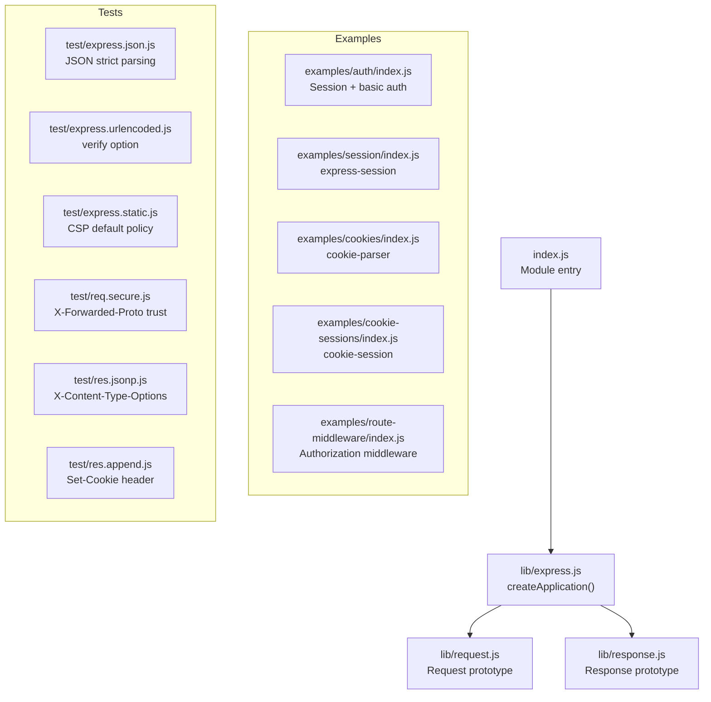
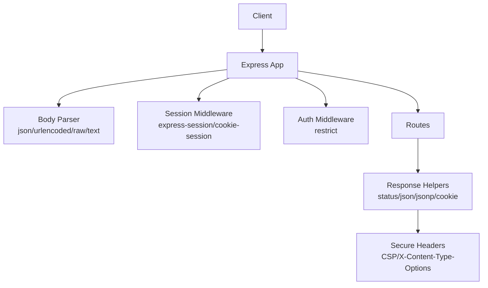
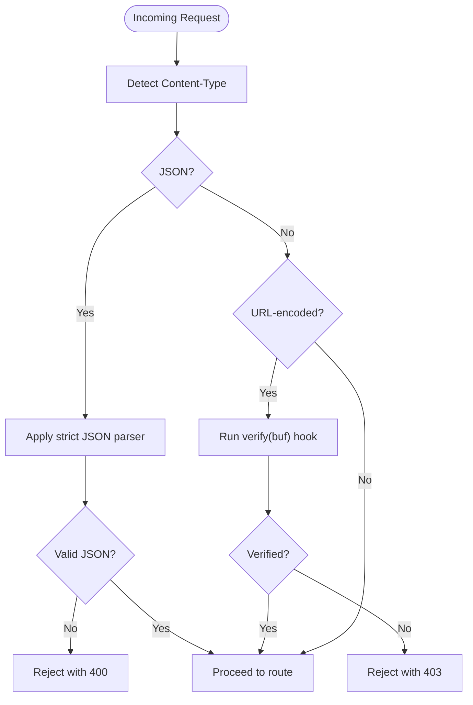
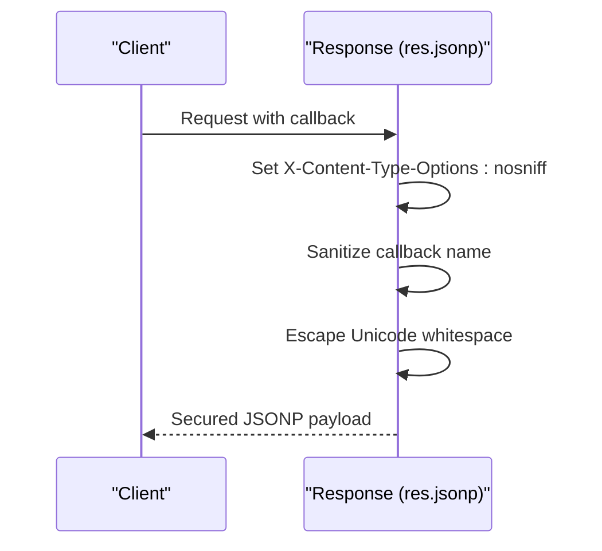
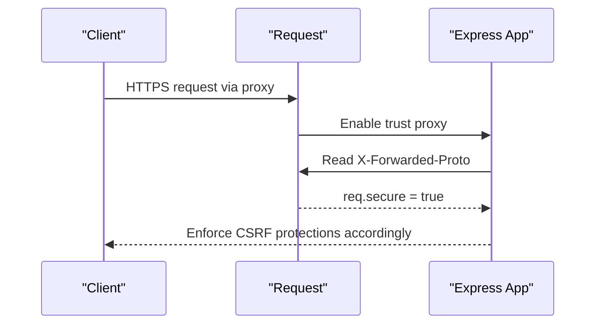
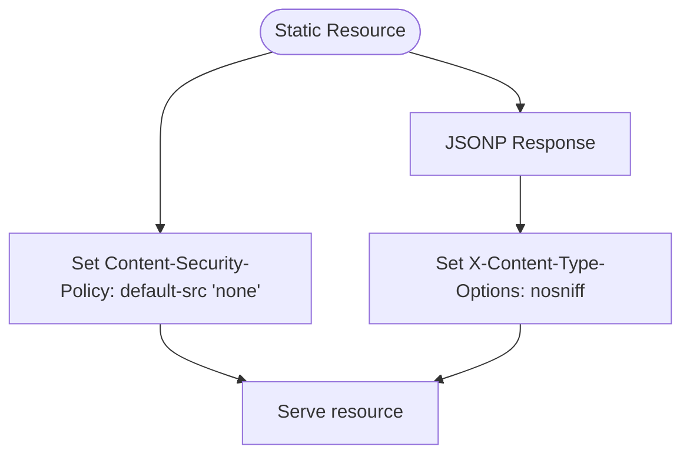
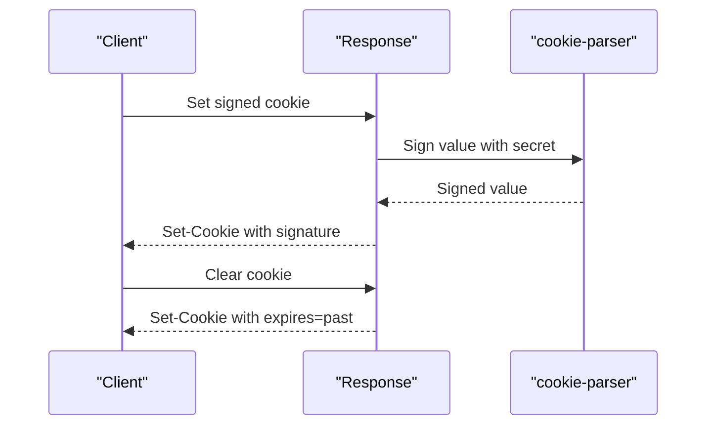
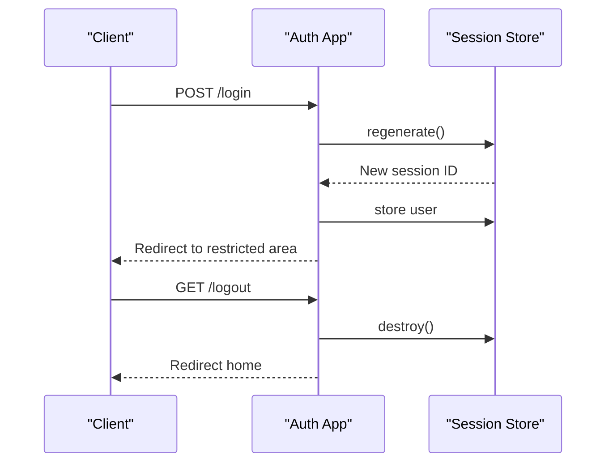
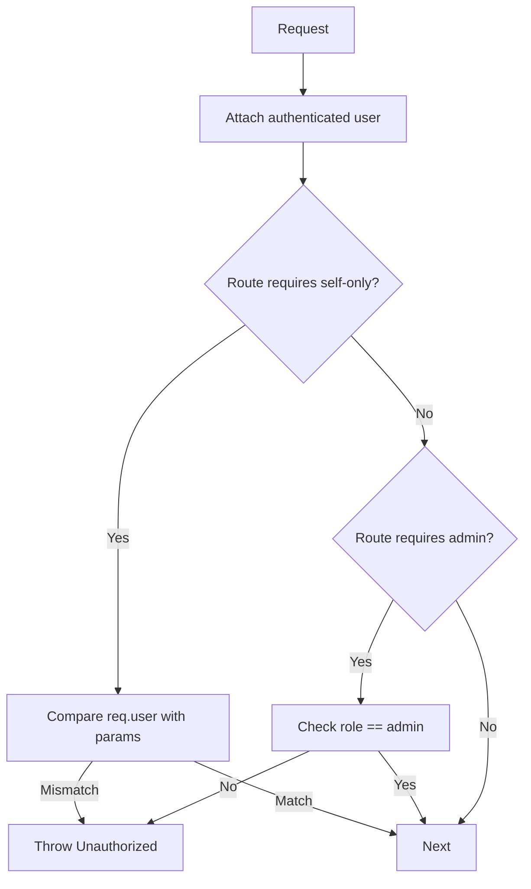
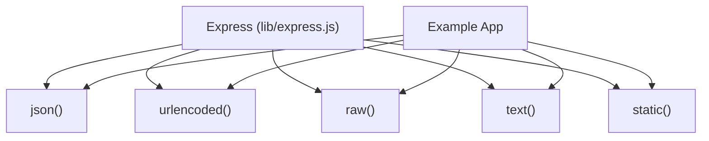

# Security Considerations

<cite>
**Referenced Files in This Document**
- [index.js](file://index.js)
- [package.json](file://package.json)
- [express.js](file://lib/express.js)
- [request.js](file://lib/request.js)
- [response.js](file://lib/response.js)
- [auth/index.js](file://examples/auth/index.js)
- [session/index.js](file://examples/session/index.js)
- [cookies/index.js](file://examples/cookies/index.js)
- [cookie-sessions/index.js](file://examples/cookie-sessions/index.js)
- [route-middleware/index.js](file://examples/route-middleware/index.js)
- [express.json.js](file://test/express.json.js)
- [express.urlencoded.js](file://test/express.urlencoded.js)
- [express.static.js](file://test/express.static.js)
- [req.secure.js](file://test/req.secure.js)
- [res.jsonp.js](file://test/res.jsonp.js)
- [res.append.js](file://test/res.append.js)
</cite>

## Table of Contents
1. [Introduction](#introduction)
2. [Project Structure](#project-structure)
3. [Core Components](#core-components)
4. [Architecture Overview](#architecture-overview)
5. [Detailed Component Analysis](#detailed-component-analysis)
6. [Dependency Analysis](#dependency-analysis)
7. [Performance Considerations](#performance-considerations)
8. [Troubleshooting Guide](#troubleshooting-guide)
9. [Conclusion](#conclusion)
10. [Appendices](#appendices)

## Introduction
This document consolidates Express.js security considerations derived from the repository’s implementation and examples. It focuses on input validation strategies, XSS prevention techniques, CSRF protection implementation, secure header configuration, content security policies, secure cookie settings, authentication and session management, authorization patterns, SQL and NoSQL injection prevention, secure database access patterns, and security monitoring and incident response strategies. Practical examples from the codebase illustrate middleware usage, input sanitization, and secure configuration patterns.

## Project Structure
The repository is organized into:
- Core library under lib/ exposing the Express application factory and request/response extensions.
- Examples demonstrating authentication, sessions, cookies, cookie-backed sessions, and route middleware.
- Tests validating behavior such as JSON parsing strictness, URL-encoded entity verification, static serving headers, secure protocol detection, JSONP security headers, and cookie header composition.

**Diagram sources**
- [index.js:1-12](file://index.js#L1-L12)
- [express.js:36-56](file://lib/express.js#L36-L56)
- [request.js:63-83](file://lib/request.js#L63-L83)
- [response.js:664-686](file://lib/response.js#L664-L686)
- [auth/index.js:12-26](file://examples/auth/index.js#L12-L26)
- [session/index.js:16-20](file://examples/session/index.js#L16-L20)
- [cookies/index.js:19](file://examples/cookies/index.js#L19)
- [cookie-sessions/index.js:13](file://examples/cookie-sessions/index.js#L13)
- [route-middleware/index.js:65-68](file://examples/route-middleware/index.js#L65-L68)
- [express.json.js:238-280](file://test/express.json.js#L238-L280)
- [express.urlencoded.js:524-563](file://test/express.urlencoded.js#L524-L563)
- [express.static.js:515-520](file://test/express.static.js#L515-L520)
- [req.secure.js:38-51](file://test/req.secure.js#L38-L51)
- [res.jsonp.js:116-128](file://test/res.jsonp.js#L116-L128)
- [res.append.js:100-116](file://test/res.append.js#L100-L116)

**Section sources**
- [index.js:1-12](file://index.js#L1-L12)
- [express.js:36-56](file://lib/express.js#L36-L56)

## Core Components
- Application factory and middleware exposure: The application factory initializes request/response prototypes and exposes middleware such as JSON, raw, text, urlencoded, and static.
- Request helpers: Protocol, secure flag, IP resolution, and header getters enable secure routing and trust-proxy-aware logic.
- Response helpers: Status code validation, JSON/JSONP, cookies, and headers support secure output and CSP/XSS mitigations.

Key implementation references:
- Application creation and middleware export: [express.js:36-82](file://lib/express.js#L36-L82)
- Request protocol and secure flag: [request.js:297-328](file://lib/request.js#L297-L328)
- Response status and JSON/JSONP: [response.js:64-76](file://lib/response.js#L64-L76), [response.js:232-246](file://lib/response.js#L232-L246), [response.js:260-304](file://lib/response.js#L260-L304)
- Cookie handling and signed cookies: [response.js:742-775](file://lib/response.js#L742-L775)

**Section sources**
- [express.js:36-82](file://lib/express.js#L36-L82)
- [request.js:297-328](file://lib/request.js#L297-L328)
- [response.js:64-76](file://lib/response.js#L64-L76)
- [response.js:232-246](file://lib/response.js#L232-L246)
- [response.js:260-304](file://lib/response.js#L260-L304)
- [response.js:742-775](file://lib/response.js#L742-L775)

## Architecture Overview
The Express application composes middleware to validate and sanitize inputs, enforce secure headers, manage sessions and cookies, and protect routes via authorization checks. The examples demonstrate secure patterns for authentication, session management, and cookie handling.

**Diagram sources**
- [express.js:77-81](file://lib/express.js#L77-L81)
- [auth/index.js:21-26](file://examples/auth/index.js#L21-L26)
- [session/index.js:16-20](file://examples/session/index.js#L16-L20)
- [cookie-sessions/index.js:13](file://examples/cookie-sessions/index.js#L13)
- [route-middleware/index.js:75-82](file://examples/route-middleware/index.js#L75-L82)
- [response.js:64-76](file://lib/response.js#L64-L76)
- [response.js:260-304](file://lib/response.js#L260-L304)
- [response.js:742-775](file://lib/response.js#L742-L775)

## Detailed Component Analysis

### Input Validation Strategies
- Strict JSON parsing: Tests demonstrate strict mode rejecting primitive top-level values and enforcing leading-whitespace rules, reducing injection risks in JSON payloads.
- URL-encoded entity verification: Tests show a verify option to assert or reject malformed bodies, enabling early rejection of malicious inputs.
- Content-type negotiation: Request.is and Accept headers help route to parsers and prevent unexpected content types.

Practical references:
- Strict JSON parsing behavior: [express.json.js:238-280](file://test/express.json.js#L238-L280)
- URL-encoded verify option: [express.urlencoded.js:524-563](file://test/express.urlencoded.js#L524-L563)
- Content-type checks: [request.js:269-281](file://lib/request.js#L269-L281)

**Diagram sources**
- [express.json.js:238-280](file://test/express.json.js#L238-L280)
- [express.urlencoded.js:524-563](file://test/express.urlencoded.js#L524-L563)
- [request.js:269-281](file://lib/request.js#L269-L281)

**Section sources**
- [express.json.js:238-280](file://test/express.json.js#L238-L280)
- [express.urlencoded.js:524-563](file://test/express.urlencoded.js#L524-L563)
- [request.js:269-281](file://lib/request.js#L269-L281)

### XSS Prevention Techniques
- JSONP safety: The JSONP responder sets X-Content-Type-Options: nosniff, restricts callback names, and escapes Unicode whitespace to mitigate XSS in legacy JSONP endpoints.
- HTML rendering: The EJS example demonstrates HTML output with escaped content in templates, preventing reflected XSS in views.

Practical references:
- JSONP security headers and escaping: [res.jsonp.js:116-128](file://test/res.jsonp.js#L116-L128)
- EJS example rendering: [acceptance/ejs.js:1-17](file://test/acceptance/ejs.js#L1-L17)

**Diagram sources**
- [res.jsonp.js:116-128](file://test/res.jsonp.js#L116-L128)

**Section sources**
- [res.jsonp.js:116-128](file://test/res.jsonp.js#L116-L128)
- [acceptance/ejs.js:1-17](file://test/acceptance/ejs.js#L1-L17)

### CSRF Protection Implementation
- Trust proxy and protocol awareness: Secure flag depends on X-Forwarded-Proto when trust proxy is enabled, ensuring CSRF protections align with actual transport security.
- Redirect safety: Location setter encodes URLs to prevent open redirect vulnerabilities.

Practical references:
- Secure flag with trust proxy: [req.secure.js:38-51](file://test/req.secure.js#L38-L51)
- Location encoding: [response.js:794-796](file://lib/response.js#L794-L796)

**Diagram sources**
- [req.secure.js:38-51](file://test/req.secure.js#L38-L51)

**Section sources**
- [req.secure.js:38-51](file://test/req.secure.js#L38-L51)
- [response.js:794-796](file://lib/response.js#L794-L796)

### Secure Header Configuration and Content Security Policies
- Default CSP: Static serving tests confirm a default Content-Security-Policy header is applied, limiting resource loading by default.
- Additional headers: JSONP responses set X-Content-Type-Options: nosniff to prevent MIME sniffing.

Practical references:
- Default CSP header: [express.static.js:515-520](file://test/express.static.js#L515-L520)
- X-Content-Type-Options in JSONP: [res.jsonp.js:116-128](file://test/res.jsonp.js#L116-L128)

**Diagram sources**
- [express.static.js:515-520](file://test/express.static.js#L515-L520)
- [res.jsonp.js:116-128](file://test/res.jsonp.js#L116-L128)

**Section sources**
- [express.static.js:515-520](file://test/express.static.js#L515-L520)
- [res.jsonp.js:116-128](file://test/res.jsonp.js#L116-L128)

### Secure Cookie Settings
- Signed cookies require a secret; attempting to sign without a secret throws an error.
- Cookie serialization enforces defaults (e.g., path) and supports HttpOnly for XSS mitigation.
- Clearing cookies forces expiration to the past.

Practical references:
- Signed cookie validation: [response.js:747-749](file://lib/response.js#L747-L749)
- Cookie serialization and defaults: [response.js:742-775](file://lib/response.js#L742-L775)
- Clear cookie expiration: [response.js:709-716](file://lib/response.js#L709-L716)

**Diagram sources**
- [response.js:742-775](file://lib/response.js#L742-L775)
- [response.js:709-716](file://lib/response.js#L709-L716)

**Section sources**
- [response.js:742-775](file://lib/response.js#L742-L775)
- [response.js:709-716](file://lib/response.js#L709-L716)

### Authentication Security and Session Management Best Practices
- Session lifecycle: Regenerating sessions upon login prevents fixation attacks; sessions are destroyed on logout.
- Session stores: Examples use express-session and cookie-session; best practice is to use a secure backend (e.g., Redis) and configure secure flags.
- Message persistence: Session-persisted messages avoid XSS by rendering server-side messages safely.

Practical references:
- Session regeneration and storage: [auth/index.js:109-120](file://examples/auth/index.js#L109-L120)
- Logout and destroy: [auth/index.js:95-97](file://examples/auth/index.js#L95-L97)
- Session configuration: [session/index.js:16-20](file://examples/session/index.js#L16-L20), [cookie-sessions/index.js:13](file://examples/cookie-sessions/index.js#L13)

**Diagram sources**
- [auth/index.js:109-120](file://examples/auth/index.js#L109-L120)
- [auth/index.js:95-97](file://examples/auth/index.js#L95-L97)

**Section sources**
- [auth/index.js:109-120](file://examples/auth/index.js#L109-L120)
- [auth/index.js:95-97](file://examples/auth/index.js#L95-L97)
- [session/index.js:16-20](file://examples/session/index.js#L16-L20)
- [cookie-sessions/index.js:13](file://examples/cookie-sessions/index.js#L13)

### Authorization Patterns
- Middleware-driven restrictions: Faux authentication middleware attaches an authenticated user to requests; route-specific middleware enforces self-access and role-based access.
- Error propagation: Unauthorized access triggers errors handled by centralized error handlers.

Practical references:
- Auth middleware and route binding: [route-middleware/index.js:65-68](file://examples/route-middleware/index.js#L65-L68)
- Self-restriction and admin restriction: [route-middleware/index.js:50-58](file://examples/route-middleware/index.js#L50-L58)
- Route handlers: [route-middleware/index.js:74-84](file://examples/route-middleware/index.js#L74-L84)

**Diagram sources**
- [route-middleware/index.js:65-68](file://examples/route-middleware/index.js#L65-L68)
- [route-middleware/index.js:50-58](file://examples/route-middleware/index.js#L50-L58)
- [route-middleware/index.js:74-84](file://examples/route-middleware/index.js#L74-L84)

**Section sources**
- [route-middleware/index.js:65-68](file://examples/route-middleware/index.js#L65-L68)
- [route-middleware/index.js:50-58](file://examples/route-middleware/index.js#L50-L58)
- [route-middleware/index.js:74-84](file://examples/route-middleware/index.js#L74-L84)

### SQL Injection Prevention and Secure Database Access Patterns
- Principle: Treat all external inputs as untrusted. Use parameterized queries or ORM/query builders to separate SQL commands from data.
- Express examples do not include database drivers; adopt the principle by avoiding template literals with user input in SQL construction and by validating/sanitizing inputs before query assembly.

[No sources needed since this section provides general guidance]

### NoSQL Injection Protection
- Principle: Validate and sanitize inputs; avoid constructing query objects from raw user input. Use allow-lists for keys and enforce strict schemas.
- Express examples do not include NoSQL drivers; apply the principle by rejecting unexpected fields and using typed schemas for document updates.

[No sources needed since this section provides general guidance]

### Secure Database Access Patterns
- Principle: Use connection pooling with TLS, least-privilege credentials, and prepared statements or parameterized queries. Centralize access in service layers with input validation and error logging.
- Express examples do not include database drivers; apply the principle by centralizing data access and enforcing strict input validation.

[No sources needed since this section provides general guidance]

### Practical Examples from the Codebase
- Authentication and sessions: [auth/index.js:12-128](file://examples/auth/index.js#L12-L128)
- Session configuration: [session/index.js:16-20](file://examples/session/index.js#L16-L20), [cookie-sessions/index.js:13](file://examples/cookie-sessions/index.js#L13)
- Cookies and signed cookies: [cookies/index.js:19](file://examples/cookies/index.js#L19), [response.js:742-775](file://lib/response.js#L742-L775)
- Authorization middleware: [route-middleware/index.js:65-82](file://examples/route-middleware/index.js#L65-L82)
- Input validation and parsing: [express.json.js:238-280](file://test/express.json.js#L238-L280), [express.urlencoded.js:524-563](file://test/express.urlencoded.js#L524-L563)
- Secure headers and CSP: [express.static.js:515-520](file://test/express.static.js#L515-L520), [res.jsonp.js:116-128](file://test/res.jsonp.js#L116-L128)
- Protocol and trust proxy: [req.secure.js:38-51](file://test/req.secure.js#L38-L51)

**Section sources**
- [auth/index.js:12-128](file://examples/auth/index.js#L12-L128)
- [session/index.js:16-20](file://examples/session/index.js#L16-L20)
- [cookie-sessions/index.js:13](file://examples/cookie-sessions/index.js#L13)
- [cookies/index.js:19](file://examples/cookies/index.js#L19)
- [response.js:742-775](file://lib/response.js#L742-L775)
- [route-middleware/index.js:65-82](file://examples/route-middleware/index.js#L65-L82)
- [express.json.js:238-280](file://test/express.json.js#L238-L280)
- [express.urlencoded.js:524-563](file://test/express.urlencoded.js#L524-L563)
- [express.static.js:515-520](file://test/express.static.js#L515-L520)
- [res.jsonp.js:116-128](file://test/res.jsonp.js#L116-L128)
- [req.secure.js:38-51](file://test/req.secure.js#L38-L51)

## Dependency Analysis
Express exposes middleware via the application factory. The examples demonstrate usage of body-parser, express-session, cookie-session, cookie-parser, and pbkdf2-password for hashing.

**Diagram sources**
- [express.js:77-81](file://lib/express.js#L77-L81)

**Section sources**
- [express.js:77-81](file://lib/express.js#L77-L81)
- [package.json:34-62](file://package.json#L34-L62)

## Performance Considerations
- Prefer streaming for large file downloads and avoid unnecessary buffering.
- Use appropriate ETag generation and caching headers to reduce bandwidth.
- Minimize synchronous operations in middleware to keep event loop responsive.

[No sources needed since this section provides general guidance]

## Troubleshooting Guide
- JSON parse errors: Strict JSON mode rejects primitives and malformed inputs; adjust client payloads or disable strict mode only if necessary and validated.
- URL-encoded verification failures: Implement a verify function to assert or reject suspicious payloads.
- Cookie signing errors: Ensure a secret is configured for signed cookies; otherwise, signing will fail.
- Redirect anomalies: Confirm trust proxy settings when relying on X-Forwarded-Proto for secure flags.
- CSP violations: Review default CSP header and relax policies only for specific resources after audit.

Practical references:
- Strict JSON behavior: [express.json.js:238-280](file://test/express.json.js#L238-L280)
- URL-encoded verify: [express.urlencoded.js:524-563](file://test/express.urlencoded.js#L524-L563)
- Cookie signing requirement: [response.js:747-749](file://lib/response.js#L747-L749)
- Trust proxy and secure flag: [req.secure.js:38-51](file://test/req.secure.js#L38-L51)
- CSP default policy: [express.static.js:515-520](file://test/express.static.js#L515-L520)

**Section sources**
- [express.json.js:238-280](file://test/express.json.js#L238-L280)
- [express.urlencoded.js:524-563](file://test/express.urlencoded.js#L524-L563)
- [response.js:747-749](file://lib/response.js#L747-L749)
- [req.secure.js:38-51](file://test/req.secure.js#L38-L51)
- [express.static.js:515-520](file://test/express.static.js#L515-L520)

## Conclusion
By leveraging Express’s built-in request/response helpers, middleware, and the included examples, applications can implement robust security controls: strict input validation, secure headers and CSP, signed and HttpOnly cookies, secure session management, and authorization middleware. Adopting these patterns reduces exposure to common web vulnerabilities while maintaining performance and maintainability.

[No sources needed since this section summarizes without analyzing specific files]

## Appendices
- External dependencies relevant to security:
  - body-parser: JSON, URL-encoded, raw, text parsing with strict and verify options.
  - cookie, cookie-signature: Cookie serialization and signing.
  - escape-html: HTML escaping for views.
  - serve-static: Default CSP header for static assets.
  - debug, depd, http-errors, on-finished, vary: Diagnostics, deprecation handling, error creation, response lifecycle, and Vary header management.

**Section sources**
- [package.json:34-62](file://package.json#L34-L62)
- [package.json:64-81](file://package.json#L64-L81)