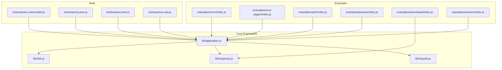
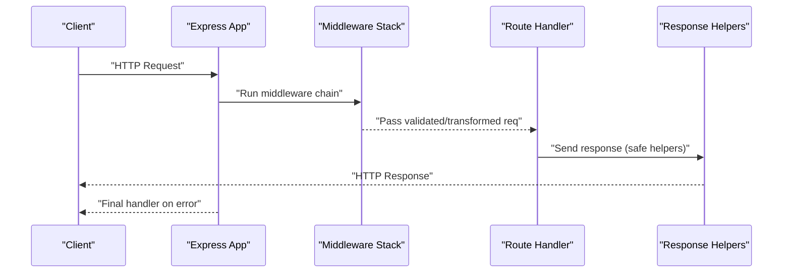
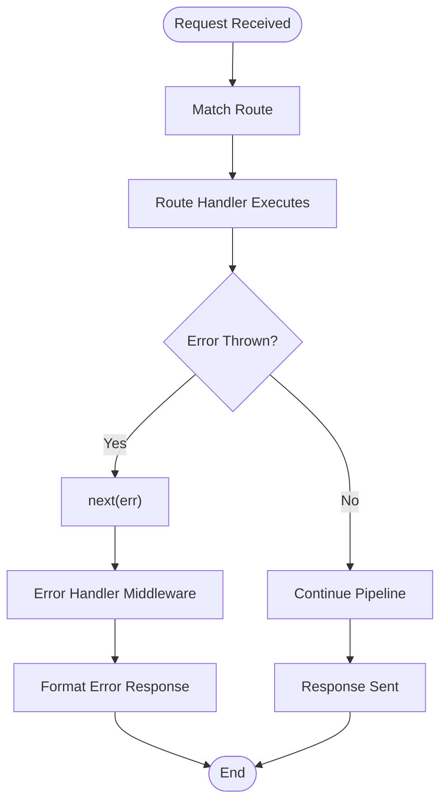
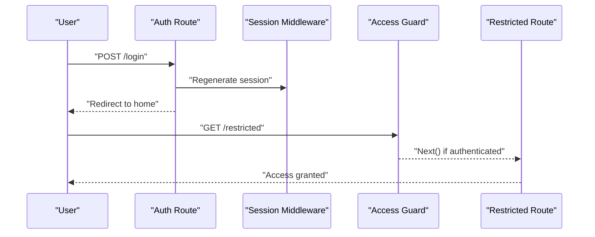
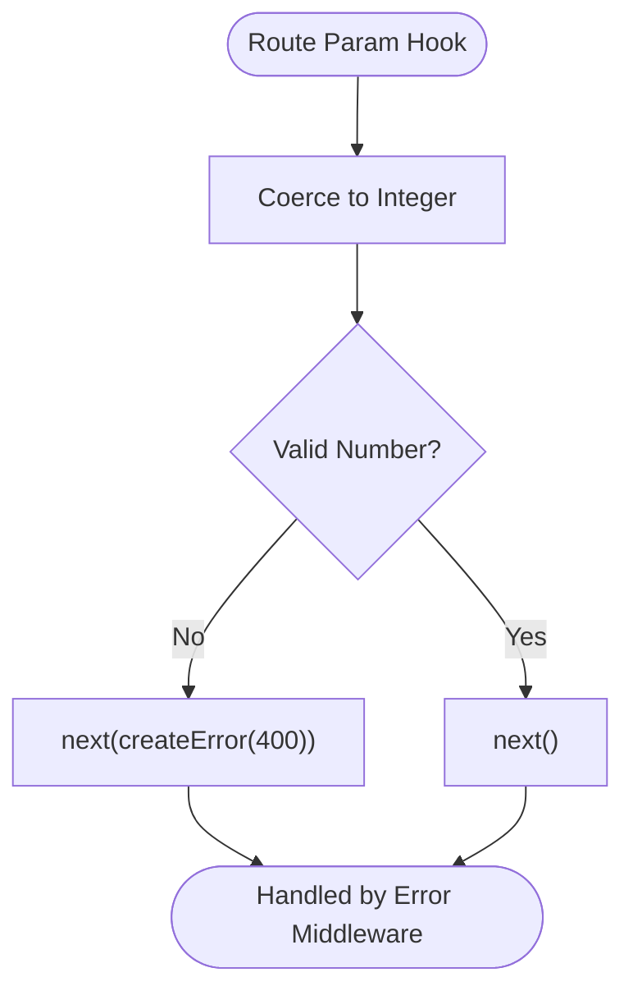
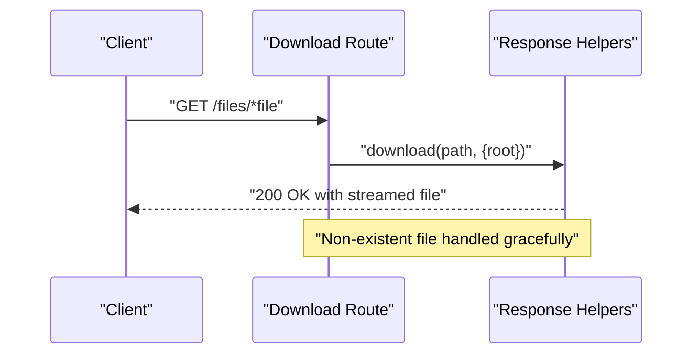
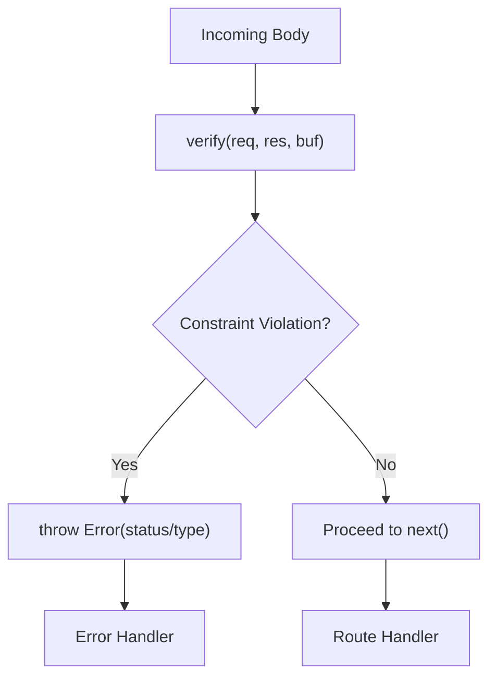
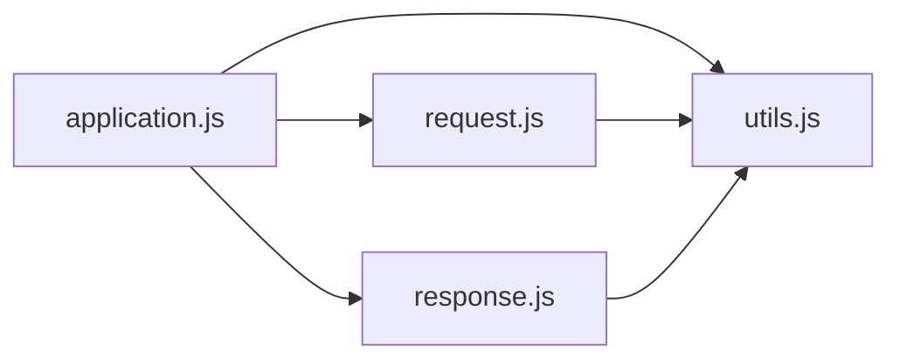

# Vulnerability Prevention and Protection

<cite>
**Referenced Files in This Document**
- [index.js](file://index.js)
- [application.js](file://lib/application.js)
- [request.js](file://lib/request.js)
- [response.js](file://lib/response.js)
- [utils.js](file://lib/utils.js)
- [error/index.js](file://examples/error/index.js)
- [error-pages/index.js](file://examples/error-pages/index.js)
- [auth/index.js](file://examples/auth/index.js)
- [params/index.js](file://examples/params/index.js)
- [downloads/index.js](file://examples/downloads/index.js)
- [session/index.js](file://examples/session/index.js)
- [express.urlencoded.js](file://test/express.urlencoded.js)
- [express.json.js](file://test/express.json.js)
- [express.text.js](file://test/express.text.js)
- [express.raw.js](file://test/express.raw.js)
</cite>

## Table of Contents
1. [Introduction](#introduction)
2. [Project Structure](#project-structure)
3. [Core Components](#core-components)
4. [Architecture Overview](#architecture-overview)
5. [Detailed Component Analysis](#detailed-component-analysis)
6. [Dependency Analysis](#dependency-analysis)
7. [Performance Considerations](#performance-considerations)
8. [Troubleshooting Guide](#troubleshooting-guide)
9. [Conclusion](#conclusion)
10. [Appendices](#appendices)

## Introduction
This document provides a comprehensive guide to vulnerability prevention and protection strategies for Express.js applications. It focuses on mitigating common web vulnerabilities such as SQL injection, NoSQL injection, command injection, and path traversal. It also covers rate limiting, DDoS protection, request throttling, secure file uploads, directory traversal prevention, malicious file detection, error handling security, information disclosure prevention, debug mode safety, and security monitoring/logging/incident response.

The content synthesizes patterns and mechanisms present in the repository’s core framework files and example applications to offer practical, code-backed guidance for building secure Express applications.

## Project Structure
The repository is organized into:
- Core framework modules under lib/ that implement the Express runtime behavior (application bootstrap, request/response helpers, utilities).
- Example applications under examples/ that demonstrate routing, sessions, authentication, error handling, and file downloads.
- Tests under test/ that exercise middleware behavior such as entity verification for various content types.

**Diagram sources**
- [application.js:152-178](file://lib/application.js#L152-L178)
- [request.js:63-83](file://lib/request.js#L63-L83)
- [response.js:125-218](file://lib/response.js#L125-L218)
- [utils.js:162-184](file://lib/utils.js#L162-L184)
- [error/index.js:20-47](file://examples/error/index.js#L20-L47)
- [error-pages/index.js:63-97](file://examples/error-pages/index.js#L63-L97)
- [auth/index.js:104-128](file://examples/auth/index.js#L104-L128)
- [params/index.js:23-41](file://examples/params/index.js#L23-L41)
- [downloads/index.js:26-34](file://examples/downloads/index.js#L26-L34)
- [session/index.js:16-20](file://examples/session/index.js#L16-L20)
- [express.urlencoded.js:524-563](file://test/express.urlencoded.js#L524-L563)
- [express.json.js:399-446](file://test/express.json.js#L399-L446)
- [express.text.js:295-334](file://test/express.text.js#L295-L334)
- [express.raw.js:279-316](file://test/express.raw.js#L279-L316)

**Section sources**
- [index.js:11-12](file://index.js#L11-L12)
- [application.js:90-141](file://lib/application.js#L90-L141)

## Core Components
- Application initialization and default configuration establish baseline security-related settings such as environment, query parser, trust proxy, and x-powered-by header behavior.
- Request helpers provide safe accessors for headers, protocol, IP, and subdomains, with trust-proxy-aware logic to avoid spoofed headers.
- Response helpers encapsulate safe sending of data, JSON, and file downloads, including Content-Type normalization and ETag generation.
- Utilities compile query parsers, ETag generators, and trust functions, enabling consistent and secure behavior across the app.

Practical implications:
- Enabling/disabling x-powered-by reduces fingerprinting.
- Configuring trust proxy correctly prevents reliance on untrusted headers.
- Using built-in response methods avoids common mistakes in content-type and body handling.

**Section sources**
- [application.js:90-141](file://lib/application.js#L90-L141)
- [request.js:297-315](file://lib/request.js#L297-L315)
- [response.js:125-218](file://lib/response.js#L125-L218)
- [utils.js:162-184](file://lib/utils.js#L162-L184)

## Architecture Overview
The Express runtime composes middleware and routes into a request pipeline. Security-relevant decisions often occur in middleware (authentication, input validation, rate limiting) and in response helpers (safe serialization, file serving). Error handling middleware ensures consistent error responses and prevents information disclosure.

**Diagram sources**
- [application.js:152-178](file://lib/application.js#L152-L178)
- [response.js:125-218](file://lib/response.js#L125-L218)
- [error-pages/index.js:91-97](file://examples/error-pages/index.js#L91-L97)

## Detailed Component Analysis

### Secure Error Handling and Information Disclosure Prevention
- Centralized error handling middleware receives thrown or nexted errors and responds consistently.
- Verbose error templates are controlled by an application setting; production disables verbose errors to avoid leaking internal details.
- The generic 404 handler uses content negotiation to return appropriate formats without exposing stack traces.

Recommended practices:
- Always use a dedicated error-handling middleware with arity 4.
- Never expose raw stack traces or internal error messages to clients.
- Use environment-specific settings to toggle verbosity.

**Diagram sources**
- [error/index.js:20-47](file://examples/error/index.js#L20-L47)
- [error-pages/index.js:63-97](file://examples/error-pages/index.js#L63-L97)

**Section sources**
- [error/index.js:20-47](file://examples/error/index.js#L20-L47)
- [error-pages/index.js:17-24](file://examples/error-pages/index.js#L17-L24)
- [error-pages/index.js:63-97](file://examples/error-pages/index.js#L63-L97)

### Authentication and Session Security
- Session middleware is configured with secure defaults (do not save uninitialized sessions, secret required).
- Authentication middleware populates session state and enforces access restrictions.
- Redirects preserve referer safely and regenerate session identifiers to prevent fixation.

Security controls:
- Use a strong secret for session signing.
- Regenerate session IDs upon login.
- Enforce middleware guards for protected routes.

**Diagram sources**
- [auth/index.js:104-128](file://examples/auth/index.js#L104-L128)
- [session/index.js:16-20](file://examples/session/index.js#L16-L20)

**Section sources**
- [auth/index.js:21-26](file://examples/auth/index.js#L21-L26)
- [auth/index.js:104-128](file://examples/auth/index.js#L104-L128)
- [session/index.js:16-20](file://examples/session/index.js#L16-L20)

### Input Validation and Parameter Sanitization
- Route parameters can be transformed and validated using app.param callbacks.
- On invalid input, create and pass explicit HTTP errors (e.g., 400/404) to the error pipeline.

Security controls:
- Validate and coerce numeric parameters.
- Fail closed on malformed input.
- Use HTTP errors with clear messages.

**Diagram sources**
- [params/index.js:23-30](file://examples/params/index.js#L23-L30)

**Section sources**
- [params/index.js:23-30](file://examples/params/index.js#L23-L30)

### Secure File Upload Handling and Directory Traversal Prevention
- File serving uses absolute paths and validates path arguments to prevent traversal.
- Download helper sets Content-Disposition and delegates to a streaming file sender with safe defaults.

Security controls:
- Always require absolute paths or enforce a root directory.
- Reject non-string or relative paths that could lead to traversal.
- Stream files to avoid loading entire files into memory.

**Diagram sources**
- [downloads/index.js:26-34](file://examples/downloads/index.js#L26-L34)
- [response.js:433-482](file://lib/response.js#L433-L482)

**Section sources**
- [downloads/index.js:12-13](file://examples/downloads/index.js#L12-L13)
- [downloads/index.js:26-34](file://examples/downloads/index.js#L26-L34)
- [response.js:371-413](file://lib/response.js#L371-L413)

### Entity Verification and Malformed Payload Detection
- Tests demonstrate verify hooks for URL-encoded, JSON, text, and raw bodies to reject unwanted prefixes or structures.
- These verify functions can throw custom errors with specific status codes and types.

Security controls:
- Use verify to enforce payload constraints (e.g., reject leading whitespace, disallow arrays).
- Return consistent error responses with appropriate HTTP status codes.

**Diagram sources**
- [express.urlencoded.js:524-563](file://test/express.urlencoded.js#L524-L563)
- [express.json.js:399-446](file://test/express.json.js#L399-L446)
- [express.text.js:295-334](file://test/express.text.js#L295-L334)
- [express.raw.js:279-316](file://test/express.raw.js#L279-L316)

**Section sources**
- [express.urlencoded.js:524-563](file://test/express.urlencoded.js#L524-L563)
- [express.json.js:399-446](file://test/express.json.js#L399-L446)
- [express.text.js:295-334](file://test/express.text.js#L295-L334)
- [express.raw.js:279-316](file://test/express.raw.js#L279-L316)

### Rate Limiting, DDoS Protection, and Request Throttling Patterns
- The repository does not include built-in rate limiting or DDoS protection middleware. Implement these at the application level using middleware patterns:
  - Track requests per IP and endpoint.
  - Apply sliding windows or token buckets.
  - Integrate with external rate limiting services or platform features.
  - Combine with reverse proxies for network-level DDoS filtering.

[No sources needed since this section provides general guidance]

### Secure Database Queries and Injection Mitigation
- The repository does not include database drivers or ORMs. To prevent SQL and NoSQL injection:
  - Use parameterized queries or ORM query builders.
  - Validate and sanitize inputs before constructing queries.
  - Enforce least privilege and audit database access.

[No sources needed since this section provides general guidance]

### Command Injection Prevention
- Avoid executing OS commands with user-supplied input.
- If unavoidable, use strict allowlists, shell escaping, and sandboxing.
- Prefer higher-level APIs and avoid shell interpretation.

[No sources needed since this section provides general guidance]

### Path Traversal Prevention
- Always validate and normalize file paths.
- Restrict file access to a designated root directory.
- Reject absolute paths and suspicious segments.

[No sources needed since this section provides general guidance]

### Error Response Patterns and Debug Mode Safety
- Use environment-aware settings to disable verbose errors in production.
- Ensure error handlers set appropriate status codes and return minimal information.
- Avoid exposing internal stack traces or implementation details.

**Section sources**
- [error-pages/index.js:17-24](file://examples/error-pages/index.js#L17-L24)
- [error-pages/index.js:91-97](file://examples/error-pages/index.js#L91-L97)

### Security Monitoring, Logging, and Incident Response
- Integrate structured logging for requests, errors, and security events.
- Correlate logs with rate-limiting and anomaly detection systems.
- Establish incident playbooks for denial-of-service, credential theft, and data exposure.

[No sources needed since this section provides general guidance]

## Dependency Analysis
Express’s core modules collaborate to provide a secure foundation:
- application.js orchestrates middleware, error handling, and default settings.
- request.js provides trust-proxy-aware getters for protocol, IP, and host.
- response.js offers safe response methods and file download helpers.
- utils.js compiles query parsers and trust functions used by request/response.

**Diagram sources**
- [application.js:152-178](file://lib/application.js#L152-L178)
- [request.js:297-315](file://lib/request.js#L297-L315)
- [response.js:125-218](file://lib/response.js#L125-L218)
- [utils.js:162-184](file://lib/utils.js#L162-L184)

**Section sources**
- [application.js:152-178](file://lib/application.js#L152-L178)
- [request.js:297-315](file://lib/request.js#L297-L315)
- [response.js:125-218](file://lib/response.js#L125-L218)
- [utils.js:162-184](file://lib/utils.js#L162-L184)

## Performance Considerations
- Prefer streaming responses for large files to reduce memory usage.
- Use ETag generation and caching headers to minimize redundant transfers.
- Keep middleware lean and avoid synchronous I/O in hot paths.

[No sources needed since this section provides general guidance]

## Troubleshooting Guide
Common pitfalls and remedies:
- Verbose errors in production: Disable “verbose errors” setting in production environments.
- Incorrect trust proxy configuration: Ensure trust proxy settings reflect your deployment topology to avoid relying on spoofed headers.
- Unsafe file serving: Always pass absolute paths or enforce a root directory; reject relative paths that could traverse directories.
- Missing input validation: Add app.param hooks to coerce and validate parameters; fail fast on invalid input.

**Section sources**
- [error-pages/index.js:17-24](file://examples/error-pages/index.js#L17-L24)
- [request.js:297-315](file://lib/request.js#L297-L315)
- [downloads/index.js:26-34](file://examples/downloads/index.js#L26-L34)
- [params/index.js:23-30](file://examples/params/index.js#L23-L30)

## Conclusion
Express provides robust primitives for building secure applications. By leveraging built-in helpers, implementing strong middleware patterns, and adopting environment-aware configurations, developers can mitigate common vulnerabilities and build resilient systems. Complement these with external rate limiting, secure logging, and incident response procedures to achieve comprehensive protection.

[No sources needed since this section summarizes without analyzing specific files]

## Appendices
- Practical example references:
  - Error handling: [examples/error/index.js:20-47](file://examples/error/index.js#L20-L47), [examples/error-pages/index.js:63-97](file://examples/error-pages/index.js#L63-L97)
  - Authentication and sessions: [examples/auth/index.js:104-128](file://examples/auth/index.js#L104-L128), [examples/session/index.js:16-20](file://examples/session/index.js#L16-L20)
  - Input validation: [examples/params/index.js:23-30](file://examples/params/index.js#L23-L30)
  - File downloads: [examples/downloads/index.js:26-34](file://examples/downloads/index.js#L26-L34)
  - Entity verification tests: [test/express.urlencoded.js:524-563](file://test/express.urlencoded.js#L524-L563), [test/express.json.js:399-446](file://test/express.json.js#L399-L446), [test/express.text.js:295-334](file://test/express.text.js#L295-L334), [test/express.raw.js:279-316](file://test/express.raw.js#L279-L316)

[No sources needed since this section lists references without analysis]