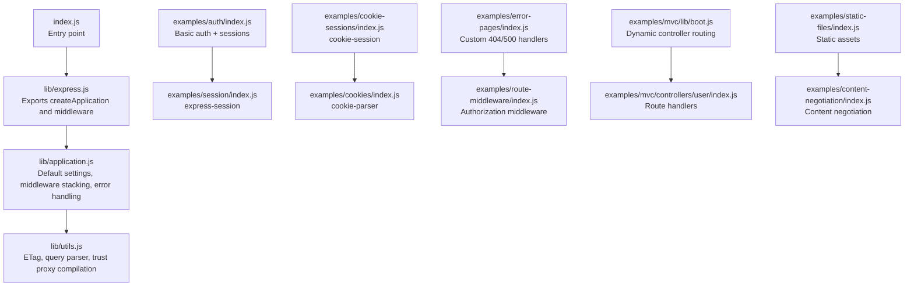
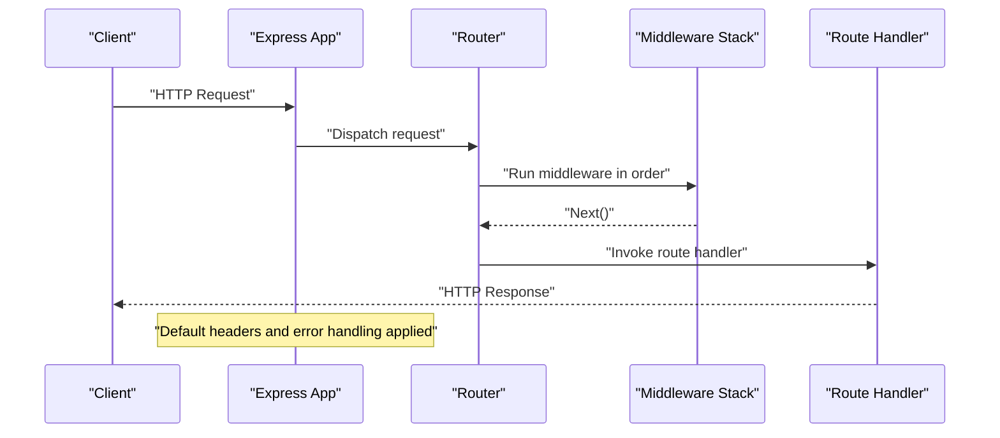
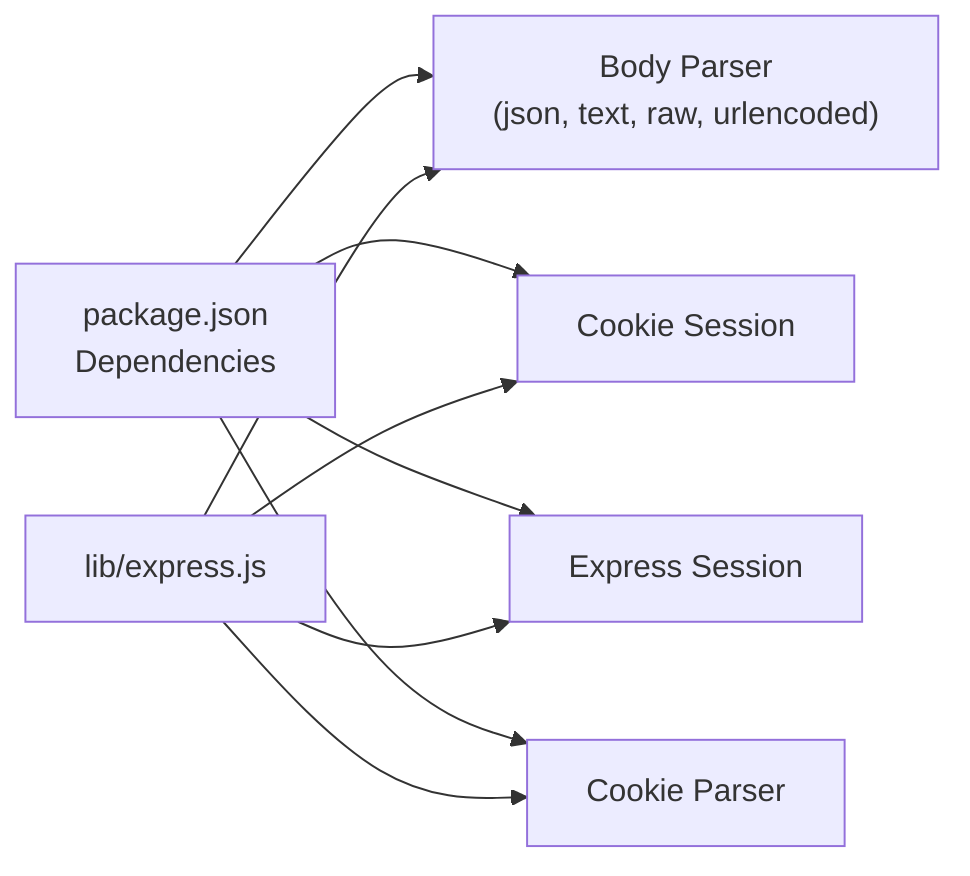

# Security and Best Practices

<cite>
**Referenced Files in This Document**
- [index.js](file://index.js)
- [package.json](file://package.json)
- [express.js](file://lib/express.js)
- [application.js](file://lib/application.js)
- [utils.js](file://lib/utils.js)
- [auth/index.js](file://examples/auth/index.js)
- [session/index.js](file://examples/session/index.js)
- [cookie-sessions/index.js](file://examples/cookie-sessions/index.js)
- [cookies/index.js](file://examples/cookies/index.js)
- [error-pages/index.js](file://examples/error-pages/index.js)
- [route-middleware/index.js](file://examples/route-middleware/index.js)
- [mvc/controllers/user/index.js](file://examples/mvc/controllers/user/index.js)
- [mvc/lib/boot.js](file://examples/mvc/lib/boot.js)
- [static-files/index.js](file://examples/static-files/index.js)
- [content-negotiation/index.js](file://examples/content-negotiation/index.js)
- [express.urlencoded.js](file://test/express.urlencoded.js)
- [express.json.js](file://test/express.json.js)
- [express.text.js](file://test/express.text.js)
- [express.raw.js](file://test/express.raw.js)
- [express.static.js](file://test/express.static.js)
- [req.secure.js](file://test/req.secure.js)
</cite>

## Table of Contents
1. [Introduction](#introduction)
2. [Project Structure](#project-structure)
3. [Core Components](#core-components)
4. [Architecture Overview](#architecture-overview)
5. [Detailed Component Analysis](#detailed-component-analysis)
6. [Dependency Analysis](#dependency-analysis)
7. [Performance Considerations](#performance-considerations)
8. [Troubleshooting Guide](#troubleshooting-guide)
9. [Conclusion](#conclusion)
10. [Appendices](#appendices)

## Introduction
This document consolidates security considerations and best practices for Express.js applications using the repository’s built-in mechanisms and example applications. It focuses on:
- Security headers and transport/security settings
- Input validation and sanitization
- Authentication and authorization patterns
- Session security
- Common vulnerabilities and prevention techniques
- Security auditing and testing approaches
- Production hardening, threat modeling, and incident response

Wherever possible, we reference concrete files and line ranges to guide secure implementation.

## Project Structure
The repository provides:
- Core framework files under lib/ that define defaults and middleware exposure
- Examples demonstrating authentication, sessions, cookies, error handling, and routing
- Tests validating behavior around request parsing, redirects, and trust proxies

**Diagram sources**
- [index.js:1-12](file://index.js#L1-L12)
- [express.js:1-82](file://lib/express.js#L1-L82)
- [application.js:90-141](file://lib/application.js#L90-L141)
- [utils.js:130-214](file://lib/utils.js#L130-L214)
- [auth/index.js:1-135](file://examples/auth/index.js#L1-L135)
- [session/index.js:1-38](file://examples/session/index.js#L1-L38)
- [cookie-sessions/index.js:1-26](file://examples/cookie-sessions/index.js#L1-L26)
- [cookies/index.js:1-54](file://examples/cookies/index.js#L1-L54)
- [error-pages/index.js:1-104](file://examples/error-pages/index.js#L1-L104)
- [route-middleware/index.js:1-91](file://examples/route-middleware/index.js#L1-L91)
- [mvc/lib/boot.js:1-84](file://examples/mvc/lib/boot.js#L1-L84)
- [mvc/controllers/user/index.js:1-42](file://examples/mvc/controllers/user/index.js#L1-L42)
- [static-files/index.js:1-44](file://examples/static-files/index.js#L1-L44)
- [content-negotiation/index.js:1-47](file://examples/content-negotiation/index.js#L1-L47)

**Section sources**
- [index.js:1-12](file://index.js#L1-L12)
- [express.js:1-82](file://lib/express.js#L1-L82)
- [application.js:90-141](file://lib/application.js#L90-L141)
- [utils.js:130-214](file://lib/utils.js#L130-L214)

## Core Components
- Default application settings and middleware exposure are defined in the core application module. Defaults include environment, ETag generation, query parser, and trust proxy configuration.
- Body parsers (JSON, text, raw, URL-encoded) are exposed via the framework and used in examples for safe request parsing.
- Utilities provide ETag generation, charset handling, and trust proxy compilation used by middleware and responses.

Key security-relevant defaults and behaviors:
- Environment defaults and production caching toggles
- ETag selection (weak/strong)
- Query parser selection (simple vs extended)
- Trust proxy configuration affecting secure flag resolution

**Section sources**
- [application.js:90-141](file://lib/application.js#L90-L141)
- [application.js:351-383](file://lib/application.js#L351-L383)
- [application.js:152-178](file://lib/application.js#L152-L178)
- [express.js:77-82](file://lib/express.js#L77-L82)
- [utils.js:130-214](file://lib/utils.js#L130-L214)

## Architecture Overview
Express applications are composed of:
- An application instance with default settings and middleware stack
- A router that dispatches requests through middleware and route handlers
- Response handling with default headers and error handling

**Diagram sources**
- [application.js:152-178](file://lib/application.js#L152-L178)
- [express.js:36-56](file://lib/express.js#L36-L56)

## Detailed Component Analysis

### Security Headers and Transport Settings
- Default headers: The application sets a default “X-Powered-By” header during request handling. In production, consider disabling this header to avoid leaking framework details.
- Trust proxy and secure flag: The secure property depends on trust proxy configuration and forwarded headers. Tests demonstrate how enabling trust proxy affects req.secure evaluation.
- Static asset redirection: Tests confirm a default Content-Security-Policy header is applied for directory redirects.

Practical guidance:
- Disable “X-Powered-By” in production.
- Configure trust proxy appropriately behind load balancers/proxies.
- Apply CSP headers consistently for static assets and dynamic responses.

**Section sources**
- [application.js:159-162](file://lib/application.js#L159-L162)
- [req.secure.js:38-98](file://test/req.secure.js#L38-L98)
- [express.static.js:515-520](file://test/express.static.js#L515-L520)

### Input Validation and Sanitization
- Body parsers: JSON, text, raw, and URL-encoded parsers are exposed by the framework. Tests demonstrate the verify option to reject unwanted prefixes or types, enabling early rejection of malformed payloads.
- Verify hook pattern: Tests show verify callbacks rejecting leading spaces, null bytes, or disallowed structures, returning 403/400 depending on configuration.

Best practices:
- Use verify hooks to enforce content constraints.
- Limit payload sizes and media types per endpoint.
- Validate and sanitize inputs at the handler boundary.

**Section sources**
- [express.js:77-82](file://lib/express.js#L77-L82)
- [express.json.js:399-446](file://test/express.json.js#L399-L446)
- [express.text.js:295-334](file://test/express.text.js#L295-L334)
- [express.urlencoded.js:524-563](file://test/express.urlencoded.js#L524-L563)
- [express.raw.js:279-316](file://test/express.raw.js#L279-L316)

### Authentication Patterns
- Basic authentication flow with session storage is demonstrated in the auth example. It includes:
  - Password hashing using PBKDF2
  - Session creation and regeneration to prevent fixation
  - Restrict middleware to gate protected routes
  - Redirect-based messaging via session flash messages

Recommendations:
- Use strong password hashing and per-user salts.
- Regenerate sessions upon login and logout.
- Store minimal identity data in sessions.
- Enforce HTTPS and secure cookie flags in production.

**Section sources**
- [auth/index.js:50-73](file://examples/auth/index.js#L50-L73)
- [auth/index.js:75-82](file://examples/auth/index.js#L75-L82)
- [auth/index.js:104-128](file://examples/auth/index.js#L104-L128)

### Authorization Strategies
- Route middleware demonstrates layered authorization:
  - Load user context
  - Restrict self-access
  - Role-based restrictions (e.g., admin)

Patterns:
- Compose middleware to build authorization chains.
- Use typed errors for unauthorized access to centralize handling.

**Section sources**
- [route-middleware/index.js:25-58](file://examples/route-middleware/index.js#L25-L58)
- [mvc/controllers/user/index.js:11-22](file://examples/mvc/controllers/user/index.js#L11-L22)

### Session Security
- express-session example shows:
  - resave=false and saveUninitialized=false to minimize unnecessary writes
  - Secret configuration for signed cookies
- cookie-session example shows in-memory cookie-backed sessions.

Guidelines:
- Use resave=false and saveUninitialized=false.
- Rotate secrets regularly.
- Prefer secure, same-site cookie flags in production.
- For distributed deployments, use a shared session store (e.g., Redis) and configure appropriate cookie flags.

**Section sources**
- [session/index.js:16-20](file://examples/session/index.js#L16-L20)
- [cookie-sessions/index.js:13](file://examples/cookie-sessions/index.js#L13)
- [auth/index.js:22-26](file://examples/auth/index.js#L22-L26)

### Cookies and Signed Cookies
- cookie-parser enables parsing signed cookies and exposes req.signedCookies.
- Example shows setting and clearing cookies with optional expiration.

Guidelines:
- Always sign cookies containing sensitive data.
- Use HttpOnly and Secure flags for sensitive cookies.
- Clear cookies on logout.

**Section sources**
- [cookies/index.js:19](file://examples/cookies/index.js#L19)
- [cookies/index.js:42-47](file://examples/cookies/index.js#L42-L47)

### Error Handling and Logging
- Custom 404/500 handlers demonstrate graceful error presentation and environment-specific verbosity.
- Tests show how errors propagate through middleware and are rendered.

Guidelines:
- Centralize error handling.
- Avoid leaking internal details in production.
- Log errors securely without sensitive data.

**Section sources**
- [error-pages/index.js:63-97](file://examples/error-pages/index.js#L63-L97)

### Static Assets and Content Negotiation
- Static serving examples show mounting static directories and optional prefixing.
- Content negotiation example shows format-specific responses.

Guidelines:
- Serve static assets from whitelisted directories.
- Apply CSP headers for static assets.
- Validate Accept headers and respond with appropriate formats.

**Section sources**
- [static-files/index.js:22-36](file://examples/static-files/index.js#L22-L36)
- [content-negotiation/index.js:9-27](file://examples/content-negotiation/index.js#L9-L27)

## Dependency Analysis
Express exposes body parsers and middleware through its core. The examples illustrate how these are used in practice.

**Diagram sources**
- [package.json:34-62](file://package.json#L34-L62)
- [express.js:77-82](file://lib/express.js#L77-L82)

**Section sources**
- [package.json:34-62](file://package.json#L34-L62)
- [express.js:77-82](file://lib/express.js#L77-L82)

## Performance Considerations
- ETag selection: Weak ETags are enabled by default in production-like environments. Choose strong ETags when byte-for-byte equality is required; otherwise weak ETags reduce CPU overhead.
- Query parser: Extended parser supports prototype poisoning risks; prefer simple or carefully configured extended parser.
- Trust proxy: Enabling trust proxy adds computation; ensure it matches deployment topology.

[No sources needed since this section provides general guidance]

## Troubleshooting Guide
Common issues and mitigations:
- Misconfigured trust proxy causing incorrect req.secure evaluation: Enable trust proxy and configure hop count or trusted IPs according to deployment.
- Unexpected 403/400 responses from verify hooks: Review verify logic and ensure legitimate payloads pass checks.
- Session fixation or replay: Regenerate sessions on login/logout and enforce secure flags.
- Insecure cookies: Ensure HttpOnly and Secure flags are set for sensitive cookies.

**Section sources**
- [req.secure.js:38-98](file://test/req.secure.js#L38-L98)
- [express.json.js:399-446](file://test/express.json.js#L399-L446)
- [express.text.js:295-334](file://test/express.text.js#L295-L334)
- [express.urlencoded.js:524-563](file://test/express.urlencoded.js#L524-L563)
- [express.raw.js:279-316](file://test/express.raw.js#L279-L316)
- [auth/index.js:109-120](file://examples/auth/index.js#L109-L120)

## Conclusion
Secure Express.js applications rely on:
- Correct trust proxy configuration and secure transport
- Strict input validation with verify hooks and bounded payloads
- Strong authentication with per-user secrets and session regeneration
- Role-based and self-restricted authorization middleware
- Proper cookie and session security flags
- Centralized error handling and CSP headers for static assets

Adopt the patterns and tests referenced above to build resilient, production-ready applications.

[No sources needed since this section summarizes without analyzing specific files]

## Appendices

### Practical Implementation References
- Authentication and session flow: [auth/index.js:104-128](file://examples/auth/index.js#L104-L128)
- Session configuration: [session/index.js:16-20](file://examples/session/index.js#L16-L20), [cookie-sessions/index.js](file://examples/cookie-sessions/index.js#L13)
- Cookie parsing and manipulation: [cookies/index.js:19-47](file://examples/cookies/index.js#L19-L47)
- Error pages and handlers: [error-pages/index.js:63-97](file://examples/error-pages/index.js#L63-L97)
- Authorization middleware: [route-middleware/index.js:25-58](file://examples/route-middleware/index.js#L25-L58)
- MVC bootstrapping and controllers: [mvc/lib/boot.js:32-78](file://examples/mvc/lib/boot.js#L32-L78), [mvc/controllers/user/index.js:11-41](file://examples/mvc/controllers/user/index.js#L11-L41)
- Static serving: [static-files/index.js:22-36](file://examples/static-files/index.js#L22-L36)
- Content negotiation: [content-negotiation/index.js:9-27](file://examples/content-negotiation/index.js#L9-L27)
- Verify hooks for JSON/text/raw: [express.json.js:399-446](file://test/express.json.js#L399-L446), [express.text.js:295-334](file://test/express.text.js#L295-L334), [express.urlencoded.js:524-563](file://test/express.urlencoded.js#L524-L563), [express.raw.js:279-316](file://test/express.raw.js#L279-L316)
- Trust proxy and secure flag: [req.secure.js:38-98](file://test/req.secure.js#L38-L98)