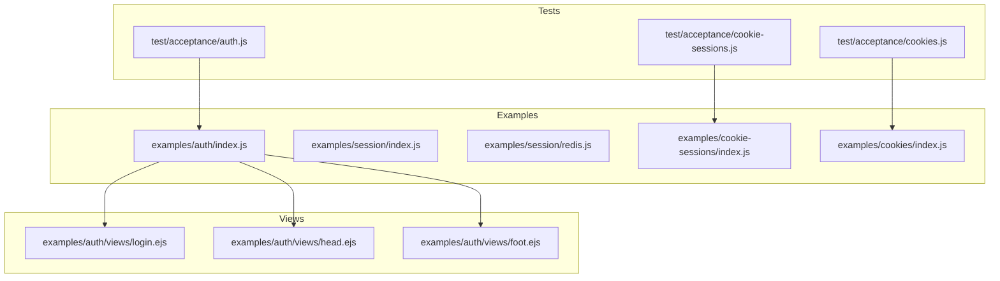
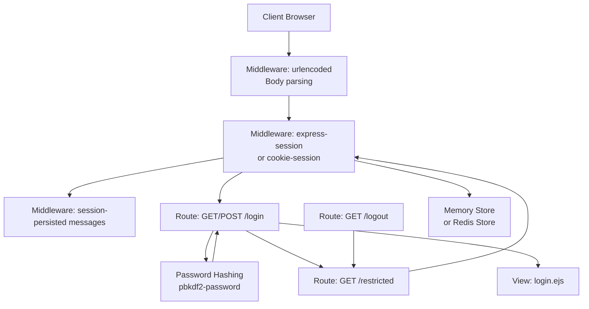
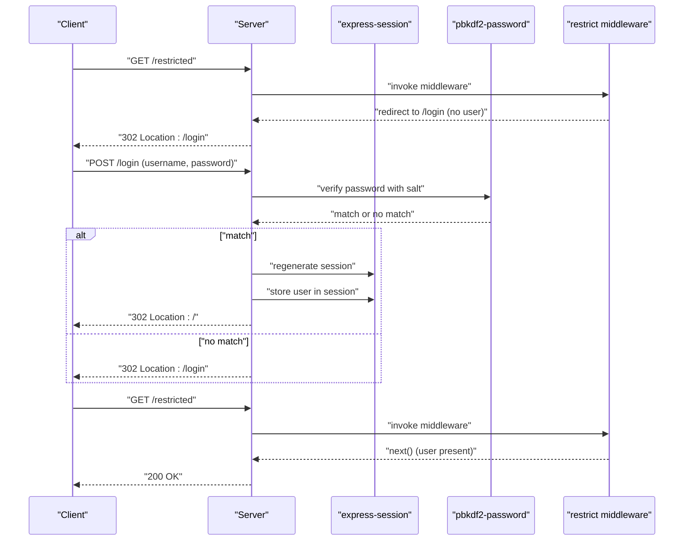
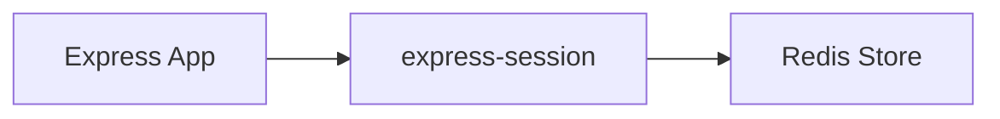
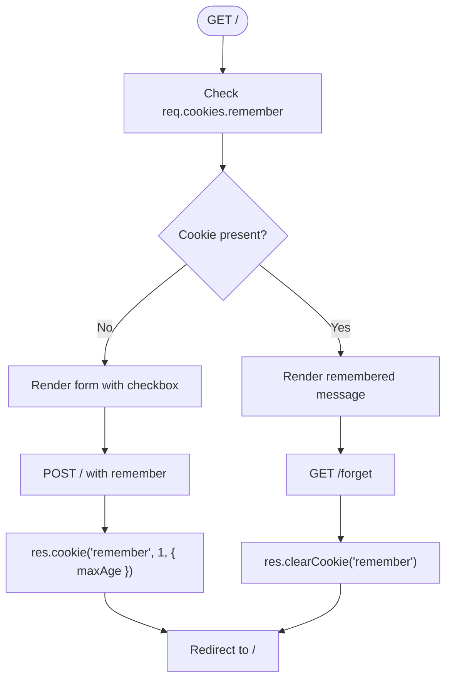
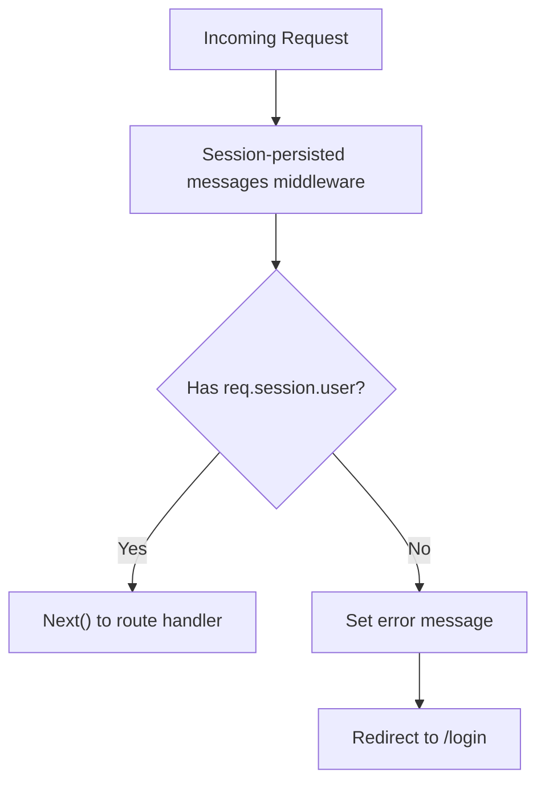
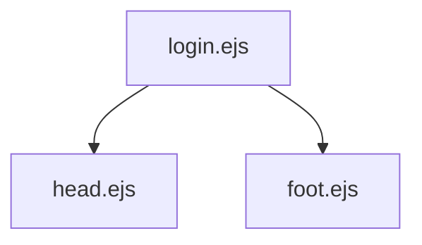
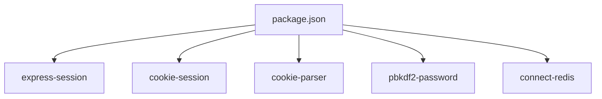

# Authentication Systems

<cite>
**Referenced Files in This Document**
- [examples/auth/index.js](file://examples/auth/index.js)
- [examples/auth/views/login.ejs](file://examples/auth/views/login.ejs)
- [examples/auth/views/head.ejs](file://examples/auth/views/head.ejs)
- [examples/auth/views/foot.ejs](file://examples/auth/views/foot.ejs)
- [examples/session/index.js](file://examples/session/index.js)
- [examples/session/redis.js](file://examples/session/redis.js)
- [examples/cookie-sessions/index.js](file://examples/cookie-sessions/index.js)
- [examples/cookies/index.js](file://examples/cookies/index.js)
- [test/acceptance/auth.js](file://test/acceptance/auth.js)
- [test/acceptance/cookies.js](file://test/acceptance/cookies.js)
- [test/acceptance/cookie-sessions.js](file://test/acceptance/cookie-sessions.js)
- [package.json](file://package.json)
</cite>

## Table of Contents
1. [Introduction](#introduction)
2. [Project Structure](#project-structure)
3. [Core Components](#core-components)
4. [Architecture Overview](#architecture-overview)
5. [Detailed Component Analysis](#detailed-component-analysis)
6. [Dependency Analysis](#dependency-analysis)
7. [Performance Considerations](#performance-considerations)
8. [Troubleshooting Guide](#troubleshooting-guide)
9. [Conclusion](#conclusion)

## Introduction
This document explains the authentication systems demonstrated in the repository, focusing on session-based authentication, cookie-based authentication, and middleware implementation. It covers authentication flow patterns including login, logout, and session validation, along with protected route implementation. It also documents cookie-based authentication with signed cookies, authentication tokens, and session-based login systems, and provides practical examples from the codebase. Security patterns such as password hashing and session security measures are addressed, and integration with external authentication providers and OAuth patterns is discussed conceptually.

## Project Structure
The authentication-related examples are organized under the examples directory:
- Session-based authentication with express-session and Redis-backed sessions
- Cookie-based authentication with cookie-parser and signed cookies
- Cookie-session storage using cookie-session
- A complete login/logout flow with EJS templates and middleware



**Diagram sources**
- [examples/auth/index.js:1-135](file://examples/auth/index.js#L1-L135)
- [examples/session/index.js:1-38](file://examples/session/index.js#L1-L38)
- [examples/session/redis.js:1-40](file://examples/session/redis.js#L1-L40)
- [examples/cookie-sessions/index.js:1-26](file://examples/cookie-sessions/index.js#L1-L26)
- [examples/cookies/index.js:1-54](file://examples/cookies/index.js#L1-L54)
- [examples/auth/views/login.ejs:1-22](file://examples/auth/views/login.ejs#L1-L22)
- [examples/auth/views/head.ejs:1-21](file://examples/auth/views/head.ejs#L1-L21)
- [examples/auth/views/foot.ejs:1-3](file://examples/auth/views/foot.ejs#L1-L3)
- [test/acceptance/auth.js:1-118](file://test/acceptance/auth.js#L1-L118)
- [test/acceptance/cookies.js:1-72](file://test/acceptance/cookies.js#L1-L72)
- [test/acceptance/cookie-sessions.js:1-39](file://test/acceptance/cookie-sessions.js#L1-L39)

**Section sources**
- [examples/auth/index.js:1-135](file://examples/auth/index.js#L1-L135)
- [examples/session/index.js:1-38](file://examples/session/index.js#L1-L38)
- [examples/session/redis.js:1-40](file://examples/session/redis.js#L1-L40)
- [examples/cookie-sessions/index.js:1-26](file://examples/cookie-sessions/index.js#L1-L26)
- [examples/cookies/index.js:1-54](file://examples/cookies/index.js#L1-L54)

## Core Components
- Session-based authentication with express-session and a memory store
- Redis-backed session store for production-grade scalability
- Cookie-based authentication with cookie-parser and signed cookies
- Cookie-session storage using cookie-session for encrypted client-side sessions
- Login/logout flow with EJS templates and middleware for session-persisted messages
- Protected routes guarded by a session validation middleware

Key implementation highlights:
- Password hashing using pbkdf2-password
- Session regeneration on login to prevent session fixation
- Session destruction on logout to invalidate the session
- Middleware to persist messages across requests using session storage
- Protected route middleware checking for presence of a user in the session

**Section sources**
- [examples/auth/index.js:1-135](file://examples/auth/index.js#L1-L135)
- [examples/session/index.js:1-38](file://examples/session/index.js#L1-L38)
- [examples/session/redis.js:1-40](file://examples/session/redis.js#L1-L40)
- [examples/cookie-sessions/index.js:1-26](file://examples/cookie-sessions/index.js#L1-L26)
- [examples/cookies/index.js:1-54](file://examples/cookies/index.js#L1-L54)

## Architecture Overview
The authentication architecture combines middleware-driven session management, password hashing, and template rendering. The flow integrates with Express routing to protect endpoints and manage user state.



**Diagram sources**
- [examples/auth/index.js:1-135](file://examples/auth/index.js#L1-L135)
- [examples/session/index.js:1-38](file://examples/session/index.js#L1-L38)
- [examples/session/redis.js:1-40](file://examples/session/redis.js#L1-L40)
- [examples/cookie-sessions/index.js:1-26](file://examples/cookie-sessions/index.js#L1-L26)
- [examples/cookies/index.js:1-54](file://examples/cookies/index.js#L1-L54)
- [examples/auth/views/login.ejs:1-22](file://examples/auth/views/login.ejs#L1-L22)

## Detailed Component Analysis

### Session-Based Authentication (express-session)
This example demonstrates a complete session-based authentication flow:
- Session configuration with resave and saveUninitialized set to minimize unnecessary writes
- Password hashing during user creation and verification during login
- Session regeneration on successful login to prevent session fixation
- Protected route middleware that checks for a user in the session
- Logout procedure that destroys the session



**Diagram sources**
- [examples/auth/index.js:75-128](file://examples/auth/index.js#L75-L128)

**Section sources**
- [examples/auth/index.js:21-26](file://examples/auth/index.js#L21-L26)
- [examples/auth/index.js:50-55](file://examples/auth/index.js#L50-L55)
- [examples/auth/index.js:60-73](file://examples/auth/index.js#L60-L73)
- [examples/auth/index.js:75-82](file://examples/auth/index.js#L75-L82)
- [examples/auth/index.js:92-98](file://examples/auth/index.js#L92-L98)
- [examples/auth/index.js:104-128](file://examples/auth/index.js#L104-L128)

### Redis-Backed Sessions
This example shows how to scale session storage using Redis:
- Connect Redis store integration with express-session
- Session persistence across browser restarts and server restarts
- Scalable session management for clustered deployments



**Diagram sources**
- [examples/session/redis.js:13-25](file://examples/session/redis.js#L13-L25)

**Section sources**
- [examples/session/redis.js:13-25](file://examples/session/redis.js#L13-L25)

### Cookie-Based Authentication (signed cookies)
This example demonstrates cookie handling and signed cookies:
- Parsing cookies with cookie-parser and signing secrets
- Setting and clearing cookies with configurable expiration
- Rendering a form and handling checkbox submission to set a cookie



**Diagram sources**
- [examples/cookies/index.js:24-47](file://examples/cookies/index.js#L24-L47)

**Section sources**
- [examples/cookies/index.js:19-19](file://examples/cookies/index.js#L19-L19)
- [examples/cookies/index.js:24-47](file://examples/cookies/index.js#L24-L47)

### Cookie-Session Storage (client-side encrypted sessions)
This example shows storing session data in a signed cookie:
- Using cookie-session middleware to encrypt and sign session data
- Storing counters and other small session data client-side
- Automatic cookie management and session regeneration

```mermaid
sequenceDiagram
participant C as "Client"
participant S as "Server"
participant CS as "cookie-session"
C->>S : "GET /"
S->>CS : "req.session.count++"
CS-->>S : "encrypted session cookie"
S-->>C : "Set-Cookie : session=...; HttpOnly"
C->>S : "GET / (with session cookie)"
S->>CS : "decrypt and read session"
S-->>C : "200 OK"
```

**Diagram sources**
- [examples/cookie-sessions/index.js:13-19](file://examples/cookie-sessions/index.js#L13-L19)

**Section sources**
- [examples/cookie-sessions/index.js:13-19](file://examples/cookie-sessions/index.js#L13-L19)

### Protected Routes and Middleware
Protected routes are enforced by a middleware that checks for a user in the session:
- Redirect to login if no user is found
- Allow access if user is present
- Session-persisted messages middleware to display success/error messages



**Diagram sources**
- [examples/auth/index.js:30-39](file://examples/auth/index.js#L30-L39)
- [examples/auth/index.js:75-82](file://examples/auth/index.js#L75-L82)

**Section sources**
- [examples/auth/index.js:30-39](file://examples/auth/index.js#L30-L39)
- [examples/auth/index.js:75-82](file://examples/auth/index.js#L75-L82)

### Login Form and Templates
The login form is rendered using EJS templates:
- Head and foot partials for consistent layout
- Message injection via session-persisted messages
- Form submission to POST /login



**Diagram sources**
- [examples/auth/views/login.ejs:1-22](file://examples/auth/views/login.ejs#L1-L22)
- [examples/auth/views/head.ejs:1-21](file://examples/auth/views/head.ejs#L1-L21)
- [examples/auth/views/foot.ejs:1-3](file://examples/auth/views/foot.ejs#L1-L3)

**Section sources**
- [examples/auth/views/login.ejs:1-22](file://examples/auth/views/login.ejs#L1-L22)
- [examples/auth/views/head.ejs:1-21](file://examples/auth/views/head.ejs#L1-L21)
- [examples/auth/views/foot.ejs:1-3](file://examples/auth/views/foot.ejs#L1-L3)

## Dependency Analysis
External dependencies used for authentication and session management:
- express-session: server-side session storage
- cookie-session: client-side encrypted session storage
- cookie-parser: cookie parsing and signed cookies
- pbkdf2-password: password hashing
- connect-redis: Redis-backed session store



**Diagram sources**
- [package.json:64-81](file://package.json#L64-L81)

**Section sources**
- [package.json:64-81](file://package.json#L64-L81)

## Performance Considerations
- Use Redis-backed sessions for horizontal scaling and persistence across restarts
- Minimize session writes by setting resave to false and saveUninitialized to false
- Prefer cookie-session for lightweight client-side state when data size is small
- Avoid storing large objects in sessions; keep only identifiers or minimal data
- Use session regeneration on login to mitigate session fixation attacks

## Troubleshooting Guide
Common issues and resolutions:
- Access denied errors: Ensure the restrict middleware is applied to protected routes and that the session contains a user object
- Session not persisting: Verify session middleware order and secret configuration; confirm resave and saveUninitialized settings
- Cookie not set/cleared: Confirm cookie-parser secret and cookie options; ensure redirects after cookie operations
- Authentication failures: Validate password hashing and salt matching; check that the user exists in the in-memory database

Validation via tests:
- Authentication acceptance tests verify redirects, login success/failure, and access to restricted routes
- Cookie acceptance tests verify cookie setting, clearing, and retrieval
- Cookie-session tests verify session cookie presence and persistence across requests

**Section sources**
- [test/acceptance/auth.js:8-117](file://test/acceptance/auth.js#L8-L117)
- [test/acceptance/cookies.js:6-71](file://test/acceptance/cookies.js#L6-L71)
- [test/acceptance/cookie-sessions.js:5-38](file://test/acceptance/cookie-sessions.js#L5-L38)

## Conclusion
The repository demonstrates robust authentication patterns in Express.js:
- Session-based authentication with secure session regeneration and protection against fixation
- Redis-backed sessions for production scalability
- Cookie-based authentication with signed cookies and client-side encrypted sessions
- Middleware-driven message persistence and protected route enforcement
- Practical examples validated by acceptance tests

These patterns provide a solid foundation for building secure and scalable authentication systems in Express.js applications.