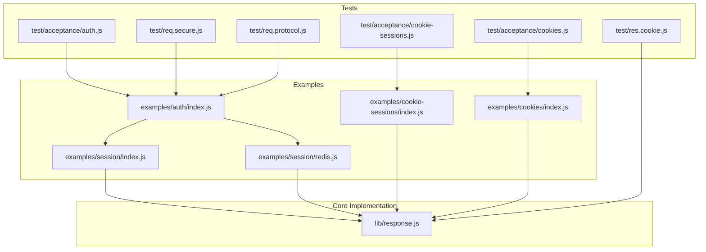
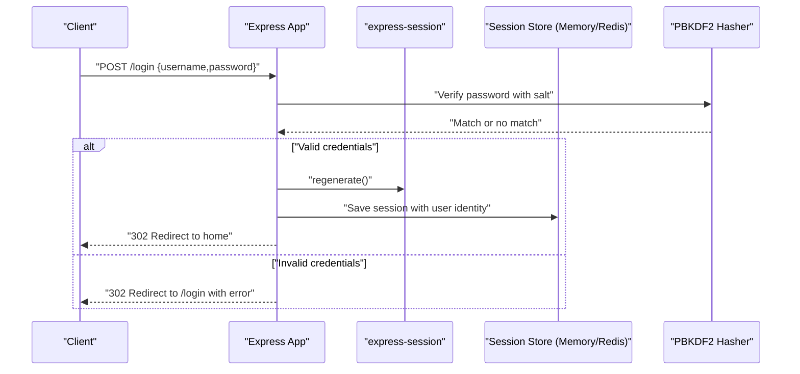
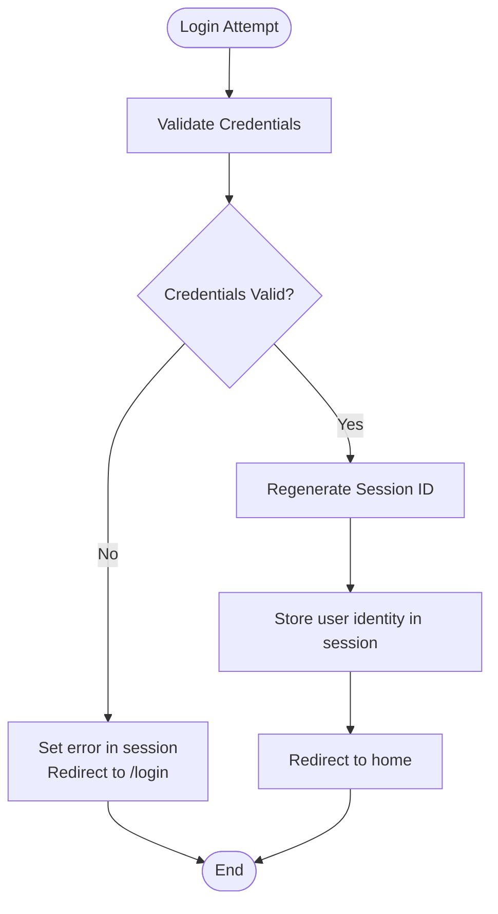
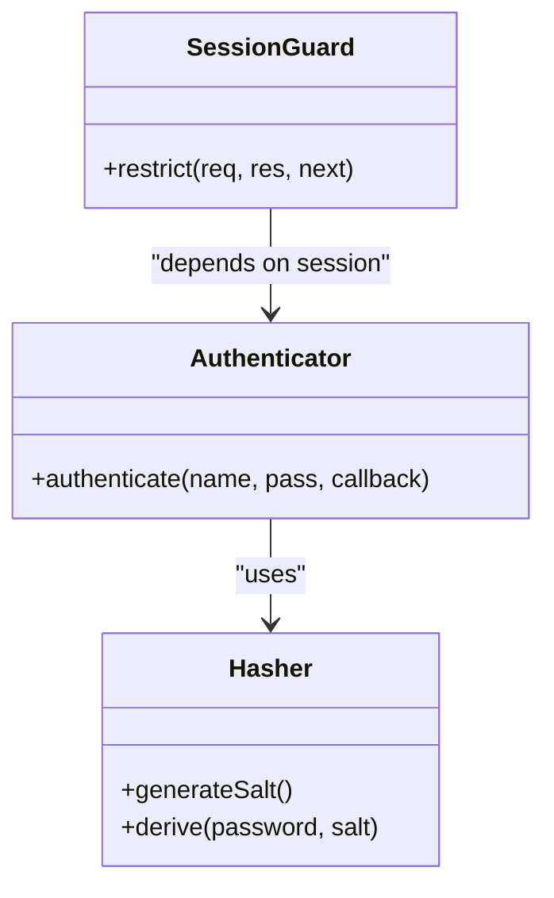
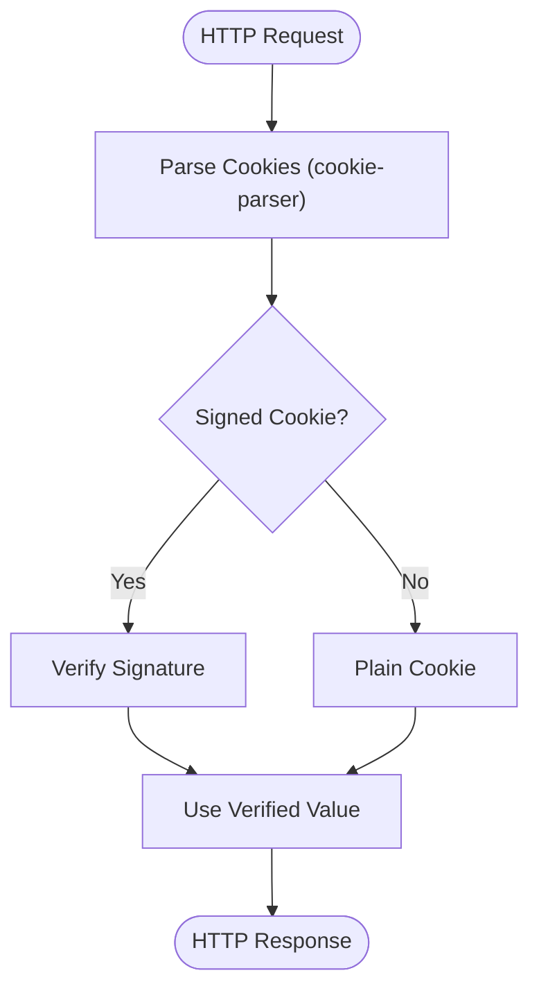
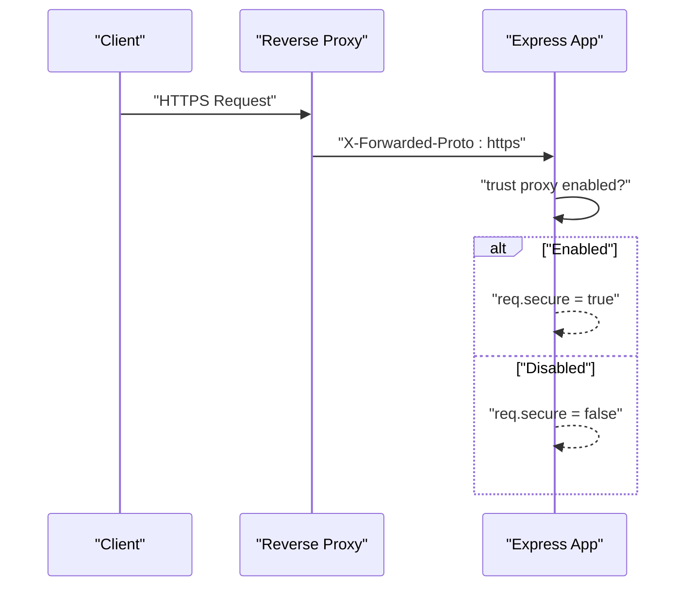
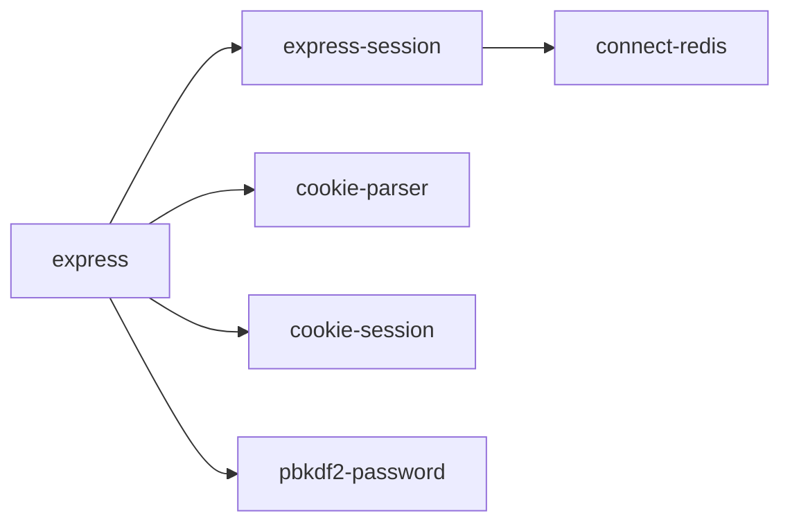

# Security Considerations

<cite>
**Referenced Files in This Document**
- [examples/auth/index.js](file://examples/auth/index.js)
- [examples/session/index.js](file://examples/session/index.js)
- [examples/session/redis.js](file://examples/session/redis.js)
- [examples/cookie-sessions/index.js](file://examples/cookie-sessions/index.js)
- [examples/cookies/index.js](file://examples/cookies/index.js)
- [test/acceptance/auth.js](file://test/acceptance/auth.js)
- [test/acceptance/cookie-sessions.js](file://test/acceptance/cookie-sessions.js)
- [test/acceptance/cookies.js](file://test/acceptance/cookies.js)
- [test/res.cookie.js](file://test/res.cookie.js)
- [test/req.secure.js](file://test/req.secure.js)
- [test/req.protocol.js](file://test/req.protocol.js)
- [lib/response.js](file://lib/response.js)
- [package.json](file://package.json)
- [README.md](file://README.md)
</cite>

## Table of Contents
1. [Introduction](#introduction)
2. [Project Structure](#project-structure)
3. [Core Components](#core-components)
4. [Architecture Overview](#architecture-overview)
5. [Detailed Component Analysis](#detailed-component-analysis)
6. [Dependency Analysis](#dependency-analysis)
7. [Performance Considerations](#performance-considerations)
8. [Troubleshooting Guide](#troubleshooting-guide)
9. [Conclusion](#conclusion)
10. [Appendices](#appendices)

## Introduction
This document consolidates security best practices for Express.js session management and authentication as demonstrated by the repository’s examples and tests. It focuses on:
- Session security: CSRF protection, session fixation prevention, secure cookie flags, and HTTPS enforcement
- Authentication security: password hashing, session timeout handling, and brute force protection
- Cookie security: HttpOnly, Secure, SameSite attributes, and domain/path restrictions
- Practical configurations from the codebase
- Security monitoring, logging, and incident response guidance

Where applicable, the document references concrete files and line ranges to anchor each recommendation to working examples in the repository.

## Project Structure
The repository includes runnable examples and comprehensive acceptance tests that demonstrate secure configuration patterns for sessions, cookies, and authentication. Key areas relevant to security:
- Authentication example with password hashing and session-based access control
- Session storage using in-memory and Redis-backed stores
- Cookie-based sessions and standard cookies
- Acceptance tests validating cookie behavior and authentication flows
- Core response cookie implementation and request security helpers

**Diagram sources**
- [examples/auth/index.js:1-135](file://examples/auth/index.js#L1-L135)
- [examples/session/index.js:1-38](file://examples/session/index.js#L1-L38)
- [examples/session/redis.js:1-40](file://examples/session/redis.js#L1-L40)
- [examples/cookies/index.js:1-54](file://examples/cookies/index.js#L1-L54)
- [examples/cookie-sessions/index.js:1-26](file://examples/cookie-sessions/index.js#L1-L26)
- [test/acceptance/auth.js:1-118](file://test/acceptance/auth.js#L1-L118)
- [test/acceptance/cookie-sessions.js:1-39](file://test/acceptance/cookie-sessions.js#L1-L39)
- [test/acceptance/cookies.js:1-72](file://test/acceptance/cookies.js#L1-L72)
- [test/res.cookie.js:1-245](file://test/res.cookie.js#L1-L245)
- [test/req.secure.js:1-101](file://test/req.secure.js#L1-L101)
- [test/req.protocol.js:1-55](file://test/req.protocol.js#L1-L55)
- [lib/response.js:742-775](file://lib/response.js#L742-L775)

**Section sources**
- [examples/auth/index.js:1-135](file://examples/auth/index.js#L1-L135)
- [examples/session/index.js:1-38](file://examples/session/index.js#L1-L38)
- [examples/session/redis.js:1-40](file://examples/session/redis.js#L1-L40)
- [examples/cookies/index.js:1-54](file://examples/cookies/index.js#L1-L54)
- [examples/cookie-sessions/index.js:1-26](file://examples/cookie-sessions/index.js#L1-L26)
- [test/acceptance/auth.js:1-118](file://test/acceptance/auth.js#L1-L118)
- [test/acceptance/cookie-sessions.js:1-39](file://test/acceptance/cookie-sessions.js#L1-L39)
- [test/acceptance/cookies.js:1-72](file://test/acceptance/cookies.js#L1-L72)
- [test/res.cookie.js:1-245](file://test/res.cookie.js#L1-L245)
- [test/req.secure.js:1-101](file://test/req.secure.js#L1-L101)
- [test/req.protocol.js:1-55](file://test/req.protocol.js#L1-L55)
- [lib/response.js:742-775](file://lib/response.js#L742-L775)

## Core Components
- Authentication example with PBKDF2-based password hashing and session-based access control
- Session configuration with express-session for in-memory and Redis-backed stores
- Cookie handling via cookie-parser and response.cookie with secure defaults
- Request security helpers for HTTPS detection and trust-proxy behavior
- Acceptance tests validating authentication flows, cookie behavior, and session persistence

Key security-relevant behaviors:
- Session fixation prevention via regenerate on login
- Session destruction on logout
- Cookie flags and options validated by tests (HttpOnly, Secure, Partitioned, Priority)
- HTTPS enforcement guidance via trust proxy and request.secure

**Section sources**
- [examples/auth/index.js:58-128](file://examples/auth/index.js#L58-L128)
- [examples/session/index.js:16-20](file://examples/session/index.js#L16-L20)
- [examples/session/redis.js:20-25](file://examples/session/redis.js#L20-L25)
- [examples/cookies/index.js:19-47](file://examples/cookies/index.js#L19-L47)
- [test/res.cookie.js:54-67](file://test/res.cookie.js#L54-L67)
- [test/req.secure.js:38-51](file://test/req.secure.js#L38-L51)
- [test/req.protocol.js:20-34](file://test/req.protocol.js#L20-L34)

## Architecture Overview
The security architecture centers on three pillars:
- Session management: express-session with optional Redis store
- Authentication: password hashing and session-based authorization
- Cookie handling: response cookie flags and request security helpers

**Diagram sources**
- [examples/auth/index.js:104-128](file://examples/auth/index.js#L104-L128)
- [examples/session/index.js:16-20](file://examples/session/index.js#L16-L20)
- [examples/session/redis.js:20-25](file://examples/session/redis.js#L20-L25)

## Detailed Component Analysis

### Session Management and Fixation Prevention
- Session fixation prevention: The authentication flow regenerates the session upon successful login to avoid session fixation attacks.
- Session lifecycle: Sessions are destroyed on logout to invalidate the session identifier.
- Storage options: Demonstrates both in-memory and Redis-backed stores for scalability and persistence.

**Diagram sources**
- [examples/auth/index.js:104-128](file://examples/auth/index.js#L104-L128)

**Section sources**
- [examples/auth/index.js:109-120](file://examples/auth/index.js#L109-L120)
- [examples/auth/index.js:92-98](file://examples/auth/index.js#L92-L98)
- [examples/session/index.js:16-20](file://examples/session/index.js#L16-L20)
- [examples/session/redis.js:20-25](file://examples/session/redis.js#L20-L25)

### Authentication Security Patterns
- Password hashing: Uses PBKDF2-based hashing with stored salt and hash per user.
- Access control: Middleware checks for presence of user identity in session to grant access.
- Brute force considerations: The example does not implement rate limiting; consider adding rate limiting at the application or infrastructure level in production deployments.

**Diagram sources**
- [examples/auth/index.js:60-82](file://examples/auth/index.js#L60-L82)
- [examples/auth/index.js:50-55](file://examples/auth/index.js#L50-L55)

**Section sources**
- [examples/auth/index.js:50-73](file://examples/auth/index.js#L50-L73)
- [examples/auth/index.js:75-82](file://examples/auth/index.js#L75-L82)

### Cookie Security and Secure Flags
- HttpOnly and Secure flags: Tests confirm setting HttpOnly and Secure cookie flags via response.cookie.
- Path defaults: The response cookie implementation sets a default path when not provided.
- Signed cookies: cookie-parser enables signed cookies; response.cookie validates presence of secret for signed cookies.
- Partitioned and Priority attributes: Tests validate Partitioned and Priority cookie attributes.

**Diagram sources**
- [test/res.cookie.js:54-67](file://test/res.cookie.js#L54-L67)
- [lib/response.js:742-775](file://lib/response.js#L742-L775)
- [examples/cookies/index.js:19](file://examples/cookies/index.js#L19)

**Section sources**
- [test/res.cookie.js:54-67](file://test/res.cookie.js#L54-L67)
- [test/res.cookie.js:84-98](file://test/res.cookie.js#L84-L98)
- [test/res.cookie.js:174-186](file://test/res.cookie.js#L174-L186)
- [test/res.cookie.js:231-242](file://test/res.cookie.js#L231-L242)
- [lib/response.js:742-775](file://lib/response.js#L742-L775)
- [examples/cookies/index.js:19-47](file://examples/cookies/index.js#L19-L47)

### HTTPS Enforcement and Trust Proxy
- trust proxy: Tests demonstrate enabling trust proxy to correctly detect HTTPS via X-Forwarded-Proto.
- Protocol detection: The request protocol respects trust proxy settings when determining whether the connection is secure.

**Diagram sources**
- [test/req.secure.js:38-51](file://test/req.secure.js#L38-L51)
- [test/req.protocol.js:20-34](file://test/req.protocol.js#L20-L34)

**Section sources**
- [test/req.secure.js:8-21](file://test/req.secure.js#L8-L21)
- [test/req.secure.js:38-51](file://test/req.secure.js#L38-L51)
- [test/req.protocol.js:20-34](file://test/req.protocol.js#L20-L34)

### CSRF Protection
- The repository does not include CSRF protection middleware. In production, integrate a CSRF library (e.g., csurf) and ensure tokens are embedded in forms and validated on POST routes.

[No sources needed since this section provides general guidance]

### Session Timeout Handling
- The examples do not implement explicit session timeouts. Consider configuring rolling sessions and idle timeouts at the session store level (e.g., Redis TTL) and/or application middleware to invalidate stale sessions.

[No sources needed since this section provides general guidance]

### Brute Force Protection
- The repository does not implement rate limiting. Add rate limiting at the application or infrastructure level to mitigate brute force attacks on login endpoints.

[No sources needed since this section provides general guidance]

### Cookie Security Attributes and Restrictions
- HttpOnly and Secure flags are validated by tests when setting cookies.
- Path defaults to "/" when not specified in response.cookie.
- Domain and SameSite are not configured in the examples; configure SameSite and optionally Domain/Path for cross-site contexts.

**Section sources**
- [test/res.cookie.js:54-67](file://test/res.cookie.js#L54-L67)
- [lib/response.js:768-770](file://lib/response.js#L768-L770)

### Practical Security Configurations from the Codebase
- Session configuration with express-session (in-memory and Redis):
  - [examples/session/index.js:16-20](file://examples/session/index.js#L16-L20)
  - [examples/session/redis.js:20-25](file://examples/session/redis.js#L20-L25)
- Authentication with password hashing and session-based access control:
  - [examples/auth/index.js:50-73](file://examples/auth/index.js#L50-L73)
  - [examples/auth/index.js:75-82](file://examples/auth/index.js#L75-L82)
  - [examples/auth/index.js:104-128](file://examples/auth/index.js#L104-L128)
- Cookie handling with signed cookies and flags:
  - [examples/cookies/index.js:19](file://examples/cookies/index.js#L19)
  - [test/res.cookie.js:54-67](file://test/res.cookie.js#L54-L67)
- HTTPS enforcement via trust proxy:
  - [test/req.secure.js:38-51](file://test/req.secure.js#L38-L51)
  - [test/req.protocol.js:20-34](file://test/req.protocol.js#L20-L34)

**Section sources**
- [examples/session/index.js:16-20](file://examples/session/index.js#L16-L20)
- [examples/session/redis.js:20-25](file://examples/session/redis.js#L20-L25)
- [examples/auth/index.js:50-73](file://examples/auth/index.js#L50-L73)
- [examples/auth/index.js:75-82](file://examples/auth/index.js#L75-L82)
- [examples/auth/index.js:104-128](file://examples/auth/index.js#L104-L128)
- [examples/cookies/index.js:19](file://examples/cookies/index.js#L19)
- [test/res.cookie.js:54-67](file://test/res.cookie.js#L54-L67)
- [test/req.secure.js:38-51](file://test/req.secure.js#L38-L51)
- [test/req.protocol.js:20-34](file://test/req.protocol.js#L20-L34)

## Dependency Analysis
External modules used for security-relevant functionality:
- express-session: Session management
- cookie-session: Cookie-based sessions
- cookie-parser: Signed cookie parsing
- pbkdf2-password: Password hashing
- connect-redis: Redis-backed session store

**Diagram sources**
- [package.json:34-81](file://package.json#L34-L81)

**Section sources**
- [package.json:34-81](file://package.json#L34-L81)

## Performance Considerations
- Prefer Redis-backed sessions for horizontal scaling and centralized session storage.
- Minimize session payload size to reduce serialization overhead.
- Enable compression for cookie values when appropriate.
- Use rolling sessions judiciously to balance security and performance.

[No sources needed since this section provides general guidance]

## Troubleshooting Guide
- Session not persisting across requests:
  - Verify session store configuration and that regenerate is called after login.
  - Confirm cookies are being sent and received correctly.
- HTTPS detection incorrect behind proxies:
  - Ensure trust proxy is enabled and X-Forwarded-Proto is set by the proxy.
- Cookie flags not applied:
  - Ensure response.cookie options include HttpOnly/Secure and that the secret is configured for signed cookies.
- Authentication failures:
  - Validate PBKDF2 parameters and salt storage; confirm session regeneration on login.

**Section sources**
- [examples/auth/index.js:109-120](file://examples/auth/index.js#L109-L120)
- [test/req.secure.js:38-51](file://test/req.secure.js#L38-L51)
- [test/res.cookie.js:54-67](file://test/res.cookie.js#L54-L67)
- [examples/cookies/index.js:19](file://examples/cookies/index.js#L19)

## Conclusion
The repository demonstrates secure session and authentication patterns using Express.js, including password hashing, session fixation prevention, and cookie flag validation. Production deployments should complement these examples with CSRF protection, rate limiting, HTTPS enforcement via trust proxy, and explicit session timeout policies. The included tests serve as a baseline for verifying cookie and authentication behavior.

[No sources needed since this section summarizes without analyzing specific files]

## Appendices
- Security contact and policies:
  - See the repository’s Security Issues section for reporting procedures.

**Section sources**
- [README.md:155-157](file://README.md#L155-L157)