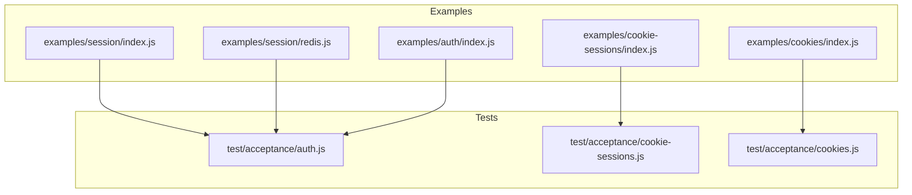
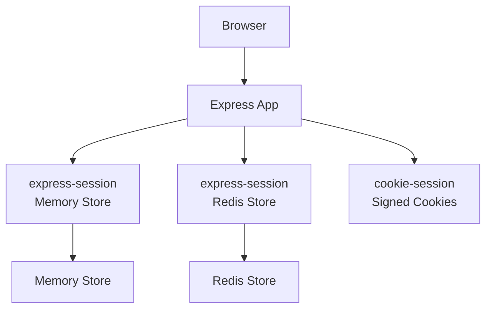
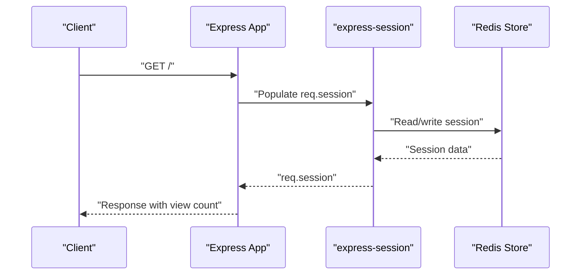
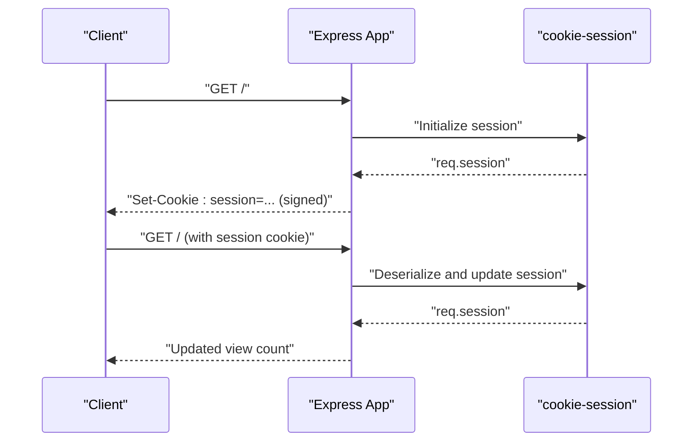
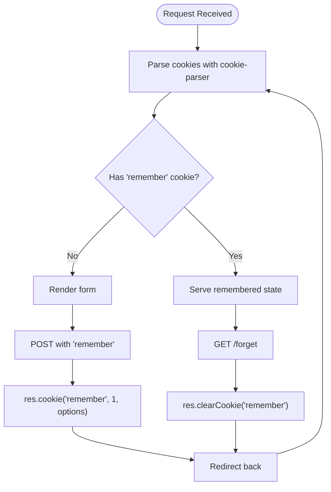
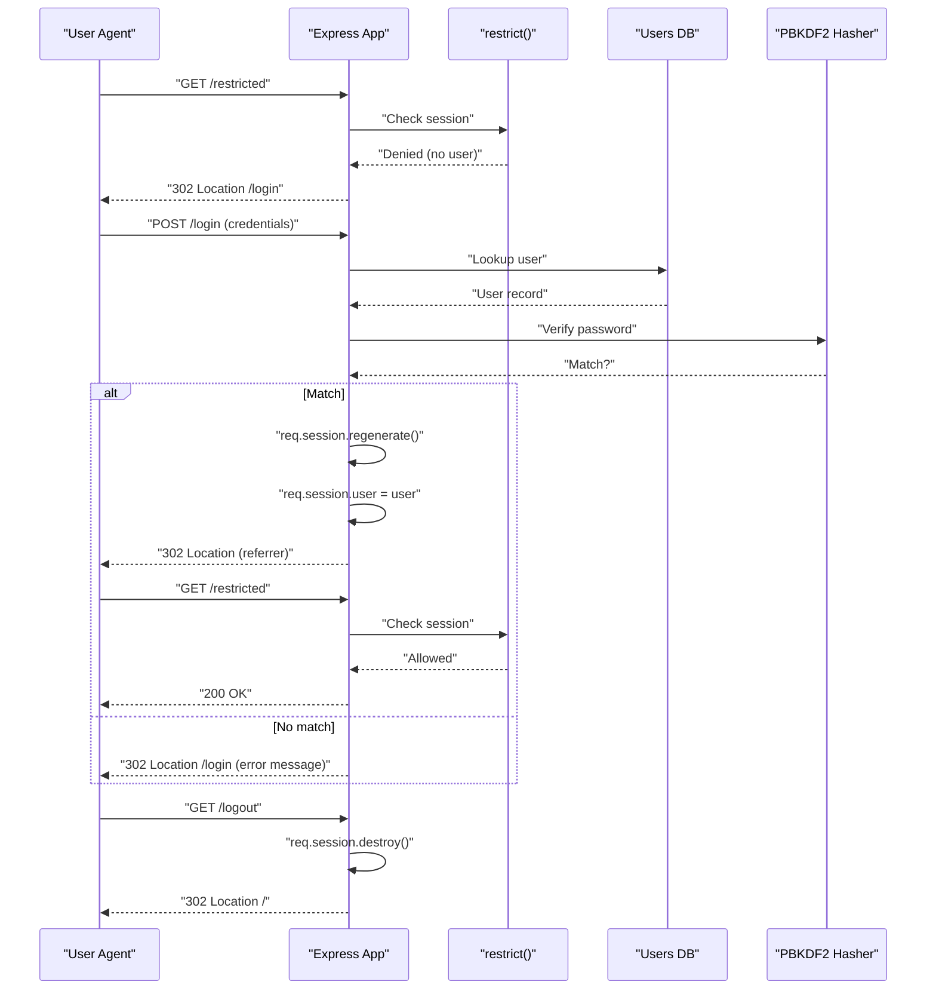
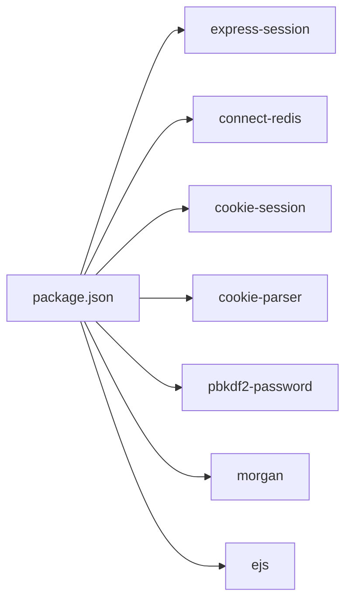
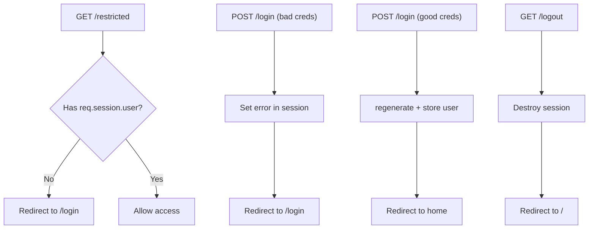

# Session Management & Authentication

<cite>
**Referenced Files in This Document**
- [index.js](file://index.js)
- [lib/application.js](file://lib/application.js)
- [lib/request.js](file://lib/request.js)
- [lib/response.js](file://lib/response.js)
- [examples/session/index.js](file://examples/session/index.js)
- [examples/session/redis.js](file://examples/session/redis.js)
- [examples/cookie-sessions/index.js](file://examples/cookie-sessions/index.js)
- [examples/cookies/index.js](file://examples/cookies/index.js)
- [examples/auth/index.js](file://examples/auth/index.js)
- [test/acceptance/auth.js](file://test/acceptance/auth.js)
- [test/acceptance/cookie-sessions.js](file://test/acceptance/cookie-sessions.js)
- [test/acceptance/cookies.js](file://test/acceptance/cookies.js)
- [package.json](file://package.json)
</cite>

## Table of Contents
1. [Introduction](#introduction)
2. [Project Structure](#project-structure)
3. [Core Components](#core-components)
4. [Architecture Overview](#architecture-overview)
5. [Detailed Component Analysis](#detailed-component-analysis)
6. [Dependency Analysis](#dependency-analysis)
7. [Performance Considerations](#performance-considerations)
8. [Troubleshooting Guide](#troubleshooting-guide)
9. [Conclusion](#conclusion)
10. [Appendices](#appendices)

## Introduction
This document explains session management and authentication systems in Express.js using the repository’s examples and tests. It covers:
- Session stores (memory and Redis-backed)
- Cookie handling and signed cookies
- Session lifecycle (creation, regeneration, destruction)
- Authentication patterns (session-based, token-based, OAuth)
- Security best practices (secure flags, CSRF considerations, session fixation prevention)
- Practical flows validated by acceptance tests

## Project Structure
The repository organizes runnable examples and acceptance tests that demonstrate session and cookie usage. Key areas:
- Examples for session with memory store and Redis store
- Cookie sessions (client-side encrypted cookie store)
- Basic cookie manipulation and signed cookies
- Session-based authentication with middleware and logout
- Acceptance tests validating behavior

**Diagram sources**
- [examples/session/index.js:1-38](file://examples/session/index.js#L1-L38)
- [examples/session/redis.js:1-40](file://examples/session/redis.js#L1-L40)
- [examples/cookie-sessions/index.js:1-26](file://examples/cookie-sessions/index.js#L1-L26)
- [examples/cookies/index.js:1-54](file://examples/cookies/index.js#L1-L54)
- [examples/auth/index.js:1-135](file://examples/auth/index.js#L1-L135)
- [test/acceptance/auth.js:1-118](file://test/acceptance/auth.js#L1-L118)
- [test/acceptance/cookie-sessions.js:1-39](file://test/acceptance/cookie-sessions.js#L1-L39)
- [test/acceptance/cookies.js:1-72](file://test/acceptance/cookies.js#L1-L72)

**Section sources**
- [examples/session/index.js:1-38](file://examples/session/index.js#L1-L38)
- [examples/session/redis.js:1-40](file://examples/session/redis.js#L1-L40)
- [examples/cookie-sessions/index.js:1-26](file://examples/cookie-sessions/index.js#L1-L26)
- [examples/cookies/index.js:1-54](file://examples/cookies/index.js#L1-L54)
- [examples/auth/index.js:1-135](file://examples/auth/index.js#L1-L135)
- [test/acceptance/auth.js:1-118](file://test/acceptance/auth.js#L1-L118)
- [test/acceptance/cookie-sessions.js:1-39](file://test/acceptance/cookie-sessions.js#L1-L39)
- [test/acceptance/cookies.js:1-72](file://test/acceptance/cookies.js#L1-L72)

## Core Components
- Express application initialization and middleware pipeline
- Session middleware (memory and Redis-backed)
- Cookie session middleware (client-side encrypted)
- Cookie parser and signed cookies
- Session-based authentication middleware and logout
- Acceptance tests asserting behavior

Key implementation references:
- Application bootstrap and middleware wiring
- Request and response cookie helpers
- Session configuration and lifecycle
- Authentication middleware and logout

**Section sources**
- [lib/application.js:190-244](file://lib/application.js#L190-L244)
- [lib/request.js:1-528](file://lib/request.js#L1-L528)
- [lib/response.js:708-775](file://lib/response.js#L708-L775)
- [examples/session/index.js:10-21](file://examples/session/index.js#L10-L21)
- [examples/session/redis.js:7-25](file://examples/session/redis.js#L7-L25)
- [examples/cookie-sessions/index.js:7-13](file://examples/cookie-sessions/index.js#L7-L13)
- [examples/cookies/index.js:9-19](file://examples/cookies/index.js#L9-L19)
- [examples/auth/index.js:10-26](file://examples/auth/index.js#L10-L26)

## Architecture Overview
The examples illustrate three complementary patterns:
- Memory-backed sessions via express-session
- Redis-backed sessions via connect-redis
- Cookie-based sessions via cookie-session

**Diagram sources**
- [examples/session/index.js:10-21](file://examples/session/index.js#L10-L21)
- [examples/session/redis.js:7-25](file://examples/session/redis.js#L7-L25)
- [examples/cookie-sessions/index.js:7-13](file://examples/cookie-sessions/index.js#L7-L13)

## Detailed Component Analysis

### Session Stores: Memory vs Redis
- Memory store: Demonstrates basic session creation and incrementing a counter. Suitable for development or single-instance deployments.
- Redis store: Uses connect-redis to persist sessions across restarts and horizontally scaled instances.

**Diagram sources**
- [examples/session/index.js:16-31](file://examples/session/index.js#L16-L31)
- [examples/session/redis.js:20-36](file://examples/session/redis.js#L20-L36)

**Section sources**
- [examples/session/index.js:10-31](file://examples/session/index.js#L10-L31)
- [examples/session/redis.js:7-39](file://examples/session/redis.js#L7-L39)

### Cookie Sessions (Client-Side Encrypted)
- Uses cookie-session to store session data in a signed cookie on the client.
- Demonstrates incrementing a counter across requests with the same cookie.

**Diagram sources**
- [examples/cookie-sessions/index.js:12-19](file://examples/cookie-sessions/index.js#L12-L19)

**Section sources**
- [examples/cookie-sessions/index.js:7-26](file://examples/cookie-sessions/index.js#L7-L26)

### Cookie Handling and Signed Cookies
- cookie-parser signs and parses cookies when a secret is provided.
- res.cookie supports signed cookies and default path configuration.
- Tests assert cookie setting, retrieval, and clearing.

**Diagram sources**
- [examples/cookies/index.js:19-47](file://examples/cookies/index.js#L19-L47)
- [lib/response.js:742-775](file://lib/response.js#L742-L775)

**Section sources**
- [examples/cookies/index.js:9-54](file://examples/cookies/index.js#L9-L54)
- [lib/response.js:708-775](file://lib/response.js#L708-L775)
- [test/acceptance/cookies.js:1-72](file://test/acceptance/cookies.js#L1-L72)

### Authentication Middleware and Logout
- Session-based authentication with a simple in-memory user store and PBKDF2-based hashing.
- restrict middleware enforces access control by checking req.session.user.
- Login authenticates credentials, regenerates the session to prevent fixation, and stores user identity.
- Logout destroys the session.

**Diagram sources**
- [examples/auth/index.js:75-128](file://examples/auth/index.js#L75-L128)
- [test/acceptance/auth.js:8-118](file://test/acceptance/auth.js#L8-L118)

**Section sources**
- [examples/auth/index.js:10-135](file://examples/auth/index.js#L10-L135)
- [test/acceptance/auth.js:1-118](file://test/acceptance/auth.js#L1-L118)

### Token-Based Authentication and OAuth Patterns
- The repository does not include token-based authentication or OAuth integrations in the examined files.
- Guidance for implementing token-based flows (e.g., JWT):
  - Issue short-lived access tokens and refresh tokens
  - Store refresh tokens in secure, httpOnly cookies or in memory with strict controls
  - Validate tokens on protected routes and rotate refresh tokens on use
  - For OAuth, integrate provider SDKs, store minimal profile data in sessions, and keep long-lived tokens in secure storage
- These are conceptual recommendations and not derived from repository code.

[No sources needed since this section doesn't analyze specific source files]

## Dependency Analysis
External modules used across examples and tests:
- express-session: session middleware for memory and Redis stores
- connect-redis: Redis session store adapter
- cookie-session: client-side encrypted cookie store
- cookie-parser: signed cookie parsing
- pbkdf2-password: password hashing for authentication example
- morgan: logging middleware
- ejs: templating for auth example

**Diagram sources**
- [package.json:34-81](file://package.json#L34-L81)

**Section sources**
- [package.json:34-81](file://package.json#L34-L81)

## Performance Considerations
- Prefer Redis-backed sessions in production for horizontal scaling and persistence.
- Use resave: false and saveUninitialized: false to minimize writes and session creation overhead.
- Keep session data lean; avoid storing large objects.
- For cookie sessions, be mindful of cookie size limits and client bandwidth.

[No sources needed since this section provides general guidance]

## Troubleshooting Guide
Common issues and validations demonstrated by tests:
- Accessing restricted routes without a session redirects to login.
- Successful login sets a session and allows access to restricted content.
- Login failures redirect back with an error message preserved in the session.
- Logout destroys the session and redirects to home.

**Diagram sources**
- [examples/auth/index.js:75-128](file://examples/auth/index.js#L75-L128)
- [test/acceptance/auth.js:8-118](file://test/acceptance/auth.js#L8-L118)

**Section sources**
- [test/acceptance/auth.js:1-118](file://test/acceptance/auth.js#L1-L118)

## Conclusion
The repository demonstrates robust patterns for session management and authentication in Express.js:
- Memory and Redis-backed sessions for scalable persistence
- Client-side cookie sessions for lightweight, stateless scenarios
- Secure cookie handling with signed cookies and path defaults
- Session-based authentication with middleware enforcement and secure logout
- Comprehensive acceptance tests validating behavior

These patterns provide a solid foundation for building secure and maintainable authentication systems in Express.js.

## Appendices

### Practical Examples Index
- Memory session setup and usage
  - [examples/session/index.js:10-31](file://examples/session/index.js#L10-L31)
- Redis-backed session setup
  - [examples/session/redis.js:7-39](file://examples/session/redis.js#L7-L39)
- Cookie session setup
  - [examples/cookie-sessions/index.js:7-13](file://examples/cookie-sessions/index.js#L7-L13)
- Cookie parsing and signed cookies
  - [examples/cookies/index.js:9-19](file://examples/cookies/index.js#L9-L19)
  - [lib/response.js:742-775](file://lib/response.js#L742-L775)
- Session-based authentication
  - [examples/auth/index.js:10-135](file://examples/auth/index.js#L10-L135)
  - [test/acceptance/auth.js:1-118](file://test/acceptance/auth.js#L1-L118)