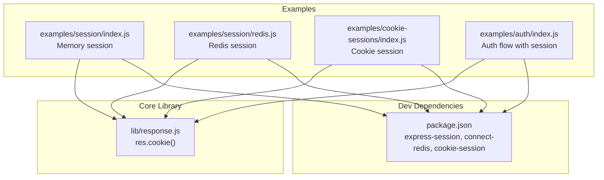
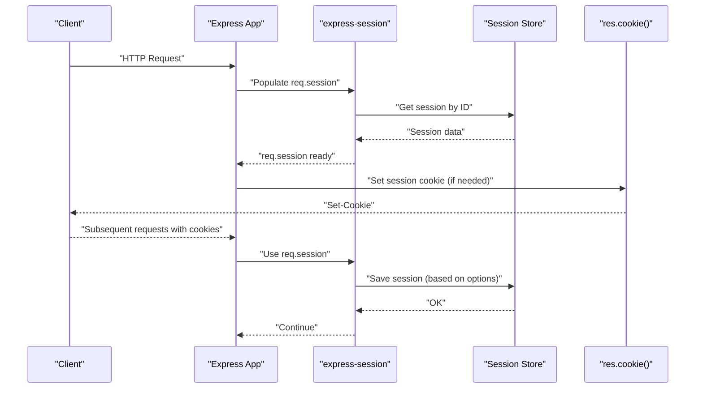
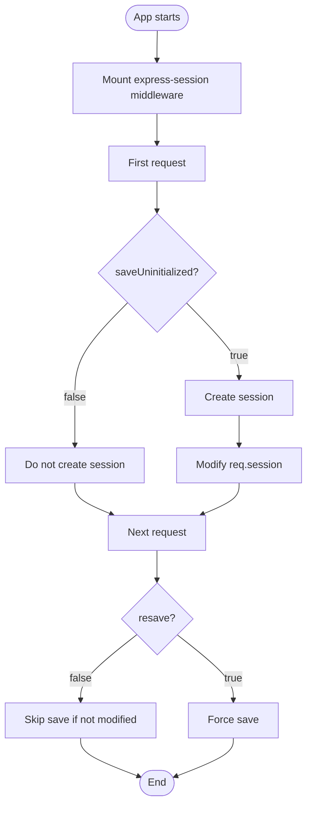
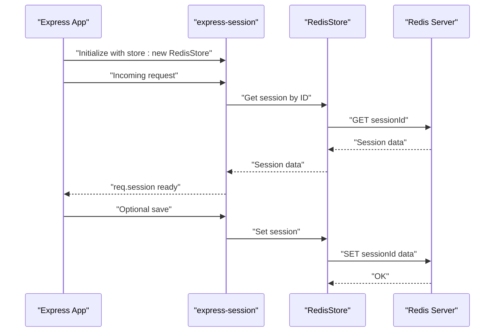
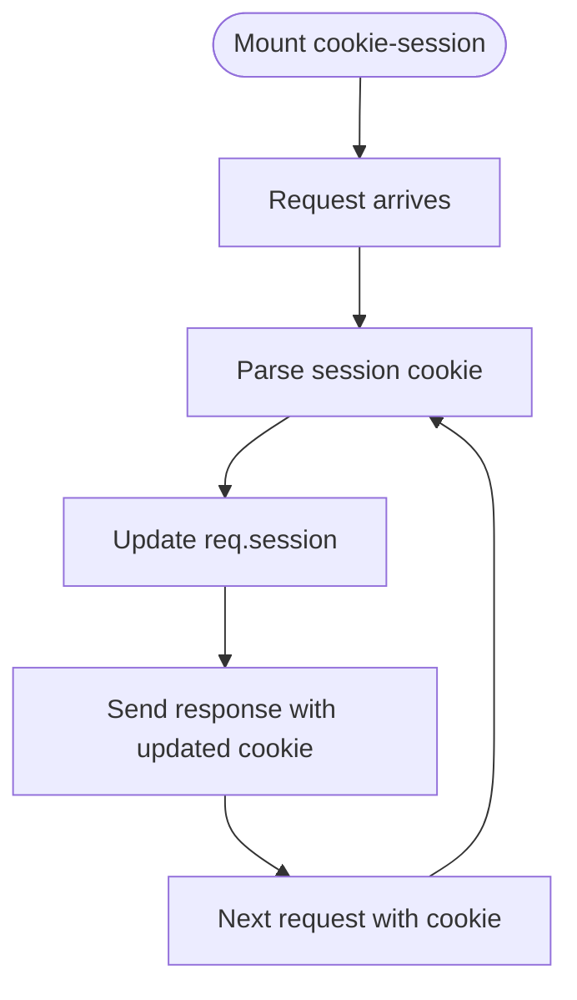
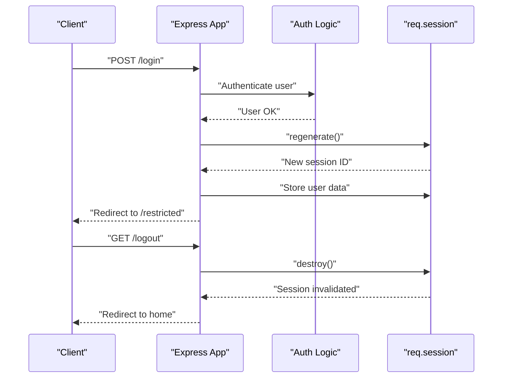
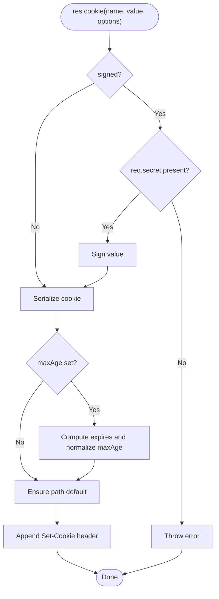
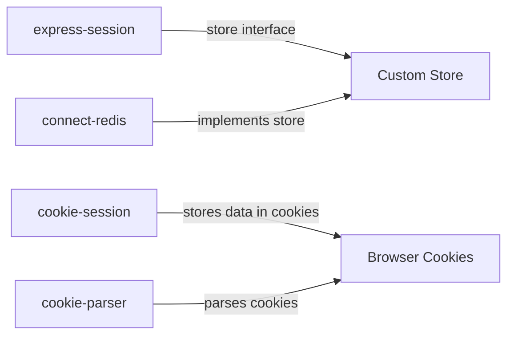

# Session Management

<cite>
**Referenced Files in This Document**
- [examples/session/index.js](file://examples/session/index.js)
- [examples/session/redis.js](file://examples/session/redis.js)
- [examples/auth/index.js](file://examples/auth/index.js)
- [examples/cookie-sessions/index.js](file://examples/cookie-sessions/index.js)
- [lib/response.js](file://lib/response.js)
- [package.json](file://package.json)
- [test/acceptance/auth.js](file://test/acceptance/auth.js)
- [test/acceptance/cookie-sessions.js](file://test/acceptance/cookie-sessions.js)
- [test/res.cookie.js](file://test/res.cookie.js)
</cite>

## Table of Contents
1. [Introduction](#introduction)
2. [Project Structure](#project-structure)
3. [Core Components](#core-components)
4. [Architecture Overview](#architecture-overview)
5. [Detailed Component Analysis](#detailed-component-analysis)
6. [Dependency Analysis](#dependency-analysis)
7. [Performance Considerations](#performance-considerations)
8. [Troubleshooting Guide](#troubleshooting-guide)
9. [Conclusion](#conclusion)
10. [Appendices](#appendices)

## Introduction
This document explains Express.js session management in this repository, focusing on session stores, configuration options, lifecycle management, and security. It covers:
- Memory-based sessions versus Redis-backed sessions
- Session configuration options (resave, saveUninitialized, secret, cookie settings)
- Session data persistence, regeneration, and cleanup
- Practical examples from the codebase
- Security considerations, session hijacking prevention, and timeout handling
- Production best practices for scaling and encryption

## Project Structure
The repository demonstrates session usage across multiple examples:
- Memory-based sessions with express-session
- Redis-backed sessions using connect-redis
- Cookie-based sessions using cookie-session
- Authentication flow with session regeneration and destruction

**Diagram sources**
- [examples/session/index.js:1-37](file://examples/session/index.js#L1-L37)
- [examples/session/redis.js:1-39](file://examples/session/redis.js#L1-L39)
- [examples/cookie-sessions/index.js:1-25](file://examples/cookie-sessions/index.js#L1-L25)
- [examples/auth/index.js:1-134](file://examples/auth/index.js#L1-L134)
- [lib/response.js:742-775](file://lib/response.js#L742-L775)
- [package.json:64-80](file://package.json#L64-L80)

**Section sources**
- [examples/session/index.js:1-37](file://examples/session/index.js#L1-L37)
- [examples/session/redis.js:1-39](file://examples/session/redis.js#L1-L39)
- [examples/cookie-sessions/index.js:1-25](file://examples/cookie-sessions/index.js#L1-L25)
- [examples/auth/index.js:1-134](file://examples/auth/index.js#L1-L134)
- [lib/response.js:742-775](file://lib/response.js#L742-L775)
- [package.json:64-80](file://package.json#L64-L80)

## Core Components
- Memory-based sessions: configured via express-session with resave, saveUninitialized, and secret.
- Redis-backed sessions: configured via connect-redis to persist sessions server-side.
- Cookie-based sessions: configured via cookie-session to store session data in cookies.
- Cookie handling: res.cookie() manages cookie attributes including httpOnly, secure, maxAge, and signed cookies.

Key configuration options demonstrated:
- resave: Controls whether to save a session if it was not modified.
- saveUninitialized: Controls whether to create a session if nothing is stored yet.
- secret: Required for signed cookies and session integrity.
- store: Selects the session store implementation (memory or Redis).
- Cookie options: httpOnly, secure, sameSite, maxAge, signed.

Practical usage patterns:
- Initialize sessions in middleware before routes.
- Manipulate session data on req.session.
- Regenerate sessions on login to prevent fixation.
- Destroy sessions on logout.

**Section sources**
- [examples/session/index.js:16-20](file://examples/session/index.js#L16-L20)
- [examples/session/redis.js:20-25](file://examples/session/redis.js#L20-L25)
- [examples/cookie-sessions/index.js:13](file://examples/cookie-sessions/index.js#L13)
- [lib/response.js:742-775](file://lib/response.js#L742-L775)

## Architecture Overview
The session architecture integrates Express middleware with session stores and cookie handling.

**Diagram sources**
- [examples/session/index.js:16-20](file://examples/session/index.js#L16-L20)
- [examples/session/redis.js:20-25](file://examples/session/redis.js#L20-L25)
- [lib/response.js:742-775](file://lib/response.js#L742-L775)

## Detailed Component Analysis

### Memory-Based Sessions
- Initialization: express-session middleware is mounted with resave, saveUninitialized, and secret.
- Data manipulation: req.session is populated and updated per request.
- Persistence: sessions are stored in memory; not suitable for clustered deployments.

**Diagram sources**
- [examples/session/index.js:16-20](file://examples/session/index.js#L16-L20)
- [examples/session/index.js:22-31](file://examples/session/index.js#L22-L31)

**Section sources**
- [examples/session/index.js:16-20](file://examples/session/index.js#L16-L20)
- [examples/session/index.js:22-31](file://examples/session/index.js#L22-L31)

### Redis-Backed Sessions
- Initialization: express-session configured with store: new RedisStore.
- Benefits: Centralized, durable storage; scales across instances.
- Setup: Requires connect-redis and a Redis server.

**Diagram sources**
- [examples/session/redis.js:13](file://examples/session/redis.js#L13)
- [examples/session/redis.js:20-25](file://examples/session/redis.js#L20-L25)

**Section sources**
- [examples/session/redis.js:13](file://examples/session/redis.js#L13)
- [examples/session/redis.js:20-25](file://examples/session/redis.js#L20-L25)
- [package.json:66](file://package.json#L66)

### Cookie-Based Sessions (cookie-session)
- Initialization: cookie-session middleware stores session data directly in cookies.
- Data manipulation: req.session is manipulated similarly.
- Considerations: Cookie size limits and client-side storage.

**Diagram sources**
- [examples/cookie-sessions/index.js:13](file://examples/cookie-sessions/index.js#L13)
- [examples/cookie-sessions/index.js:16-19](file://examples/cookie-sessions/index.js#L16-L19)

**Section sources**
- [examples/cookie-sessions/index.js:13](file://examples/cookie-sessions/index.js#L13)
- [examples/cookie-sessions/index.js:16-19](file://examples/cookie-sessions/index.js#L16-L19)
- [package.json:68](file://package.json#L68)

### Session Lifecycle: Regeneration and Destruction
- Regeneration: On successful login, regenerate the session to prevent fixation attacks.
- Destruction: On logout, destroy the session to invalidate it server-side.

**Diagram sources**
- [examples/auth/index.js:104-127](file://examples/auth/index.js#L104-L127)
- [examples/auth/index.js:92-98](file://examples/auth/index.js#L92-L98)

**Section sources**
- [examples/auth/index.js:104-127](file://examples/auth/index.js#L104-L127)
- [examples/auth/index.js:92-98](file://examples/auth/index.js#L92-L98)

### Cookie Settings and Timeout Handling
- Cookie options: httpOnly, secure, sameSite, maxAge, signed.
- Timeout: maxAge controls session duration; expires can be used for absolute expiry.
- Signed cookies: Require a secret; res.cookie() validates presence of secret for signed cookies.

**Diagram sources**
- [lib/response.js:742-775](file://lib/response.js#L742-L775)

**Section sources**
- [lib/response.js:742-775](file://lib/response.js#L742-L775)
- [test/res.cookie.js:54-186](file://test/res.cookie.js#L54-L186)

## Dependency Analysis
- express-session: Provides session middleware and store interface.
- connect-redis: Implements RedisStore for express-session.
- cookie-session: Stores session data in cookies.
- cookie-parser: Parses cookies (used by cookie-session and for signed cookies).

**Diagram sources**
- [package.json:71](file://package.json#L71)
- [package.json:66](file://package.json#L66)
- [package.json:68](file://package.json#L68)

**Section sources**
- [package.json:64-80](file://package.json#L64-L80)

## Performance Considerations
- Memory sessions:
  - Pros: Low latency, simple setup.
  - Cons: Not shared across processes or servers; memory growth over time.
- Redis sessions:
  - Pros: Persistent, scalable, shared across instances.
  - Cons: Network latency; requires Redis infrastructure.
- Cookie sessions:
  - Pros: Stateless server-side; no store required.
  - Cons: Cookie size limits; increased payload per request; potential client-side tampering risks.

Operational tips:
- Use Redis for production with clustering and persistence.
- Tune resave and saveUninitialized to reduce writes.
- Monitor session store latency and throughput.
- Consider compression for large session payloads (when using Redis).

[No sources needed since this section provides general guidance]

## Troubleshooting Guide
Common issues and resolutions:
- Signed cookie errors: Ensure a secret is configured for signed cookies.
- Session not persisting: Verify store is configured and reachable (especially Redis).
- Session fixation: Always regenerate the session after login.
- Logout not working: Ensure session.destroy() is called and cookies are cleared if needed.

Validation references:
- Signed cookie requirement and error messages.
- Session cookie presence in requests and responses.
- Authentication redirects and cookie handling.

**Section sources**
- [lib/response.js:747-749](file://lib/response.js#L747-L749)
- [test/acceptance/cookie-sessions.js:13-18](file://test/acceptance/cookie-sessions.js#L13-L18)
- [test/acceptance/auth.js:8-16](file://test/acceptance/auth.js#L8-L16)
- [examples/auth/index.js:109-120](file://examples/auth/index.js#L109-L120)
- [examples/auth/index.js:95-97](file://examples/auth/index.js#L95-L97)

## Conclusion
This repository demonstrates robust session management patterns:
- Memory sessions for development and small deployments.
- Redis-backed sessions for production scalability.
- Cookie sessions for lightweight, stateless scenarios.
- Strong emphasis on security via secret usage, signed cookies, session regeneration, and destruction.

Adopt the patterns shown here to implement secure, scalable session handling in Express applications.

[No sources needed since this section summarizes without analyzing specific files]

## Appendices

### Configuration Options Reference
- resave: Controls saving unchanged sessions.
- saveUninitialized: Controls creation of uninitialized sessions.
- secret: Required for signed cookies and session integrity.
- store: Selects the session store (memory or Redis).
- Cookie options: httpOnly, secure, sameSite, maxAge, signed.

**Section sources**
- [examples/session/index.js:16-20](file://examples/session/index.js#L16-L20)
- [examples/session/redis.js:20-25](file://examples/session/redis.js#L20-L25)
- [lib/response.js:742-775](file://lib/response.js#L742-L775)

### Practical Examples Index
- Memory session initialization and usage: [examples/session/index.js:16-31](file://examples/session/index.js#L16-L31)
- Redis session initialization and usage: [examples/session/redis.js:20-36](file://examples/session/redis.js#L20-L36)
- Cookie session initialization and usage: [examples/cookie-sessions/index.js:13-19](file://examples/cookie-sessions/index.js#L13-L19)
- Authentication flow with session regeneration and destruction: [examples/auth/index.js:104-127](file://examples/auth/index.js#L104-L127), [examples/auth/index.js:92-98](file://examples/auth/index.js#L92-L98)