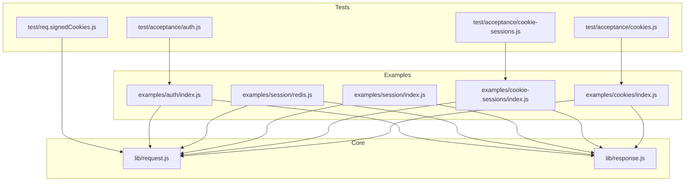
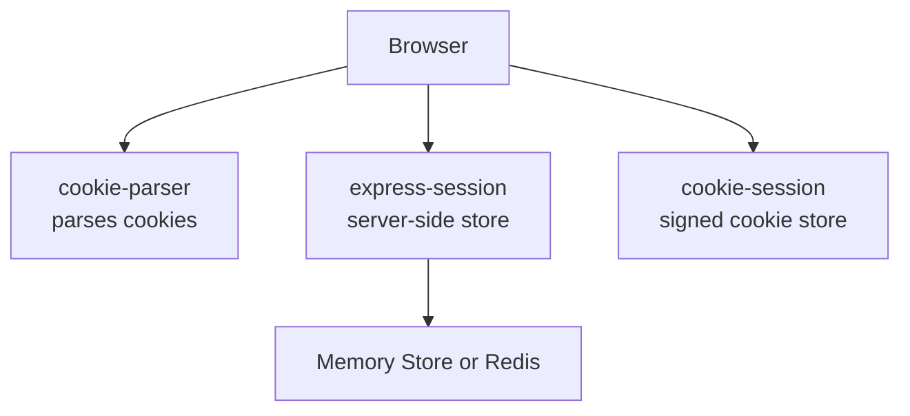
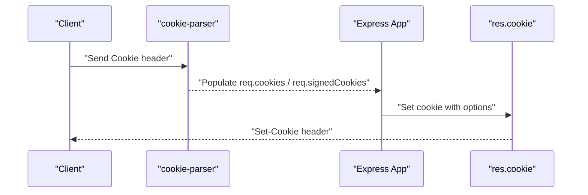
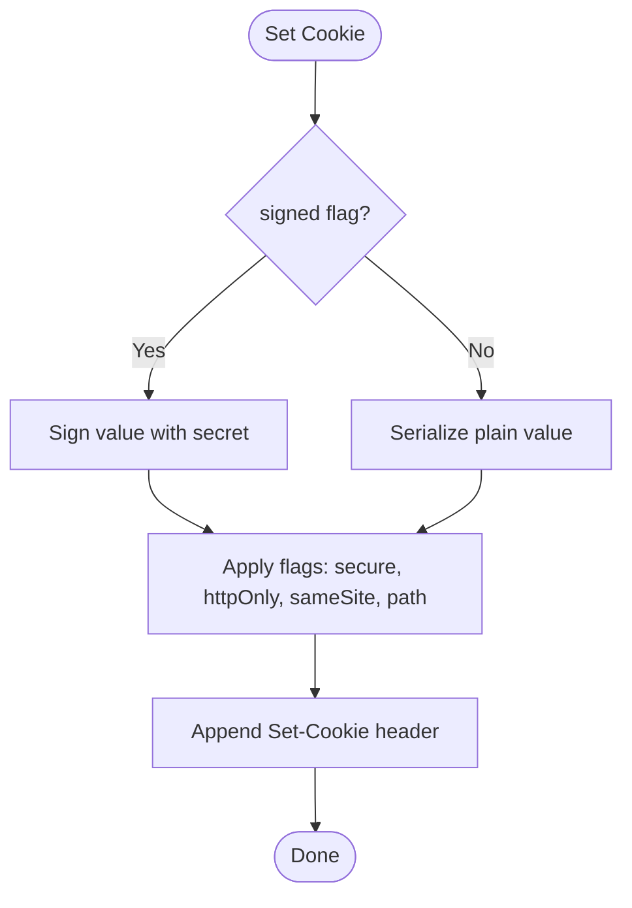
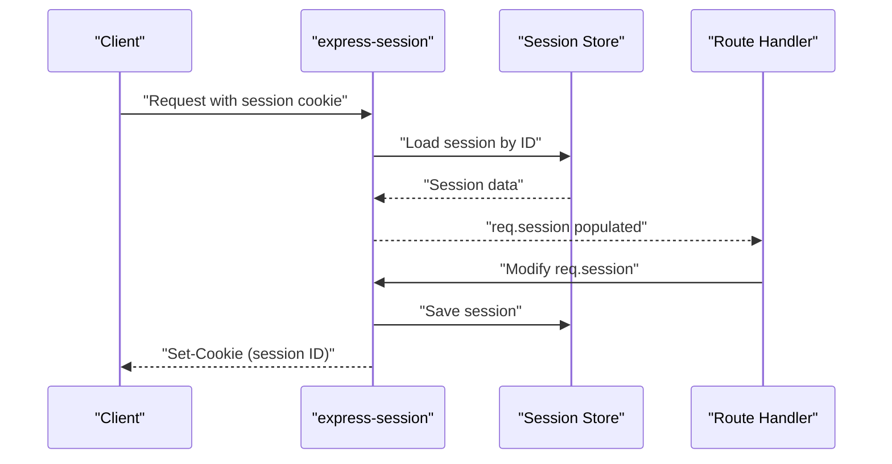
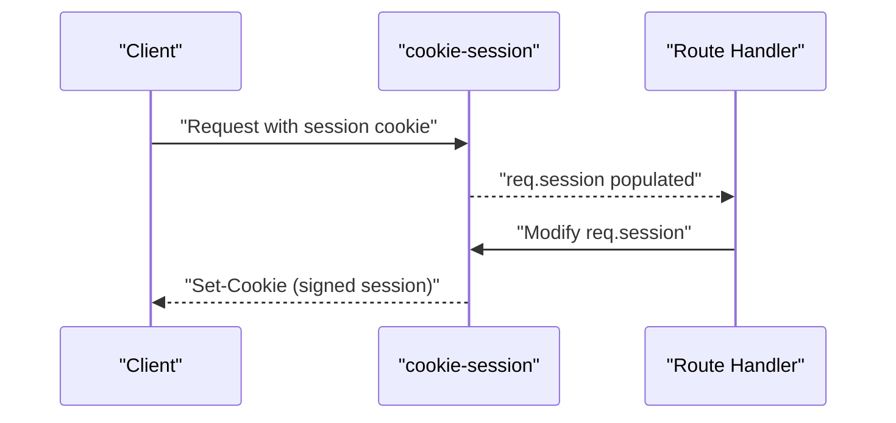
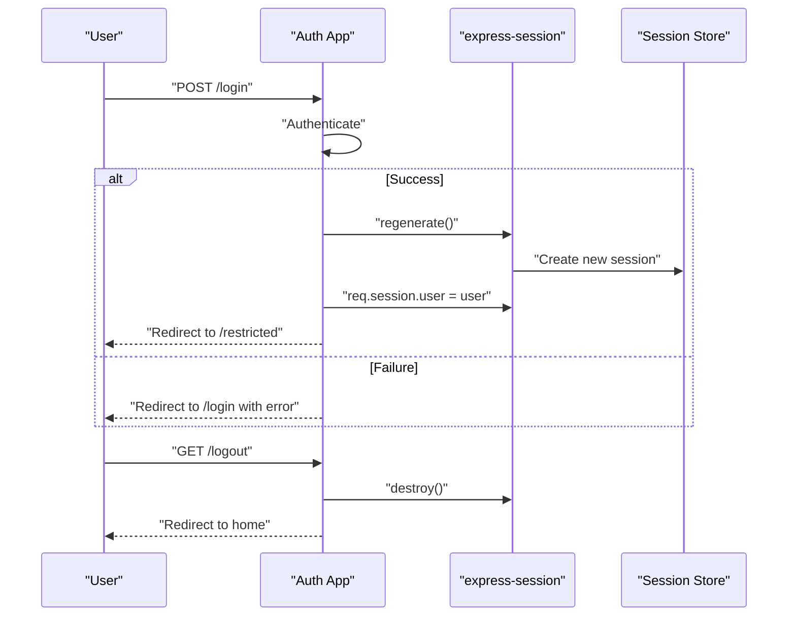
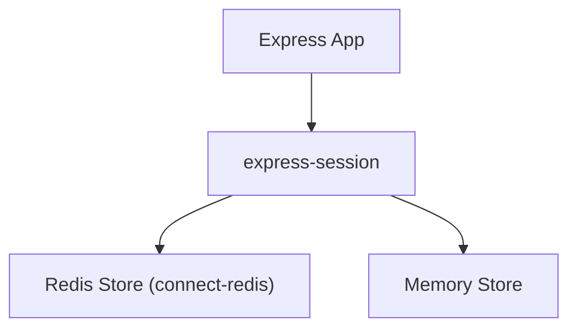
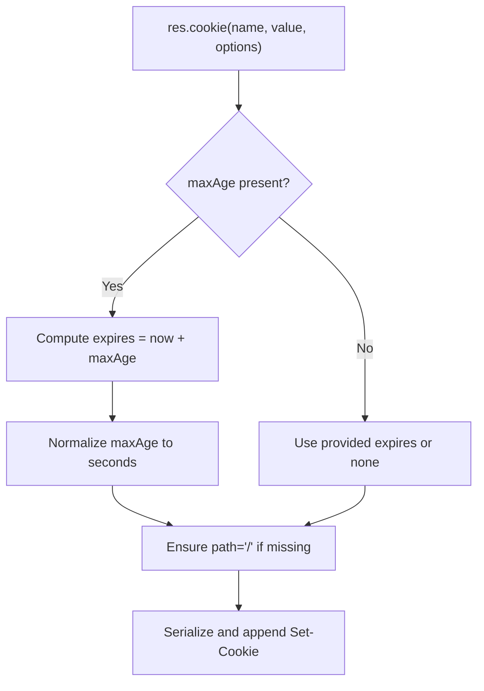
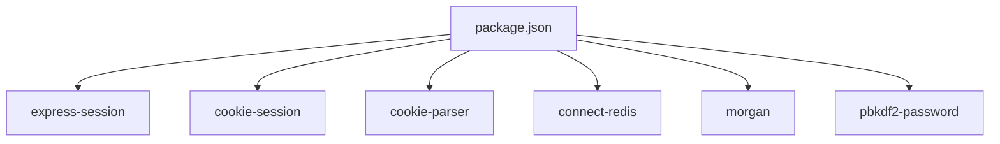

# Sessions and Cookies

<cite>
**Referenced Files in This Document**
- [examples/session/index.js](file://examples/session/index.js)
- [examples/session/redis.js](file://examples/session/redis.js)
- [examples/cookies/index.js](file://examples/cookies/index.js)
- [examples/cookie-sessions/index.js](file://examples/cookie-sessions/index.js)
- [examples/auth/index.js](file://examples/auth/index.js)
- [lib/response.js](file://lib/response.js)
- [lib/request.js](file://lib/request.js)
- [test/acceptance/cookies.js](file://test/acceptance/cookies.js)
- [test/acceptance/cookie-sessions.js](file://test/acceptance/cookie-sessions.js)
- [test/acceptance/auth.js](file://test/acceptance/auth.js)
- [test/req.signedCookies.js](file://test/req.signedCookies.js)
- [package.json](file://package.json)
- [Readme.md](file://Readme.md)
</cite>

## Table of Contents
1. [Introduction](#introduction)
2. [Project Structure](#project-structure)
3. [Core Components](#core-components)
4. [Architecture Overview](#architecture-overview)
5. [Detailed Component Analysis](#detailed-component-analysis)
6. [Dependency Analysis](#dependency-analysis)
7. [Performance Considerations](#performance-considerations)
8. [Troubleshooting Guide](#troubleshooting-guide)
9. [Conclusion](#conclusion)
10. [Appendices](#appendices)

## Introduction
This document explains session management and cookie handling in Express.js using the included examples and tests. It covers cookie creation and modification, signed cookies, secure flags, session implementation with express-session and cookie-session, session stores (memory and Redis), session persistence, configuration, expiration handling, and security best practices. Practical examples demonstrate cookie manipulation, session setup, and authentication patterns. Security topics include XSS protection, CSRF prevention, and session hijacking mitigation.

## Project Structure
The repository includes:
- Examples demonstrating cookies, session storage, Redis-backed sessions, and authentication
- Core Express request/response prototypes that implement cookie parsing and cookie setting
- Test suites validating cookie behavior and session flows

**Diagram sources**
- [examples/cookies/index.js:1-54](file://examples/cookies/index.js#L1-L54)
- [examples/cookie-sessions/index.js:1-26](file://examples/cookie-sessions/index.js#L1-L26)
- [examples/session/index.js:1-38](file://examples/session/index.js#L1-L38)
- [examples/session/redis.js:1-40](file://examples/session/redis.js#L1-L40)
- [examples/auth/index.js:1-135](file://examples/auth/index.js#L1-L135)
- [lib/request.js:1-528](file://lib/request.js#L1-L528)
- [lib/response.js:1-1048](file://lib/response.js#L1-L1048)
- [test/acceptance/cookies.js:1-72](file://test/acceptance/cookies.js#L1-L72)
- [test/acceptance/cookie-sessions.js:1-39](file://test/acceptance/cookie-sessions.js#L1-L39)
- [test/acceptance/auth.js:1-118](file://test/acceptance/auth.js#L1-L118)
- [test/req.signedCookies.js:1-37](file://test/req.signedCookies.js#L1-L37)

**Section sources**
- [Readme.md:127-146](file://Readme.md#L127-L146)
- [package.json:64-81](file://package.json#L64-L81)

## Core Components
- Cookie parsing and signed cookies: Implemented in the request prototype, enabling req.cookies and req.signedCookies.
- Cookie setting and serialization: Implemented in the response prototype, including support for signed cookies, maxAge/expires, httpOnly, secure, and path.
- Session middleware:
  - express-session: Provides server-side session storage and session ID cookie handling.
  - cookie-session: Stores session data client-side in an encrypted cookie.

Key responsibilities:
- Parsing incoming cookies and signed cookies
- Serializing outgoing cookies with appropriate flags
- Managing session lifecycle (creation, regeneration, destruction)
- Integrating with session stores (memory or Redis)

**Section sources**
- [lib/request.js:1-528](file://lib/request.js#L1-L528)
- [lib/response.js:708-775](file://lib/response.js#L708-L775)
- [examples/cookies/index.js:15-19](file://examples/cookies/index.js#L15-L19)
- [examples/cookie-sessions/index.js:12-13](file://examples/cookie-sessions/index.js#L12-L13)
- [examples/session/index.js:15-20](file://examples/session/index.js#L15-L20)
- [examples/session/redis.js:19-25](file://examples/session/redis.js#L19-L25)

## Architecture Overview
The examples illustrate two primary patterns:
- Cookie-based sessions: Uses cookie-session to store session data in a signed cookie.
- Server-side sessions: Uses express-session with an optional Redis store to persist session data server-side while storing only a session ID cookie.

**Diagram sources**
- [examples/cookies/index.js:15-19](file://examples/cookies/index.js#L15-L19)
- [examples/session/index.js:15-20](file://examples/session/index.js#L15-L20)
- [examples/session/redis.js:19-25](file://examples/session/redis.js#L19-L25)
- [examples/cookie-sessions/index.js:12-13](file://examples/cookie-sessions/index.js#L12-L13)

## Detailed Component Analysis

### Cookie Handling: Parsing and Setting
- Parsing cookies:
  - cookie-parser populates req.cookies and req.signedCookies when a secret is provided.
- Setting cookies:
  - res.cookie supports signed cookies, maxAge/expires, httpOnly, secure, sameSite, and path.
  - Signed cookies are prefixed and validated using the application secret.

**Diagram sources**
- [examples/cookies/index.js:15-19](file://examples/cookies/index.js#L15-L19)
- [lib/response.js:742-775](file://lib/response.js#L742-L775)
- [test/req.signedCookies.js:12-21](file://test/req.signedCookies.js#L12-L21)

**Section sources**
- [lib/request.js:1-528](file://lib/request.js#L1-L528)
- [lib/response.js:708-775](file://lib/response.js#L708-L775)
- [examples/cookies/index.js:24-47](file://examples/cookies/index.js#L24-L47)
- [test/acceptance/cookies.js:14-33](file://test/acceptance/cookies.js#L14-L33)
- [test/req.signedCookies.js:8-34](file://test/req.signedCookies.js#L8-L34)

### Signed Cookies and Security Flags
- Signed cookies:
  - Enable integrity verification by prefixing values and signing with the secret.
  - Requires cookie-parser with a secret to populate req.signedCookies.
- Secure and httpOnly:
  - Use secure: true to transmit cookies over HTTPS only.
  - Use httpOnly: true to prevent client-side script access.
- SameSite:
  - Controls cross-site cookie sending; recommended to set SameSite=Lax or SameSite=Strict depending on CSRF needs.

**Diagram sources**
- [lib/response.js:742-775](file://lib/response.js#L742-L775)
- [test/req.signedCookies.js:12-21](file://test/req.signedCookies.js#L12-L21)

**Section sources**
- [lib/response.js:742-775](file://lib/response.js#L742-L775)
- [test/req.signedCookies.js:8-34](file://test/req.signedCookies.js#L8-L34)

### Session Implementation: express-session
- Behavior:
  - Creates req.session and manages session IDs via a session cookie.
  - Options include resave, saveUninitialized, and secret.
- Persistence:
  - Defaults to memory store; can be configured with a Redis store for clustering and persistence.

**Diagram sources**
- [examples/session/index.js:15-31](file://examples/session/index.js#L15-L31)
- [examples/session/redis.js:19-36](file://examples/session/redis.js#L19-L36)

**Section sources**
- [examples/session/index.js:15-31](file://examples/session/index.js#L15-L31)
- [examples/session/redis.js:19-36](file://examples/session/redis.js#L19-L36)
- [test/acceptance/cookie-sessions.js:6-31](file://test/acceptance/cookie-sessions.js#L6-L31)

### Session Implementation: cookie-session
- Behavior:
  - Stores session data client-side in a signed cookie.
  - No server-side store required; session data is transported with each request.
- Use cases:
  - Lightweight apps or when server-side scaling is unnecessary.

**Diagram sources**
- [examples/cookie-sessions/index.js:12-19](file://examples/cookie-sessions/index.js#L12-L19)
- [test/acceptance/cookie-sessions.js:6-31](file://test/acceptance/cookie-sessions.js#L6-L31)

**Section sources**
- [examples/cookie-sessions/index.js:12-19](file://examples/cookie-sessions/index.js#L12-L19)
- [test/acceptance/cookie-sessions.js:6-31](file://test/acceptance/cookie-sessions.js#L6-L31)

### Authentication Pattern with Sessions
- Steps:
  - Parse form data and authenticate credentials.
  - On success, regenerate the session to prevent fixation.
  - Store user identity in req.session.
  - Redirect to a protected route.
  - On logout, destroy the session.

**Diagram sources**
- [examples/auth/index.js:104-128](file://examples/auth/index.js#L104-L128)
- [examples/auth/index.js:92-98](file://examples/auth/index.js#L92-L98)

**Section sources**
- [examples/auth/index.js:75-98](file://examples/auth/index.js#L75-L98)
- [examples/auth/index.js:104-128](file://examples/auth/index.js#L104-L128)
- [test/acceptance/auth.js:65-87](file://test/acceptance/auth.js#L65-L87)

### Session Stores and Persistence Strategies
- Memory store:
  - Simple, suitable for development or single-instance deployments.
- Redis store:
  - Enables horizontal scaling and persistence across instances.
  - Requires connect-redis and a Redis server.

**Diagram sources**
- [examples/session/redis.js:13-25](file://examples/session/redis.js#L13-L25)
- [package.json:66-68](file://package.json#L66-L68)

**Section sources**
- [examples/session/index.js:15-20](file://examples/session/index.js#L15-L20)
- [examples/session/redis.js:13-25](file://examples/session/redis.js#L13-L25)
- [package.json:66-68](file://package.json#L66-L68)

### Expiration Handling
- maxAge vs expires:
  - maxAge is converted to expires and seconds-based maxAge.
  - If maxAge is provided, expires is computed and maxAge is normalized to seconds.
- Default path:
  - If path is omitted, defaults to "/".
- Clearing cookies:
  - res.clearCookie sets expires to the epoch to expire the cookie.

**Diagram sources**
- [lib/response.js:742-775](file://lib/response.js#L742-L775)

**Section sources**
- [lib/response.js:742-775](file://lib/response.js#L742-L775)
- [examples/cookies/index.js:40-44](file://examples/cookies/index.js#L40-L44)

## Dependency Analysis
External modules used by examples and tests:
- express-session: Server-side session middleware
- cookie-session: Client-side session via signed cookies
- cookie-parser: Parses cookies and signed cookies
- connect-redis: Redis-backed session store
- morgan: Logging middleware
- pbkdf2-password: Password hashing for authentication example

**Diagram sources**
- [package.json:64-81](file://package.json#L64-L81)

**Section sources**
- [package.json:64-81](file://package.json#L64-L81)

## Performance Considerations
- Prefer Redis-backed sessions for clustered deployments to avoid memory store limitations.
- Minimize session payload size to reduce cookie size (for cookie-session) or network overhead (for express-session).
- Use httpOnly and secure flags to protect cookies and enforce HTTPS.
- Avoid storing large objects in sessions; keep only identifiers or minimal data.

[No sources needed since this section provides general guidance]

## Troubleshooting Guide
Common issues and resolutions:
- Signed cookies require a secret:
  - Ensure cookie-parser is initialized with a secret to populate req.signedCookies.
- Session not persisting:
  - Verify express-session options (resave, saveUninitialized) and store configuration.
  - Confirm the session cookie is being sent and received consistently.
- Logout not working:
  - Ensure req.session.destroy is called and the session cookie is cleared or expired.

Validation references:
- Cookie parsing and signed cookies
- Session cookie presence and behavior
- Authentication redirects and session usage

**Section sources**
- [lib/response.js:742-775](file://lib/response.js#L742-L775)
- [test/req.signedCookies.js:8-34](file://test/req.signedCookies.js#L8-L34)
- [test/acceptance/cookie-sessions.js:13-18](file://test/acceptance/cookie-sessions.js#L13-L18)
- [test/acceptance/auth.js:65-87](file://test/acceptance/auth.js#L65-L87)

## Conclusion
Express.js provides robust primitives for cookie handling and session management. Use cookie-parser for parsing, res.cookie for setting, and choose between express-session (server-side) and cookie-session (client-side) based on deployment needs. Apply security flags (httpOnly, secure, sameSite), manage expiration carefully, and adopt best practices to mitigate XSS, CSRF, and session hijacking risks.

[No sources needed since this section summarizes without analyzing specific files]

## Appendices

### Practical Examples Index
- Cookie manipulation: [examples/cookies/index.js:24-47](file://examples/cookies/index.js#L24-L47)
- Cookie-session setup: [examples/cookie-sessions/index.js:12-19](file://examples/cookie-sessions/index.js#L12-L19)
- Server-side sessions: [examples/session/index.js:15-31](file://examples/session/index.js#L15-L31)
- Redis-backed sessions: [examples/session/redis.js:19-36](file://examples/session/redis.js#L19-L36)
- Authentication with sessions: [examples/auth/index.js:104-128](file://examples/auth/index.js#L104-L128)

**Section sources**
- [examples/cookies/index.js:24-47](file://examples/cookies/index.js#L24-L47)
- [examples/cookie-sessions/index.js:12-19](file://examples/cookie-sessions/index.js#L12-L19)
- [examples/session/index.js:15-31](file://examples/session/index.js#L15-L31)
- [examples/session/redis.js:19-36](file://examples/session/redis.js#L19-L36)
- [examples/auth/index.js:104-128](file://examples/auth/index.js#L104-L128)