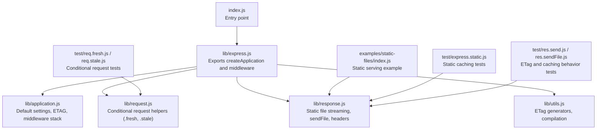
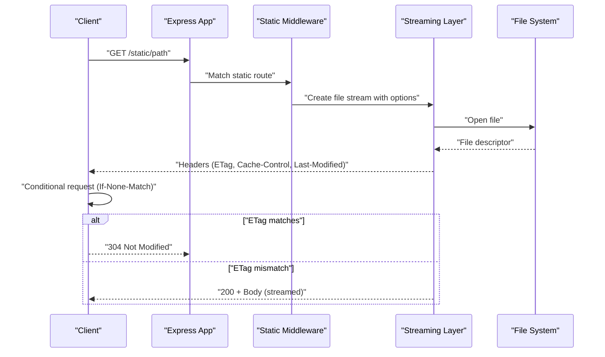
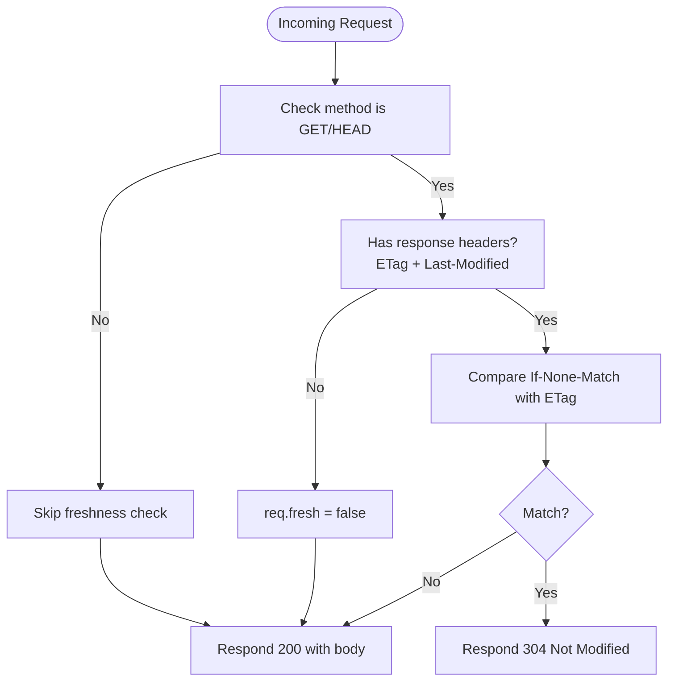
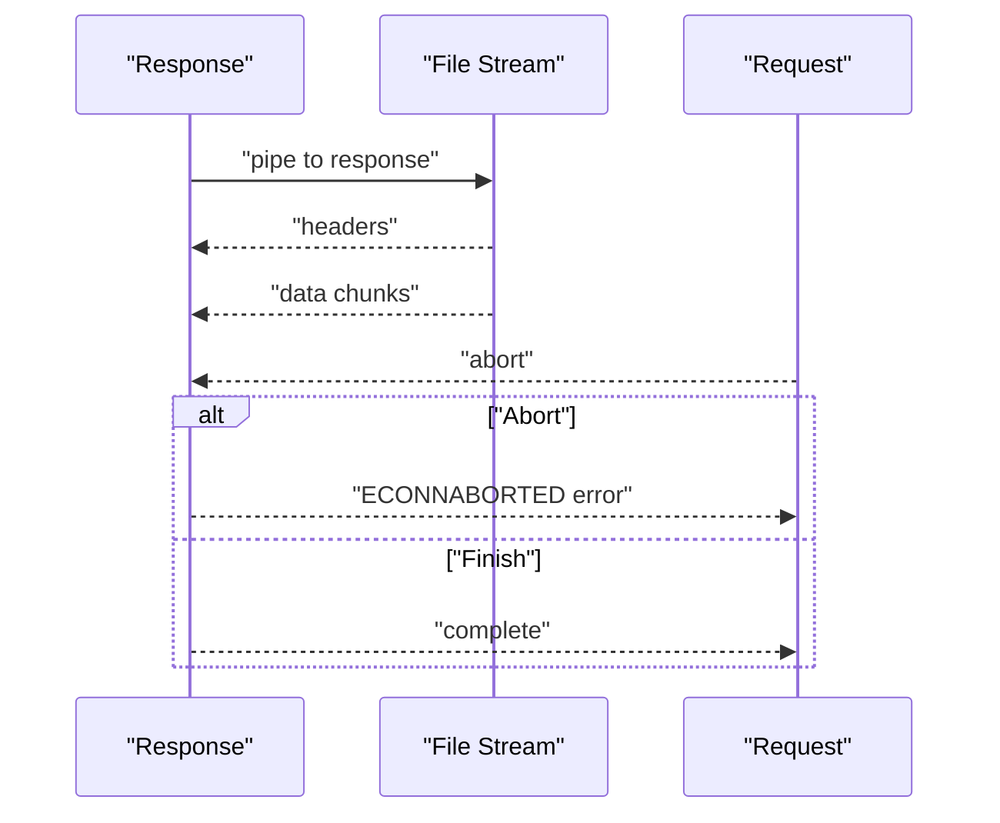
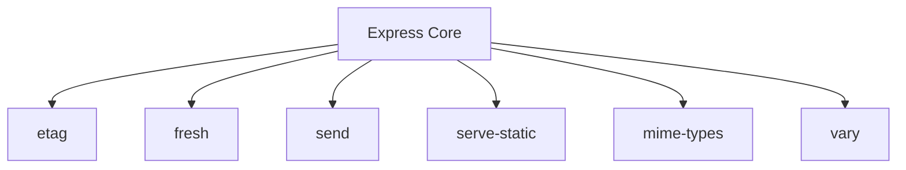

# Caching and Performance Optimization

<cite>
**Referenced Files in This Document**
- [index.js](file://index.js)
- [package.json](file://package.json)
- [express.js](file://lib/express.js)
- [application.js](file://lib/application.js)
- [request.js](file://lib/request.js)
- [response.js](file://lib/response.js)
- [utils.js](file://lib/utils.js)
- [static-files/index.js](file://examples/static-files/index.js)
- [static-files/public/js/app.js](file://examples/static-files/public/js/app.js)
- [static-files/public/css/style.css](file://examples/static-files/public/css/style.css)
- [express.static.js](file://test/express.static.js)
- [req.fresh.js](file://test/req.fresh.js)
- [req.stale.js](file://test/req.stale.js)
- [res.send.js](file://test/res.send.js)
- [res.sendFile.js](file://test/res.sendFile.js)
</cite>

## Table of Contents
1. [Introduction](#introduction)
2. [Project Structure](#project-structure)
3. [Core Components](#core-components)
4. [Architecture Overview](#architecture-overview)
5. [Detailed Component Analysis](#detailed-component-analysis)
6. [Dependency Analysis](#dependency-analysis)
7. [Performance Considerations](#performance-considerations)
8. [Troubleshooting Guide](#troubleshooting-guide)
9. [Conclusion](#conclusion)
10. [Appendices](#appendices)

## Introduction
This document focuses on Express.js static file caching and performance optimization with an emphasis on efficient file delivery strategies. It explains how Express generates ETags, configures Cache-Control headers, and handles conditional requests. It also covers caching strategies (max-age, immutable directives, validation), browser caching optimization, compression and encoding, static file bundling, CDN and reverse proxy integration, production deployment optimizations, memory management, streaming for large files, and bandwidth optimization.

## Project Structure
The repository provides:
- Core Express runtime and middleware integrations
- Static file serving via the built-in static middleware
- Tests validating caching behavior, ETag generation, and conditional requests
- Example applications demonstrating static file serving

**Diagram sources**
- [index.js:1-12](file://index.js#L1-L12)
- [express.js:70-82](file://lib/express.js#L70-L82)
- [application.js:90-141](file://lib/application.js#L90-L141)
- [request.js:468-499](file://lib/request.js#L468-L499)
- [response.js:331-413](file://lib/response.js#L331-L413)
- [utils.js:130-152](file://lib/utils.js#L130-L152)
- [static-files/index.js:1-44](file://examples/static-files/index.js#L1-L44)
- [express.static.js:16-213](file://test/express.static.js#L16-L213)
- [req.fresh.js:1-70](file://test/req.fresh.js#L1-L70)
- [req.stale.js:1-50](file://test/req.stale.js#L1-L50)
- [res.send.js:285-569](file://test/res.send.js#L285-L569)
- [res.sendFile.js:116-141](file://test/res.sendFile.js#L116-L141)

**Section sources**
- [index.js:1-12](file://index.js#L1-L12)
- [express.js:70-82](file://lib/express.js#L70-L82)
- [application.js:90-141](file://lib/application.js#L90-L141)
- [static-files/index.js:1-44](file://examples/static-files/index.js#L1-L44)

## Core Components
- Static file serving: Express integrates static file delivery through the static middleware, which leverages streaming and supports conditional requests, caching headers, and range requests.
- ETag generation: Express compiles an ETag function from settings and applies it to responses and static files.
- Conditional requests: The request object exposes freshness/staleness helpers that drive 304 Not Modified responses.
- Response streaming: The response layer streams files via a dedicated pipeline and honors request lifecycle events.

Key behaviors validated by tests:
- Default Cache-Control: public, max-age=0 for static assets.
- Conditional GET: If-None-Match triggers 304 when ETag matches.
- Range requests: Accept-Ranges and Content-Range headers are set appropriately.
- Immutable directive: When configured, Cache-Control includes immutable for long-lived assets.
- ETag customization: Strong vs weak ETags and custom generator functions.

**Section sources**
- [express.js:77-79](file://lib/express.js#L77-L79)
- [application.js:94-96](file://lib/application.js#L94-L96)
- [utils.js:130-152](file://lib/utils.js#L130-L152)
- [response.js:331-413](file://lib/response.js#L331-L413)
- [request.js:468-499](file://lib/request.js#L468-L499)
- [express.static.js:56-61](file://test/express.static.js#L56-L61)
- [express.static.js:103-115](file://test/express.static.js#L103-L115)
- [express.static.js:188-213](file://test/express.static.js#L188-L213)
- [express.static.js:418-430](file://test/express.static.js#L418-L430)
- [express.static.js:452-466](file://test/express.static.js#L452-L466)
- [res.sendFile.js:116-123](file://test/res.sendFile.js#L116-L123)

## Architecture Overview
The static file delivery pipeline integrates Express application settings, middleware, and response streaming.

**Diagram sources**
- [express.js:77-79](file://lib/express.js#L77-L79)
- [response.js:371-413](file://lib/response.js#L371-L413)
- [response.js:920-1009](file://lib/response.js#L920-L1009)
- [express.static.js:30-47](file://test/express.static.js#L30-L47)
- [express.static.js:103-115](file://test/express.static.js#L103-L115)

## Detailed Component Analysis

### Static File Serving and Caching Headers
- Default behavior: Static assets receive Cache-Control: public, max-age=0 by default.
- Configurable options: maxAge, immutable, cacheControl, lastModified, acceptRanges, redirect, dotfiles, extensions, fallthrough, setHeaders.
- Range requests: When enabled, Accept-Ranges and Content-Range are included; invalid ranges fall back to full response.

Practical configuration examples (paths):
- [examples/static-files/index.js:22-36](file://examples/static-files/index.js#L22-L36)
- [test/express.static.js:188-213](file://test/express.static.js#L188-L213)
- [test/express.static.js:418-430](file://test/express.static.js#L418-L430)
- [test/express.static.js:452-466](file://test/express.static.js#L452-L466)
- [test/express.static.js:593-690](file://test/express.static.js#L593-L690)

**Section sources**
- [express.static.js:56-61](file://test/express.static.js#L56-L61)
- [express.static.js:188-213](file://test/express.static.js#L188-L213)
- [express.static.js:418-430](file://test/express.static.js#L418-L430)
- [express.static.js:452-466](file://test/express.static.js#L452-L466)
- [express.static.js:593-690](file://test/express.static.js#L593-L690)

### ETag Generation Mechanisms
- Application-level ETag function compiled from settings (weak, strong, or custom).
- Automatic ETag generation for responses and static files when enabled.
- Custom ETag functions can override default behavior.

Implementation and tests:
- [utils.js:130-152](file://lib/utils.js#L130-L152)
- [utils.js:249-257](file://lib/utils.js#L249-L257)
- [application.js:364-366](file://lib/application.js#L364-L366)
- [res.send.js:398-427](file://test/res.send.js#L398-L427)
- [res.send.js:495-527](file://test/res.send.js#L495-L527)
- [res.send.js:529-567](file://test/res.send.js#L529-L567)

**Section sources**
- [utils.js:130-152](file://lib/utils.js#L130-L152)
- [utils.js:249-257](file://lib/utils.js#L249-L257)
- [application.js:364-366](file://lib/application.js#L364-L366)
- [res.send.js:398-427](file://test/res.send.js#L398-L427)
- [res.send.js:495-527](file://test/res.send.js#L495-L527)
- [res.send.js:529-567](file://test/res.send.js#L529-L567)

### Conditional Request Handling (If-None-Match / If-Modified-Since)
- req.fresh evaluates whether a cached representation is still valid based on ETag and Last-Modified.
- req.stale indicates when validation is required.
- Tests demonstrate 304 Not Modified on match and 200 on mismatch.

Validation flow:

**Diagram sources**
- [request.js:468-499](file://lib/request.js#L468-L499)
- [req.fresh.js:8-35](file://test/req.fresh.js#L8-L35)
- [req.stale.js:8-35](file://test/req.stale.js#L8-L35)

**Section sources**
- [request.js:468-499](file://lib/request.js#L468-L499)
- [req.fresh.js:8-35](file://test/req.fresh.js#L8-L35)
- [req.stale.js:8-35](file://test/req.stale.js#L8-L35)

### Streaming and Large File Delivery
- Static file streaming uses a dedicated pipeline that listens to file events and request lifecycle.
- Proper handling of aborts, directory errors, and finish conditions ensures robust streaming.

Streaming pipeline:

**Diagram sources**
- [response.js:920-1009](file://lib/response.js#L920-L1009)

**Section sources**
- [response.js:920-1009](file://lib/response.js#L920-L1009)

### Compression and Encoding
- Express does not include built-in compression middleware; however, it interacts with content-type and encoding headers.
- For production, integrate compression middleware and configure appropriate encodings.

[No sources needed since this section provides general guidance]

### CDN and Reverse Proxy Integration
- Static assets benefit from CDN caching with immutable directives and long max-age.
- Reverse proxies can offload static delivery and enforce caching policies.

[No sources needed since this section provides general guidance]

### Production Deployment Optimizations
- Serve static assets with immutable and long max-age for optimal caching.
- Use CDN and reverse proxies to reduce origin load.
- Monitor latency and bandwidth usage during peak periods.

[No sources needed since this section provides general guidance]

## Dependency Analysis
Express depends on external libraries for caching and static delivery:
- etag: ETag generation
- fresh: Conditional request evaluation
- send: File streaming and HTTP caching
- serve-static: Static file serving middleware

**Diagram sources**
- [package.json:34-62](file://package.json#L34-L62)

**Section sources**
- [package.json:34-62](file://package.json#L34-L62)

## Performance Considerations
- Prefer immutable static assets with long max-age to minimize revalidation overhead.
- Use weak ETags for static resources to allow flexible caching.
- Stream large files to avoid loading entire content into memory.
- Enable range requests for media assets to improve perceived performance.
- Integrate CDN and reverse proxies for global caching and reduced origin traffic.

[No sources needed since this section provides general guidance]

## Troubleshooting Guide
Common issues and resolutions:
- Unexpected 304 responses: Verify ETag correctness and ensure conditional headers are set.
- Missing Cache-Control: Confirm static middleware options and application settings.
- Range request failures: Validate Range header syntax and server support.
- Streaming errors: Check for aborted requests and proper cleanup.

Validation references:
- [express.static.js:103-115](file://test/express.static.js#L103-L115)
- [express.static.js:188-213](file://test/express.static.js#L188-L213)
- [express.static.js:593-690](file://test/express.static.js#L593-L690)
- [res.sendFile.js:116-123](file://test/res.sendFile.js#L116-L123)

**Section sources**
- [express.static.js:103-115](file://test/express.static.js#L103-L115)
- [express.static.js:188-213](file://test/express.static.js#L188-L213)
- [express.static.js:593-690](file://test/express.static.js#L593-L690)
- [res.sendFile.js:116-123](file://test/res.sendFile.js#L116-L123)

## Conclusion
Express provides robust primitives for static file caching and performance optimization. By configuring Cache-Control, leveraging ETags, honoring conditional requests, streaming large files, and integrating CDNs and reverse proxies, applications can achieve efficient and scalable static asset delivery.

[No sources needed since this section summarizes without analyzing specific files]

## Appendices
- Example static serving setup: [examples/static-files/index.js:22-36](file://examples/static-files/index.js#L22-L36)
- Sample assets: [examples/static-files/public/js/app.js:1-2](file://examples/static-files/public/js/app.js#L1-L2), [examples/static-files/public/css/style.css:1-3](file://examples/static-files/public/css/style.css#L1-L3)

[No sources needed since this section provides general guidance]