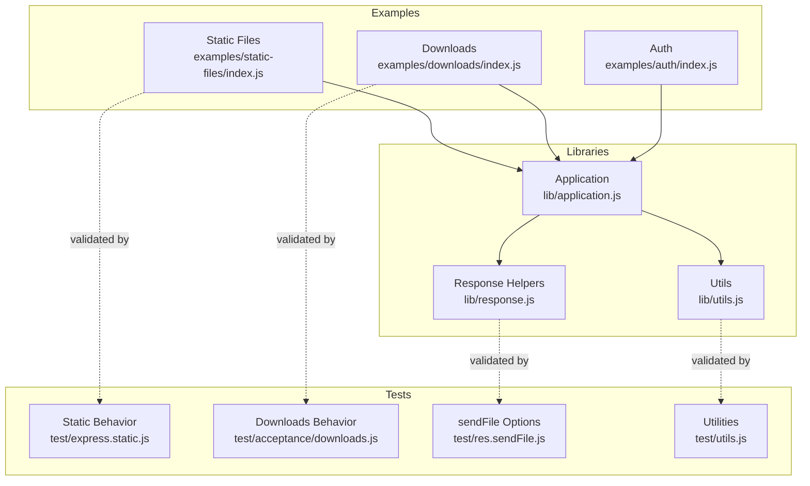
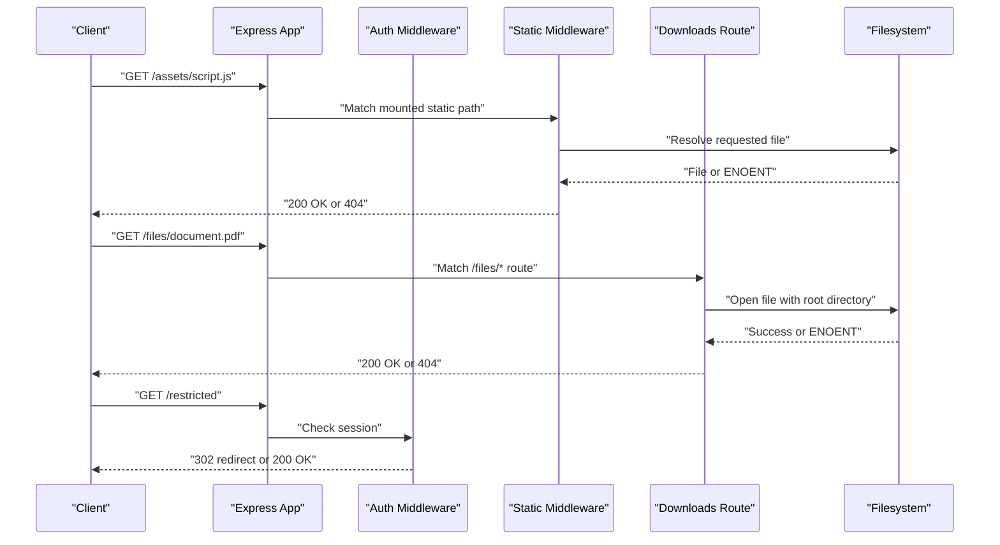
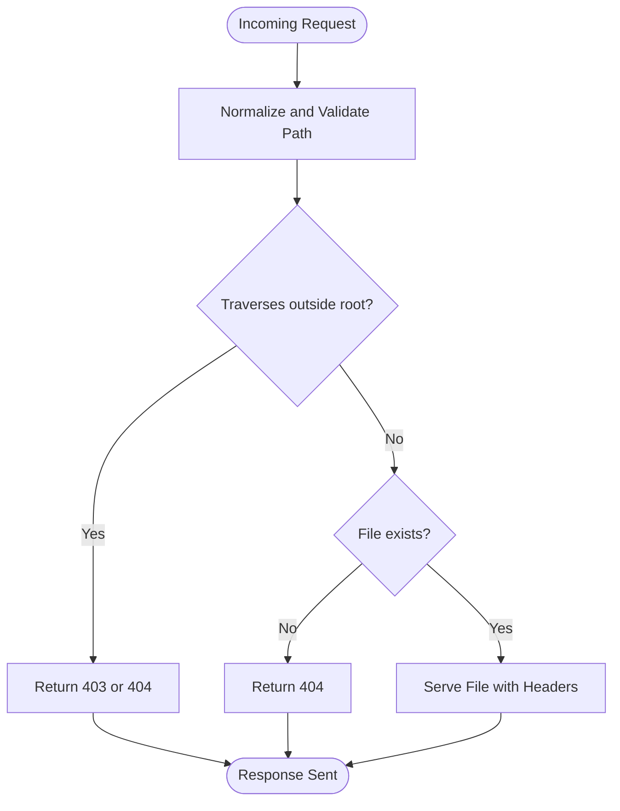
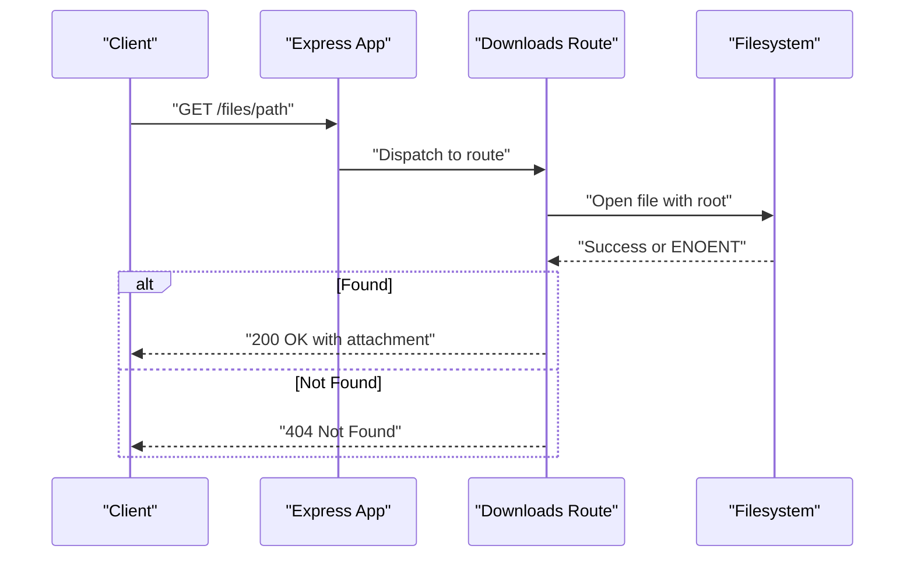
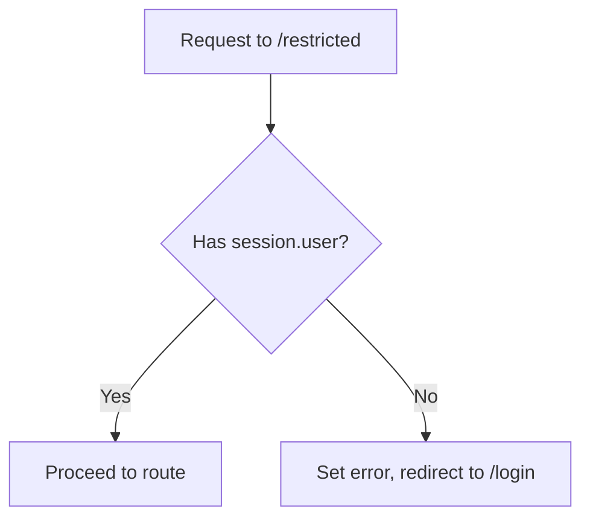
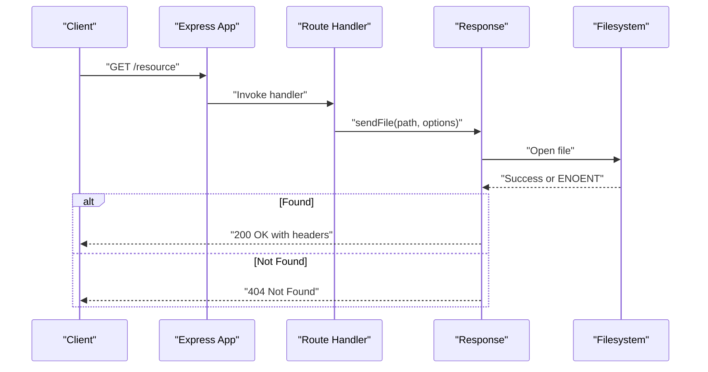
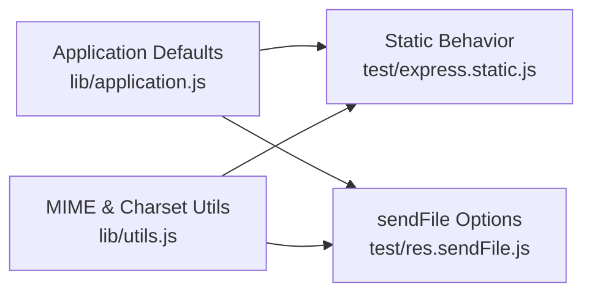

# Security and Access Control

<cite>
**Referenced Files in This Document**
- [examples/static-files/index.js](file://examples/static-files/index.js)
- [examples/downloads/index.js](file://examples/downloads/index.js)
- [examples/auth/index.js](file://examples/auth/index.js)
- [lib/application.js](file://lib/application.js)
- [lib/utils.js](file://lib/utils.js)
- [lib/response.js](file://lib/response.js)
- [test/express.static.js](file://test/express.static.js)
- [test/acceptance/downloads.js](file://test/acceptance/downloads.js)
- [test/res.sendFile.js](file://test/res.sendFile.js)
- [test/utils.js](file://test/utils.js)
</cite>

## Table of Contents
1. [Introduction](#introduction)
2. [Project Structure](#project-structure)
3. [Core Components](#core-components)
4. [Architecture Overview](#architecture-overview)
5. [Detailed Component Analysis](#detailed-component-analysis)
6. [Dependency Analysis](#dependency-analysis)
7. [Performance Considerations](#performance-considerations)
8. [Troubleshooting Guide](#troubleshooting-guide)
9. [Conclusion](#conclusion)
10. [Appendices](#appendices)

## Introduction
This document focuses on secure static file serving and access control in Express.js applications. It explains how to prevent directory traversal attacks, restrict file access, validate MIME types, configure security headers, and integrate authentication for protected assets. Practical examples are drawn from the repository’s static file serving, downloads, and authentication examples, along with tests that demonstrate safe defaults and hardening options.

## Project Structure
The repository includes:
- Examples demonstrating static asset serving, downloads, and authentication
- Core libraries for application setup, utilities, and response helpers
- Tests validating behavior such as directory traversal protection, redirects, and headers

**Diagram sources**
- [examples/static-files/index.js:1-44](file://examples/static-files/index.js#L1-L44)
- [examples/downloads/index.js:1-41](file://examples/downloads/index.js#L1-L41)
- [examples/auth/index.js:1-135](file://examples/auth/index.js#L1-L135)
- [lib/application.js:90-141](file://lib/application.js#L90-L141)
- [lib/utils.js:1-272](file://lib/utils.js#L1-L272)
- [lib/response.js:337-382](file://lib/response.js#L337-L382)
- [test/express.static.js:16-816](file://test/express.static.js#L16-L816)
- [test/acceptance/downloads.js:1-47](file://test/acceptance/downloads.js#L1-L47)
- [test/res.sendFile.js:496-818](file://test/res.sendFile.js#L496-L818)
- [test/utils.js:1-41](file://test/utils.js#L1-L41)

**Section sources**
- [examples/static-files/index.js:1-44](file://examples/static-files/index.js#L1-L44)
- [examples/downloads/index.js:1-41](file://examples/downloads/index.js#L1-L41)
- [examples/auth/index.js:1-135](file://examples/auth/index.js#L1-L135)
- [lib/application.js:90-141](file://lib/application.js#L90-L141)
- [lib/utils.js:1-272](file://lib/utils.js#L1-L272)
- [lib/response.js:337-382](file://lib/response.js#L337-L382)
- [test/express.static.js:16-816](file://test/express.static.js#L16-L816)
- [test/acceptance/downloads.js:1-47](file://test/acceptance/downloads.js#L1-L47)
- [test/res.sendFile.js:496-818](file://test/res.sendFile.js#L496-L818)
- [test/utils.js:1-41](file://test/utils.js#L1-L41)

## Core Components
- Static file serving with express.static: mounts a filesystem directory and serves files based on request path. Defaults include ignoring hidden files and redirecting directories to include a trailing slash.
- Downloads endpoint: uses a controlled route with a root directory and explicit error handling for missing or unauthorized files.
- Authentication middleware: integrates sessions and a restrict middleware to gate protected areas.
- Response helpers: sendFile provides programmatic control over file delivery with options for headers, caching, and dotfiles policy.

Key security-relevant behaviors observed in tests:
- Directory traversal protection: requests that traverse past the configured root return forbidden or not found depending on fallthrough configuration.
- Redirects for directories: adds trailing slash to directory URLs and sets a default Content-Security-Policy header on redirects.
- Range requests: supports partial content with appropriate headers and status codes.
- Headers customization: allows setting custom headers and overriding Content-Type per request.

**Section sources**
- [examples/static-files/index.js:15-36](file://examples/static-files/index.js#L15-L36)
- [examples/downloads/index.js:24-34](file://examples/downloads/index.js#L24-L34)
- [examples/auth/index.js:75-82](file://examples/auth/index.js#L75-L82)
- [lib/response.js:337-382](file://lib/response.js#L337-L382)
- [test/express.static.js:575-591](file://test/express.static.js#L575-L591)
- [test/express.static.js:491-520](file://test/express.static.js#L491-L520)
- [test/express.static.js:593-690](file://test/express.static.js#L593-L690)
- [test/acceptance/downloads.js:40-46](file://test/acceptance/downloads.js#L40-L46)

## Architecture Overview
The secure serving architecture combines:
- Controlled mounting of static directories with explicit options
- Authentication middleware applied before protected routes
- Explicit downloads with a dedicated root and error handling
- Response-level controls for headers, caching, and MIME types

**Diagram sources**
- [examples/static-files/index.js:22-36](file://examples/static-files/index.js#L22-L36)
- [examples/downloads/index.js:24-34](file://examples/downloads/index.js#L24-L34)
- [examples/auth/index.js:75-82](file://examples/auth/index.js#L75-L82)

## Detailed Component Analysis

### Secure Static File Serving with express.static
Secure configuration involves:
- Mounting only trusted directories and prefixing paths when needed
- Enabling redirect behavior to avoid ambiguous directory URLs
- Disabling fallthrough to prevent unintended fallback to other routes
- Controlling hidden file exposure and MIME type normalization
- Setting cache-control and immutable flags for long-lived assets

Observed behaviors in tests:
- Redirects for directories and proper encoding of redirect targets
- Default Content-Security-Policy header on redirects
- Range request support with appropriate headers and status codes
- Dotfiles policy to ignore or allow hidden files
- Extensions fallback and index file serving behavior

**Diagram sources**
- [test/express.static.js:346-350](file://test/express.static.js#L346-L350)
- [test/express.static.js:575-591](file://test/express.static.js#L575-L591)

**Section sources**
- [examples/static-files/index.js:22-36](file://examples/static-files/index.js#L22-L36)
- [test/express.static.js:491-520](file://test/express.static.js#L491-L520)
- [test/express.static.js:593-690](file://test/express.static.js#L593-L690)
- [test/express.static.js:404-416](file://test/express.static.js#L404-L416)

### Downloads Endpoint with Controlled Root
The downloads example demonstrates:
- Dedicated route for file downloads
- Explicit root directory to prevent traversal
- Error handling for missing files and forbidden paths
- Automatic Content-Disposition attachment headers

**Diagram sources**
- [examples/downloads/index.js:24-34](file://examples/downloads/index.js#L24-L34)
- [test/acceptance/downloads.js:32-46](file://test/acceptance/downloads.js#L32-L46)

**Section sources**
- [examples/downloads/index.js:12-34](file://examples/downloads/index.js#L12-L34)
- [test/acceptance/downloads.js:14-46](file://test/acceptance/downloads.js#L14-L46)

### Authentication Integration for Protected Assets
Authentication middleware:
- Uses sessions to track logged-in users
- restrict middleware denies access if no session user is present
- Redirects to login page on denial

**Diagram sources**
- [examples/auth/index.js:75-82](file://examples/auth/index.js#L75-L82)

**Section sources**
- [examples/auth/index.js:75-82](file://examples/auth/index.js#L75-L82)

### Response-Level Controls with res.sendFile
Programmatic control over file delivery:
- Set headers including Content-Type overrides
- Configure cache-control and immutable flags
- Control dotfiles policy and index behavior
- Apply custom headers only when a file is served

**Diagram sources**
- [lib/response.js:371-382](file://lib/response.js#L371-L382)
- [test/res.sendFile.js:509-584](file://test/res.sendFile.js#L509-L584)

**Section sources**
- [lib/response.js:337-382](file://lib/response.js#L337-L382)
- [test/res.sendFile.js:509-584](file://test/res.sendFile.js#L509-L584)

## Dependency Analysis
Express application defaults and utilities influence static file security:
- Default settings include weak ETag generation and simple query parsing
- Utilities provide MIME type normalization and charset handling
- Application-level trust proxy settings affect secure detection behind proxies

**Diagram sources**
- [lib/application.js:90-141](file://lib/application.js#L90-L141)
- [lib/utils.js:61-77](file://lib/utils.js#L61-L77)
- [test/express.static.js:16-816](file://test/express.static.js#L16-L816)
- [test/res.sendFile.js:496-818](file://test/res.sendFile.js#L496-L818)

**Section sources**
- [lib/application.js:90-141](file://lib/application.js#L90-L141)
- [lib/utils.js:61-77](file://lib/utils.js#L61-L77)
- [test/utils.js:29-41](file://test/utils.js#L29-L41)

## Performance Considerations
- Prefer immutable cache-control for static assets to reduce revalidation overhead
- Use weak ETag by default for correctness; strong ETag may increase CPU cost
- Limit fallthrough to avoid unnecessary route checks after a static hit
- Avoid serving large binary assets through dynamic routes; prefer static middleware or controlled downloads

[No sources needed since this section provides general guidance]

## Troubleshooting Guide
Common issues and resolutions:
- Directory traversal attempts return 403 or 404 depending on fallthrough configuration
- Malformed URLs may return 400 or 404; ensure URL encoding is correct
- Hidden files are ignored by default; adjust dotfiles policy if needed
- Range requests require Accept-Ranges and proper Content-Range headers
- Redirects for directories include a default Content-Security-Policy header

**Section sources**
- [test/express.static.js:346-350](file://test/express.static.js#L346-L350)
- [test/express.static.js:340-344](file://test/express.static.js#L340-L344)
- [test/express.static.js:404-416](file://test/express.static.js#L404-L416)
- [test/express.static.js:593-690](file://test/express.static.js#L593-L690)
- [test/express.static.js:515-520](file://test/express.static.js#L515-L520)

## Conclusion
Secure static file serving in Express.js relies on explicit configuration of roots, redirects, and fallthrough behavior, combined with authentication middleware for protected assets and response-level controls for headers and caching. The repository’s examples and tests demonstrate safe defaults and highlight the importance of validating paths, controlling MIME types, and setting appropriate security headers.

[No sources needed since this section summarizes without analyzing specific files]

## Appendices

### Practical Secure Serving Patterns
- Static assets: mount trusted directories, enable redirect, disable fallthrough, and set immutable cache-control for long-lived resources
- Downloads: use a dedicated route with a controlled root and explicit error handling
- Authentication: protect routes with session-based middleware before serving sensitive files
- Headers: customize Content-Type and cache-control per request; rely on normalized MIME types from utilities

**Section sources**
- [examples/static-files/index.js:22-36](file://examples/static-files/index.js#L22-L36)
- [examples/downloads/index.js:24-34](file://examples/downloads/index.js#L24-L34)
- [examples/auth/index.js:75-82](file://examples/auth/index.js#L75-L82)
- [lib/utils.js:61-77](file://lib/utils.js#L61-L77)
- [test/res.sendFile.js:509-584](file://test/res.sendFile.js#L509-L584)