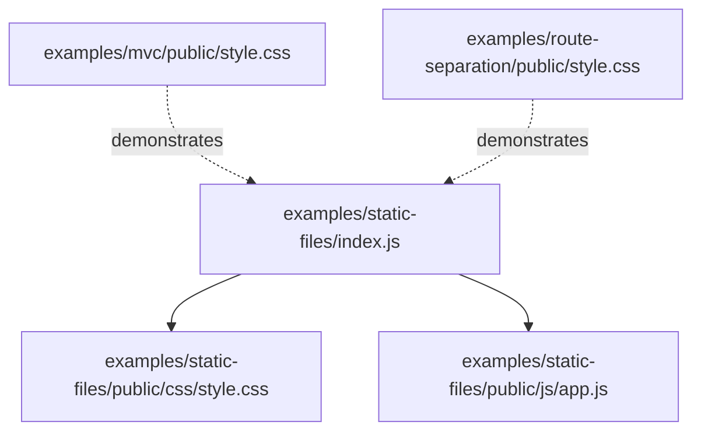
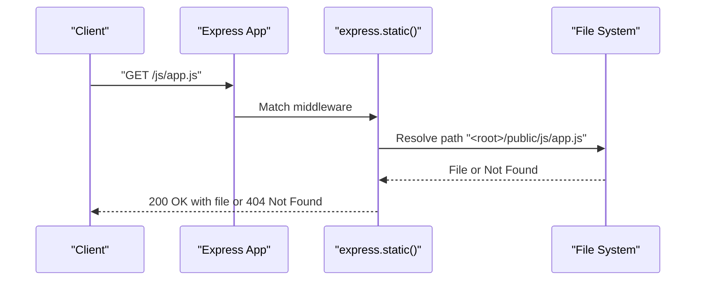
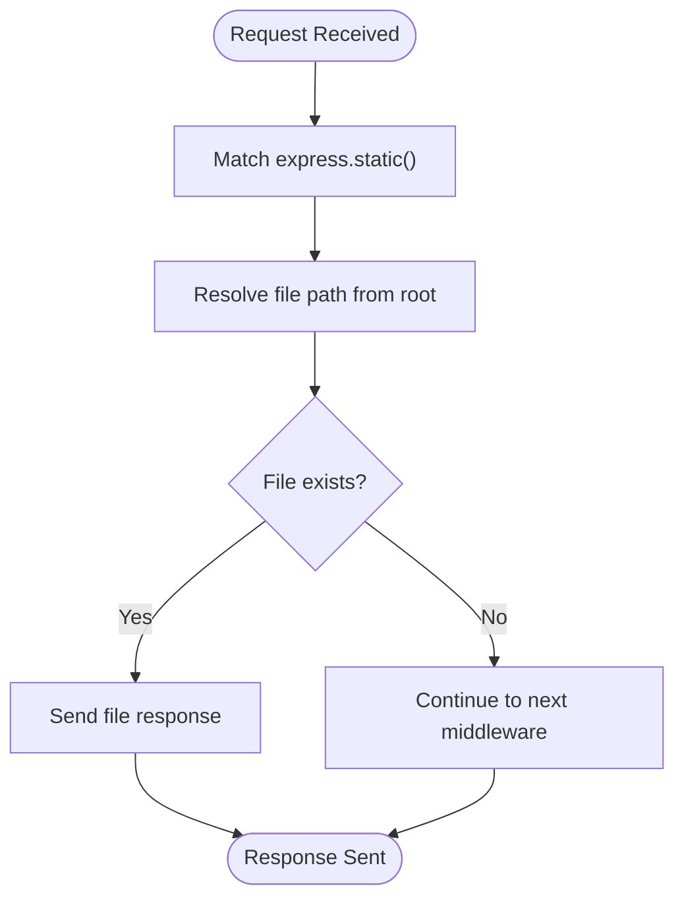
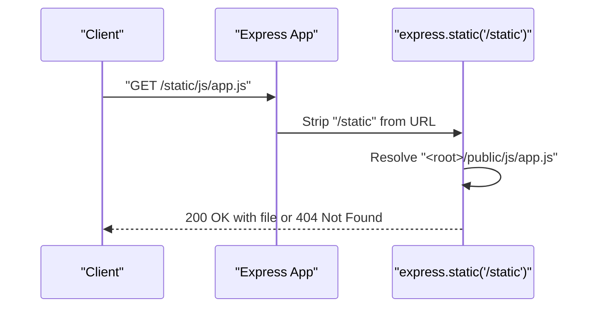
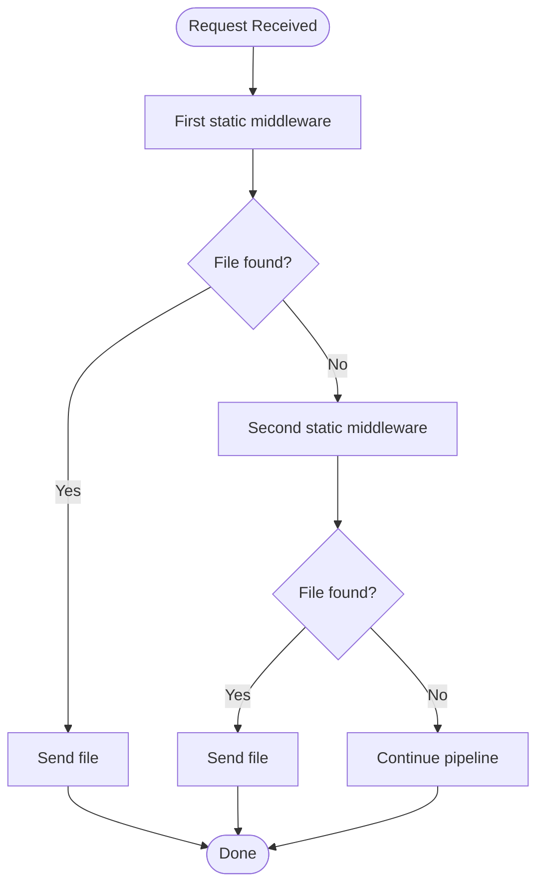
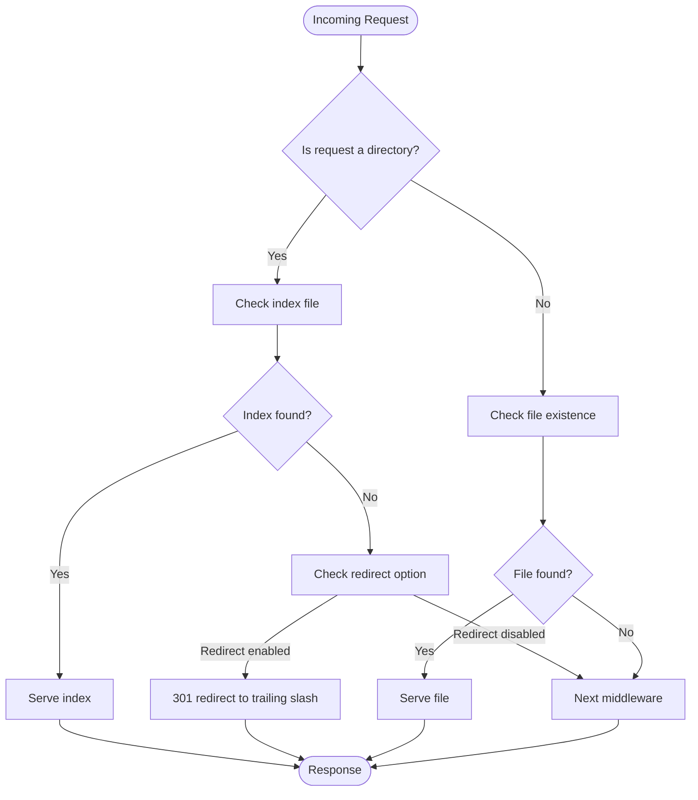
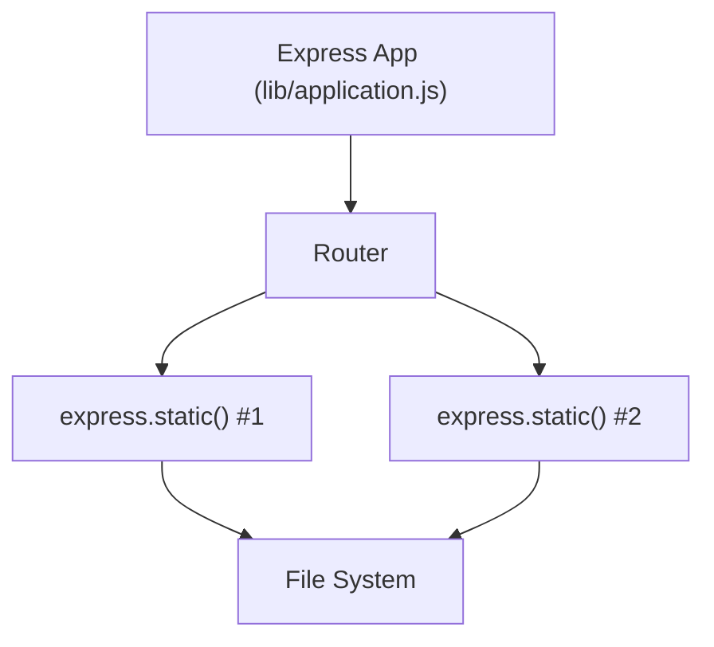

# Static File Configuration

<cite>
**Referenced Files in This Document**
- [examples/static-files/index.js](file://examples/static-files/index.js)
- [examples/static-files/public/css/style.css](file://examples/static-files/public/css/style.css)
- [examples/static-files/public/js/app.js](file://examples/static-files/public/js/app.js)
- [examples/mvc/public/style.css](file://examples/mvc/public/style.css)
- [examples/route-separation/public/style.css](file://examples/route-separation/public/style.css)
- [lib/application.js](file://lib/application.js)
- [test/express.static.js](file://test/express.static.js)
- [test/support/utils.js](file://test/support/utils.js)
</cite>

## Table of Contents
1. [Introduction](#introduction)
2. [Project Structure](#project-structure)
3. [Core Components](#core-components)
4. [Architecture Overview](#architecture-overview)
5. [Detailed Component Analysis](#detailed-component-analysis)
6. [Dependency Analysis](#dependency-analysis)
7. [Performance Considerations](#performance-considerations)
8. [Troubleshooting Guide](#troubleshooting-guide)
9. [Conclusion](#conclusion)

## Introduction
This document explains how to configure Express.js static file serving using the express.static() middleware. It covers the configuration syntax, path resolution, multiple static directories, mount point behavior, directory serving patterns, file resolution order, and how Express handles static file requests. Practical examples demonstrate basic serving, multiple directories, and environment-aware configurations. Guidance is included for integrating static paths with application routing and handling URLs for assets in subdirectories.

## Project Structure
The repository includes a dedicated example for static files and several other examples that demonstrate serving static assets from public directories. These examples illustrate common patterns such as serving from a single directory, mounting static routes under a prefix, and combining multiple static directories.

**Diagram sources**
- [examples/static-files/index.js:1-44](file://examples/static-files/index.js#L1-L44)
- [examples/static-files/public/css/style.css:1-3](file://examples/static-files/public/css/style.css#L1-L3)
- [examples/static-files/public/js/app.js:1-2](file://examples/static-files/public/js/app.js#L1-L2)
- [examples/mvc/public/style.css:1-15](file://examples/mvc/public/style.css#L1-L15)
- [examples/route-separation/public/style.css:1-24](file://examples/route-separation/public/style.css#L1-L24)

**Section sources**
- [examples/static-files/index.js:1-44](file://examples/static-files/index.js#L1-L44)
- [examples/static-files/public/css/style.css:1-3](file://examples/static-files/public/css/style.css#L1-L3)
- [examples/static-files/public/js/app.js:1-2](file://examples/static-files/public/js/app.js#L1-L2)
- [examples/mvc/public/style.css:1-15](file://examples/mvc/public/style.css#L1-L15)
- [examples/route-separation/public/style.css:1-24](file://examples/route-separation/public/style.css#L1-L24)

## Core Components
- express.static(path, options): Middleware that serves static files from a specified directory. It resolves requested paths against the configured root directory and sends matching files as responses.
- app.use(): Registers middleware in the application pipeline. When used with express.static(), it defines the mount path and the root directory for static files.
- Mounting behavior: When a mount path is provided (e.g., '/static'), incoming requests are stripped of that prefix before the static middleware resolves the file path.

Key configuration patterns demonstrated in the example:
- Single directory serving: app.use(express.static(path.join(__dirname, 'public')))
- Mounting under a prefix: app.use('/static', express.static(...))
- Multiple directories: app.use(express.static(...)) followed by another app.use(express.static(...))

**Section sources**
- [examples/static-files/index.js:15-36](file://examples/static-files/index.js#L15-L36)
- [lib/application.js:190-244](file://lib/application.js#L190-L244)

## Architecture Overview
Express routes requests through middleware layers. The static middleware intercepts requests for static assets and serves files from the configured directory. Mount paths modify how the request URL is interpreted before resolving the file.

**Diagram sources**
- [examples/static-files/index.js:22-22](file://examples/static-files/index.js#L22-L22)
- [lib/application.js:190-244](file://lib/application.js#L190-L244)

## Detailed Component Analysis

### Basic Static File Serving
- Purpose: Serve static assets from a single directory.
- Behavior: Requests are resolved directly against the configured root directory.
- Example pattern: app.use(express.static(path.join(__dirname, 'public')))

**Diagram sources**
- [examples/static-files/index.js:22-22](file://examples/static-files/index.js#L22-L22)
- [test/express.static.js:30-47](file://test/express.static.js#L30-L47)

**Section sources**
- [examples/static-files/index.js:22-22](file://examples/static-files/index.js#L22-L22)
- [test/express.static.js:30-47](file://test/express.static.js#L30-L47)

### Mount Point Configuration
- Purpose: Serve static files under a specific URL prefix.
- Behavior: The mount path is stripped from the request URL before resolving the file.
- Example pattern: app.use('/static', express.static(path.join(__dirname, 'public')))

**Diagram sources**
- [examples/static-files/index.js:24-30](file://examples/static-files/index.js#L24-L30)

**Section sources**
- [examples/static-files/index.js:24-30](file://examples/static-files/index.js#L24-L30)

### Multiple Static Directories
- Purpose: Serve assets from multiple directories in a single application.
- Behavior: Later static declarations can override earlier ones for overlapping paths. Order matters.
- Example pattern: app.use(express.static(...)) followed by app.use(express.static(...))

**Diagram sources**
- [examples/static-files/index.js:32-36](file://examples/static-files/index.js#L32-L36)

**Section sources**
- [examples/static-files/index.js:32-36](file://examples/static-files/index.js#L32-L36)

### Directory Serving Patterns and File Resolution Order
- Index files: When requesting a directory, index files are served if configured.
- Hidden files: By default, hidden files are not served unless explicitly allowed.
- Extensions: Optional extension fallbacks can be configured.
- Redirect behavior: Directories without a trailing slash may be redirected to the trailing slash variant.
- Fallthrough: Controls whether non-matching requests continue to subsequent middleware.

**Diagram sources**
- [test/express.static.js:75-81](file://test/express.static.js#L75-L81)
- [test/express.static.js:404-416](file://test/express.static.js#L404-L416)
- [test/express.static.js:468-527](file://test/express.static.js#L468-L527)
- [test/express.static.js:247-402](file://test/express.static.js#L247-L402)

**Section sources**
- [test/express.static.js:75-81](file://test/express.static.js#L75-L81)
- [test/express.static.js:404-416](file://test/express.static.js#L404-L416)
- [test/express.static.js:468-527](file://test/express.static.js#L468-L527)
- [test/express.static.js:247-402](file://test/express.static.js#L247-L402)

### Path Resolution Techniques
- Absolute vs relative roots: Use path.join(__dirname, 'public') to construct a reliable absolute path.
- Environment-specific roots: Choose different directories per environment (e.g., development vs production).
- Subdirectory assets: Place assets in subdirectories (e.g., js/, css/) and request them via URLs that match the directory structure.

Practical references:
- Root construction: [examples/static-files/index.js:22-22](file://examples/static-files/index.js#L22-L22)
- Subdirectory asset example: [examples/static-files/public/js/app.js:1-2](file://examples/static-files/public/js/app.js#L1-L2), [examples/static-files/public/css/style.css:1-3](file://examples/static-files/public/css/style.css#L1-L3)

**Section sources**
- [examples/static-files/index.js:22-22](file://examples/static-files/index.js#L22-L22)
- [examples/static-files/public/js/app.js:1-2](file://examples/static-files/public/js/app.js#L1-L2)
- [examples/static-files/public/css/style.css:1-3](file://examples/static-files/public/css/style.css#L1-L3)

### Integration with Application Routing
- Middleware ordering: Place static middleware before route handlers to avoid masking routes.
- Prefixing: Use mount paths to separate static assets from application routes.
- Overlapping paths: Configure multiple static directories to serve shared assets from a common location.

References:
- Mounting and ordering: [examples/static-files/index.js:24-36](file://examples/static-files/index.js#L24-L36)
- Middleware registration: [lib/application.js:190-244](file://lib/application.js#L190-L244)

**Section sources**
- [examples/static-files/index.js:24-36](file://examples/static-files/index.js#L24-L36)
- [lib/application.js:190-244](file://lib/application.js#L190-L244)

## Dependency Analysis
The static middleware integrates with the Express application through app.use(). The application’s router invokes registered middleware in the order they were added.

**Diagram sources**
- [lib/application.js:190-244](file://lib/application.js#L190-L244)
- [examples/static-files/index.js:22-36](file://examples/static-files/index.js#L22-L36)

**Section sources**
- [lib/application.js:190-244](file://lib/application.js#L190-L244)
- [examples/static-files/index.js:22-36](file://examples/static-files/index.js#L22-L36)

## Performance Considerations
- Cache headers: Configure maxAge and immutable to improve caching behavior for static assets.
- Range requests: Enable acceptRanges for efficient partial content delivery.
- Conditional requests: Leverage ETags and Last-Modified for efficient revalidation.
- Redirects: Disable redirects when unnecessary to reduce overhead.

References:
- Cache and ranges: [test/express.static.js:150-186](file://test/express.static.js#L150-L186), [test/express.static.js:418-430](file://test/express.static.js#L418-L430)
- Conditional and preconditions: [test/express.static.js:103-122](file://test/express.static.js#L103-L122)
- Redirect behavior: [test/express.static.js:468-527](file://test/express.static.js#L468-L527)

**Section sources**
- [test/express.static.js:150-186](file://test/express.static.js#L150-L186)
- [test/express.static.js:418-430](file://test/express.static.js#L418-L430)
- [test/express.static.js:103-122](file://test/express.static.js#L103-L122)
- [test/express.static.js:468-527](file://test/express.static.js#L468-L527)

## Troubleshooting Guide
Common issues and resolutions:
- 404 Not Found: Occurs when the requested file does not exist or falls through to subsequent middleware. Verify the file path and mount path.
- 403 Forbidden: Typically occurs when attempting to traverse outside the configured root. Ensure paths remain within the static root.
- 416 Range Not Satisfiable: Returned when the requested range exceeds file boundaries.
- Hidden files not served: Configure dotfiles policy to allow serving hidden files.
- Redirect loops: Disable redirect or ensure trailing slash semantics align with expectations.

References:
- 404 and fallthrough: [test/express.static.js:247-326](file://test/express.static.js#L247-L326)
- 403 Forbidden traversal: [test/express.static.js:346-364](file://test/express.static.js#L346-L364)
- Range errors: [test/express.static.js:665-680](file://test/express.static.js#L665-L680)
- Hidden files: [test/express.static.js:404-416](file://test/express.static.js#L404-L416)
- Redirect behavior: [test/express.static.js:468-527](file://test/express.static.js#L468-L527)

**Section sources**
- [test/express.static.js:247-326](file://test/express.static.js#L247-L326)
- [test/express.static.js:346-364](file://test/express.static.js#L346-L364)
- [test/express.static.js:665-680](file://test/express.static.js#L665-L680)
- [test/express.static.js:404-416](file://test/express.static.js#L404-L416)
- [test/express.static.js:468-527](file://test/express.static.js#L468-L527)

## Conclusion
Express static file serving is straightforward and powerful. Use express.static() with a well-defined root path, leverage mount paths for clean separation, and configure options to optimize caching and redirects. Order multiple static directories carefully to control resolution precedence, and validate behavior with the provided test patterns.