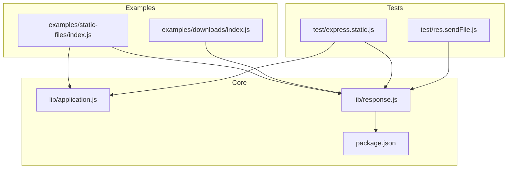
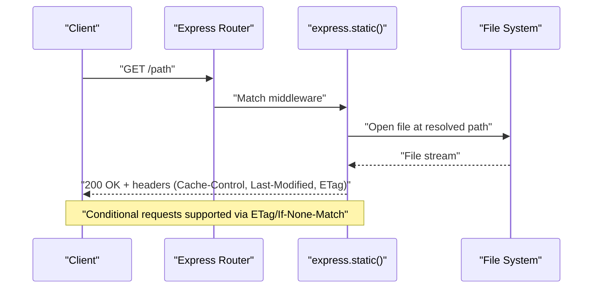
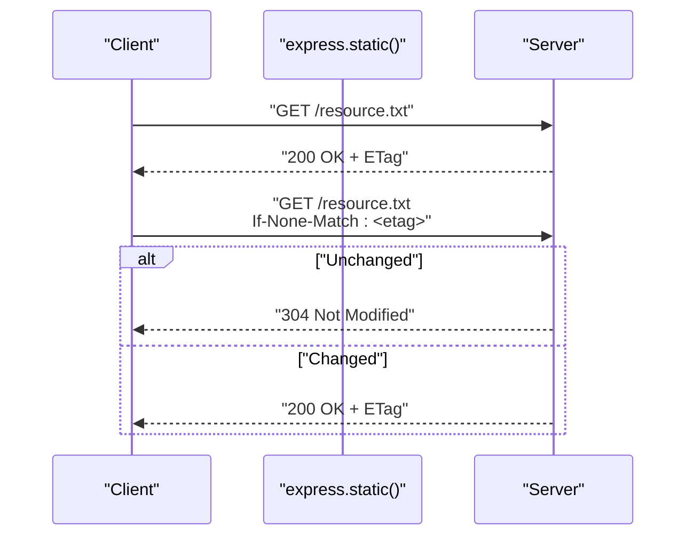
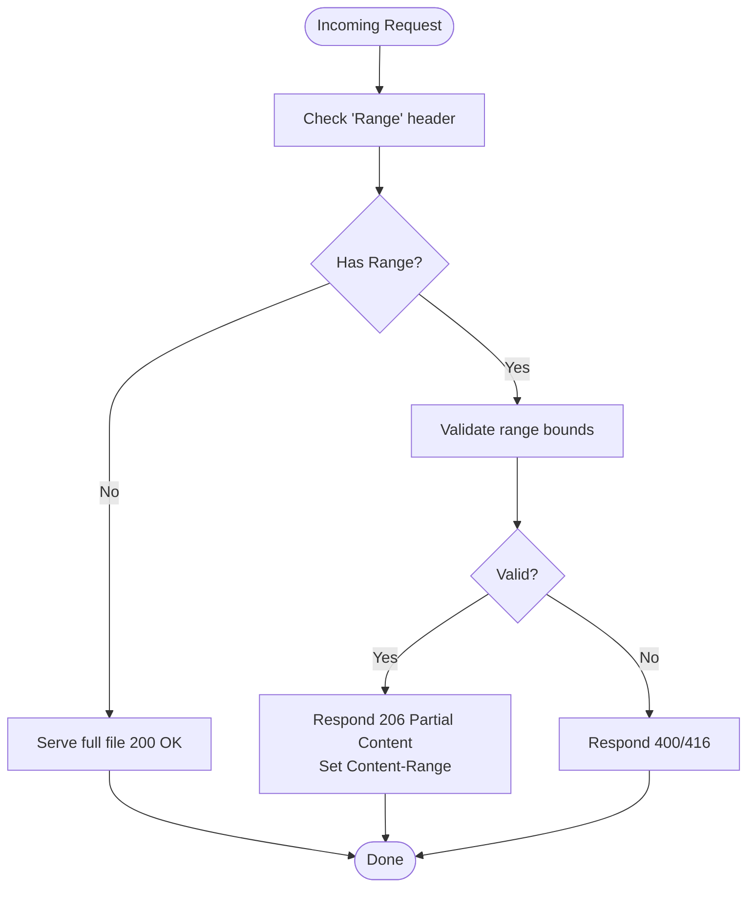
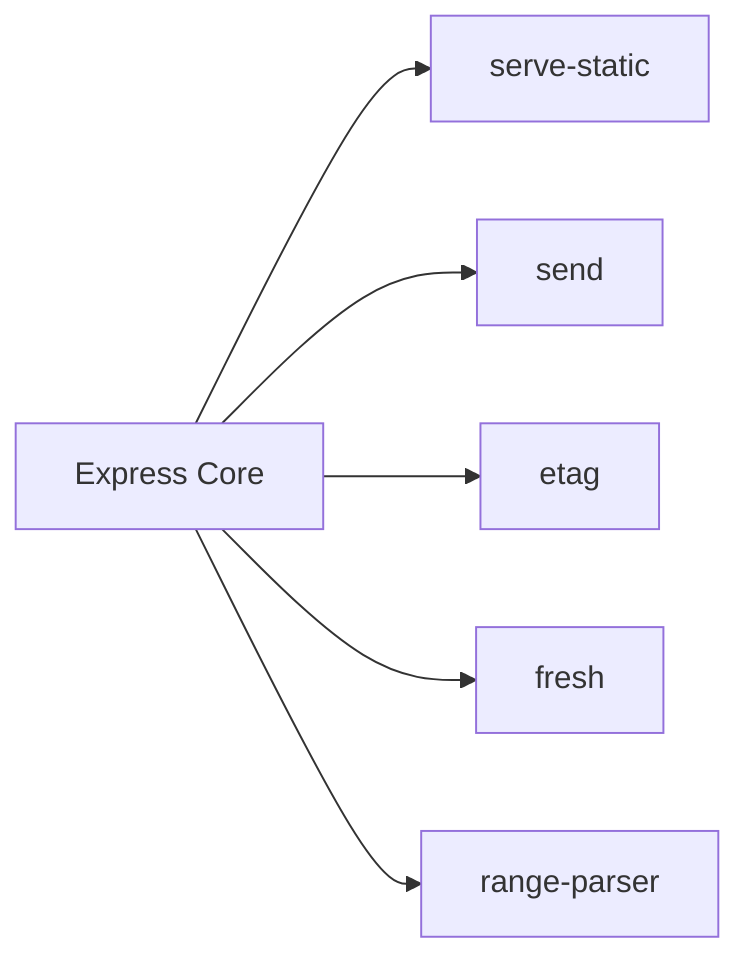

# Static File Serving

<cite>
**Referenced Files in This Document**
- [examples/static-files/index.js](file://examples/static-files/index.js)
- [examples/static-files/public/css/style.css](file://examples/static-files/public/css/style.css)
- [examples/downloads/index.js](file://examples/downloads/index.js)
- [lib/application.js](file://lib/application.js)
- [lib/response.js](file://lib/response.js)
- [package.json](file://package.json)
- [test/express.static.js](file://test/express.static.js)
- [test/res.sendFile.js](file://test/res.sendFile.js)
- [Readme.md](file://Readme.md)
</cite>

## Table of Contents
1. [Introduction](#introduction)
2. [Project Structure](#project-structure)
3. [Core Components](#core-components)
4. [Architecture Overview](#architecture-overview)
5. [Detailed Component Analysis](#detailed-component-analysis)
6. [Dependency Analysis](#dependency-analysis)
7. [Performance Considerations](#performance-considerations)
8. [Troubleshooting Guide](#troubleshooting-guide)
9. [Conclusion](#conclusion)
10. [Appendices](#appendices)

## Introduction
This document explains how Express.js serves static files efficiently and securely, focusing on configuration, caching, conditional requests, range requests for partial content, and production deployment considerations. It synthesizes behavior from the Express core, example applications, and tests to provide a practical guide for developers.

## Project Structure
The repository includes:
- Example applications demonstrating static file serving and downloads
- Core Express modules that implement middleware and response helpers
- Test suites that validate caching, redirects, range requests, and security

**Diagram sources**
- [examples/static-files/index.js](file://examples/static-files/index.js)
- [examples/downloads/index.js](file://examples/downloads/index.js)
- [lib/application.js](file://lib/application.js)
- [lib/response.js](file://lib/response.js)
- [package.json](file://package.json)
- [test/express.static.js](file://test/express.static.js)
- [test/res.sendFile.js](file://test/res.sendFile.js)

**Section sources**
- [examples/static-files/index.js](file://examples/static-files/index.js)
- [examples/downloads/index.js](file://examples/downloads/index.js)
- [lib/application.js](file://lib/application.js)
- [lib/response.js](file://lib/response.js)
- [package.json](file://package.json)
- [test/express.static.js](file://test/express.static.js)
- [test/res.sendFile.js](file://test/res.sendFile.js)

## Core Components
- Static file serving middleware: configured via app.use(express.static(root[, options]))
- Response helpers: res.sendFile() and res.download() delegate to the same underlying file transfer mechanism
- Caching controls: Cache-Control, immutable directive, and Last-Modified
- Conditional requests: ETag and If-None-Match handling
- Range requests: Accept-Ranges and Content-Range for partial content
- Security: Directory traversal protection, dotfiles policy, and redirect behavior

Key behaviors validated by tests:
- Basic file serving, nested paths, and index.html support
- Content-Type detection and Last-Modified header
- Default Cache-Control: public, max-age=0
- Conditional request handling via ETag
- Redirect behavior for directory paths and encoding
- Range request support and Content-Range responses
- Hidden file handling via dotfiles policy
- Fallthrough and redirect options
- Header customization hook

**Section sources**
- [test/express.static.js](file://test/express.static.js)
- [lib/response.js](file://lib/response.js)
- [test/res.sendFile.js](file://test/res.sendFile.js)

## Architecture Overview
Express routes requests through a router to middleware. Static file serving is implemented as middleware that checks the filesystem for a matching path and streams the file to the client. Response helpers like res.sendFile() reuse the same streaming logic and honor application-level settings such as ETag generation.

**Diagram sources**
- [lib/application.js](file://lib/application.js)
- [test/express.static.js](file://test/express.static.js)

## Detailed Component Analysis

### Static File Serving Configuration
- Path resolution: The middleware resolves the requested path against the configured root directory. Requests are matched to files under the provided root.
- Mounting and prefixes: You can mount static serving under a path prefix so that GET /static/js/app.js maps to ./public/js/app.js.
- Multiple roots: Register multiple static middleware instances to serve from different directories, enabling shorter URLs for assets in subdirectories.

Practical example references:
- Mounting under a prefix and serving from multiple directories
- Logging middleware combined with static serving

**Section sources**
- [examples/static-files/index.js](file://examples/static-files/index.js)
- [test/express.static.js](file://test/express.static.js)

### Caching Strategies
- Cache-Control: Defaults to public, max-age=0 unless disabled or overridden. Supports string durations and Infinity with sensible caps.
- Immutable directive: When enabled, adds immutable to Cache-Control for long-lived static assets.
- Last-Modified: Included by default; can be disabled.
- ETag: Generated by the application’s ETag setting and propagated to the file transfer logic.

Validation references:
- Cache-Control presence and values
- Immutable directive behavior
- Last-Modified header presence
- Conditional request handling via ETag

**Section sources**
- [test/express.static.js](file://test/express.static.js)
- [test/res.sendFile.js](file://test/res.sendFile.js)
- [lib/application.js](file://lib/application.js)

### Conditional Requests and ETags
- If-None-Match: When the client supplies an ETag, the server responds with 304 Not Modified if the file has not changed.
- If-Match: Precondition failures return 412 Precondition Failed.
- Freshness: Express uses the fresh module to evaluate conditional headers.

**Diagram sources**
- [test/express.static.js](file://test/express.static.js)

**Section sources**
- [test/express.static.js](file://test/express.static.js)

### Range Requests and Partial Content
- Accept-Ranges: Indicates support for byte-range requests.
- Range header: When present, returns 206 Partial Content with Content-Range and adjusted Content-Length.
- Support for suffix and prefix forms (e.g., -n and n-).

**Diagram sources**
- [test/express.static.js](file://test/express.static.js)

**Section sources**
- [test/express.static.js](file://test/express.static.js)

### Security Considerations
- Directory traversal protection: Requests attempting to traverse outside the root return 403 Forbidden when fallthrough is disabled.
- Dotfiles policy: Hidden files are not served by default; can be allowed via configuration.
- Redirect behavior: Directory requests are redirected to a trailing slash with proper encoding; redirect can be disabled.
- Non-GET methods: Static middleware skips non-safe methods, allowing downstream routes to handle them.

**Section sources**
- [test/express.static.js](file://test/express.static.js)

### Custom Middleware for File Delivery
While express.static() is the recommended approach, you can implement custom middleware to:
- Enforce access control per request
- Apply additional headers or transformations
- Integrate with external storage or CDNs

Example pattern references:
- Using res.download() with a root directory for controlled downloads
- Combining middleware to intercept and validate file access

**Section sources**
- [examples/downloads/index.js](file://examples/downloads/index.js)
- [lib/response.js](file://lib/response.js)

### Practical Examples
- Static serving with logging and multiple roots
- Serving CSS and JS assets from dedicated folders
- Download endpoint with fallback handling

**Section sources**
- [examples/static-files/index.js](file://examples/static-files/index.js)
- [examples/static-files/public/css/style.css](file://examples/static-files/public/css/style.css)
- [examples/downloads/index.js](file://examples/downloads/index.js)

## Dependency Analysis
Express integrates static file serving through dedicated packages:
- serve-static: Implements express.static()
- send: Provides low-level file streaming, headers, and range handling
- etag: Generates entity tags for caching
- fresh: Evaluates cache freshness for conditional requests
- range-parser: Parses Range headers for partial content

**Diagram sources**
- [package.json](file://package.json)

**Section sources**
- [package.json](file://package.json)

## Performance Considerations
- Prefer serve-static with appropriate cacheControl and maxAge for long-lived assets
- Use immutable directive for assets with stable content to maximize browser cache reuse
- Enable Accept-Ranges for large files to support resumable downloads and reduce bandwidth
- Place static assets behind a CDN or reverse proxy to offload origin traffic
- Use compression only when beneficial; binary assets often compress poorly and increase CPU usage

[No sources needed since this section provides general guidance]

## Troubleshooting Guide
Common issues and resolutions:
- 404 Not Found: Verify the file exists under the configured root and path resolution matches expectations
- 403 Forbidden: Occurs when attempting directory traversal outside the root; confirm fallthrough and redirect settings
- 304 Not Modified: Expected for unchanged resources; ensure clients send If-None-Match
- 412 Precondition Failed: If-Match mismatch; validate client-side preconditions
- 400 Bad Request: Malformed URLs or excessive path lengths; sanitize inputs and enforce limits
- Range errors: Ensure the Range header is valid and within file bounds

**Section sources**
- [test/express.static.js](file://test/express.static.js)

## Conclusion
Express provides a robust, secure, and efficient foundation for static file serving. By configuring caching, leveraging conditional requests, supporting range requests, and applying security policies, you can deliver assets reliably at scale. For production, combine Express static serving with CDN and reverse proxy layers to optimize performance and global availability.

[No sources needed since this section summarizes without analyzing specific files]

## Appendices

### API and Options Summary
- express.static(root[, options])
  - cacheControl: boolean or string duration
  - maxAge: string duration or ms
  - immutable: boolean
  - redirect: boolean
  - dotfiles: "allow", "deny", "ignore"
  - etag: inherited from app setting
  - extensions: string, array, or false
  - fallthrough: boolean
  - setHeaders: function(res)
- res.sendFile(path, options[, callback])
  - maxAge, root, headers, dotfiles, etag inherited from app setting

**Section sources**
- [test/express.static.js](file://test/express.static.js)
- [lib/response.js](file://lib/response.js)
- [test/res.sendFile.js](file://test/res.sendFile.js)