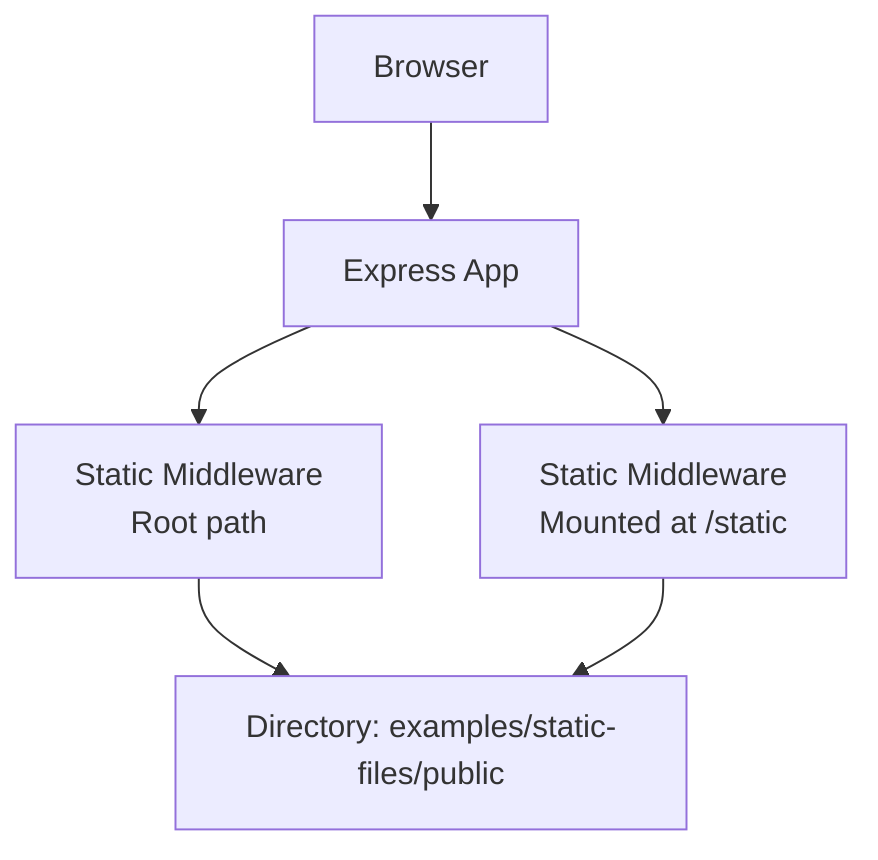
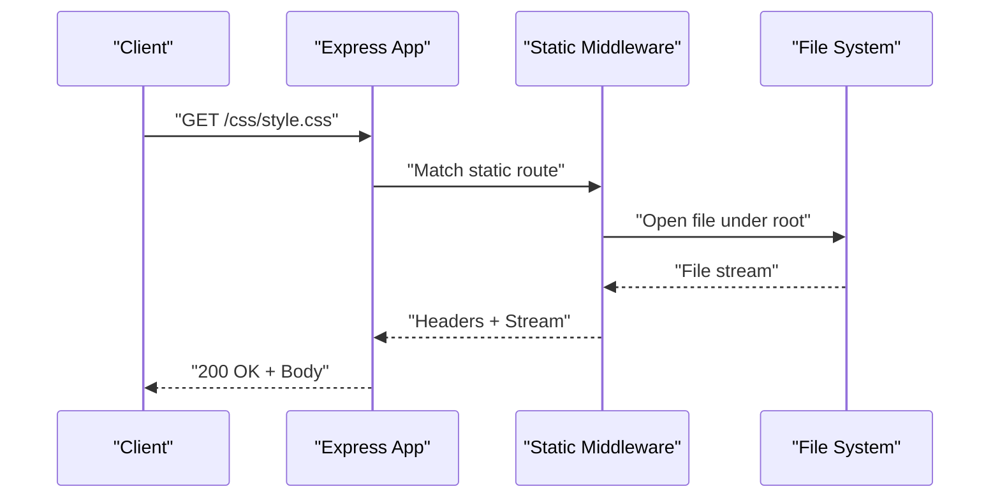
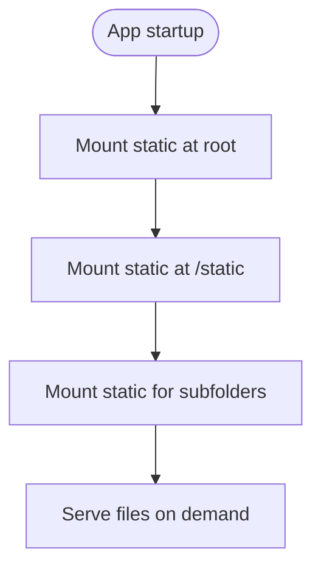
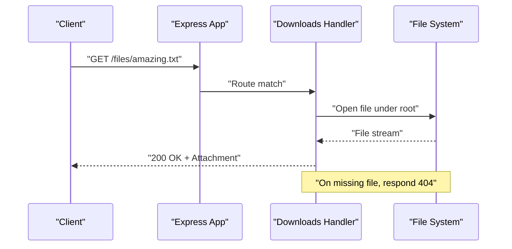
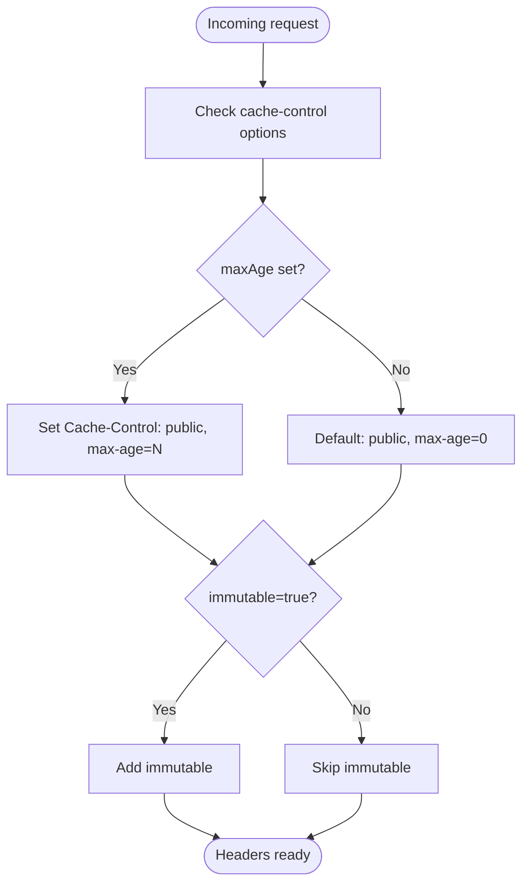
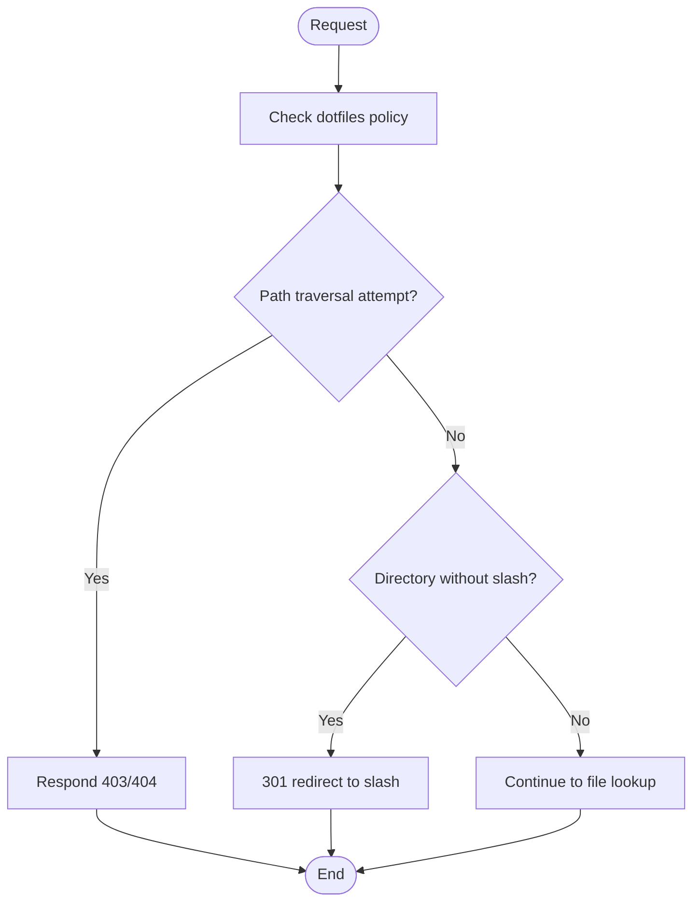
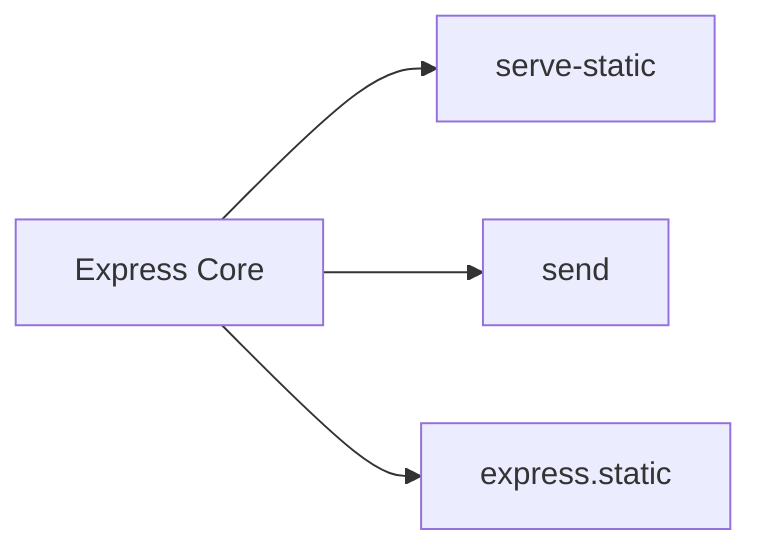

# Static Files and Assets

<cite>
**Referenced Files in This Document**
- [express.js](file://lib/express.js)
- [index.js](file://examples/static-files/index.js)
- [style.css](file://examples/static-files/public/css/style.css)
- [index.js](file://examples/downloads/index.js)
- [index.js](file://examples/mvc/index.js)
- [style.css](file://examples/mvc/public/style.css)
- [index.js](file://examples/route-separation/index.js)
- [style.css](file://examples/route-separation/public/style.css)
- [index.js](file://examples/ejs/public/stylesheets/style.css)
- [express.static.js](file://test/express.static.js)
- [res.sendFile.js](file://test/res.sendFile.js)
- [response.js](file://lib/response.js)
- [package.json](file://package.json)
</cite>

## Table of Contents
1. [Introduction](#introduction)
2. [Project Structure](#project-structure)
3. [Core Components](#core-components)
4. [Architecture Overview](#architecture-overview)
5. [Detailed Component Analysis](#detailed-component-analysis)
6. [Dependency Analysis](#dependency-analysis)
7. [Performance Considerations](#performance-considerations)
8. [Troubleshooting Guide](#troubleshooting-guide)
9. [Conclusion](#conclusion)
10. [Appendices](#appendices)

## Introduction
This document explains how Express.js serves static files and manages assets, focusing on configuration, directory layout, security, optimization, and production readiness. It synthesizes patterns from the repository’s examples and tests to provide practical guidance for serving CSS, JS, images, and downloadable content while maintaining robustness and performance.

## Project Structure
Express applications commonly serve static assets from a dedicated directory (for example, public) and mount the static middleware early in the pipeline. The repository demonstrates:
- A minimal static-file server example that mounts static middleware at the root and under a prefix.
- MVC and route-separation examples that mount static middleware alongside view engines and routing.
- A downloads example that handles file downloads with explicit error handling.
- Extensive unit tests that define behavior for caching, redirects, range requests, and security.

**Diagram sources**
- [index.js:22-36](file://examples/static-files/index.js#L22-L36)
- [express.js](file://lib/express.js#L79)

**Section sources**
- [index.js:12-38](file://examples/static-files/index.js#L12-L38)
- [express.js](file://lib/express.js#L79)

## Core Components
- Static middleware: Provided by serve-static and exposed via express.static. It maps incoming requests to files under a configured root directory, supports redirects for directories, conditional requests, range requests, and various options for caching and headers.
- Response helpers: res.sendFile and related options enable dynamic file serving with fine-grained control over caching, headers, and content-type.
- Tests: Comprehensive coverage of static behavior, including caching headers, redirects, range requests, hidden files, and mount-point semantics.

Key behaviors validated by tests:
- Caching defaults and overrides via maxAge and immutable.
- Conditional requests with ETag and Last-Modified.
- Redirects for directories and proper encoding.
- Range request support and partial content responses.
- Security posture against traversal and unauthorized access.

**Section sources**
- [express.static.js:16-135](file://test/express.static.js#L16-L135)
- [express.static.js:188-245](file://test/express.static.js#L188-L245)
- [express.static.js:452-466](file://test/express.static.js#L452-L466)
- [express.static.js:468-521](file://test/express.static.js#L468-L521)
- [express.static.js:593-690](file://test/express.static.js#L593-L690)
- [res.sendFile.js:116-131](file://test/res.sendFile.js#L116-L131)
- [res.sendFile.js:496-551](file://test/res.sendFile.js#L496-L551)
- [response.js:337-382](file://lib/response.js#L337-L382)

## Architecture Overview
Express integrates static file serving through middleware. The typical flow:
- Request arrives at the Express app.
- Static middleware checks if a file exists under the configured root(s).
- If found, headers (including cache-related ones) are set and the file is streamed.
- If not found, control falls through to subsequent middleware or triggers a 404.

**Diagram sources**
- [index.js:22-36](file://examples/static-files/index.js#L22-L36)
- [express.static.js:30-47](file://test/express.static.js#L30-L47)

## Detailed Component Analysis

### Static Serving Setup Patterns
- Root-level static serving: Mount a single static middleware pointing to the public directory.
- Prefixed static serving: Mount static middleware under a path (for example, /static) to avoid conflicts with dynamic routes.
- Multiple roots: Register multiple static middlewares to serve from different directories.

**Diagram sources**
- [index.js:22-36](file://examples/static-files/index.js#L22-L36)

**Section sources**
- [index.js:22-36](file://examples/static-files/index.js#L22-L36)

### Directory Organization Examples
- examples/static-files: Demonstrates serving CSS and JS from a public directory.
- examples/mvc: Serves stylesheets from public/style.css.
- examples/route-separation: Serves stylesheets from public/style.css.
- examples/ejs: Serves CSS from public/stylesheets/style.css.

These examples illustrate a consistent pattern of placing static assets under a public folder and mounting the static middleware to serve them.

**Section sources**
- [style.css:1-3](file://examples/static-files/public/css/style.css#L1-L3)
- [index.js:36-37](file://examples/mvc/index.js#L36-L37)
- [style.css:1-15](file://examples/mvc/public/style.css#L1-L15)
- [index.js](file://examples/route-separation/index.js#L32)
- [style.css:1-24](file://examples/route-separation/public/style.css#L1-L24)
- [style.css:1-5](file://examples/ejs/public/stylesheets/style.css#L1-L5)

### Asset Delivery Patterns
- Static middleware: Best for public assets delivered as-is.
- Dynamic file serving: Use res.sendFile for controlled delivery with headers, caching, and content-type overrides.
- Downloads: Use res.download for controlled downloads with explicit error handling for missing files.

**Diagram sources**
- [index.js:24-34](file://examples/downloads/index.js#L24-L34)

**Section sources**
- [index.js:24-34](file://examples/downloads/index.js#L24-L34)

### Caching Strategies and Headers
- Default cache-control: Public with max-age=0 when not overridden.
- maxAge: Accepts numeric ms and string durations (for example, days).
- immutable: Adds immutable directive to cache-control.
- lastModified: Controls emission of Last-Modified header.
- setHeaders: Allows injecting custom headers per request.

**Diagram sources**
- [express.static.js:452-466](file://test/express.static.js#L452-L466)
- [express.static.js:418-430](file://test/express.static.js#L418-L430)
- [express.static.js:432-450](file://test/express.static.js#L432-L450)
- [res.sendFile.js:586-622](file://test/res.sendFile.js#L586-L622)

**Section sources**
- [express.static.js:452-466](file://test/express.static.js#L452-L466)
- [express.static.js:418-430](file://test/express.static.js#L418-L430)
- [express.static.js:432-450](file://test/express.static.js#L432-L450)
- [res.sendFile.js:586-622](file://test/res.sendFile.js#L586-L622)

### Range Requests and Partial Content
Static middleware supports HTTP range requests for efficient large-file transfers:
- Accept-Ranges header included when enabled.
- Range parsing and Content-Range responses.
- 206 Partial Content for valid ranges.
- 416 when ranges exceed file length.

**Diagram sources**
- [express.static.js:593-690](file://test/express.static.js#L593-L690)

**Section sources**
- [express.static.js:593-690](file://test/express.static.js#L593-L690)

### Security Considerations
- Hidden files: By default, hidden files are not served; can be configured via dotfiles policy.
- Traversal protection: Requests attempting to traverse outside the root are rejected with appropriate status codes.
- Redirects: Automatic redirect for directories; configurable via redirect option.
- Content-Type: Defaults are inferred from file extensions; can be overridden.
- CSP: Redirects include a default CSP header for safety.

**Diagram sources**
- [express.static.js:404-416](file://test/express.static.js#L404-L416)
- [express.static.js:575-591](file://test/express.static.js#L575-L591)
- [express.static.js:468-521](file://test/express.static.js#L468-L521)

**Section sources**
- [express.static.js:404-416](file://test/express.static.js#L404-L416)
- [express.static.js:575-591](file://test/express.static.js#L575-L591)
- [express.static.js:468-521](file://test/express.static.js#L468-L521)

### Practical Examples
- Minimal static server: Mount static middleware at root and under a prefix; serve files from public.
- MVC app: Serve public assets alongside views and controllers.
- Route separation: Serve public assets with modularized routes.
- Downloads: Implement a route that streams files with error handling for missing files.

**Section sources**
- [index.js:22-36](file://examples/static-files/index.js#L22-L36)
- [index.js:36-37](file://examples/mvc/index.js#L36-L37)
- [index.js](file://examples/route-separation/index.js#L32)
- [index.js:24-34](file://examples/downloads/index.js#L24-L34)

## Dependency Analysis
Express exposes static middleware via serve-static. The dependency graph highlights how the framework integrates static serving into the request lifecycle.

**Diagram sources**
- [express.js](file://lib/express.js#L79)
- [package.json:58-59](file://package.json#L58-L59)

**Section sources**
- [express.js](file://lib/express.js#L79)
- [package.json:58-59](file://package.json#L58-L59)

## Performance Considerations
- Prefer static middleware for public assets to leverage built-in optimizations (ETag, conditional requests, range support).
- Tune cache-control with maxAge and immutable for long-lived assets.
- Use range requests for large files to improve perceived performance and reduce bandwidth.
- Minimize directory traversal and avoid exposing sensitive files by relying on default hidden-file policies.
- Consider offloading static assets to a CDN in production for global distribution and reduced origin load.

[No sources needed since this section provides general guidance]

## Troubleshooting Guide
Common issues and resolutions:
- 404 Not Found: Verify the file exists under the configured root and path. Confirm mount points and prefixes.
- 403 Forbidden: Indicates traversal attempts or restricted access; check root boundaries and dotfiles policy.
- 301 Redirect: Occurs when requesting a directory without a trailing slash; adjust client URLs or rely on automatic redirect.
- Range errors: 416 indicates out-of-range requests; ensure clients send valid ranges.
- Missing headers: Confirm cache-control and lastModified options; ensure setHeaders callbacks are applied only on successful sends.

**Section sources**
- [express.static.js:247-401](file://test/express.static.js#L247-L401)
- [express.static.js:593-690](file://test/express.static.js#L593-L690)
- [res.sendFile.js:116-131](file://test/res.sendFile.js#L116-L131)

## Conclusion
Express provides a robust, tested foundation for serving static files and managing assets. By organizing assets under a public directory, mounting static middleware early, leveraging caching and range support, and applying security controls, applications can deliver assets efficiently and safely. For production, pair Express static serving with CDN offload and compression to maximize performance and scalability.

[No sources needed since this section summarizes without analyzing specific files]

## Appendices

### Appendix A: Example Directory Layouts
- examples/static-files/public: CSS and JS assets.
- examples/mvc/public: Stylesheets for MVC example.
- examples/route-separation/public: Stylesheets for route-separated example.
- examples/ejs/public/stylesheets: Stylesheets for EJS example.

**Section sources**
- [style.css:1-3](file://examples/static-files/public/css/style.css#L1-L3)
- [style.css:1-15](file://examples/mvc/public/style.css#L1-L15)
- [style.css:1-24](file://examples/route-separation/public/style.css#L1-L24)
- [style.css:1-5](file://examples/ejs/public/stylesheets/style.css#L1-L5)