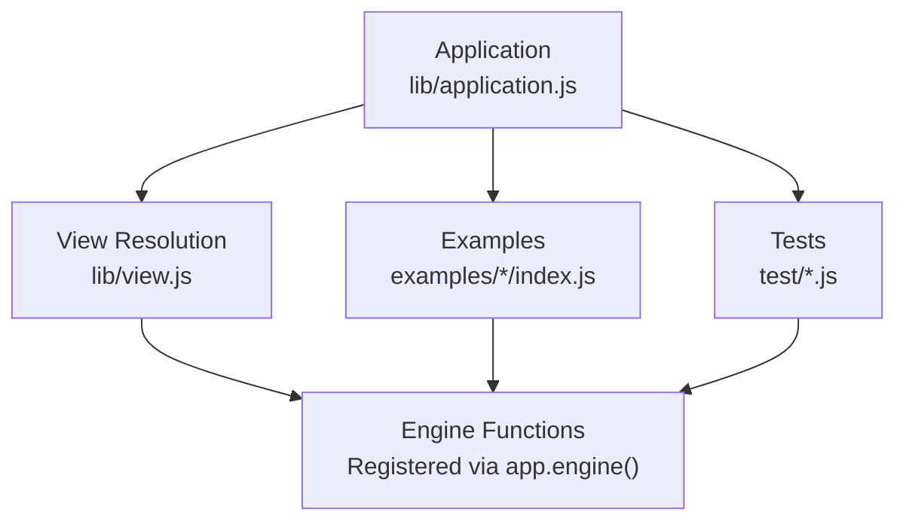
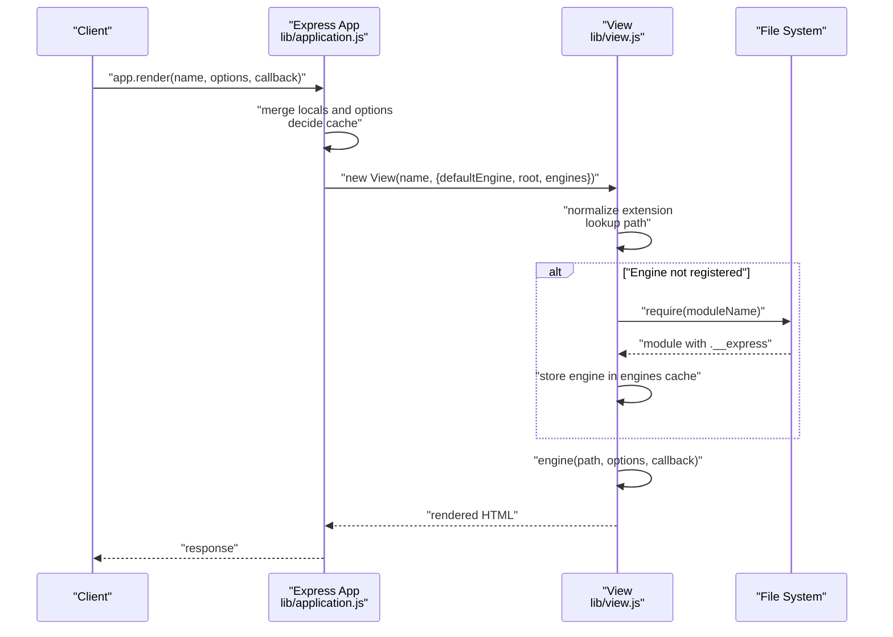
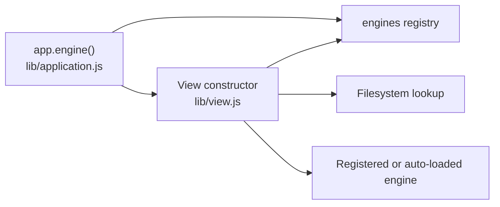

# Engine Registration

<cite>
**Referenced Files in This Document**
- [lib/application.js](file://lib/application.js)
- [lib/view.js](file://lib/view.js)
- [examples/ejs/index.js](file://examples/ejs/index.js)
- [examples/markdown/index.js](file://examples/markdown/index.js)
- [examples/mvc/controllers/user/index.js](file://examples/mvc/controllers/user/index.js)
- [examples/mvc/controllers/user/views/list.hbs](file://examples/mvc/controllers/user/views/list.hbs)
- [examples/mvc/controllers/user/views/edit.hbs](file://examples/mvc/controllers/user/views/edit.hbs)
- [examples/error-pages/index.js](file://examples/error-pages/index.js)
- [test/app.engine.js](file://test/app.engine.js)
- [test/app.render.js](file://test/app.render.js)
- [test/res.render.js](file://test/res.render.js)
</cite>

## Table of Contents
1. [Introduction](#introduction)
2. [Project Structure](#project-structure)
3. [Core Components](#core-components)
4. [Architecture Overview](#architecture-overview)
5. [Detailed Component Analysis](#detailed-component-analysis)
6. [Dependency Analysis](#dependency-analysis)
7. [Performance Considerations](#performance-considerations)
8. [Troubleshooting Guide](#troubleshooting-guide)
9. [Conclusion](#conclusion)

## Introduction
This document explains how Express registers and uses template engines via the app.engine() method, how engines are resolved and cached, and how to integrate built-in and third-party engines. It covers extension mapping, engine function signatures, caching behavior, and practical examples from the repository for EJS, Markdown, and Handlebars. It also documents engine loading order, conflict resolution, and debugging techniques for engine registration issues.

## Project Structure
The engine registration mechanism spans three primary areas:
- Application-level engine registry and render orchestration
- View resolution and engine selection
- Examples and tests demonstrating registration patterns

**Diagram sources**
- [lib/application.js:294-308](file://lib/application.js#L294-L308)
- [lib/view.js:52-95](file://lib/view.js#L52-L95)
- [examples/ejs/index.js:23](file://examples/ejs/index.js#L23)
- [examples/markdown/index.js:17-25](file://examples/markdown/index.js#L17-L25)
- [test/app.engine.js:22](file://test/app.engine.js#L22)

**Section sources**
- [lib/application.js:294-308](file://lib/application.js#L294-L308)
- [lib/view.js:52-95](file://lib/view.js#L52-L95)

## Core Components
- app.engine(ext, fn): Registers a template engine function for a given file extension. The extension may include a leading dot or not. The function must be synchronous or call a callback with (err, html) semantics.
- View class: Resolves the view path, selects the appropriate engine, and invokes it with (path, options, callback).
- app.render(name, options, callback): Orchestrates view caching, merges locals, and delegates rendering to the View instance.

Key behaviors:
- Extension normalization: Leading dot is ensured when registering engines.
- Default engine fallback: If no extension is provided, the default engine is appended.
- Automatic engine loading: If an engine is not explicitly registered for an extension, Express attempts to require a module named after the extension and use its .__express method.
- Caching: Both view instances and rendered content can be cached depending on settings.

**Section sources**
- [lib/application.js:294-308](file://lib/application.js#L294-L308)
- [lib/application.js:522-575](file://lib/application.js#L522-L575)
- [lib/view.js:52-95](file://lib/view.js#L52-L95)
- [lib/view.js:133-159](file://lib/view.js#L133-L159)

## Architecture Overview
The engine registration and rendering flow:

**Diagram sources**
- [lib/application.js:522-575](file://lib/application.js#L522-L575)
- [lib/view.js:52-95](file://lib/view.js#L52-L95)
- [lib/view.js:133-159](file://lib/view.js#L133-L159)

## Detailed Component Analysis

### app.engine() Method
Purpose:
- Map a file extension to a rendering function.
- Support both explicit extensions (with or without leading dot) and default engine behavior.

Requirements:
- The function must accept (path, options, callback) and call the callback with (err, html).
- If omitted, Express will attempt to require a module by extension and use its .__express method.

Behavior highlights:
- Normalizes extension to include a leading dot.
- Stores the function in app.engines for reuse.
- Throws if the second argument is not a function.

Integration patterns:
- Built-in engines: EJS exposes both ejs.__express and ejs.renderFile; either can be used.
- Third-party engines: Provide a compatible function or use a compatibility layer.

Practical examples:
- EJS mapped to .html extension and set as default engine.
- Custom Markdown engine registered with a function that reads the file, converts Markdown to HTML, interpolates options, and calls the callback.

**Section sources**
- [lib/application.js:260-292](file://lib/application.js#L260-L292)
- [lib/application.js:294-308](file://lib/application.js#L294-L308)
- [examples/ejs/index.js:23](file://examples/ejs/index.js#L23)
- [examples/markdown/index.js:17-25](file://examples/markdown/index.js#L17-L25)
- [test/app.engine.js:22](file://test/app.engine.js#L22)

### View Resolution and Engine Selection
Responsibilities:
- Determine the file extension and default engine.
- If no extension is present, append the default engine extension.
- If an engine is not yet registered for the extension, require the module and use its .__express method.
- Locate the view file in configured views directories, including index fallback.

Rendering:
- Calls the selected engine with (path, options, callback).
- Ensures asynchronous callback invocation even if the engine appears synchronous.

Caching:
- View instances can be cached based on the "view cache" setting.
- The engines registry itself acts as a per-app cache for engine functions.

**Section sources**
- [lib/view.js:52-95](file://lib/view.js#L52-L95)
- [lib/view.js:133-159](file://lib/view.js#L133-L159)

### Built-in Engine Support and Third-Party Integration
Built-in pattern:
- Engines that export a .__express method can be registered directly by extension.
- If no extension is provided, Express tries to require a module by extension and use its .__express.

Third-party engines:
- Provide a function with the expected signature (path, options, callback).
- Alternatively, use a compatibility layer to normalize signatures.

Examples in repository:
- EJS: Registered to .html and used as default engine in the EJS example.
- Markdown: Custom engine registered with a function that reads, parses, and interpolates.
- Handlebars: Demonstrated via controller-level engine assignment and corresponding .hbs views.

**Section sources**
- [lib/application.js:260-292](file://lib/application.js#L260-L292)
- [examples/ejs/index.js:23](file://examples/ejs/index.js#L23)
- [examples/markdown/index.js:17-25](file://examples/markdown/index.js#L17-L25)
- [examples/mvc/controllers/user/index.js:9](file://examples/mvc/controllers/user/index.js#L9)
- [examples/mvc/controllers/user/views/list.hbs:1-19](file://examples/mvc/controllers/user/views/list.hbs#L1-L19)
- [examples/mvc/controllers/user/views/edit.hbs:1-28](file://examples/mvc/controllers/user/views/edit.hbs#L1-L28)

### Engine Function Signatures, Parameters, and Callback Patterns
Signature:
- (path, options, callback)
- callback(err, html)

Behavior:
- Engines must call the callback once with either an error or the rendered HTML.
- The callback is guaranteed to be asynchronous by the View layer.

Validation:
- Tests demonstrate that engines must conform to this signature; mismatches cause errors.

**Section sources**
- [lib/view.js:133-159](file://lib/view.js#L133-L159)
- [test/res.render.js:364](file://test/res.render.js#L364)

### Engine Loading Order, Conflict Resolution, and Defaults
Loading order:
1. If app.engine(ext, fn) was called, use the registered function.
2. If no extension is provided, use the default engine extension.
3. If still no engine is registered, require the module named by the extension and use its .__express method.

Conflict resolution:
- Explicit registration overrides automatic loading.
- If multiple views directories are configured, the first to resolve wins.
- If no extension is provided, the default engine is used.

Defaults:
- Default view class is used unless overridden.
- Default views directory is ./views unless overridden.

**Section sources**
- [lib/view.js:52-95](file://lib/view.js#L52-L95)
- [lib/application.js:550-556](file://lib/application.js#L550-L556)

### Practical Examples from the Codebase

#### EJS Engine Registration (.html)
- Registers EJS to render .html files.
- Sets the default view engine to html so filenames can omit the extension.
- Renders a view with locals passed to the template.

**Section sources**
- [examples/ejs/index.js:23](file://examples/ejs/index.js#L23)
- [examples/ejs/index.js:36](file://examples/ejs/index.js#L36)
- [examples/ejs/index.js:45-51](file://examples/ejs/index.js#L45-L51)

#### Markdown Engine Registration (Custom)
- Defines a custom engine for .md files.
- Reads the file, converts Markdown to HTML, interpolates placeholders from options, and calls the callback.
- Sets the default view engine to md.

**Section sources**
- [examples/markdown/index.js:17-25](file://examples/markdown/index.js#L17-L25)
- [examples/markdown/index.js:30](file://examples/markdown/index.js#L30)
- [examples/markdown/index.js:32-38](file://examples/markdown/index.js#L32-L38)

#### Handlebars Engine Registration (Controller-level)
- A controller sets its engine to hbs, indicating Handlebars should be used for its views.
- Views are written in .hbs and rendered by res.render().

**Section sources**
- [examples/mvc/controllers/user/index.js:9](file://examples/mvc/controllers/user/index.js#L9)
- [examples/mvc/controllers/user/views/list.hbs:1-19](file://examples/mvc/controllers/user/views/list.hbs#L1-L19)
- [examples/mvc/controllers/user/views/edit.hbs:1-28](file://examples/mvc/controllers/user/views/edit.hbs#L1-L28)

#### Error Pages Using EJS
- Demonstrates setting the default view engine to ejs and rendering error templates.

**Section sources**
- [examples/error-pages/index.js:15](file://examples/error-pages/index.js#L15)
- [examples/error-pages/index.js:30-32](file://examples/error-pages/index.js#L30-L32)
- [examples/error-pages/index.js:96](file://examples/error-pages/index.js#L96)

## Dependency Analysis
Engine registration depends on:
- Application registry (app.engines)
- View resolution (extension handling, default engine, module loading)
- Rendering pipeline (asynchronous callback enforcement)

**Diagram sources**
- [lib/application.js:294-308](file://lib/application.js#L294-L308)
- [lib/view.js:52-95](file://lib/view.js#L52-L95)
- [lib/view.js:133-159](file://lib/view.js#L133-L159)

**Section sources**
- [lib/application.js:294-308](file://lib/application.js#L294-L308)
- [lib/view.js:52-95](file://lib/view.js#L52-L95)
- [lib/view.js:133-159](file://lib/view.js#L133-L159)

## Performance Considerations
- View caching: Enable "view cache" to avoid re-resolving views and to reuse View instances.
- Engine caching: Registered engines are cached in app.engines; avoid repeated re-registrations.
- Asynchronous callbacks: The View layer ensures callbacks are asynchronous, preventing blocking.

**Section sources**
- [lib/application.js:538-541](file://lib/application.js#L538-L541)
- [lib/application.js:568-571](file://lib/application.js#L568-L571)
- [lib/view.js:133-159](file://lib/view.js#L133-L159)

## Troubleshooting Guide
Common issues and resolutions:
- Missing callback function in app.engine(): app.engine() requires a function; otherwise it throws an error.
- Incorrect extension format: Extensions with or without leading dot are supported; ensure consistency with filenames and default engine.
- No default engine and no extension: If neither defaultEngine nor extension is provided, an error is thrown.
- Engine not found: If an engine is not registered and cannot be auto-loaded, an error is thrown indicating the module does not provide a view engine.
- Rendering errors: Errors during rendering are passed to the callback; wrap res.render() calls to handle errors gracefully.

Debugging tips:
- Verify app.engines contents and extension mapping.
- Confirm default engine and views directory settings.
- Inspect View resolution logs and filesystem paths.

**Section sources**
- [test/app.engine.js:32-37](file://test/app.engine.js#L32-L37)
- [lib/view.js:60-62](file://lib/view.js#L60-L62)
- [lib/view.js:83-85](file://lib/view.js#L83-L85)
- [test/res.render.js:340-357](file://test/res.render.js#L340-L357)

## Conclusion
Express’s engine registration model centers on app.engine(), which binds file extensions to rendering functions. The View class resolves extensions, supports default engines, and auto-loads engines from modules. The render pipeline caches views and enforces asynchronous callbacks. The repository includes clear examples for EJS, Markdown, and Handlebars, along with tests validating engine registration and rendering behavior. Following the documented patterns ensures predictable engine loading order, robust error handling, and efficient caching.