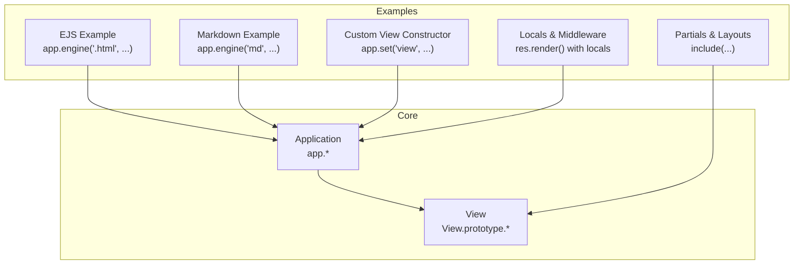
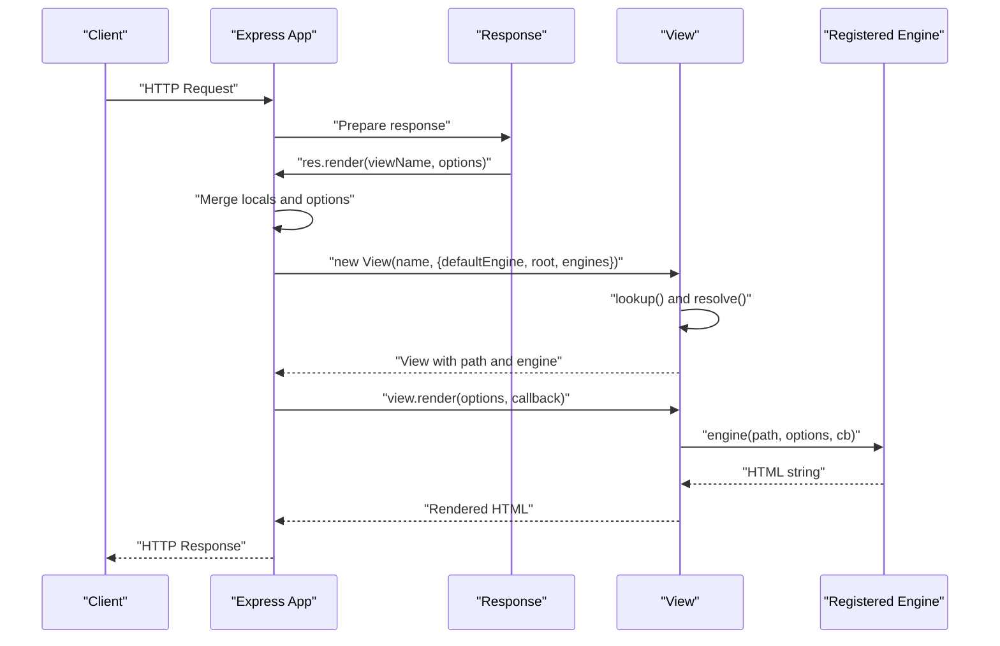
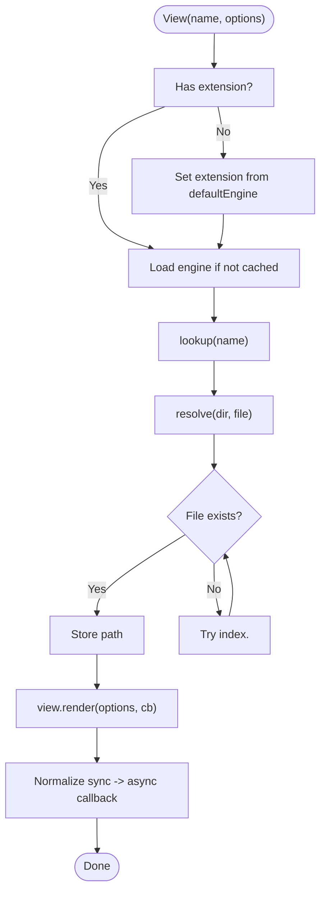
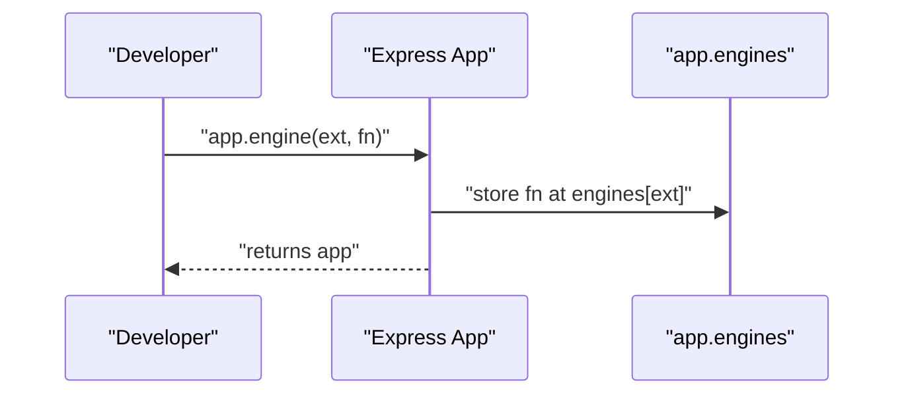
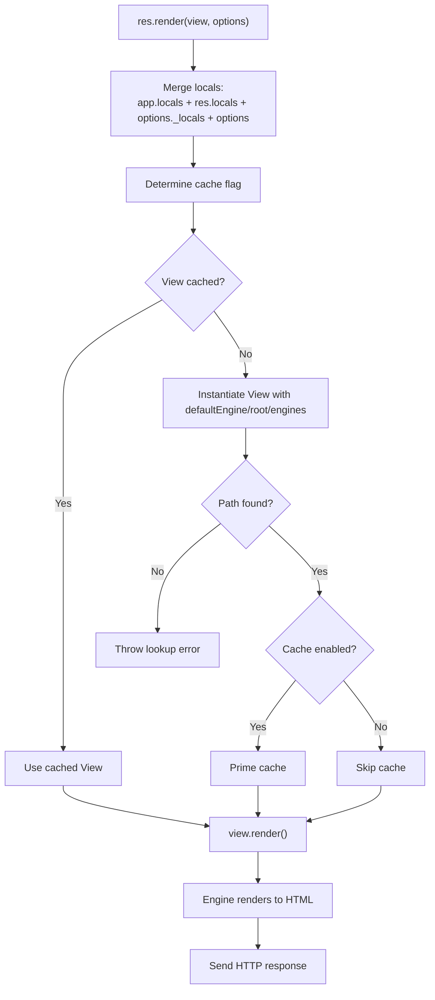
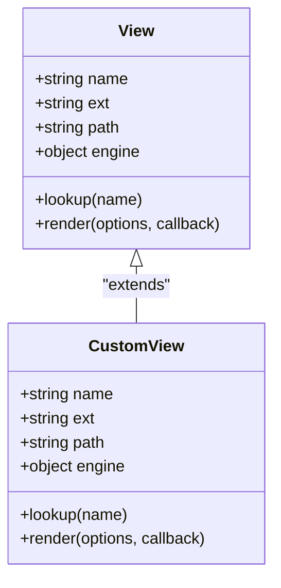
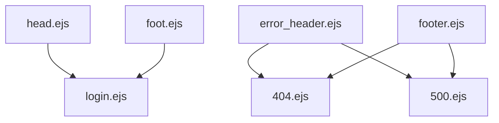
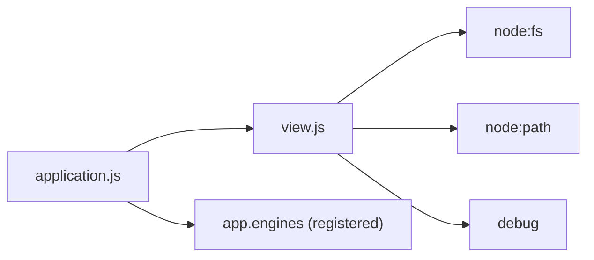

# Template Engine Integration

<cite>
**Referenced Files in This Document**
- [view.js](file://lib/view.js)
- [application.js](file://lib/application.js)
- [index.js](file://examples/ejs/index.js)
- [index.js](file://examples/markdown/index.js)
- [index.js](file://examples/view-constructor/index.js)
- [index.js](file://examples/view-locals/index.js)
- [index.js](file://examples/mvc/controllers/user/index.js)
- [index.js](file://examples/mvc/controllers/pet/index.js)
- [index.js](file://examples/route-separation/views/users/edit.ejs)
- [index.js](file://examples/route-separation/views/users/index.ejs)
- [index.js](file://examples/error-pages/views/404.ejs)
- [index.js](file://examples/error-pages/views/500.ejs)
- [index.js](file://examples/auth/views/login.ejs)
- [index.js](file://examples/auth/views/head.ejs)
</cite>

## Table of Contents
1. [Introduction](#introduction)
2. [Project Structure](#project-structure)
3. [Core Components](#core-components)
4. [Architecture Overview](#architecture-overview)
5. [Detailed Component Analysis](#detailed-component-analysis)
6. [Dependency Analysis](#dependency-analysis)
7. [Performance Considerations](#performance-considerations)
8. [Troubleshooting Guide](#troubleshooting-guide)
9. [Conclusion](#conclusion)
10. [Appendices](#appendices)

## Introduction
This document explains how Express.js integrates template engines to power the view system. It covers view resolution, template compilation, and the rendering pipeline. It also documents engine registration via app.engine(), practical examples for EJS, Handlebars, and Markdown, view constructor customization, template inheritance patterns, rendering with locals, partials, and layout systems, caching strategies, performance considerations, debugging techniques, and security practices such as XSS prevention.

## Project Structure
Express’s view system is implemented in core modules and demonstrated across example applications:
- Core modules:
  - Application configuration and rendering orchestration
  - View resolution and rendering
- Examples demonstrate:
  - EJS with custom extension mapping
  - Markdown engine registration and safe rendering
  - Custom view constructor for remote templates
  - Locals propagation and middleware-driven rendering
  - Partial inclusion and layout composition
  - Controller-level engine selection

**Diagram sources**
- [application.js:294-308](file://lib/application.js#L294-L308)
- [application.js:522-575](file://lib/application.js#L522-L575)
- [view.js:104-123](file://lib/view.js#L104-L123)
- [view.js:133-159](file://lib/view.js#L133-L159)
- [index.js:23-36](file://examples/ejs/index.js#L23-L36)
- [index.js:17-25](file://examples/markdown/index.js#L17-L25)
- [index.js:29-30](file://examples/view-constructor/index.js#L29-L30)
- [index.js:12-13](file://examples/view-locals/index.js#L12-L13)
- [index.js:1-23](file://examples/route-separation/views/users/edit.ejs#L1-L23)

**Section sources**
- [application.js:59-141](file://lib/application.js#L59-L141)
- [view.js:52-95](file://lib/view.js#L52-L95)

## Core Components
- View constructor
  - Determines extension, loads engine, and resolves view path
  - Provides render method that delegates to the registered engine
- Application rendering pipeline
  - Merges app.locals, route-specific _locals, and per-render options
  - Optionally caches View instances
  - Delegates to View.render with normalized callback behavior

Key behaviors:
- Extension resolution and default engine fallback
- Root directories traversal and index fallback
- Engine registration via app.engine()
- Rendering with synchronous-to-asynchronous normalization

**Section sources**
- [view.js:52-95](file://lib/view.js#L52-L95)
- [view.js:104-123](file://lib/view.js#L104-L123)
- [view.js:133-159](file://lib/view.js#L133-L159)
- [application.js:522-575](file://lib/application.js#L522-L575)
- [application.js:294-308](file://lib/application.js#L294-L308)

## Architecture Overview
The rendering flow connects application settings, view resolution, and engine execution.

**Diagram sources**
- [application.js:522-575](file://lib/application.js#L522-L575)
- [view.js:104-123](file://lib/view.js#L104-L123)
- [view.js:133-159](file://lib/view.js#L133-L159)

## Detailed Component Analysis

### View Resolution and Rendering Pipeline
- View constructor
  - Validates presence of extension or default engine
  - Loads engine via require and caches it in app.engines
  - Resolves filesystem path with fallback to index.<ext>
- Rendering
  - Normalizes synchronous engine callbacks to asynchronous
  - Uses debug logging for lookup and stat operations

**Diagram sources**
- [view.js:52-95](file://lib/view.js#L52-L95)
- [view.js:104-123](file://lib/view.js#L104-L123)
- [view.js:133-159](file://lib/view.js#L133-L159)

**Section sources**
- [view.js:52-95](file://lib/view.js#L52-L95)
- [view.js:104-123](file://lib/view.js#L104-L123)
- [view.js:133-159](file://lib/view.js#L133-L159)

### Engine Registration with app.engine()
- Purpose
  - Register a template engine for a given extension
  - Accepts a function with signature (path, options, callback)
- Behavior
  - Ensures extension starts with a dot
  - Stores engine in app.engines keyed by extension
- Practical examples
  - EJS mapped to .html extension
  - Markdown engine registered with custom parsing and escaping
  - Custom view constructor replaces default View behavior

**Diagram sources**
- [application.js:294-308](file://lib/application.js#L294-L308)
- [index.js:23-23](file://examples/ejs/index.js#L23-L23)
- [index.js:17-25](file://examples/markdown/index.js#L17-L25)
- [index.js:29-30](file://examples/view-constructor/index.js#L29-L30)

**Section sources**
- [application.js:294-308](file://lib/application.js#L294-L308)
- [index.js:23-36](file://examples/ejs/index.js#L23-L36)
- [index.js:17-25](file://examples/markdown/index.js#L17-L25)
- [index.js:29-30](file://examples/view-constructor/index.js#L29-L30)

### Template Rendering with Locals, Partials, and Layouts
- Locals
  - app.locals, res.locals, and per-route _locals are merged
  - Option precedence: app.locals < res.locals < per-route options
- Partials and layouts
  - Templates commonly include partials (e.g., header/footer)
  - Layouts are composed by rendering partials around content
- Examples
  - EJS partials and headers/footers
  - Markdown templates with placeholder substitution
  - MVC controllers selecting engines per controller

**Diagram sources**
- [application.js:522-575](file://lib/application.js#L522-L575)
- [index.js:1-23](file://examples/route-separation/views/users/edit.ejs#L1-L23)
- [index.js:1-3](file://examples/error-pages/views/404.ejs#L1-L3)
- [index.js:1-8](file://examples/error-pages/views/500.ejs#L1-L8)

**Section sources**
- [application.js:522-575](file://lib/application.js#L522-L575)
- [index.js:12-13](file://examples/view-locals/index.js#L12-L13)
- [index.js:1-23](file://examples/route-separation/views/users/edit.ejs#L1-L23)
- [index.js:1-3](file://examples/error-pages/views/404.ejs#L1-L3)
- [index.js:1-8](file://examples/error-pages/views/500.ejs#L1-L8)

### View Constructor Customization
- Override default View class
  - Set app.set('view', CustomView) to use a custom constructor
  - Useful for loading templates from remote sources (e.g., GitHub)
- Example
  - Custom view constructor enables rendering templates from a remote repository path

**Diagram sources**
- [view.js:52-95](file://lib/view.js#L52-L95)
- [view.js:104-123](file://lib/view.js#L104-L123)
- [view.js:133-159](file://lib/view.js#L133-L159)
- [index.js:29-30](file://examples/view-constructor/index.js#L29-L30)

**Section sources**
- [view.js:52-95](file://lib/view.js#L52-L95)
- [index.js:29-30](file://examples/view-constructor/index.js#L29-L30)

### Template Inheritance Patterns
- Partials and includes
  - Templates include reusable fragments (e.g., header, footer)
  - Supports passing locals to included templates
- Layout composition
  - Wrap content with shared header/footer partials
- Example patterns
  - Authentication example composes head/body partials
  - Error pages reuse error_header and footer partials

**Diagram sources**
- [index.js:1-21](file://examples/auth/views/head.ejs#L1-L21)
- [index.js:1-22](file://examples/auth/views/login.ejs#L1-L22)
- [index.js:1-3](file://examples/error-pages/views/404.ejs#L1-L3)
- [index.js:1-8](file://examples/error-pages/views/500.ejs#L1-L8)

**Section sources**
- [index.js:1-22](file://examples/auth/views/login.ejs#L1-L22)
- [index.js:1-21](file://examples/auth/views/head.ejs#L1-L21)
- [index.js:1-3](file://examples/error-pages/views/404.ejs#L1-L3)
- [index.js:1-8](file://examples/error-pages/views/500.ejs#L1-L8)

### Practical Examples: EJS, Handlebars, Markdown
- EJS mapped to .html
  - Register engine for .html and set default view engine to html
  - Render views with locals and static assets
- Handlebars
  - Controller sets engine per controller module
  - Views rendered with handlebars templates
- Markdown
  - Register engine for .md with custom parsing and placeholder replacement
  - Escape interpolated values to prevent XSS

**Section sources**
- [index.js:23-36](file://examples/ejs/index.js#L23-L36)
- [index.js:9-9](file://examples/mvc/controllers/user/index.js#L9-L9)
- [index.js:9-9](file://examples/mvc/controllers/pet/index.js#L9-L9)
- [index.js:17-25](file://examples/markdown/index.js#L17-L25)

## Dependency Analysis
- Application depends on:
  - View for resolving and rendering templates
  - Registered engines stored in app.engines
  - Settings for view engine, views directory, and caching
- View depends on:
  - Node path and fs for resolution and stat checks
  - Debug for logging

**Diagram sources**
- [application.js:18-26](file://lib/application.js#L18-L26)
- [application.js:522-575](file://lib/application.js#L522-L575)
- [view.js:16-18](file://lib/view.js#L16-L18)
- [view.js:104-123](file://lib/view.js#L104-L123)

**Section sources**
- [application.js:59-141](file://lib/application.js#L59-L141)
- [view.js:16-18](file://lib/view.js#L16-L18)

## Performance Considerations
- View caching
  - Enabled by default in production via app.enable('view cache')
  - app.render caches View instances when cache option is true
- Rendering normalization
  - Ensures engine callbacks are invoked asynchronously
- Recommendations
  - Prefer production builds for caching benefits
  - Minimize expensive computations inside templates
  - Use partials to avoid repeated rendering work

**Section sources**
- [application.js:138-140](file://lib/application.js#L138-L140)
- [application.js:538-541](file://lib/application.js#L538-L541)
- [application.js:625-631](file://lib/application.js#L625-L631)

## Troubleshooting Guide
- View lookup failures
  - Symptom: Error indicating failed to lookup view in configured directories
  - Causes: Incorrect view name, missing extension, wrong views directory
  - Fix: Verify app.set('views'), app.set('view engine'), and file existence
- Engine registration errors
  - Symptom: Error indicating module does not provide a view engine
  - Causes: Missing or incorrect engine function signature
  - Fix: Ensure engine provides a function compatible with (path, options, callback)
- Rendering exceptions
  - Symptom: Exceptions thrown during rendering
  - Fix: Wrap engine logic in try/catch and return callback with error

**Section sources**
- [view.js:80-88](file://lib/view.js#L80-L88)
- [application.js:558-565](file://lib/application.js#L558-L565)
- [application.js:625-631](file://lib/application.js#L625-L631)

## Conclusion
Express’s view system centers on a flexible View class and a straightforward rendering pipeline. Developers register engines with app.engine(), configure view directories and default engines, and compose templates using partials and layouts. With built-in caching and robust error handling, the system supports scalable rendering while maintaining security through careful handling of user-provided content.

## Appendices

### Security Considerations and Safe Rendering Practices
- XSS prevention
  - Escape interpolated values in custom engines (e.g., Markdown example escapes placeholders)
  - Avoid evaluating untrusted content in templates
- Least privilege
  - Restrict file system access in custom engines
  - Sanitize inputs passed to templates
- Error handling
  - Always return errors via callback in engine functions
  - Avoid leaking internal stack traces in production

**Section sources**
- [index.js:17-25](file://examples/markdown/index.js#L17-L25)