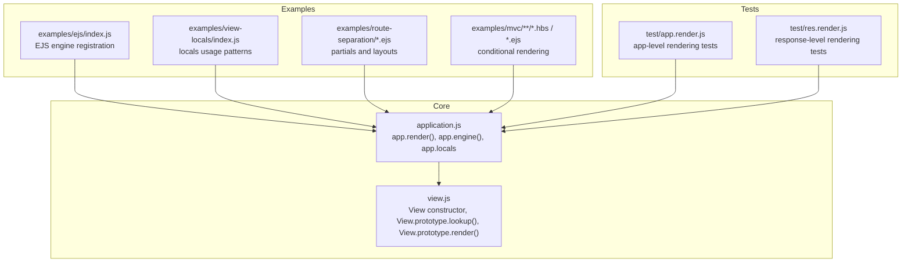
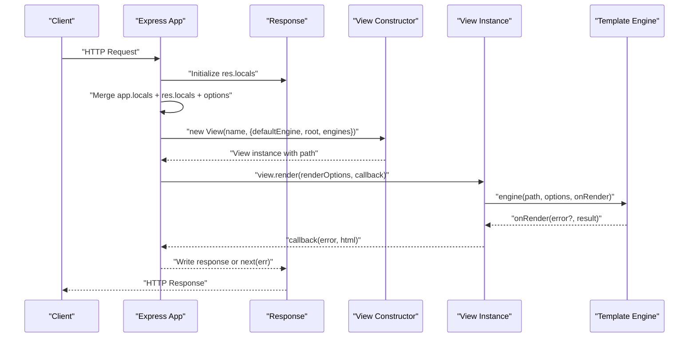
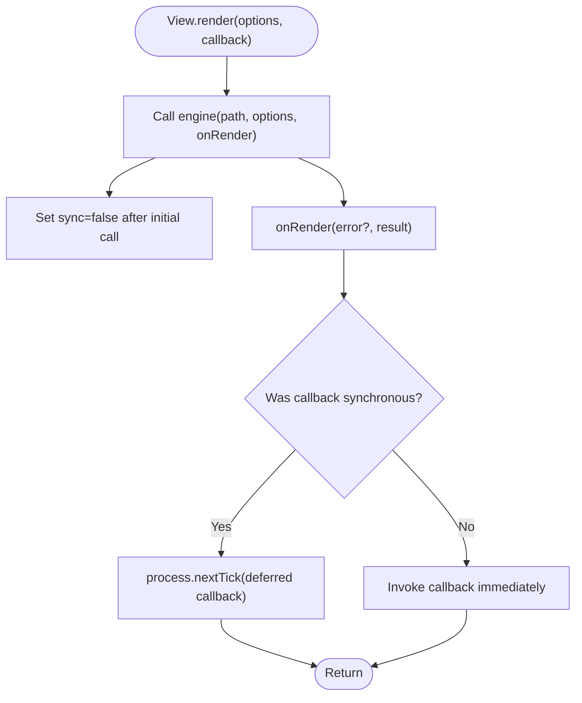
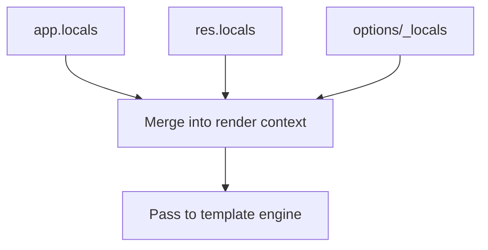
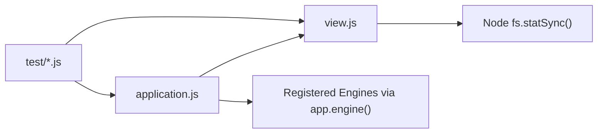
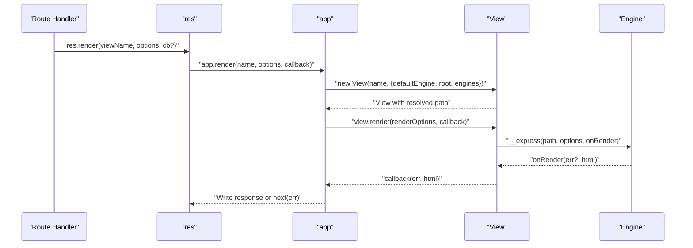

# Template Rendering & Locals

<cite>
**Referenced Files in This Document**
- [view.js](file://lib/view.js)
- [application.js](file://lib/application.js)
- [index.js](file://examples/ejs/index.js)
- [index.js](file://examples/view-locals/index.js)
- [index.ejs](file://examples/view-locals/views/index.ejs)
- [index.js](file://examples/route-separation/index.js)
- [header.ejs](file://examples/route-separation/views/header.ejs)
- [footer.ejs](file://examples/route-separation/views/footer.ejs)
- [users\edit.ejs](file://examples/route-separation/views/users/edit.ejs)
- [posts\index.ejs](file://examples/route-separation/views/posts/index.ejs)
- [users\index.ejs](file://examples/route-separation/views/users/index.ejs)
- [users\view.ejs](file://examples/route-separation/views/users/view.ejs)
- [show.hbs](file://examples/mvc/controllers/user/views/show.hbs)
- [edit.ejs](file://examples/mvc/controllers/pet/views/edit.ejs)
- [app.render.js](file://test/app.render.js)
- [res.render.js](file://test/res.render.js)
</cite>

## Table of Contents
1. [Introduction](#introduction)
2. [Project Structure](#project-structure)
3. [Core Components](#core-components)
4. [Architecture Overview](#architecture-overview)
5. [Detailed Component Analysis](#detailed-component-analysis)
6. [Dependency Analysis](#dependency-analysis)
7. [Performance Considerations](#performance-considerations)
8. [Troubleshooting Guide](#troubleshooting-guide)
9. [Conclusion](#conclusion)
10. [Appendices](#appendices)

## Introduction
This document explains Express.js template rendering with a focus on the View.prototype.render() method and the end-to-end rendering pipeline. It covers synchronous vs asynchronous rendering behavior, callback handling, error propagation, and how template locals integrate global variables, request-specific data, and view-specific context. It also documents template inheritance via partials, layout composition, and practical examples for different data types, conditional rendering, and template composition. Finally, it provides performance optimization strategies, caching, memory management considerations, and debugging techniques.

## Project Structure
The rendering system spans core modules and example applications:
- Core rendering engine and view resolution live in lib/view.js and lib/application.js.
- Examples demonstrate EJS/HBS templates, partial inclusion, and locals usage.
- Tests validate rendering behavior, caching, and error propagation.

**Diagram sources**
- [application.js](file://lib/application.js)
- [view.js](file://lib/view.js)
- [index.js](file://examples/ejs/index.js)
- [index.js](file://examples/view-locals/index.js)
- [index.js](file://examples/route-separation/index.js)
- [show.hbs](file://examples/mvc/controllers/user/views/show.hbs)
- [app.render.js](file://test/app.render.js)
- [res.render.js](file://test/res.render.js)

**Section sources**
- [application.js](file://lib/application.js)
- [view.js](file://lib/view.js)

## Core Components
- View class: encapsulates template discovery, engine loading, and rendering. It resolves the filesystem path, loads the appropriate template engine, and renders synchronously or asynchronously while ensuring consistent callback semantics.
- Application rendering: merges app.locals, res.locals/_locals, and per-request options into a single render context, supports view caching, and delegates to View.render().

Key behaviors:
- Engine selection and caching: engines are cached by extension for reuse.
- View lookup: supports single or multiple views directories and index fallback.
- Rendering normalization: ensures callbacks are invoked asynchronously regardless of engine behavior.

**Section sources**
- [view.js](file://lib/view.js)
- [application.js](file://lib/application.js)

## Architecture Overview
The rendering pipeline integrates request lifecycle, view resolution, engine invocation, and response emission.

**Diagram sources**
- [application.js](file://lib/application.js)
- [view.js](file://lib/view.js)

## Detailed Component Analysis

### View.prototype.render() and Synchronous vs Asynchronous Rendering
- Normalization: The renderer wraps engine callbacks to ensure asynchronous invocation. A flag toggles after initial engine call to detect whether the engine already called back synchronously; if so, it defers to the next tick to normalize timing.
- Callback semantics: The callback receives either an error or the rendered HTML string. This guarantees consistent async behavior for middleware and error handling.

**Diagram sources**
- [view.js](file://lib/view.js)

**Section sources**
- [view.js](file://lib/view.js)

### Template Locals Integration
Express merges three layers of data into the rendering context:
- app.locals: global application-level variables.
- res.locals: request-scoped variables set during the request lifecycle.
- options/_locals/options: per-render overrides and additional data passed to res.render()/app.render().

Precedence:
- res.render() options take highest precedence.
- res.locals override app.locals.
- app.locals are merged first, then res.locals, then per-call options.

**Diagram sources**
- [application.js](file://lib/application.js)

Practical examples:
- Using app.locals for shared metadata and res.locals for request-scoped data.
- Passing locals directly to res.render() for view-specific context.

**Section sources**
- [application.js](file://lib/application.js)
- [index.js](file://examples/view-locals/index.js)
- [index.ejs](file://examples/view-locals/views/index.ejs)
- [res.render.js](file://test/res.render.js)

### Template Inheritance Patterns and Partial Rendering
- Partials: Templates include other templates using include directives. This enables reusable header/footer/layout fragments.
- Layouts: A common pattern is to wrap page content with a header and footer partials, passing page-specific data (e.g., title) to the included partials.

Examples:
- Header and footer partials used across multiple pages.
- Page templates include the header and footer and render lists or forms.

**Section sources**
- [header.ejs](file://examples/route-separation/views/header.ejs)
- [footer.ejs](file://examples/route-separation/views/footer.ejs)
- [users\edit.ejs](file://examples/route-separation/views/users/edit.ejs)
- [posts\index.ejs](file://examples/route-separation/views/posts/index.ejs)
- [users\index.ejs](file://examples/route-separation/views/users/index.ejs)
- [users\view.ejs](file://examples/route-separation/views/users/view.ejs)

### Conditional Rendering and Template Composition
- Handlebars (HBS): Demonstrates conditionals and loops for dynamic content composition.
- EJS: Uses forEach and include for composition and iteration.

Examples:
- Conditional blocks for presence checks and loop rendering.
- Composition via partials and per-route templates.

**Section sources**
- [show.hbs](file://examples/mvc/controllers/user/views/show.hbs)
- [edit.ejs](file://examples/mvc/controllers/pet/views/edit.ejs)

### Practical Rendering Scenarios
- Absolute paths: Rendering templates using absolute file paths.
- Extensions and engines: Registering engines and rendering without explicit extensions.
- Multiple views directories: Rendering from prioritized directories with fallbacks.
- Caching: Enabling or disabling view caching at app or per-render level.

**Section sources**
- [app.render.js](file://test/app.render.js)
- [res.render.js](file://test/res.render.js)
- [index.js](file://examples/ejs/index.js)

## Dependency Analysis
- application.js depends on view.js for view instantiation and rendering.
- View.load() requires the template engine module and expects an __express method or equivalent.
- Tests validate engine registration, caching, and error propagation.

**Diagram sources**
- [application.js](file://lib/application.js)
- [view.js](file://lib/view.js)
- [app.render.js](file://test/app.render.js)
- [res.render.js](file://test/res.render.js)

**Section sources**
- [application.js](file://lib/application.js)
- [view.js](file://lib/view.js)
- [app.render.js](file://test/app.render.js)
- [res.render.js](file://test/res.render.js)

## Performance Considerations
- View caching: Enable caching via app setting or per-render option to avoid repeated view instantiation and lookup.
- Engine caching: Engines are cached by extension; reuse registered engines to avoid repeated require costs.
- Minimize heavy computation in templates: Move expensive logic to middleware or pre-process data to keep templates lean.
- Memory management: Avoid retaining large objects in app.locals; prefer res.locals for request-scoped data to reduce cross-request memory pressure.

[No sources needed since this section provides general guidance]

## Troubleshooting Guide
Common issues and resolutions:
- Missing default engine: Ensure a view engine is registered or set the view engine setting when templates lack extensions.
- View not found: Verify views directories and extensions; confirm index fallback behavior.
- Error propagation: Rendering errors are surfaced to callbacks or next(err); attach error handlers to capture and respond appropriately.
- Locals precedence confusion: Understand the merge order and explicitly pass locals to res.render() when overriding.

**Section sources**
- [res.render.js](file://test/res.render.js)
- [app.render.js](file://test/app.render.js)
- [application.js](file://lib/application.js)

## Conclusion
Express’s rendering pipeline centers on a robust View abstraction that resolves templates, loads engines, and normalizes asynchronous callbacks. Locals are merged predictably across global, request-scoped, and per-render contexts. Partial inclusion and layout composition enable scalable template reuse. Performance benefits come from enabling caching and keeping templates lightweight. Proper error handling and understanding of locals precedence help avoid common pitfalls.

[No sources needed since this section summarizes without analyzing specific files]

## Appendices

### Appendix A: Rendering Flow (Code-Level)

**Diagram sources**
- [application.js](file://lib/application.js)
- [view.js](file://lib/view.js)