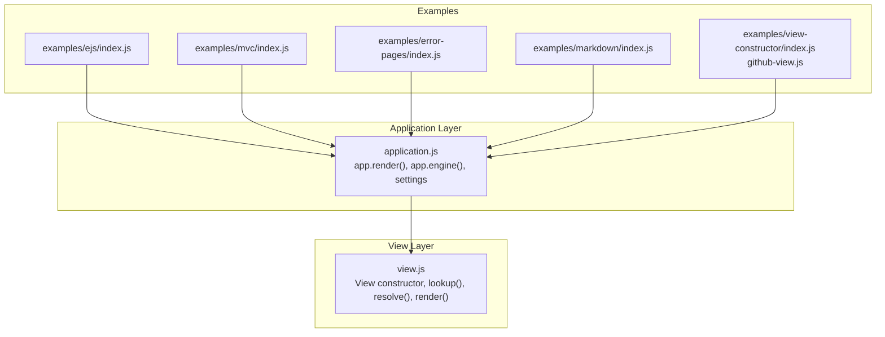
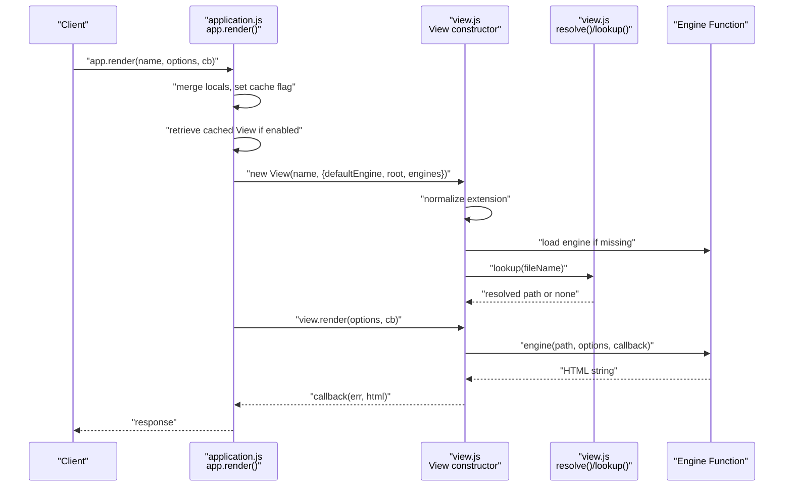
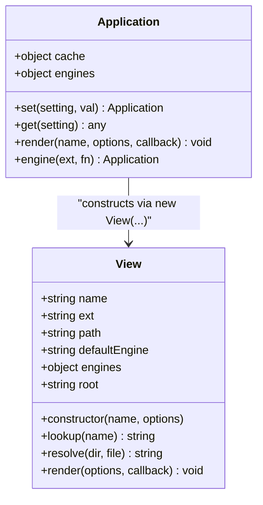
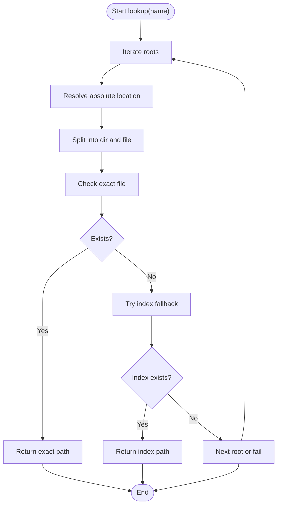
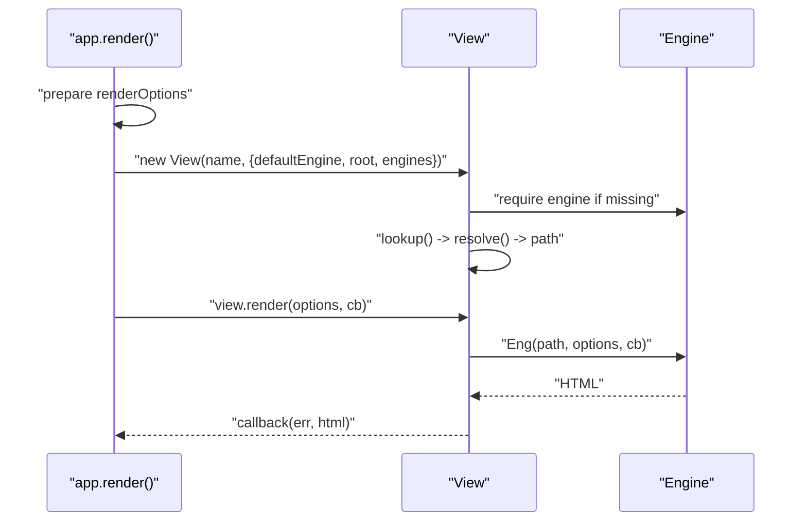
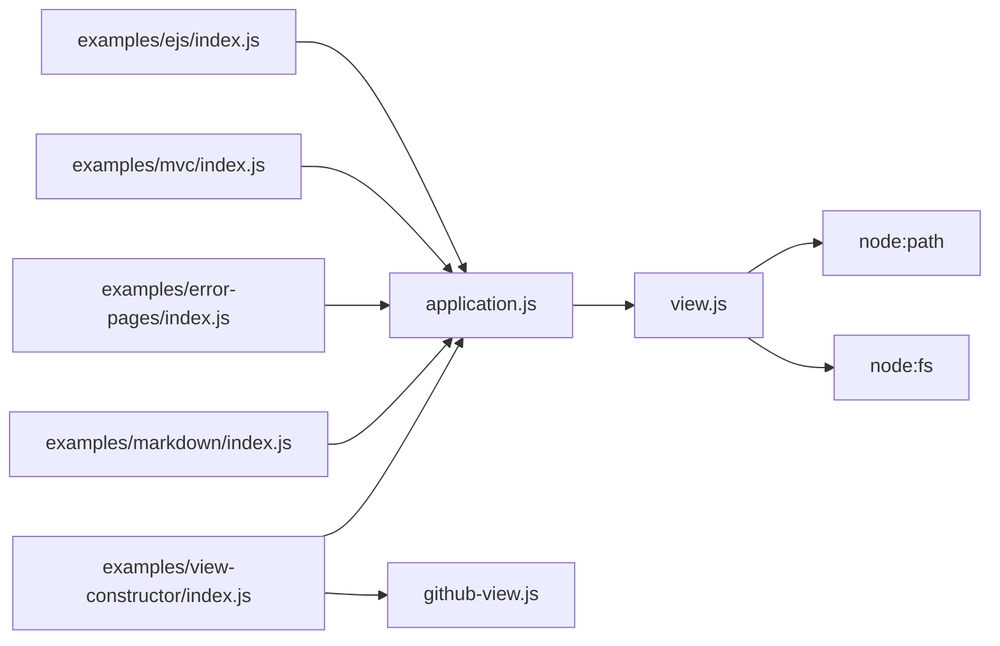

# Template System Overview

<cite>
**Referenced Files in This Document**
- [view.js](file://lib/view.js)
- [application.js](file://lib/application.js)
- [index.js](file://examples/ejs/index.js)
- [index.js](file://examples/mvc/index.js)
- [index.js](file://examples/error-pages/index.js)
- [index.js](file://examples/markdown/index.js)
- [index.js](file://examples/view-constructor/index.js)
- [github-view.js](file://examples/view-constructor/github-view.js)
- [app.engine.js](file://test/app.engine.js)
- [app.render.js](file://test/app.render.js)
- [res.render.js](file://test/res.render.js)
</cite>

## Table of Contents
1. [Introduction](#introduction)
2. [Project Structure](#project-structure)
3. [Core Components](#core-components)
4. [Architecture Overview](#architecture-overview)
5. [Detailed Component Analysis](#detailed-component-analysis)
6. [Dependency Analysis](#dependency-analysis)
7. [Performance Considerations](#performance-considerations)
8. [Troubleshooting Guide](#troubleshooting-guide)
9. [Conclusion](#conclusion)

## Introduction
This document explains the Express.js template system with a focus on the view architecture and template resolution mechanism. It covers how templates are discovered, loaded, compiled, and rendered, and how view engines, file extensions, and lookup paths interact. Practical examples demonstrate real-world usage patterns, including custom view constructors and engine registration.

## Project Structure
Express’s template system centers around two primary modules:
- Application-level rendering orchestration and configuration
- The View class responsible for locating templates, loading engines, and invoking rendering

**Diagram sources**
- [application.js:522-575](file://lib/application.js#L522-L575)
- [view.js:52-95](file://lib/view.js#L52-L95)
- [index.js:10-58](file://examples/ejs/index.js#L10-L58)
- [index.js:13-96](file://examples/mvc/index.js#L13-L96)
- [index.js:9-104](file://examples/error-pages/index.js#L9-L104)
- [index.js:13-45](file://examples/markdown/index.js#L13-L45)
- [index.js:11-49](file://examples/view-constructor/index.js#L11-L49)
- [github-view.js:23-54](file://examples/view-constructor/github-view.js#L23-L54)

**Section sources**
- [application.js:134-141](file://lib/application.js#L134-L141)
- [view.js:52-95](file://lib/view.js#L52-L95)

## Core Components
- View class
  - Constructor parameters: name, options including defaultEngine, engines cache, root
  - Engine loading: resolves extension, loads via require(mod).__express, caches in engines
  - Path resolution: lookup() iterates roots, resolve() checks exact file and index fallback
  - Rendering: render() delegates to engine with normalized async callback
- Application rendering
  - app.render(): merges locals, handles caching, constructs View, invokes render
  - app.engine(): registers engines by extension, normalizes extension format
  - Settings: view, views, view engine, view cache

Key behaviors:
- Template discovery supports root directories and index fallback patterns
- Engines are cached per extension to avoid repeated require costs
- Rendering is always asynchronous, even if the underlying engine is synchronous

**Section sources**
- [view.js:52-95](file://lib/view.js#L52-L95)
- [view.js:104-123](file://lib/view.js#L104-L123)
- [view.js:169-187](file://lib/view.js#L169-L187)
- [view.js:133-159](file://lib/view.js#L133-L159)
- [application.js:294-308](file://lib/application.js#L294-L308)
- [application.js:522-575](file://lib/application.js#L522-L575)

## Architecture Overview
The rendering flow begins at app.render(), which prepares options, optionally retrieves a cached View, constructs a View with the configured settings, and finally calls the View’s render method. The View locates the template file using the configured roots and extension, loads the appropriate engine, and executes the engine’s render function.

**Diagram sources**
- [application.js:522-575](file://lib/application.js#L522-L575)
- [view.js:52-95](file://lib/view.js#L52-L95)
- [view.js:104-123](file://lib/view.js#L104-L123)
- [view.js:133-159](file://lib/view.js#L133-L159)

## Detailed Component Analysis

### View Class Implementation
The View class encapsulates template discovery and rendering:
- Constructor
  - Validates presence of extension or defaultEngine
  - Normalizes extension and ensures engines cache has the loader
  - Computes path via lookup()
- lookup()
  - Iterates roots, resolves absolute location, and delegates to resolve()
- resolve()
  - Checks exact file existence; falls back to index.<ext> if applicable
- render()
  - Ensures asynchronous callback semantics regardless of engine behavior

**Diagram sources**
- [view.js:52-95](file://lib/view.js#L52-L95)
- [view.js:104-123](file://lib/view.js#L104-L123)
- [view.js:169-187](file://lib/view.js#L169-L187)
- [view.js:133-159](file://lib/view.js#L133-L159)
- [application.js:522-575](file://lib/application.js#L522-L575)

**Section sources**
- [view.js:52-95](file://lib/view.js#L52-L95)
- [view.js:104-123](file://lib/view.js#L104-L123)
- [view.js:169-187](file://lib/view.js#L169-L187)
- [view.js:133-159](file://lib/view.js#L133-L159)

### Template Resolution Mechanism
Resolution follows a deterministic order:
- Roots: An array of root directories is supported; iteration stops upon first successful match
- Exact file: join(dir, file) is checked for existence
- Index fallback: join(dir, basenameWithoutExt, "index" + ext) is checked for existence
- Failure: No path found yields an error from app.render()

**Diagram sources**
- [view.js:104-123](file://lib/view.js#L104-L123)
- [view.js:169-187](file://lib/view.js#L169-L187)

**Section sources**
- [view.js:104-123](file://lib/view.js#L104-L123)
- [view.js:169-187](file://lib/view.js#L169-L187)

### View Instantiation Workflow
From app.render() to template compilation:
1. app.render() merges locals and sets cache flag
2. If caching enabled, retrieves View from cache
3. If not cached, constructs View with defaultEngine, root, and engines
4. View constructor loads engine if needed and computes path
5. app.render() calls view.render(), which invokes the engine
6. Engine returns HTML string to callback

**Diagram sources**
- [application.js:522-575](file://lib/application.js#L522-L575)
- [view.js:52-95](file://lib/view.js#L52-L95)
- [view.js:133-159](file://lib/view.js#L133-L159)

**Section sources**
- [application.js:522-575](file://lib/application.js#L522-L575)
- [view.js:52-95](file://lib/view.js#L52-L95)
- [view.js:133-159](file://lib/view.js#L133-L159)

### Practical Examples

- EJS with mapped extension
  - Registers EJS engine for .html and sets view engine to html
  - Renders a template without requiring .html extension in code
  - Demonstrates extension mapping and default engine usage

  **Section sources**
  - [index.js:23-36](file://examples/ejs/index.js#L23-L36)

- MVC-style layout and partials
  - Sets view engine to ejs and defines views directory
  - Uses res.render() for controller actions and error handlers

  **Section sources**
  - [index.js:17-89](file://examples/mvc/index.js#L17-L89)

- Error pages with explicit extensions
  - Renders error templates with .ejs extension and exposes settings to views

  **Section sources**
  - [index.js:14-97](file://examples/error-pages/index.js#L14-L97)

- Markdown engine registration
  - Defines a custom .md engine using marked
  - Sets default view engine to md for extensionless rendering

  **Section sources**
  - [index.js:17-30](file://examples/markdown/index.js#L17-L30)

- Custom View constructor
  - Overrides the default View to fetch templates from a remote GitHub repository
  - Demonstrates how to replace the built-in filesystem-based View

  **Section sources**
  - [index.js:13-30](file://examples/view-constructor/index.js#L13-L30)
  - [github-view.js:23-54](file://examples/view-constructor/github-view.js#L23-L54)

### Relationship Between View Engines, Extensions, and Resolution
- app.engine(ext, fn) registers a rendering function for a given extension
- app.set('view engine', ...) sets the default extension to append when rendering without an extension
- View constructor derives the effective extension from either the filename or the default engine
- Resolution uses the effective extension to locate files and apply index fallback

Evidence:
- Engine registration and default engine behavior
- Extension normalization and engine caching
- Default engine usage when no extension is present

**Section sources**
- [application.js:294-308](file://lib/application.js#L294-L308)
- [application.js:134-141](file://lib/application.js#L134-L141)
- [view.js:66-73](file://lib/view.js#L66-L73)
- [view.js:75-88](file://lib/view.js#L75-L88)

## Dependency Analysis
The template system exhibits clear separation of concerns:
- application.js depends on view.js for constructing and rendering Views
- View relies on Node’s path and fs modules for resolution and file existence checks
- Tests and examples demonstrate usage patterns and edge cases

**Diagram sources**
- [application.js:18](file://lib/application.js#L18)
- [view.js:17-18](file://lib/view.js#L17-L18)
- [index.js:10-58](file://examples/ejs/index.js#L10-L58)
- [index.js:13-96](file://examples/mvc/index.js#L13-L96)
- [index.js:9-104](file://examples/error-pages/index.js#L9-L104)
- [index.js:13-45](file://examples/markdown/index.js#L13-L45)
- [index.js:11-49](file://examples/view-constructor/index.js#L11-L49)
- [github-view.js:23-54](file://examples/view-constructor/github-view.js#L23-L54)

**Section sources**
- [application.js:18](file://lib/application.js#L18)
- [view.js:17-18](file://lib/view.js#L17-L18)

## Performance Considerations
- View caching
  - Enabled by default in production; controlled by the “view cache” setting
  - app.render() checks cache when enabled; View instances are reused
  - Explicit per-call cache override is supported via render options
- Engine caching
  - Engines are cached per extension in the app.engines map to avoid repeated require costs
- Asynchronous rendering
  - view.render() normalizes callbacks to be asynchronous, preventing blocking behavior

Practical guidance:
- Keep “view cache” enabled in production to reduce repeated View construction and engine loading
- Prefer registering engines early during application bootstrap to leverage the engines cache
- Avoid expensive operations inside templates; precompute data in controllers

**Section sources**
- [application.js:138-141](file://lib/application.js#L138-L141)
- [application.js:539-541](file://lib/application.js#L539-L541)
- [application.js:544-571](file://lib/application.js#L544-L571)
- [view.js:75-88](file://lib/view.js#L75-L88)
- [view.js:133-159](file://lib/view.js#L133-L159)
- [app.render.js:260-288](file://test/app.render.js#L260-L288)
- [app.render.js:352-382](file://test/app.render.js#L352-L382)

## Troubleshooting Guide
Common issues and resolutions:
- Missing default engine and no extension
  - Symptom: Error thrown during View construction
  - Cause: No extension provided and no default engine set
  - Fix: Set app.set('view engine', ...) or include an extension in the template name

  **Section sources**
  - [view.js:60-62](file://lib/view.js#L60-L62)

- Engine not providing a view engine function
  - Symptom: Error indicating the module does not provide a view engine
  - Cause: The registered engine function is not compatible
  - Fix: Ensure the engine exposes the expected signature (e.g., require(mod).__express)

  **Section sources**
  - [view.js:83-85](file://lib/view.js#L83-L85)
  - [res.render.js:39-51](file://test/res.render.js#L39-L51)

- Template not found
  - Symptom: Error mentioning failure to lookup view in views directory/roots
  - Cause: Path does not exist and index fallback fails
  - Fix: Verify template path, extension, and that index fallback matches the intended extension

  **Section sources**
  - [application.js:558-565](file://lib/application.js#L558-L565)
  - [view.js:169-187](file://lib/view.js#L169-L187)

- Rendering errors
  - Symptom: Errors passed to callback or thrown synchronously
  - Cause: Engine rendering failure or custom View throwing
  - Fix: Wrap res.render() calls with error handling and validate template content

  **Section sources**
  - [application.js:625-631](file://lib/application.js#L625-L631)
  - [app.render.js:61-80](file://test/app.render.js#L61-L80)

## Conclusion
Express’s template system cleanly separates concerns between application configuration, view resolution, and engine execution. The View class provides robust template discovery with root directories and index fallback, while app.render() orchestrates caching, options merging, and error propagation. Properly registering engines, configuring default engines, and enabling view caching are key to reliable and performant rendering.