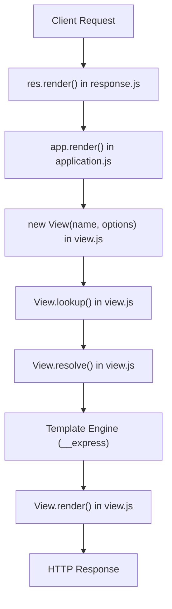
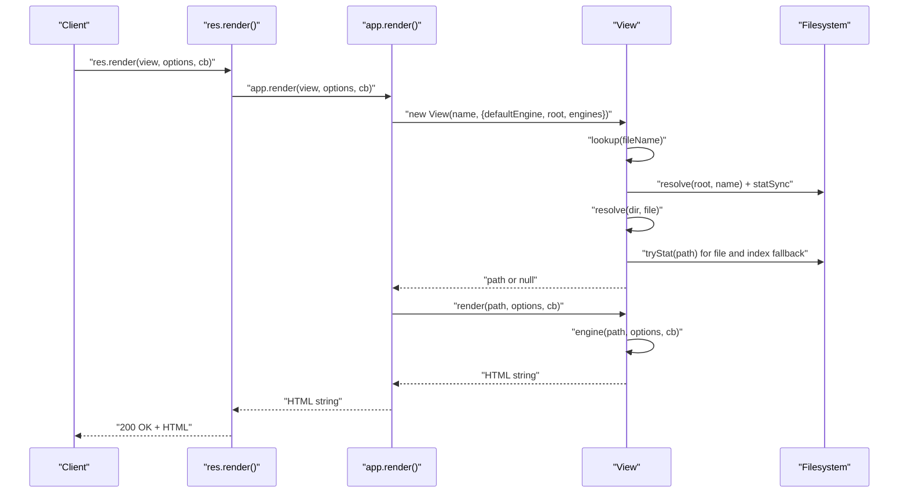
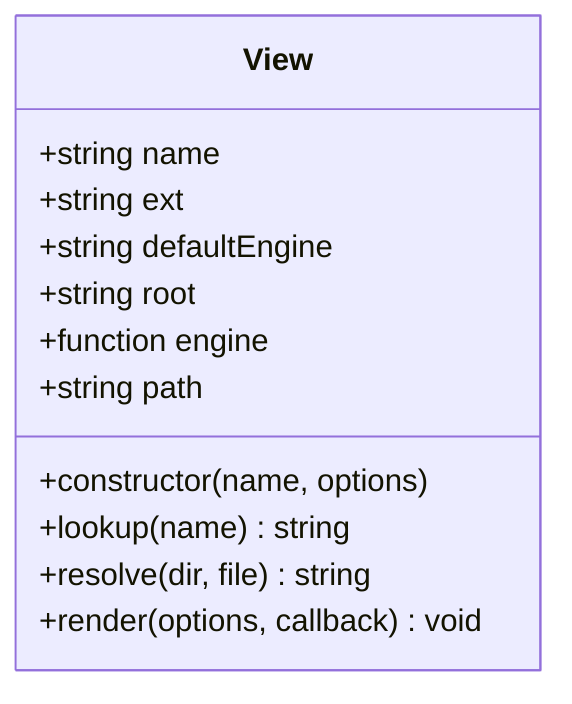
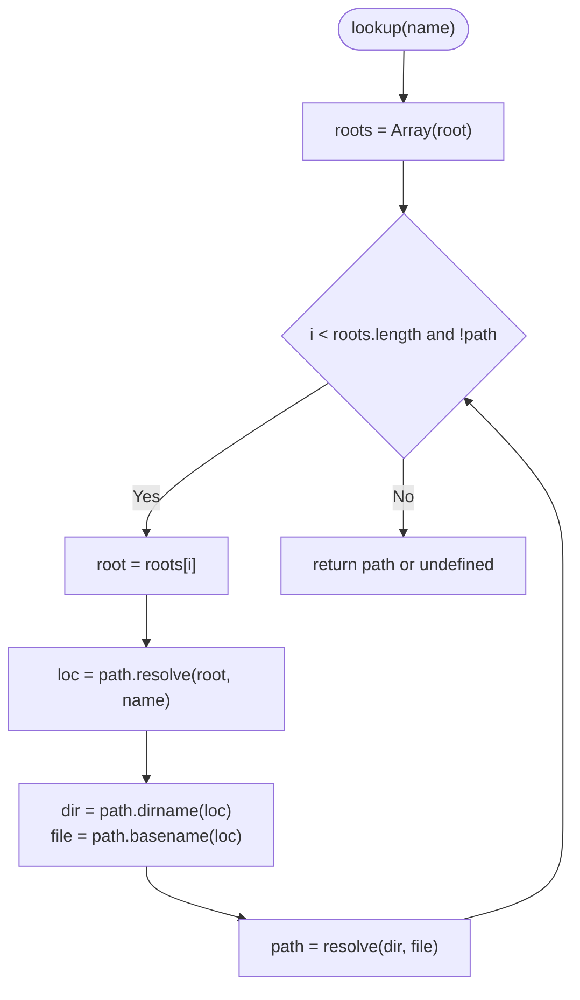
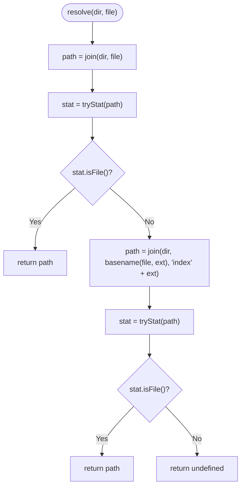
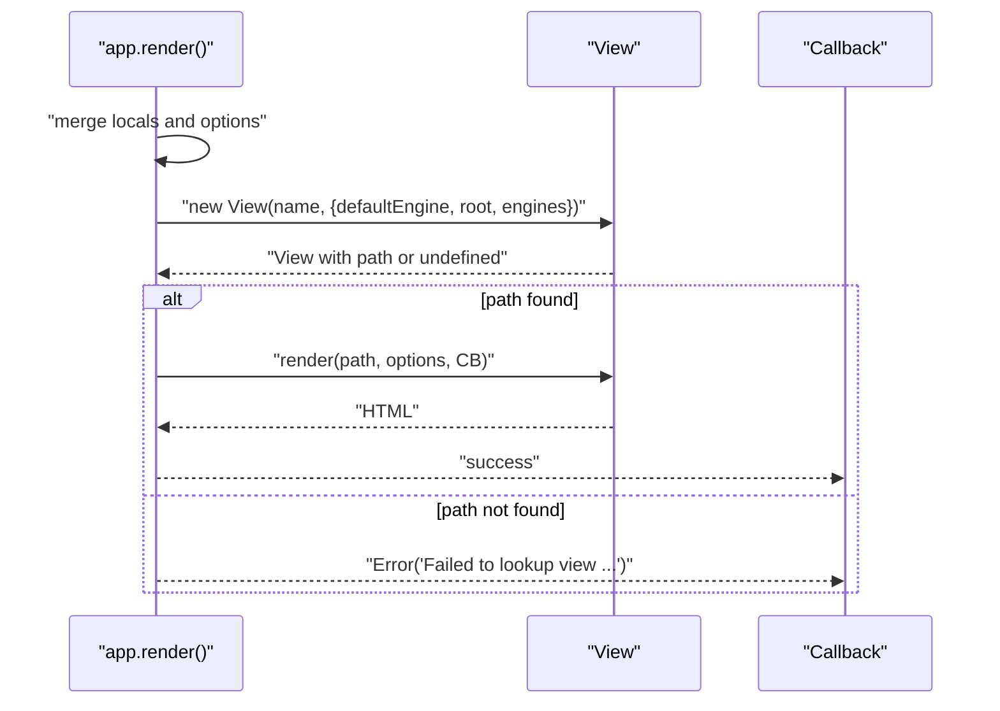
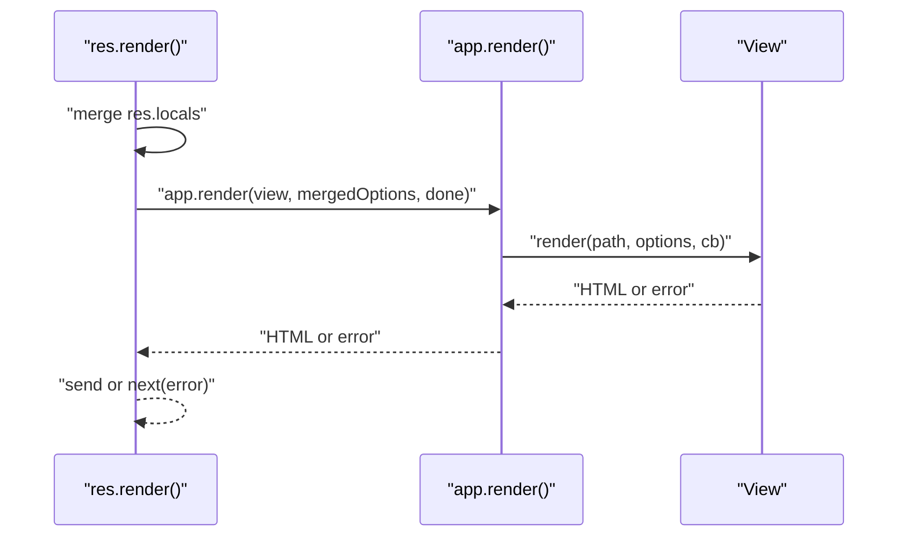
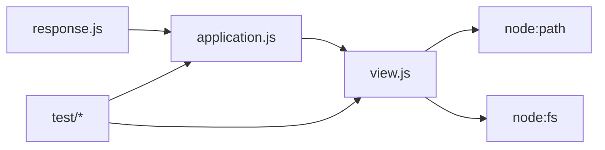

# View Resolution & Path Lookup

<cite>
**Referenced Files in This Document**
- [view.js](file://lib/view.js)
- [application.js](file://lib/application.js)
- [response.js](file://lib/response.js)
- [app.render.js](file://test/app.render.js)
- [res.render.js](file://test/res.render.js)
- [404.ejs](file://examples/error-pages/views/404.ejs)
- [index.ejs](file://examples/route-separation/views/users/index.ejs)
- [edit.ejs](file://examples/mvc/controllers/pet/views/edit.ejs)
- [name.tmpl](file://test/fixtures/local_layout/user.tmpl)
- [user.tmpl](file://test/fixtures/default_layout/name.tmpl)
</cite>

## Table of Contents
1. [Introduction](#introduction)
2. [Project Structure](#project-structure)
3. [Core Components](#core-components)
4. [Architecture Overview](#architecture-overview)
5. [Detailed Component Analysis](#detailed-component-analysis)
6. [Dependency Analysis](#dependency-analysis)
7. [Performance Considerations](#performance-considerations)
8. [Troubleshooting Guide](#troubleshooting-guide)
9. [Conclusion](#conclusion)

## Introduction
This document explains how Express.js resolves views and looks up template files. It focuses on the View class and its methods View.prototype.lookup() and View.prototype.resolve(), detailing how Express discovers templates across root directories, handles extensions, and applies index fallback patterns. It also covers how res.render delegates to app.render, how multiple view roots are searched, and practical examples drawn from the repository’s examples and tests.

## Project Structure
Express organizes view resolution around three primary modules:
- View class: encapsulates template discovery, engine loading, and rendering
- Application: holds settings (views, view engine), caches views, and renders via View
- Response: exposes res.render() as the user-facing API that forwards to app.render()

**Diagram sources**
- [response.js:894-918](file://lib/response.js#L894-L918)
- [application.js:522-575](file://lib/application.js#L522-L575)
- [view.js:52-95](file://lib/view.js#L52-L95)
- [view.js:104-123](file://lib/view.js#L104-L123)
- [view.js:169-187](file://lib/view.js#L169-L187)

**Section sources**
- [response.js:894-918](file://lib/response.js#L894-L918)
- [application.js:522-575](file://lib/application.js#L522-L575)
- [view.js:52-95](file://lib/view.js#L52-L95)

## Core Components
- View class: constructs a view with a name and options, loads the appropriate template engine, and performs path lookup and resolution.
- View.prototype.lookup(): iterates over configured root(s), resolves the target path, and delegates to View.prototype.resolve().
- View.prototype.resolve(): checks for an exact match and falls back to index.<ext> if applicable.
- app.render(): creates or retrieves a cached View, validates the resolved path, and triggers rendering.
- res.render(): the public API that merges locals and delegates to app.render().

Key behaviors:
- Extension resolution: if no extension is provided, the default engine determines the extension.
- Root traversal: supports a single root or an array of roots; iteration stops upon first successful match.
- Index fallback: when a directory path is provided, Express attempts index.<ext> inside that directory.
- Error reporting: provides explicit failure messages indicating which root(s) were searched.

**Section sources**
- [view.js:52-95](file://lib/view.js#L52-L95)
- [view.js:104-123](file://lib/view.js#L104-L123)
- [view.js:169-187](file://lib/view.js#L169-L187)
- [application.js:522-575](file://lib/application.js#L522-L575)
- [response.js:894-918](file://lib/response.js#L894-L918)

## Architecture Overview
The view resolution pipeline connects HTTP requests to template rendering through a small set of cohesive modules. The flow below maps the actual code paths.

**Diagram sources**
- [response.js:894-918](file://lib/response.js#L894-L918)
- [application.js:522-575](file://lib/application.js#L522-L575)
- [view.js:52-95](file://lib/view.js#L52-L95)
- [view.js:104-123](file://lib/view.js#L104-L123)
- [view.js:169-187](file://lib/view.js#L169-L187)
- [view.js:197-205](file://lib/view.js#L197-L205)

## Detailed Component Analysis

### View Class and Constructor
The View constructor prepares the view for resolution:
- Determines extension from either the name or the default engine
- Loads the template engine if not yet cached
- Calls lookup() to compute the final path

**Diagram sources**
- [view.js:52-95](file://lib/view.js#L52-L95)
- [view.js:104-123](file://lib/view.js#L104-L123)
- [view.js:169-187](file://lib/view.js#L169-L187)
- [view.js:133-159](file://lib/view.js#L133-L159)

**Section sources**
- [view.js:52-95](file://lib/view.js#L52-L95)

### View.prototype.lookup()
Lookup resolves the logical path against each configured root and then delegates to resolve():
- Accepts a file name (possibly without extension)
- Iterates roots (converted to an array)
- Uses path.resolve(root, name) to form a candidate path
- Extracts directory and base file name and calls resolve(dir, file)

**Diagram sources**
- [view.js:104-123](file://lib/view.js#L104-L123)

**Section sources**
- [view.js:104-123](file://lib/view.js#L104-L123)

### View.prototype.resolve()
Resolve implements the core file existence check and index fallback:
- Exact match: join(dir, file) and statSync to confirm file existence
- Index fallback: join(dir, stem, "index" + ext) where stem is basename(file, ext)
- Returns the first matching path or undefined

**Diagram sources**
- [view.js:169-187](file://lib/view.js#L169-L187)
- [view.js:197-205](file://lib/view.js#L197-L205)

**Section sources**
- [view.js:169-187](file://lib/view.js#L169-L187)
- [view.js:197-205](file://lib/view.js#L197-L205)

### app.render() and Error Handling
app.render() coordinates view creation, caching, and rendering:
- Merges app.locals and per-request options
- Creates a View with defaultEngine, root, and engines
- Validates that a path was found; otherwise throws a descriptive error
- Renders via view.render() and invokes the callback

**Diagram sources**
- [application.js:522-575](file://lib/application.js#L522-L575)
- [view.js:52-95](file://lib/view.js#L52-L95)
- [view.js:133-159](file://lib/view.js#L133-L159)

**Section sources**
- [application.js:522-575](file://lib/application.js#L522-L575)

### res.render() API
res.render() is the public interface:
- Merges res.locals into options
- Defaults to sending the rendered string or forwarding errors to next()
- Delegates to app.render()

**Diagram sources**
- [response.js:894-918](file://lib/response.js#L894-L918)
- [application.js:522-575](file://lib/application.js#L522-L575)

**Section sources**
- [response.js:894-918](file://lib/response.js#L894-L918)

### Template Hierarchy and Naming Conventions
- Directory-based views: when a directory path is provided, Express attempts index.<ext> inside that directory.
- Single-file views: Express checks for the exact file path first.
- Extension precedence: if no extension is provided, the default engine sets the extension.
- Multiple roots: when views is an array, Express searches roots in order and uses the first match.

Examples from the repository:
- Directory-based index fallback: rendering "blog/post" resolves to index.<ext> inside the "blog/post" directory.
- Absolute paths: passing an absolute path to render allows bypassing root resolution.
- Multiple roots: tests demonstrate searching multiple directories and selecting the first match.

**Section sources**
- [app.render.js:48-59](file://test/app.render.js#L48-L59)
- [app.render.js:10-33](file://test/app.render.js#L10-L33)
- [app.render.js:152-200](file://test/app.render.js#L152-L200)
- [res.render.js:103-110](file://test/res.render.js#L103-L110)
- [res.render.js:28-37](file://test/res.render.js#L28-L37)

### Examples: Nested Directory Structures
- Users index page: a nested route separation example renders a users index view that includes shared partials.
- MVC controller views: nested controller-specific views illustrate hierarchical organization.
- Error pages: nested error templates include shared header/footer partials.

These examples demonstrate how templates are organized and included across nested directories.

**Section sources**
- [index.ejs:1-15](file://examples/route-separation/views/users/index.ejs#L1-L15)
- [edit.ejs:1-18](file://examples/mvc/controllers/pet/views/edit.ejs#L1-L18)
- [404.ejs:1-4](file://examples/error-pages/views/404.ejs#L1-L4)

## Dependency Analysis
The view resolution system exhibits low coupling and clear responsibilities:
- response.js depends on application.js for rendering
- application.js depends on view.js for path resolution and rendering
- view.js depends on node:path and node:fs for path manipulation and filesystem checks
- Tests validate behavior across absolute paths, default engines, index fallbacks, and multiple roots

**Diagram sources**
- [response.js:894-918](file://lib/response.js#L894-L918)
- [application.js:522-575](file://lib/application.js#L522-L575)
- [view.js:16-30](file://lib/view.js#L16-L30)

**Section sources**
- [response.js:894-918](file://lib/response.js#L894-L918)
- [application.js:522-575](file://lib/application.js#L522-L575)
- [view.js:16-30](file://lib/view.js#L16-L30)

## Performance Considerations
- Filesystem checks: View.prototype.resolve() performs synchronous stat checks for each candidate path. On large hierarchies or slow filesystems, this can add latency.
- Multiple roots: Searching multiple roots increases the number of stat calls proportionally to the number of roots.
- Caching: Enabling the view cache reduces repeated View instantiation and path resolution overhead. The cache is controlled by the "view cache" setting.
- Engine loading: Engines are cached in app.engines after first load, avoiding repeated require() calls.

Optimization strategies:
- Prefer a single root when possible to minimize iterations.
- Enable view cache in production to avoid repeated resolution.
- Keep template hierarchies reasonably shallow and avoid excessive nesting.
- Use absolute paths for frequently accessed templates to bypass root traversal.

**Section sources**
- [application.js:522-575](file://lib/application.js#L522-L575)
- [view.js:169-187](file://lib/view.js#L169-L187)

## Troubleshooting Guide
Common issues and resolutions:
- Missing extension and default engine: If neither the name nor the default engine provides an extension, construction fails early.
- No matching view found: When none of the roots contain the requested file or index fallback, app.render() throws a descriptive error indicating which root(s) were searched.
- Non-engine module: Attempting to use a module that does not provide a view engine leads to an error during engine loading.
- Directory without index: Rendering a directory path without an index.<ext> results in a lookup failure.

Validation references:
- Construction error for missing extension
- Lookup failure with explicit root list
- Engine loading error for non-conforming modules

**Section sources**
- [view.js:60-62](file://lib/view.js#L60-L62)
- [application.js:558-565](file://lib/application.js#L558-L565)
- [app.render.js:39-51](file://test/app.render.js#L39-L51)
- [app.render.js:82-93](file://test/app.render.js#L82-L93)

## Conclusion
Express view resolution centers on a predictable, layered process: res.render() delegates to app.render(), which constructs a View and relies on View.lookup() and View.resolve() to locate templates. The algorithm supports single-file and directory-based templates, extension inference, and multiple root directories. Understanding these mechanics enables efficient organization of templates, accurate error diagnostics, and informed decisions about caching and performance.