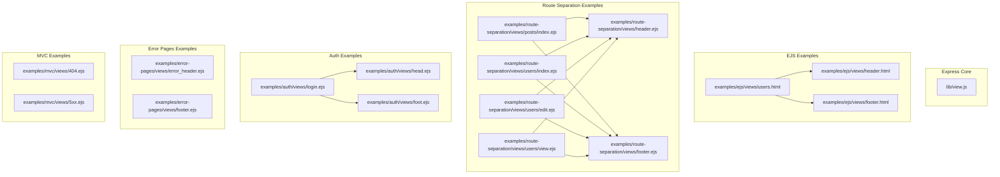
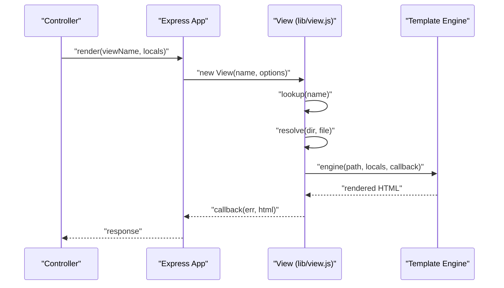
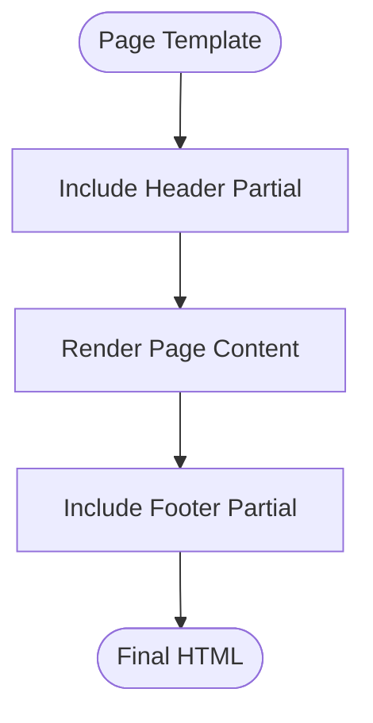
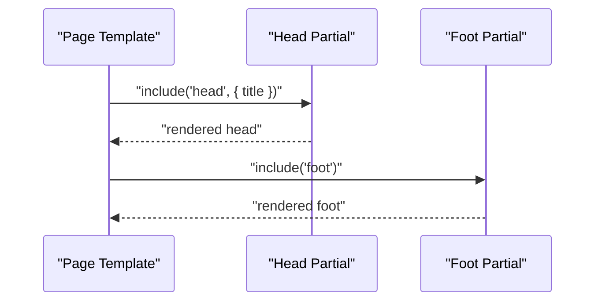
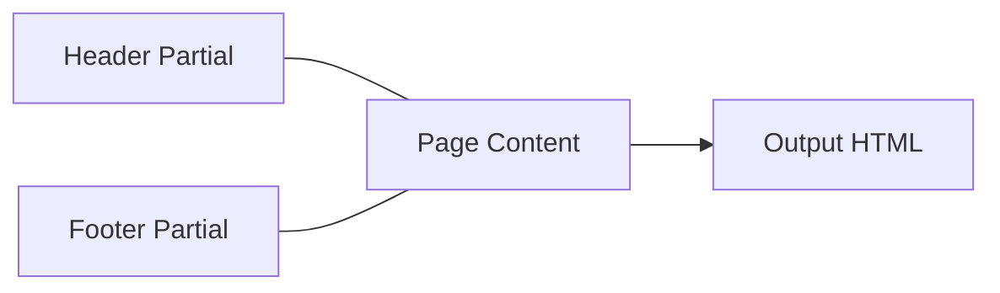
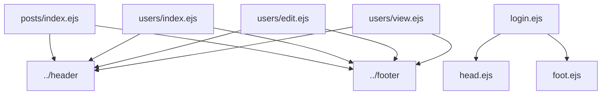
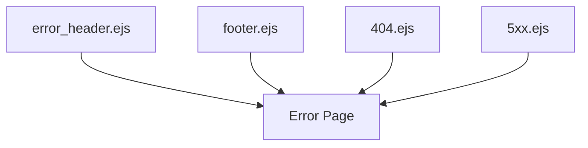
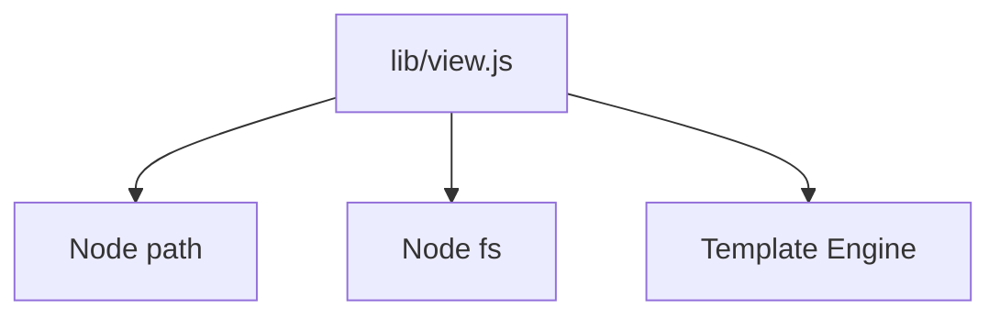

# Layout and Partial Systems

<cite>
**Referenced Files in This Document**
- [view.js](file://lib/view.js)
- [header.ejs](file://examples/ejs/views/header.html)
- [footer.ejs](file://examples/ejs/views/footer.html)
- [users.html](file://examples/ejs/views/users.html)
- [header.ejs](file://examples/route-separation/views/header.ejs)
- [footer.ejs](file://examples/route-separation/views/footer.ejs)
- [posts/index.ejs](file://examples/route-separation/views/posts/index.ejs)
- [users/index.ejs](file://examples/route-separation/views/users/index.ejs)
- [users/edit.ejs](file://examples/route-separation/views/users/edit.ejs)
- [users/view.ejs](file://examples/route-separation/views/users/view.ejs)
- [login.ejs](file://examples/auth/views/login.ejs)
- [head.ejs](file://examples/auth/views/head.ejs)
- [foot.ejs](file://examples/auth/views/foot.ejs)
- [error_header.ejs](file://examples/error-pages/views/error_header.ejs)
- [footer.ejs](file://examples/error-pages/views/footer.ejs)
- [404.ejs](file://examples/mvc/views/404.ejs)
- [5xx.ejs](file://examples/mvc/views/5xx.ejs)
</cite>

## Table of Contents
1. [Introduction](#introduction)
2. [Project Structure](#project-structure)
3. [Core Components](#core-components)
4. [Architecture Overview](#architecture-overview)
5. [Detailed Component Analysis](#detailed-component-analysis)
6. [Dependency Analysis](#dependency-analysis)
7. [Performance Considerations](#performance-considerations)
8. [Troubleshooting Guide](#troubleshooting-guide)
9. [Conclusion](#conclusion)
10. [Appendices](#appendices)

## Introduction
This document explains how Express.js supports layout and partial template systems, focusing on layout inheritance patterns, partial template inclusion, and component composition strategies. It synthesizes real examples from the repository to demonstrate how templates are structured, composed, and rendered. Topics include:
- How to build reusable template components and manage template hierarchies
- How partials are included and passed parameters
- Scope management and template composition techniques
- Practical examples of complex layouts, nested partials, and dynamic composition
- Template organization, naming conventions, and best practices for maintainable template hierarchies

## Project Structure
Express’s view rendering pipeline is implemented in a dedicated view module. Templates in the examples illustrate common patterns for partial inclusion and layout composition across EJS and HTML templates.

**Diagram sources**
- [view.js:104-123](file://lib/view.js#L104-L123)
- [header.ejs:1-10](file://examples/ejs/views/header.html#L1-L10)
- [footer.ejs:1-3](file://examples/ejs/views/footer.html#L1-L3)
- [users.html:1-11](file://examples/ejs/views/users.html#L1-L11)
- [header.ejs:1-10](file://examples/route-separation/views/header.ejs#L1-L10)
- [footer.ejs:1-3](file://examples/route-separation/views/footer.ejs#L1-L3)
- [posts/index.ejs:1-13](file://examples/route-separation/views/posts/index.ejs#L1-L13)
- [users/index.ejs:1-15](file://examples/route-separation/views/users/index.ejs#L1-L15)
- [users/edit.ejs:1-24](file://examples/route-separation/views/users/edit.ejs#L1-L24)
- [users/view.ejs:1-10](file://examples/route-separation/views/users/view.ejs#L1-L10)
- [login.ejs:1-22](file://examples/auth/views/login.ejs#L1-L22)
- [head.ejs:1-21](file://examples/auth/views/head.ejs#L1-L21)
- [foot.ejs:1-3](file://examples/auth/views/foot.ejs#L1-L3)
- [error_header.ejs:1-11](file://examples/error-pages/views/error_header.ejs#L1-L11)
- [footer.ejs:1-3](file://examples/error-pages/views/footer.ejs#L1-L3)
- [404.ejs:1-14](file://examples/mvc/views/404.ejs#L1-L14)
- [5xx.ejs:1-14](file://examples/mvc/views/5xx.ejs#L1-L14)

**Section sources**
- [view.js:104-123](file://lib/view.js#L104-L123)
- [users.html:1-11](file://examples/ejs/views/users.html#L1-L11)
- [posts/index.ejs:1-13](file://examples/route-separation/views/posts/index.ejs#L1-L13)
- [users/index.ejs:1-15](file://examples/route-separation/views/users/index.ejs#L1-L15)
- [login.ejs:1-22](file://examples/auth/views/login.ejs#L1-L22)

## Core Components
- View resolution and rendering: The view module encapsulates template discovery, engine loading, and synchronous-to-asynchronous normalization during rendering. It supports root-based lookup and index fallback resolution.
- Partial inclusion patterns: Examples demonstrate including partials via relative paths and passing scoped parameters (for example, title and message).

Key responsibilities:
- Discovering the correct template path given roots and extensions
- Resolving index fallbacks for directory-based templates
- Loading template engines and invoking render callbacks asynchronously

**Section sources**
- [view.js:52-95](file://lib/view.js#L52-L95)
- [view.js:104-123](file://lib/view.js#L104-L123)
- [view.js:133-159](file://lib/view.js#L133-L159)
- [view.js:169-187](file://lib/view.js#L169-L187)

## Architecture Overview
The rendering flow connects controller actions to the view layer, which resolves templates and renders them with provided locals.

**Diagram sources**
- [view.js:52-95](file://lib/view.js#L52-L95)
- [view.js:104-123](file://lib/view.js#L104-L123)
- [view.js:133-159](file://lib/view.js#L133-L159)
- [view.js:169-187](file://lib/view.js#L169-L187)

## Detailed Component Analysis

### Layout Inheritance Patterns
Layout inheritance is achieved by composing pages from reusable partials. Typical patterns:
- Page-specific templates include a shared header and footer partials
- Route separation demonstrates including ../header and ../footer from nested routes
- Error pages reuse a shared error header and footer

**Diagram sources**
- [users.html:1-11](file://examples/ejs/views/users.html#L1-L11)
- [posts/index.ejs:1-13](file://examples/route-separation/views/posts/index.ejs#L1-L13)
- [users/index.ejs:1-15](file://examples/route-separation/views/users/index.ejs#L1-L15)
- [users/edit.ejs:1-24](file://examples/route-separation/views/users/edit.ejs#L1-L24)
- [users/view.ejs:1-10](file://examples/route-separation/views/users/view.ejs#L1-L10)
- [error_header.ejs:1-11](file://examples/error-pages/views/error_header.ejs#L1-L11)
- [footer.ejs:1-3](file://examples/error-pages/views/footer.ejs#L1-L3)

**Section sources**
- [users.html:1-11](file://examples/ejs/views/users.html#L1-L11)
- [posts/index.ejs:1-13](file://examples/route-separation/views/posts/index.ejs#L1-L13)
- [users/index.ejs:1-15](file://examples/route-separation/views/users/index.ejs#L1-L15)
- [users/edit.ejs:1-24](file://examples/route-separation/views/users/edit.ejs#L1-L24)
- [users/view.ejs:1-10](file://examples/route-separation/views/users/view.ejs#L1-L10)
- [error_header.ejs:1-11](file://examples/error-pages/views/error_header.ejs#L1-L11)
- [footer.ejs:1-3](file://examples/error-pages/views/footer.ejs#L1-L3)

### Partial Template Inclusion and Parameters
Partials are included with optional scoped parameters. Examples show:
- Passing a title variable to a head partial
- Rendering lists and forms inside page templates
- Using include statements with relative paths

**Diagram sources**
- [login.ejs:2-21](file://examples/auth/views/login.ejs#L2-L21)
- [head.ejs:1-21](file://examples/auth/views/head.ejs#L1-L21)
- [foot.ejs:1-3](file://examples/auth/views/foot.ejs#L1-L3)

**Section sources**
- [login.ejs:2-21](file://examples/auth/views/login.ejs#L2-L21)
- [head.ejs:1-21](file://examples/auth/views/head.ejs#L1-L21)
- [foot.ejs:1-3](file://examples/auth/views/foot.ejs#L1-L3)

### Component Composition Strategies
Reusable components are built from small, focused partials:
- Header and footer partials encapsulate common markup
- Route-specific templates focus on content rendering
- Error templates centralize error presentation

**Diagram sources**
- [header.ejs:1-10](file://examples/ejs/views/header.html#L1-L10)
- [footer.ejs:1-3](file://examples/ejs/views/footer.html#L1-L3)
- [users.html:1-11](file://examples/ejs/views/users.html#L1-L11)

**Section sources**
- [header.ejs:1-10](file://examples/ejs/views/header.html#L1-L10)
- [footer.ejs:1-3](file://examples/ejs/views/footer.html#L1-L3)
- [users.html:1-11](file://examples/ejs/views/users.html#L1-L11)

### Nested Partials and Dynamic Composition
Nested partials are included from subdirectories, enabling modular composition:
- Posts and users routes include ../header and ../footer
- Authentication login page composes head and foot partials with scoped parameters

**Diagram sources**
- [posts/index.ejs:1-13](file://examples/route-separation/views/posts/index.ejs#L1-L13)
- [users/index.ejs:1-15](file://examples/route-separation/views/users/index.ejs#L1-L15)
- [users/edit.ejs:1-24](file://examples/route-separation/views/users/edit.ejs#L1-L24)
- [users/view.ejs:1-10](file://examples/route-separation/views/users/view.ejs#L1-L10)
- [login.ejs:2-21](file://examples/auth/views/login.ejs#L2-L21)
- [head.ejs:1-21](file://examples/auth/views/head.ejs#L1-L21)
- [foot.ejs:1-3](file://examples/auth/views/foot.ejs#L1-L3)

**Section sources**
- [posts/index.ejs:1-13](file://examples/route-separation/views/posts/index.ejs#L1-L13)
- [users/index.ejs:1-15](file://examples/route-separation/views/users/index.ejs#L1-L15)
- [users/edit.ejs:1-24](file://examples/route-separation/views/users/edit.ejs#L1-L24)
- [users/view.ejs:1-10](file://examples/route-separation/views/users/view.ejs#L1-L10)
- [login.ejs:2-21](file://examples/auth/views/login.ejs#L2-L21)

### Scope Management and Locals
Locals passed to render are available inside partials. Examples demonstrate:
- title being used inside head partials
- message being used inside login page partials
- user and posts data being iterated inside page templates

Best practices:
- Keep partials self-contained and parameterized
- Avoid global state; pass only required data
- Use consistent naming for shared variables across partials

**Section sources**
- [login.ejs:2-21](file://examples/auth/views/login.ejs#L2-L21)
- [head.ejs:1-21](file://examples/auth/views/head.ejs#L1-L21)
- [users.html:1-11](file://examples/ejs/views/users.html#L1-L11)

### Error and Specialized Layouts
Error pages and specialized layouts reuse common partials:
- Error header and footer partials standardize error presentation
- MVC 404 and 500 templates demonstrate standalone error layouts

**Diagram sources**
- [error_header.ejs:1-11](file://examples/error-pages/views/error_header.ejs#L1-L11)
- [footer.ejs:1-3](file://examples/error-pages/views/footer.ejs#L1-L3)
- [404.ejs:1-14](file://examples/mvc/views/404.ejs#L1-L14)
- [5xx.ejs:1-14](file://examples/mvc/views/5xx.ejs#L1-L14)

**Section sources**
- [error_header.ejs:1-11](file://examples/error-pages/views/error_header.ejs#L1-L11)
- [footer.ejs:1-3](file://examples/error-pages/views/footer.ejs#L1-L3)
- [404.ejs:1-14](file://examples/mvc/views/404.ejs#L1-L14)
- [5xx.ejs:1-14](file://examples/mvc/views/5xx.ejs#L1-L14)

## Dependency Analysis
The view module depends on Node path and filesystem APIs to locate templates and engines. Rendering is delegated to the selected template engine, which is discovered by extension.

**Diagram sources**
- [view.js:16-18](file://lib/view.js#L16-L18)
- [view.js:75-88](file://lib/view.js#L75-L88)

**Section sources**
- [view.js:16-18](file://lib/view.js#L16-L18)
- [view.js:75-88](file://lib/view.js#L75-L88)

## Performance Considerations
- Minimize deep nesting of partials to reduce include overhead
- Reuse common partials to avoid duplication and improve maintainability
- Prefer asynchronous rendering and avoid heavy computation in templates
- Cache compiled templates when using engines that support it

## Troubleshooting Guide
Common issues and resolutions:
- Missing extension or default engine: Ensure a default engine is configured or templates include explicit extensions
- Incorrect partial paths: Verify relative paths from the including template; use ../ to move up directories
- Engine not found: Confirm the engine module exports a compatible render function
- Index fallback not resolving: Ensure directory-based templates follow the index.<ext> convention

**Section sources**
- [view.js:60-62](file://lib/view.js#L60-L62)
- [view.js:83-85](file://lib/view.js#L83-L85)
- [view.js:169-187](file://lib/view.js#L169-L187)

## Conclusion
Express’s layout and partial systems enable modular, maintainable view architectures. By composing pages from shared header and footer partials, parameterizing partials with locals, and organizing templates with consistent naming and structure, teams can build scalable and readable applications. The examples in this repository demonstrate proven patterns for layout inheritance, nested partials, and dynamic composition.

## Appendices

### Best Practices for Maintainable Template Hierarchies
- Naming conventions
  - Use descriptive names for partials (for example, head, foot, header, footer)
  - Group related templates under route-specific directories
- Organization
  - Centralize shared partials in a common directory
  - Use relative paths consistently; include ../header and ../footer from nested routes
- Parameterization
  - Pass only required data to partials via locals
  - Avoid global state inside partials
- Error handling
  - Provide dedicated error layouts and partials
  - Standardize error presentation across the application

[No sources needed since this section provides general guidance]