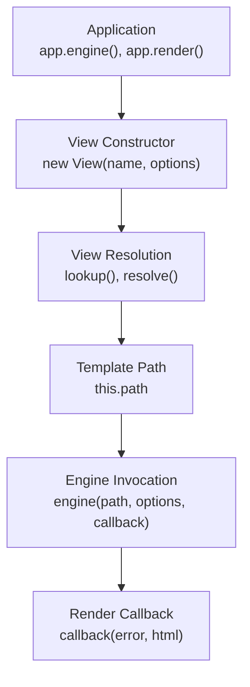
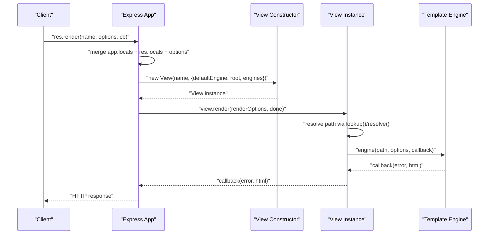
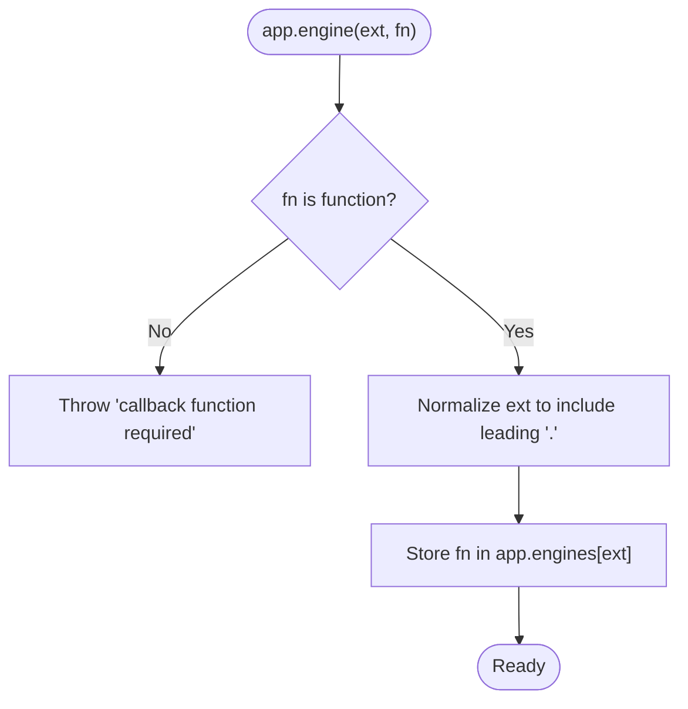
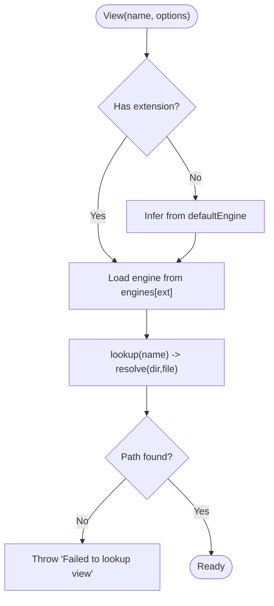
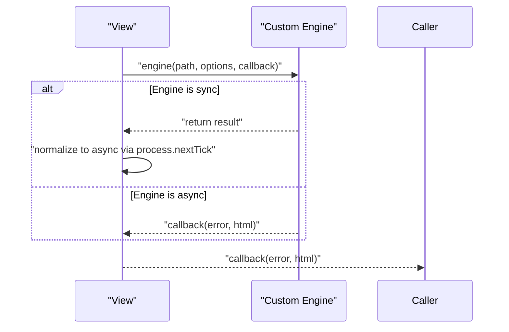
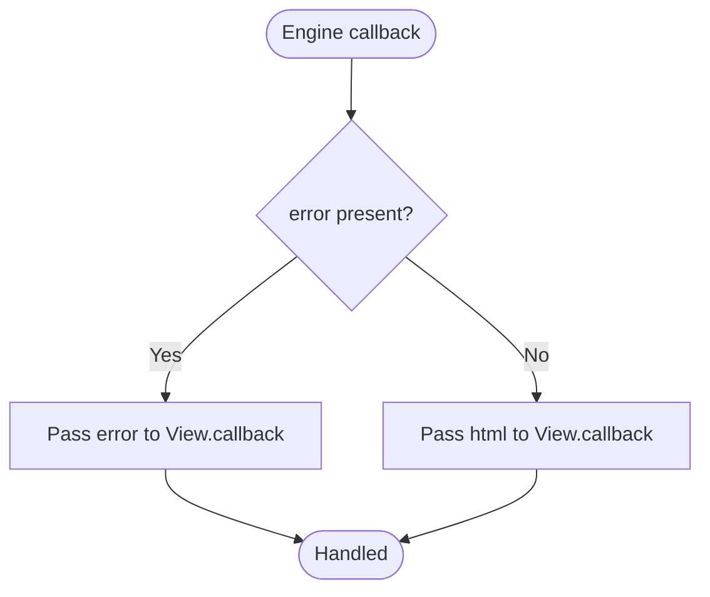
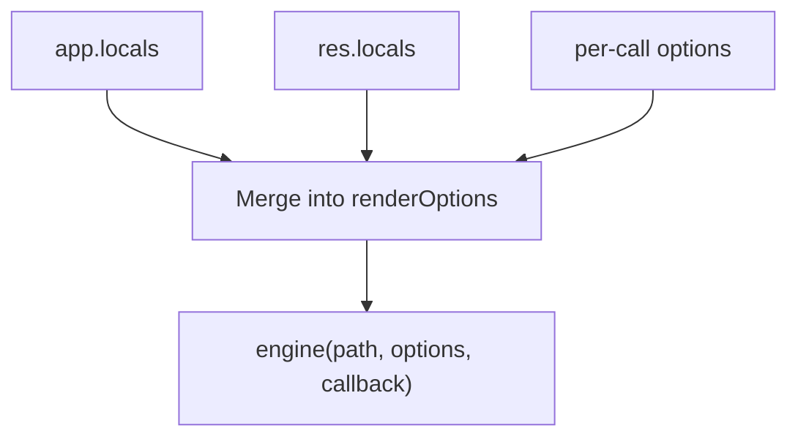
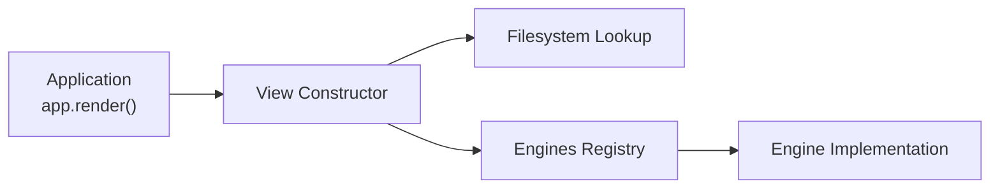

# Custom Engine Development

<cite>
**Referenced Files in This Document**
- [lib/application.js](file://lib/application.js)
- [lib/view.js](file://lib/view.js)
- [examples/ejs/index.js](file://examples/ejs/index.js)
- [examples/view-constructor/index.js](file://examples/view-constructor/index.js)
- [examples/view-constructor/github-view.js](file://examples/view-constructor/github-view.js)
- [test/app.engine.js](file://test/app.engine.js)
- [test/res.render.js](file://test/res.render.js)
- [test/app.render.js](file://test/app.render.js)
- [test/support/tmpl.js](file://test/support/tmpl.js)
- [test/fixtures/user.tmpl](file://test/fixtures/user.tmpl)
</cite>

## Table of Contents
1. [Introduction](#introduction)
2. [Project Structure](#project-structure)
3. [Core Components](#core-components)
4. [Architecture Overview](#architecture-overview)
5. [Detailed Component Analysis](#detailed-component-analysis)
6. [Dependency Analysis](#dependency-analysis)
7. [Performance Considerations](#performance-considerations)
8. [Troubleshooting Guide](#troubleshooting-guide)
9. [Conclusion](#conclusion)
10. [Appendices](#appendices)

## Introduction
This document explains how to develop custom template engines for Express.js. It covers the template engine interface, callback signatures, synchronous-to-asynchronous normalization, engine registration, render method requirements, error handling, configuration options, global variable sharing, compilation caching, and integration with Express’s view system. It also provides step-by-step examples, testing strategies, performance tips, and debugging techniques.

## Project Structure
Express exposes two primary integration points for custom engines:
- Application-level engine registration via app.engine(ext, fn)
- Custom view constructors via app.set('view', CustomView)

Key runtime behaviors:
- app.render merges app.locals, res.locals, and per-render options into a single renderOptions object
- View resolves the physical template path and delegates rendering to the selected engine
- The engine callback is invoked with a normalized asynchronous signature

**Diagram sources**
- [lib/application.js:522-575](file://lib/application.js#L522-L575)
- [lib/view.js:104-123](file://lib/view.js#L104-L123)
- [lib/view.js:133-159](file://lib/view.js#L133-L159)

**Section sources**
- [lib/application.js:522-575](file://lib/application.js#L522-L575)
- [lib/view.js:104-159](file://lib/view.js#L104-L159)

## Core Components
- Template engine function signature
  - Path-based engines: (path, options, callback)
  - String-based engines: (str, options, callback)
  - Callback semantics: callback(error, result) where result is the rendered HTML string
- Engine registration
  - app.engine(ext, fn) stores fn in app.engines[ext] for later resolution
  - Accepts extensions with or without leading dot
- View resolution and rendering
  - View constructor receives { defaultEngine, root, engines }
  - View.prototype.render invokes engine(path, options, callback) and normalizes sync callbacks to async
- Global variable sharing
  - app.render merges app.locals, res.locals, and per-call options into renderOptions
  - Engines receive merged options and can access shared variables

**Section sources**
- [lib/application.js:294-308](file://lib/application.js#L294-L308)
- [lib/application.js:522-575](file://lib/application.js#L522-L575)
- [lib/view.js:52-95](file://lib/view.js#L52-L95)
- [lib/view.js:133-159](file://lib/view.js#L133-L159)
- [test/res.render.js:67-95](file://test/res.render.js#L67-L95)
- [test/res.render.js:251-281](file://test/res.render.js#L251-L281)

## Architecture Overview
The rendering pipeline integrates application settings, view resolution, and engine invocation.

**Diagram sources**
- [lib/application.js:522-575](file://lib/application.js#L522-L575)
- [lib/view.js:104-159](file://lib/view.js#L104-L159)

## Detailed Component Analysis

### Template Engine Interface and Registration
- Signature requirement
  - Path-based engines: (path, options, callback)
  - String-based engines: (str, options, callback)
  - Callback must be invoked as callback(error, html)
- Registration
  - app.engine(ext, fn) validates fn is a function and stores it under engines[ext]
  - Works with or without leading dot
- Default engine behavior
  - If a file lacks extension, Express uses app.get('view engine') to infer the extension and loads the corresponding engine

**Diagram sources**
- [lib/application.js:294-308](file://lib/application.js#L294-L308)
- [test/app.engine.js:32-37](file://test/app.engine.js#L32-L37)

**Section sources**
- [lib/application.js:294-308](file://lib/application.js#L294-L308)
- [test/app.engine.js:18-51](file://test/app.engine.js#L18-L51)

### View Resolution and Rendering
- View constructor
  - Receives { defaultEngine, root, engines }
  - Infers extension and resolves engine via engines[ext]
  - Resolves physical path via lookup() and resolve()
- Rendering
  - View.prototype.render invokes engine(path, options, callback)
  - Normalizes synchronous engines to asynchronous using process.nextTick
- Path resolution rules
  - lookup() iterates roots and resolves the file path
  - resolve() checks exact file and falls back to index.<ext>

**Diagram sources**
- [lib/view.js:52-95](file://lib/view.js#L52-L95)
- [lib/view.js:104-123](file://lib/view.js#L104-L123)
- [lib/view.js:133-159](file://lib/view.js#L133-L159)

**Section sources**
- [lib/view.js:52-159](file://lib/view.js#L52-L159)

### Render Method Implementation Patterns
- Path-based engines
  - Read file from disk, transform, and invoke callback
  - Example pattern: read file, replace placeholders, callback with error or result
- String-based engines
  - Receive raw template string and options; render immediately
  - Useful for remote templates or in-memory templates
- Asynchronous normalization
  - Even if the engine runs synchronously, View.prototype.render ensures the callback is invoked asynchronously

**Diagram sources**
- [lib/view.js:133-159](file://lib/view.js#L133-L159)
- [test/support/tmpl.js:5-23](file://test/support/tmpl.js#L5-L23)

**Section sources**
- [lib/view.js:133-159](file://lib/view.js#L133-L159)
- [test/support/tmpl.js:5-23](file://test/support/tmpl.js#L5-L23)

### Error Handling Strategies
- Engine errors
  - Engines must invoke callback with an error object as the first argument
  - Errors bubble up to the application error handler or the res.render callback
- Missing engines
  - If no engine is registered for an extension, Express throws “does not provide a view engine”
- Missing default engine
  - If a template has no extension and no default engine is set, Express throws “No default engine was specified”

**Diagram sources**
- [lib/view.js:139-156](file://lib/view.js#L139-L156)
- [test/res.render.js:39-65](file://test/res.render.js#L39-L65)

**Section sources**
- [lib/view.js:133-159](file://lib/view.js#L133-L159)
- [test/res.render.js:39-65](file://test/res.render.js#L39-L65)

### Engine Configuration Options and Global Variables
- Global variables
  - app.locals are merged into renderOptions
  - res.locals override app.locals
  - per-call options override both
- Settings
  - app.set('view engine') sets the default extension for unnamed templates
  - app.set('views') sets the root path(s) for template lookup
  - app.set('view cache') toggles view instance caching
- Custom view constructor
  - app.set('view', CustomView) allows full control over resolution and rendering

**Diagram sources**
- [lib/application.js:536-541](file://lib/application.js#L536-L541)
- [test/res.render.js:67-95](file://test/res.render.js#L67-L95)
- [test/res.render.js:251-281](file://test/res.render.js#L251-L281)

**Section sources**
- [lib/application.js:536-541](file://lib/application.js#L536-L541)
- [test/res.render.js:67-95](file://test/res.render.js#L67-L95)
- [test/res.render.js:251-281](file://test/res.render.js#L251-L281)

### Step-by-Step: Creating a Custom Engine
- Choose a signature
  - Path-based: (path, options, callback)
  - String-based: (str, options, callback)
- Implement the engine
  - Read/transform template
  - Invoke callback(error, html)
- Register the engine
  - app.engine('.ext', engineFn)
  - Or alias an existing engine for a different extension
- Test the engine
  - Use app.render or res.render with a fixture file
  - Verify variable substitution and error propagation

**Section sources**
- [test/app.engine.js:18-30](file://test/app.engine.js#L18-L30)
- [test/app.engine.js:39-51](file://test/app.engine.js#L39-L51)
- [test/support/tmpl.js:5-23](file://test/support/tmpl.js#L5-L23)

### Step-by-Step: Integrating with Express View System
- Set view paths and default engine
  - app.set('views', path)
  - app.set('view engine', 'ext')
- Register engine
  - app.engine('.ext', engineFn)
- Render
  - res.render('name', options, cb) or res.render('name.ext', options)

**Section sources**
- [examples/ejs/index.js:23-36](file://examples/ejs/index.js#L23-L36)
- [test/res.render.js:132-147](file://test/res.render.js#L132-L147)

### Step-by-Step: Custom View Constructor
- Define a constructor that accepts (name, options)
  - options.engines contains the registered engines
  - options.root is the configured views path(s)
- Implement render(options, callback)
  - Fetch or resolve the template content
  - Call the engine with the content and options
- Register the constructor
  - app.set('view', CustomView)

**Section sources**
- [examples/view-constructor/github-view.js:23-53](file://examples/view-constructor/github-view.js#L23-L53)
- [examples/view-constructor/index.js:14-30](file://examples/view-constructor/index.js#L14-L30)
- [test/app.render.js:206-227](file://test/app.render.js#L206-L227)

### Testing Engine Implementations
- Unit tests for app.engine
  - Verify engine mapping and behavior with and without leading dot
  - Verify error when callback is missing
- Integration tests for res.render
  - Verify precedence of res.locals vs app.locals vs per-call options
  - Verify error propagation to callback and middleware
  - Verify index.<ext> fallback and multiple views paths

**Section sources**
- [test/app.engine.js:18-51](file://test/app.engine.js#L18-L51)
- [test/res.render.js:67-95](file://test/res.render.js#L67-L95)
- [test/res.render.js:251-281](file://test/res.render.js#L251-L281)
- [test/res.render.js:339-357](file://test/res.render.js#L339-L357)

## Dependency Analysis
- Application depends on View for resolution and rendering
- View depends on engines registry and filesystem to locate templates
- Engines depend on external libraries or internal logic to produce HTML

**Diagram sources**
- [lib/application.js:522-575](file://lib/application.js#L522-L575)
- [lib/view.js:104-159](file://lib/view.js#L104-L159)

**Section sources**
- [lib/application.js:522-575](file://lib/application.js#L522-L575)
- [lib/view.js:104-159](file://lib/view.js#L104-L159)

## Performance Considerations
- Enable view caching
  - app.enable('view cache') or app.set('view cache', true) caches View instances
  - Per-call cache: app.render(name, { cache: true }, cb)
- Minimize filesystem reads
  - Prefer string-based engines for in-memory templates
  - Cache compiled templates when supported by the engine
- Avoid blocking operations
  - Ensure engines are asynchronous; View.prototype.render normalizes sync engines
- Reduce allocations
  - Reuse buffers and avoid repeated string concatenation in hot paths

[No sources needed since this section provides general guidance]

## Troubleshooting Guide
- “No default engine was specified”
  - Occurs when rendering a template without extension and no default engine is set
  - Fix: set app.set('view engine', 'ext') or include extension in res.render()
- “Module does not provide a view engine”
  - Occurs when requiring a module that does not export a compatible render function
  - Fix: ensure the module exports a function matching the expected signature
- Errors in rendering
  - Engines must invoke callback(error, html); unhandled exceptions become errors passed to the callback
  - Verify error handling in engine and confirm Express error handlers are attached
- Local variables precedence
  - res.locals override app.locals; per-call options override both
  - Confirm order of merging and variable names

**Section sources**
- [test/res.render.js:39-65](file://test/res.render.js#L39-L65)
- [test/res.render.js:339-357](file://test/res.render.js#L339-L357)
- [lib/application.js:536-541](file://lib/application.js#L536-L541)

## Conclusion
To build a custom Express template engine:
- Implement a function with the expected signature (path or string) and callback(error, html)
- Register it via app.engine(ext, fn)
- Optionally provide a custom view constructor for advanced resolution and rendering
- Leverage app.locals, res.locals, and per-call options for global variable sharing
- Enable caching and keep rendering asynchronous for optimal performance

[No sources needed since this section summarizes without analyzing specific files]

## Appendices

### Appendix A: Engine Callback Semantics
- Signature: (path, options, callback) or (str, options, callback)
- Callback: callback(error, html)
- Async normalization: View.prototype.render ensures callback is invoked asynchronously

**Section sources**
- [lib/view.js:133-159](file://lib/view.js#L133-L159)
- [test/support/tmpl.js:5-23](file://test/support/tmpl.js#L5-L23)

### Appendix B: Example Fixtures and Tests
- Minimal template fixture: [test/fixtures/user.tmpl:1-1](file://test/fixtures/user.tmpl#L1-L1)
- Engine implementation for tests: [test/support/tmpl.js:5-23](file://test/support/tmpl.js#L5-L23)
- Engine registration and rendering tests: [test/app.engine.js:18-51](file://test/app.engine.js#L18-L51)
- Rendering precedence and error handling: [test/res.render.js:67-95](file://test/res.render.js#L67-L95), [test/res.render.js:339-357](file://test/res.render.js#L339-L357)

**Section sources**
- [test/fixtures/user.tmpl:1-1](file://test/fixtures/user.tmpl#L1-L1)
- [test/support/tmpl.js:5-23](file://test/support/tmpl.js#L5-L23)
- [test/app.engine.js:18-51](file://test/app.engine.js#L18-L51)
- [test/res.render.js:67-95](file://test/res.render.js#L67-L95)
- [test/res.render.js:339-357](file://test/res.render.js#L339-L357)