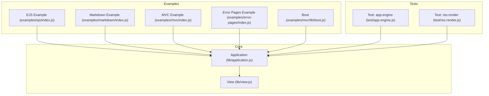
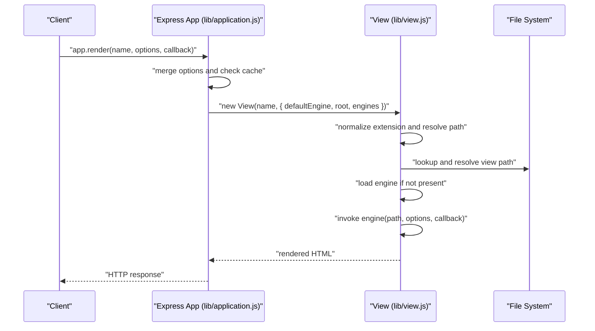
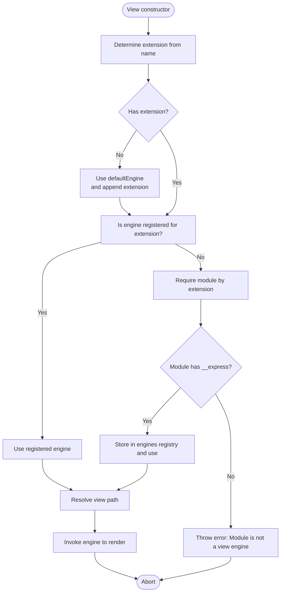
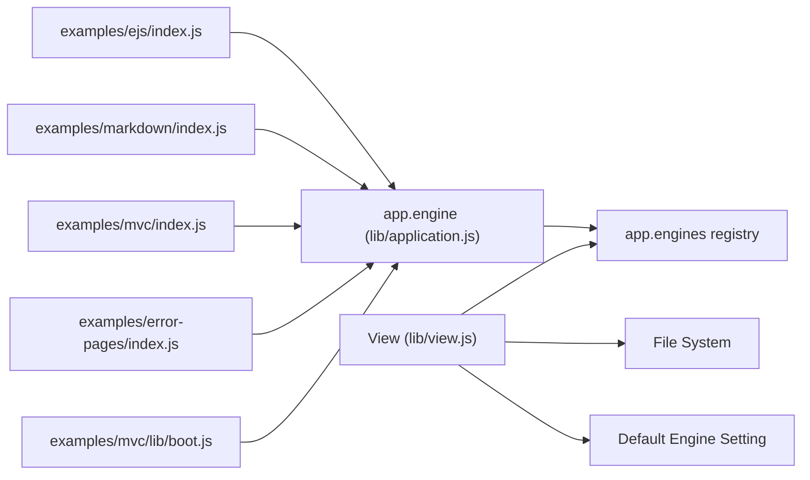

# Engine Registration and Setup

<cite>
**Referenced Files in This Document**
- [lib/application.js](file://lib/application.js)
- [lib/view.js](file://lib/view.js)
- [examples/ejs/index.js](file://examples/ejs/index.js)
- [examples/markdown/index.js](file://examples/markdown/index.js)
- [examples/mvc/index.js](file://examples/mvc/index.js)
- [examples/error-pages/index.js](file://examples/error-pages/index.js)
- [examples/mvc/lib/boot.js](file://examples/mvc/lib/boot.js)
- [test/app.engine.js](file://test/app.engine.js)
- [test/res.render.js](file://test/res.render.js)
- [package.json](file://package.json)
</cite>

## Table of Contents
1. [Introduction](#introduction)
2. [Project Structure](#project-structure)
3. [Core Components](#core-components)
4. [Architecture Overview](#architecture-overview)
5. [Detailed Component Analysis](#detailed-component-analysis)
6. [Dependency Analysis](#dependency-analysis)
7. [Performance Considerations](#performance-considerations)
8. [Troubleshooting Guide](#troubleshooting-guide)
9. [Conclusion](#conclusion)

## Introduction
This document explains how Express.js registers and sets up template engines using the app.engine() method. It covers the method signature, parameter requirements, engine naming conventions, file extension mapping, and callback function requirements. It also demonstrates registering built-in engines (EJS) and custom engines, outlines error handling during registration, describes engine discovery mechanisms, and discusses engine priority, fallback behavior, and performance implications.

## Project Structure
The engine registration and rendering pipeline spans core application logic and example applications:
- Core engine registration and rendering logic live in lib/application.js and lib/view.js.
- Examples demonstrate registering EJS and a custom Markdown engine.
- Tests validate engine registration behavior and error conditions.

**Diagram sources**
- [lib/application.js](file://lib/application.js)
- [lib/view.js](file://lib/view.js)
- [examples/ejs/index.js](file://examples/ejs/index.js)
- [examples/markdown/index.js](file://examples/markdown/index.js)
- [examples/mvc/index.js](file://examples/mvc/index.js)
- [examples/error-pages/index.js](file://examples/error-pages/index.js)
- [examples/mvc/lib/boot.js](file://examples/mvc/lib/boot.js)
- [test/app.engine.js](file://test/app.engine.js)
- [test/res.render.js](file://test/res.render.js)

**Section sources**
- [lib/application.js](file://lib/application.js)
- [lib/view.js](file://lib/view.js)
- [examples/ejs/index.js](file://examples/ejs/index.js)
- [examples/markdown/index.js](file://examples/markdown/index.js)
- [examples/mvc/index.js](file://examples/mvc/index.js)
- [examples/error-pages/index.js](file://examples/error-pages/index.js)
- [examples/mvc/lib/boot.js](file://examples/mvc/lib/boot.js)
- [test/app.engine.js](file://test/app.engine.js)
- [test/res.render.js](file://test/res.render.js)

## Core Components
- app.engine(ext, fn): Registers a template engine for a given file extension. The extension may include a leading dot or not. The callback must be a function with a specific signature.
- View constructor and render flow: Determines the extension, loads or retrieves the engine from the app’s engines registry, resolves the view path, and invokes the engine to render.

Key behaviors:
- Extension normalization: Leading dot is added if omitted.
- Engine storage: Engines are stored in app.engines keyed by normalized extension.
- Discovery fallback: If no explicit engine is registered for an extension, the View constructor attempts to require a module named by the extension and use its default export (__express).
- Rendering: The View.render method ensures asynchronous callback invocation regardless of whether the engine calls synchronously or asynchronously.

**Section sources**
- [lib/application.js](file://lib/application.js)
- [lib/view.js](file://lib/view.js)

## Architecture Overview
The engine registration and rendering flow connects application configuration, view resolution, and engine invocation.

**Diagram sources**
- [lib/application.js](file://lib/application.js)
- [lib/view.js](file://lib/view.js)

## Detailed Component Analysis

### Method Signature and Registration Process
- Method: app.engine(ext, fn)
- Parameters:
  - ext: String representing the file extension (with or without leading dot).
  - fn: Function implementing the rendering interface (path, options, callback).
- Behavior:
  - Validates that fn is a function; otherwise throws an error.
  - Normalizes ext to include a leading dot if absent.
  - Stores fn in app.engines[extension].
  - Returns the app instance for chaining.

Registration examples:
- Built-in engine (EJS) mapped to .html:
  - [examples/ejs/index.js](file://examples/ejs/index.js)
- Custom engine (Markdown) registered with a custom renderer:
  - [examples/markdown/index.js](file://examples/markdown/index.js)
- Default engine set globally:
  - [examples/mvc/index.js](file://examples/mvc/index.js)
  - [examples/error-pages/index.js](file://examples/error-pages/index.js)

Validation and tests:
- Ensures callback is a function and throws an error otherwise:
  - [test/app.engine.js](file://test/app.engine.js)
- Verifies extension handling with and without leading dot:
  - [test/app.engine.js](file://test/app.engine.js)

**Section sources**
- [lib/application.js](file://lib/application.js)
- [examples/ejs/index.js](file://examples/ejs/index.js)
- [examples/markdown/index.js](file://examples/markdown/index.js)
- [examples/mvc/index.js](file://examples/mvc/index.js)
- [examples/error-pages/index.js](file://examples/error-pages/index.js)
- [test/app.engine.js](file://test/app.engine.js)

### Engine Naming Conventions and File Extension Mapping
- Extension normalization:
  - If ext does not start with ".", a dot is prepended before storing.
  - [lib/application.js](file://lib/application.js)
- Default engine behavior:
  - If a view has no extension, Express uses the default engine configured via app.set("view engine").
  - [lib/view.js](file://lib/view.js)
- Mapping examples:
  - EJS mapped to .html for convenience:
    - [examples/ejs/index.js](file://examples/ejs/index.js)
  - Markdown engine registered for .md:
    - [examples/markdown/index.js](file://examples/markdown/index.js)

**Section sources**
- [lib/application.js](file://lib/application.js)
- [lib/view.js](file://lib/view.js)
- [examples/ejs/index.js](file://examples/ejs/index.js)
- [examples/markdown/index.js](file://examples/markdown/index.js)

### Callback Function Requirements
- Signature: (path, options, callback)
- Invocation semantics:
  - The callback must be invoked once with an error (or null) and the rendered HTML string.
  - The View.render method ensures asynchronous invocation even if the engine calls synchronously.
  - [lib/view.js](file://lib/view.js)
- Example implementations:
  - EJS engine callback via __express:
    - [examples/ejs/index.js](file://examples/ejs/index.js)
  - Custom Markdown renderer:
    - [examples/markdown/index.js](file://examples/markdown/index.js)
  - Test harness for a custom engine:
    - [test/app.engine.js](file://test/app.engine.js)

**Section sources**
- [lib/view.js](file://lib/view.js)
- [examples/ejs/index.js](file://examples/ejs/index.js)
- [examples/markdown/index.js](file://examples/markdown/index.js)
- [test/app.engine.js](file://test/app.engine.js)

### Built-in Engines: EJS
- Registering EJS:
  - Map .html to EJS’s default export (__express) for convenient file naming.
  - Set default engine to ejs so views without extension resolve correctly.
  - [examples/ejs/index.js](file://examples/ejs/index.js)
- Global default engine:
  - [examples/mvc/index.js](file://examples/mvc/index.js)
  - [examples/error-pages/index.js](file://examples/error-pages/index.js)

**Section sources**
- [examples/ejs/index.js](file://examples/ejs/index.js)
- [examples/mvc/index.js](file://examples/mvc/index.js)
- [examples/error-pages/index.js](file://examples/error-pages/index.js)

### Custom Engines
- Example: Markdown engine
  - Register a custom renderer for .md files.
  - Set the default engine to md to avoid needing .md suffixes.
  - [examples/markdown/index.js](file://examples/markdown/index.js)
- Example: Template engine via Consolidate.js
  - The application comment documents using Consolidate.js to normalize engine APIs.
  - [lib/application.js](file://lib/application.js)

**Section sources**
- [examples/markdown/index.js](file://examples/markdown/index.js)
- [lib/application.js](file://lib/application.js)

### Engine Discovery Mechanism
- If no engine is explicitly registered for an extension, the View constructor attempts to require a module named by the extension and use its default export (__express).
- This enables automatic discovery for engines that provide a standard export.
- [lib/view.js](file://lib/view.js)

**Diagram sources**
- [lib/view.js](file://lib/view.js)

**Section sources**
- [lib/view.js](file://lib/view.js)

### Error Handling During Registration
- Missing callback:
  - app.engine(ext, fn) throws an error if fn is not a function.
  - [test/app.engine.js](file://test/app.engine.js)
- Missing default engine and no extension:
  - Creating a View without an extension and no default engine throws an error.
  - [lib/view.js](file://lib/view.js)
- Render-time errors:
  - Errors thrown during rendering are passed to the callback.
  - [test/res.render.js](file://test/res.render.js)

**Section sources**
- [test/app.engine.js](file://test/app.engine.js)
- [lib/view.js](file://lib/view.js)
- [test/res.render.js](file://test/res.render.js)

### Engine Priority and Fallback Behavior
- Explicit registration takes priority:
  - app.engine(ext, fn) stores fn in app.engines[ext]; subsequent lookups use this function.
  - [lib/application.js](file://lib/application.js)
- Automatic discovery fallback:
  - If no engine is registered for an extension, View attempts to require a module named by the extension and use its default export (__express).
  - [lib/view.js](file://lib/view.js)
- Default engine fallback:
  - If a view has no extension, the default engine is used.
  - [lib/view.js](file://lib/view.js)

**Section sources**
- [lib/application.js](file://lib/application.js)
- [lib/view.js](file://lib/view.js)

### Practical Examples of Engine Registration
- EJS mapped to .html with default engine set to ejs:
  - [examples/ejs/index.js](file://examples/ejs/index.js)
- Markdown engine registered for .md with default engine set to md:
  - [examples/markdown/index.js](file://examples/markdown/index.js)
- Global default engine set to ejs:
  - [examples/mvc/index.js](file://examples/mvc/index.js)
  - [examples/error-pages/index.js](file://examples/error-pages/index.js)
- Per-controller engine override:
  - [examples/mvc/lib/boot.js](file://examples/mvc/lib/boot.js)

**Section sources**
- [examples/ejs/index.js](file://examples/ejs/index.js)
- [examples/markdown/index.js](file://examples/markdown/index.js)
- [examples/mvc/index.js](file://examples/mvc/index.js)
- [examples/error-pages/index.js](file://examples/error-pages/index.js)
- [examples/mvc/lib/boot.js](file://examples/mvc/lib/boot.js)

## Dependency Analysis
- app.engine depends on:
  - app.engines registry (stored on the application instance).
  - Extension normalization logic.
- View depends on:
  - app.engines registry for engine lookup.
  - File system for view path resolution.
  - Default engine configuration for extensionless views.
- Example apps depend on:
  - Installed template engines (e.g., ejs, hbs) and optional libraries (e.g., consolidate-like behavior described in comments).

**Diagram sources**
- [lib/application.js](file://lib/application.js)
- [lib/view.js](file://lib/view.js)
- [examples/ejs/index.js](file://examples/ejs/index.js)
- [examples/markdown/index.js](file://examples/markdown/index.js)
- [examples/mvc/index.js](file://examples/mvc/index.js)
- [examples/error-pages/index.js](file://examples/error-pages/index.js)
- [examples/mvc/lib/boot.js](file://examples/mvc/lib/boot.js)

**Section sources**
- [lib/application.js](file://lib/application.js)
- [lib/view.js](file://lib/view.js)
- [examples/ejs/index.js](file://examples/ejs/index.js)
- [examples/markdown/index.js](file://examples/markdown/index.js)
- [examples/mvc/index.js](file://examples/mvc/index.js)
- [examples/error-pages/index.js](file://examples/error-pages/index.js)
- [examples/mvc/lib/boot.js](file://examples/mvc/lib/boot.js)

## Performance Considerations
- Caching:
  - app.render caches View instances when the view cache setting is enabled, reducing repeated path resolution and engine loading overhead.
  - [lib/application.js](file://lib/application.js)
- Engine registration cost:
  - Registering engines early avoids per-request require costs and potential runtime errors.
  - [lib/view.js](file://lib/view.js)
- Asynchronous rendering:
  - The View.render method ensures callbacks are invoked asynchronously, preventing synchronous blocking and enabling predictable control flow.
  - [lib/view.js](file://lib/view.js)
- Default engine impact:
  - Using a default engine reduces the need for explicit extensions and simplifies route rendering logic.
  - [examples/mvc/index.js](file://examples/mvc/index.js)

[No sources needed since this section provides general guidance]

## Troubleshooting Guide
- Error: "callback function required"
  - Cause: app.engine was called with a non-function second argument.
  - Resolution: Ensure the second argument is a function with signature (path, options, callback).
  - [test/app.engine.js](file://test/app.engine.js)
- Error: "No default engine was specified and no extension was provided"
  - Cause: Attempted to render a view without an extension and no default engine set.
  - Resolution: Set app.set("view engine") or provide an extension in the view name.
  - [lib/view.js](file://lib/view.js)
- Error: "Module "<engine>" does not provide a view engine"
  - Cause: No default export (__express) found for the engine module.
  - Resolution: Register the engine explicitly via app.engine(ext, fn) or install a compatible engine.
  - [lib/view.js](file://lib/view.js)
- Render errors:
  - Errors thrown during rendering are passed to the callback; ensure error handling in res.render callbacks.
  - [test/res.render.js](file://test/res.render.js)

**Section sources**
- [test/app.engine.js](file://test/app.engine.js)
- [lib/view.js](file://lib/view.js)
- [test/res.render.js](file://test/res.render.js)

## Conclusion
Express.js provides a straightforward mechanism to register template engines via app.engine(ext, fn). The extension is normalized and stored in app.engines, enabling per-extension rendering. If no engine is registered for an extension, the View constructor attempts to auto-discover a module by the same name and use its default export. Proper registration, default engine configuration, and adherence to the callback signature ensure reliable rendering. Tests and examples illustrate correct usage patterns for built-in engines like EJS and custom engines such as Markdown.