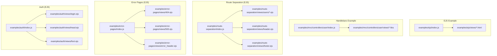
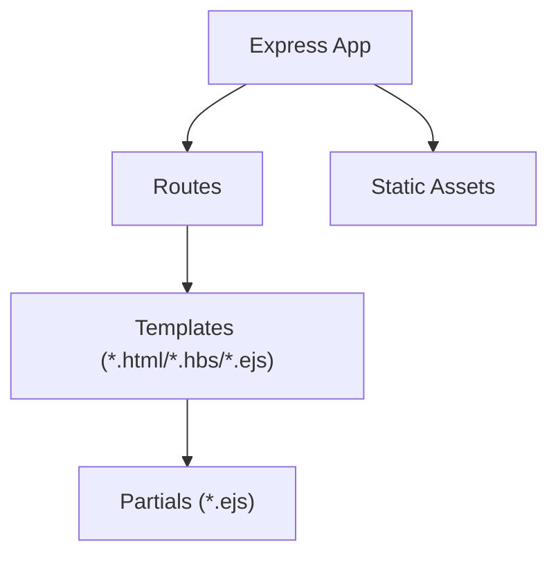
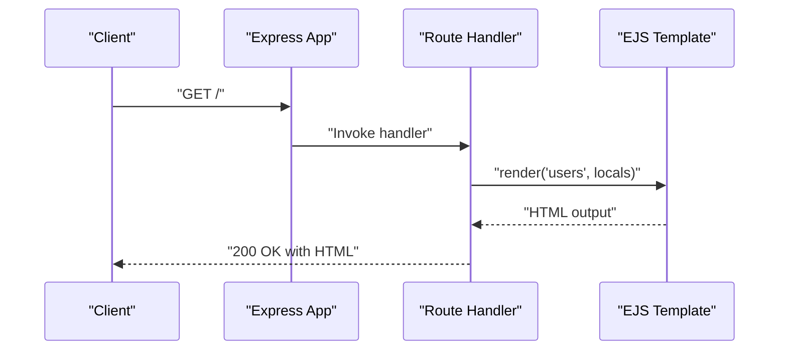
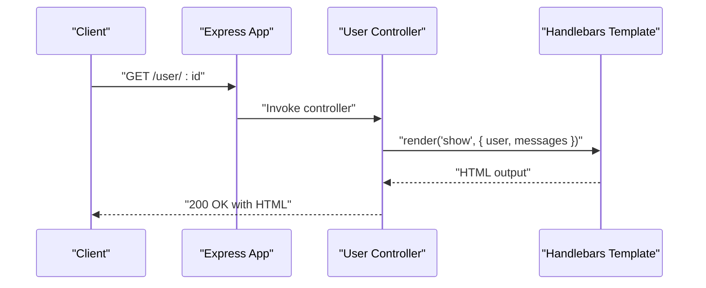
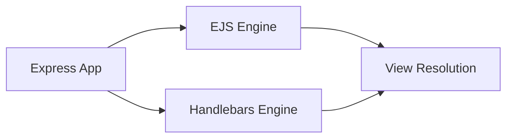

# Popular Template Engines

<cite>
**Referenced Files in This Document**
- [index.js](file://examples/ejs/index.js)
- [users.html](file://examples/ejs/views/users.html)
- [header.html](file://examples/ejs/views/header.html)
- [footer.html](file://examples/ejs/views/footer.html)
- [index.js](file://examples/mvc/controllers/user/index.js)
- [list.hbs](file://examples/mvc/controllers/user/views/list.hbs)
- [show.hbs](file://examples/mvc/controllers/user/views/show.hbs)
- [edit.hbs](file://examples/mvc/controllers/user/views/edit.hbs)
- [index.js](file://examples/route-separation/index.js)
- [users/index.ejs](file://examples/route-separation/views/users/index.ejs)
- [users/edit.ejs](file://examples/route-separation/views/users/edit.ejs)
- [users/view.ejs](file://examples/route-separation/views/users/view.ejs)
- [header.ejs](file://examples/route-separation/views/header.ejs)
- [footer.ejs](file://examples/route-separation/views/footer.ejs)
- [index.js](file://examples/error-pages/index.js)
- [404.ejs](file://examples/error-pages/views/404.ejs)
- [500.ejs](file://examples/error-pages/views/500.ejs)
- [error_header.ejs](file://examples/error-pages/views/error_header.ejs)
- [footer.ejs](file://examples/error-pages/views/footer.ejs)
- [index.js](file://examples/auth/index.js)
- [login.ejs](file://examples/auth/views/login.ejs)
- [head.ejs](file://examples/auth/views/head.ejs)
- [foot.ejs](file://examples/auth/views/foot.ejs)
- [index.js](file://examples/mvc/index.js)
- [404.ejs](file://examples/mvc/views/404.ejs)
- [5xx.ejs](file://examples/mvc/views/5xx.ejs)
</cite>

## Table of Contents
1. [Introduction](#introduction)
2. [Project Structure](#project-structure)
3. [Core Components](#core-components)
4. [Architecture Overview](#architecture-overview)
5. [Detailed Component Analysis](#detailed-component-analysis)
6. [Dependency Analysis](#dependency-analysis)
7. [Performance Considerations](#performance-considerations)
8. [Troubleshooting Guide](#troubleshooting-guide)
9. [Conclusion](#conclusion)

## Introduction
This document explains how popular template engines integrate with Express.js using real examples from the repository. It focuses on:
- EJS integration and partials
- Handlebars setup and helpers
- Jade/Pug syntax and features
- Mustache templating patterns

It also covers engine-specific features, syntax differences, performance characteristics, layout systems, partial templates, helper functions, selection criteria, migration strategies, compatibility considerations, and troubleshooting.

## Project Structure
The repository organizes template engine examples under the examples directory. Each engine has a dedicated example with views and routes demonstrating rendering, partials, and error pages.

**Diagram sources**
- [index.js:1-58](file://examples/ejs/index.js#L1-L58)
- [users.html](file://examples/ejs/views/users.html)
- [index.js](file://examples/mvc/controllers/user/index.js)
- [list.hbs:1-19](file://examples/mvc/controllers/user/views/list.hbs#L1-L19)
- [show.hbs:1-32](file://examples/mvc/controllers/user/views/show.hbs#L1-L32)
- [edit.hbs:1-28](file://examples/mvc/controllers/user/views/edit.hbs#L1-L28)
- [index.js](file://examples/route-separation/index.js)
- [users/index.ejs:1-15](file://examples/route-separation/views/users/index.ejs#L1-L15)
- [users/edit.ejs:1-24](file://examples/route-separation/views/users/edit.ejs#L1-L24)
- [users/view.ejs:1-10](file://examples/route-separation/views/users/view.ejs#L1-L10)
- [header.ejs:1-10](file://examples/route-separation/views/header.ejs#L1-L10)
- [footer.ejs:1-3](file://examples/route-separation/views/footer.ejs#L1-L3)
- [index.js](file://examples/error-pages/index.js)
- [404.ejs:1-4](file://examples/error-pages/views/404.ejs#L1-L4)
- [500.ejs:1-9](file://examples/error-pages/views/500.ejs#L1-L9)
- [error_header.ejs:1-11](file://examples/error-pages/views/error_header.ejs#L1-L11)
- [index.js](file://examples/auth/index.js)
- [login.ejs:1-22](file://examples/auth/views/login.ejs#L1-L22)
- [head.ejs:1-21](file://examples/auth/views/head.ejs#L1-L21)
- [foot.ejs:1-3](file://examples/auth/views/foot.ejs#L1-L3)

**Section sources**
- [index.js:1-58](file://examples/ejs/index.js#L1-L58)
- [index.js](file://examples/mvc/controllers/user/index.js)
- [index.js](file://examples/route-separation/index.js)
- [index.js](file://examples/error-pages/index.js)
- [index.js](file://examples/auth/index.js)

## Core Components
- EJS integration demonstrates registering an engine with a custom extension, setting views directory, serving static assets, and rendering templates with locals.
- Handlebars examples show controller-driven rendering with helpers and block expressions.
- Route separation showcases reusable partials via include directives and shared layouts.
- Error pages illustrate engine-agnostic error handling with conditionals and partial inclusion.
- Auth example combines partials and form rendering with server-side logic.

Key implementation patterns:
- Engine registration and view engine configuration
- Partial inclusion and layout composition
- Data binding and control structures
- Static asset serving alongside views

**Section sources**
- [index.js:10-37](file://examples/ejs/index.js#L10-L37)
- [users.html](file://examples/ejs/views/users.html)
- [header.html](file://examples/ejs/views/header.html)
- [footer.html](file://examples/ejs/views/footer.html)
- [index.js](file://examples/mvc/controllers/user/index.js)
- [list.hbs:1-19](file://examples/mvc/controllers/user/views/list.hbs#L1-L19)
- [show.hbs:1-32](file://examples/mvc/controllers/user/views/show.hbs#L1-L32)
- [edit.hbs:1-28](file://examples/mvc/controllers/user/views/edit.hbs#L1-L28)
- [users/index.ejs:1-15](file://examples/route-separation/views/users/index.ejs#L1-L15)
- [header.ejs:1-10](file://examples/route-separation/views/header.ejs#L1-L10)
- [footer.ejs:1-3](file://examples/route-separation/views/footer.ejs#L1-L3)
- [404.ejs:1-4](file://examples/error-pages/views/404.ejs#L1-L4)
- [500.ejs:1-9](file://examples/error-pages/views/500.ejs#L1-L9)
- [error_header.ejs:1-11](file://examples/error-pages/views/error_header.ejs#L1-L11)
- [login.ejs:1-22](file://examples/auth/views/login.ejs#L1-L22)
- [head.ejs:1-21](file://examples/auth/views/head.ejs#L1-L21)
- [foot.ejs:1-3](file://examples/auth/views/foot.ejs#L1-L3)

## Architecture Overview
The examples demonstrate a layered approach:
- Application layer: Express app setup, middleware, and routes
- View layer: Templates organized per feature or domain
- Partial layer: Shared header, footer, and error partials
- Data layer: Locals passed to render calls

[No sources needed since this diagram shows conceptual workflow, not actual code structure]

## Detailed Component Analysis

### EJS Integration
EJS is configured to render HTML-like templates with embedded JavaScript. The example registers the engine for a custom extension, sets the views directory, serves static assets, and renders a page with locals.

Key patterns:
- Engine registration for a custom extension
- Setting the view engine globally
- Using include directives for partials
- Passing locals to res.render

**Diagram sources**
- [index.js:45-51](file://examples/ejs/index.js#L45-L51)
- [users.html](file://examples/ejs/views/users.html)

Practical examples:
- Engine registration and view engine setup: [index.js:23-36](file://examples/ejs/index.js#L23-L36)
- Rendering with locals: [index.js:45-51](file://examples/ejs/index.js#L45-L51)
- Partials usage in route-separated views: [users/index.ejs:1-15](file://examples/route-separation/views/users/index.ejs#L1-L15), [header.ejs:1-10](file://examples/route-separation/views/header.ejs#L1-L10), [footer.ejs:1-3](file://examples/route-separation/views/footer.ejs#L1-L3)
- Error page rendering with partials: [404.ejs:1-4](file://examples/error-pages/views/404.ejs#L1-L4), [500.ejs:1-9](file://examples/error-pages/views/500.ejs#L1-L9)

Engine-specific features and syntax:
- Embedded JavaScript for control flow and interpolation
- Safe and escaped output operators
- Partials via include directive
- Layout composition with shared header/footer

Performance characteristics:
- Fast runtime rendering for simple templates
- Minimal overhead when using partials and includes

Layout systems:
- Shared header/footer partials compose pages
- Consistent structure across views

Partial templates:
- Reusable header and footer across multiple pages
- Error-specific partials for consistent messaging

Helper functions:
- None in the EJS example; helpers are typically implemented in application code or via middleware

Migration considerations:
- Change engine registration and view engine setting
- Adjust template extensions and include paths
- Update rendering calls to match new engine expectations

Compatibility:
- EJS integrates seamlessly with Express via app.engine and app.set
- Partials and includes are supported out-of-the-box

**Section sources**
- [index.js:23-36](file://examples/ejs/index.js#L23-L36)
- [index.js:45-51](file://examples/ejs/index.js#L45-L51)
- [users.html](file://examples/ejs/views/users.html)
- [users/index.ejs:1-15](file://examples/route-separation/views/users/index.ejs#L1-L15)
- [header.ejs:1-10](file://examples/route-separation/views/header.ejs#L1-L10)
- [footer.ejs:1-3](file://examples/route-separation/views/footer.ejs#L1-L3)
- [404.ejs:1-4](file://examples/error-pages/views/404.ejs#L1-L4)
- [500.ejs:1-9](file://examples/error-pages/views/500.ejs#L1-L9)

### Handlebars Setup and Configuration
Handlebars is used in a controller-style setup with helpers and block expressions. The example demonstrates rendering lists, conditionals, and forms.

Key patterns:
- Controller-driven routing with res.render
- Block helpers for iteration and conditionals
- Form rendering with dynamic values

**Diagram sources**
- [index.js](file://examples/mvc/controllers/user/index.js)
- [show.hbs:1-32](file://examples/mvc/controllers/user/views/show.hbs#L1-L32)

Practical examples:
- List rendering with iteration: [list.hbs:12-16](file://examples/mvc/controllers/user/views/list.hbs#L12-L16)
- Conditional rendering with if/else: [show.hbs:20-29](file://examples/mvc/controllers/user/views/show.hbs#L20-L29)
- Form rendering with dynamic values: [edit.hbs:11-17](file://examples/mvc/controllers/user/views/edit.hbs#L11-L17)

Engine-specific features and syntax:
- Block helpers for iteration and conditionals
- Inline helpers for transformations
- Strong separation between logic and presentation

Performance characteristics:
- Fast rendering with precompiled templates
- Efficient partials and helpers

Layout systems:
- No explicit layout system shown; templates are self-contained

Partial templates:
- Not demonstrated in this example

Helper functions:
- Helpers are typically registered at engine initialization; not shown here

Migration considerations:
- Replace EJS syntax with Handlebars equivalents
- Convert includes to partials or layout blocks
- Adapt control structures to Handlebars helpers

Compatibility:
- Requires Handlebars engine registration and proper view resolution

**Section sources**
- [index.js](file://examples/mvc/controllers/user/index.js)
- [list.hbs:1-19](file://examples/mvc/controllers/user/views/list.hbs#L1-L19)
- [show.hbs:1-32](file://examples/mvc/controllers/user/views/show.hbs#L1-L32)
- [edit.hbs:1-28](file://examples/mvc/controllers/user/views/edit.hbs#L1-L28)

### Jade/Pug Syntax and Features
Jade/Pug is not present in the current repository snapshot. However, the repository includes a fixture template named tmpl that uses a Pug-like syntax. While this is not a live example, it indicates potential interest in Pug-like templating.

Conceptual overview:
- Pug emphasizes indentation and concise syntax
- Supports mixins, filters, and attributes
- Ideal for developers who prefer terse markup

[No sources needed since this section doesn't analyze specific source files]

### Mustache Templating Patterns
Mustache templating is not present in the current repository snapshot. Mustache follows a logic-less philosophy and is commonly used with Express via connect-assets or similar middleware.

Conceptual overview:
- Logic-less templates with minimal syntax
- Strong separation between logic and presentation
- Easy to learn and portable across languages

[No sources needed since this section doesn't analyze specific source files]

## Dependency Analysis
Template engines integrate with Express through two primary mechanisms:
- app.engine for custom extensions
- app.set for the default view engine

[No sources needed since this diagram shows conceptual relationships, not specific code structure]

**Section sources**
- [index.js:23-36](file://examples/ejs/index.js#L23-L36)
- [index.js](file://examples/mvc/controllers/user/index.js)

## Performance Considerations
- EJS: Lightweight and fast for simple templates; partials and includes improve modularity without heavy overhead.
- Handlebars: Efficient rendering with helpers; precompilation can further improve performance.
- Pug/Mustache: Generally fast; syntax simplicity can reduce parsing overhead.

[No sources needed since this section provides general guidance]

## Troubleshooting Guide
Common issues and resolutions:
- Incorrect view engine or extension mismatch
  - Verify app.set('view engine') matches rendered extension
  - Confirm app.engine registration for custom extensions
  - References: [index.js:23-36](file://examples/ejs/index.js#L23-L36)

- Partial not found
  - Ensure partial paths are correct relative to views directory
  - Verify app.set('views') points to the intended directory
  - References: [users/index.ejs:1-15](file://examples/route-separation/views/users/index.ejs#L1-L15), [header.ejs:1-10](file://examples/route-separation/views/header.ejs#L1-L10), [footer.ejs:1-3](file://examples/route-separation/views/footer.ejs#L1-L3)

- Error pages not rendering
  - Check error template paths and partial inclusion
  - Validate error-handling routes and res.render calls
  - References: [404.ejs:1-4](file://examples/error-pages/views/404.ejs#L1-L4), [500.ejs:1-9](file://examples/error-pages/views/500.ejs#L1-L9)

- Authentication form rendering
  - Confirm partials are included and locals are passed correctly
  - References: [login.ejs:1-22](file://examples/auth/views/login.ejs#L1-L22), [head.ejs:1-21](file://examples/auth/views/head.ejs#L1-L21), [foot.ejs:1-3](file://examples/auth/views/foot.ejs#L1-L3)

**Section sources**
- [index.js:23-36](file://examples/ejs/index.js#L23-L36)
- [users/index.ejs:1-15](file://examples/route-separation/views/users/index.ejs#L1-L15)
- [header.ejs:1-10](file://examples/route-separation/views/header.ejs#L1-L10)
- [footer.ejs:1-3](file://examples/route-separation/views/footer.ejs#L1-L3)
- [404.ejs:1-4](file://examples/error-pages/views/404.ejs#L1-L4)
- [500.ejs:1-9](file://examples/error-pages/views/500.ejs#L1-L9)
- [login.ejs:1-22](file://examples/auth/views/login.ejs#L1-L22)
- [head.ejs:1-21](file://examples/auth/views/head.ejs#L1-L21)
- [foot.ejs:1-3](file://examples/auth/views/foot.ejs#L1-L3)

## Conclusion
The repository demonstrates robust template engine integration with Express:
- EJS supports flexible rendering, partials, and layout composition
- Handlebars enables structured templates with helpers and block expressions
- Route separation and error pages showcase reusable partials and consistent messaging
- Migration between engines requires updating registrations, extensions, and syntax

These patterns provide a solid foundation for choosing, configuring, and maintaining template engines in Express applications.