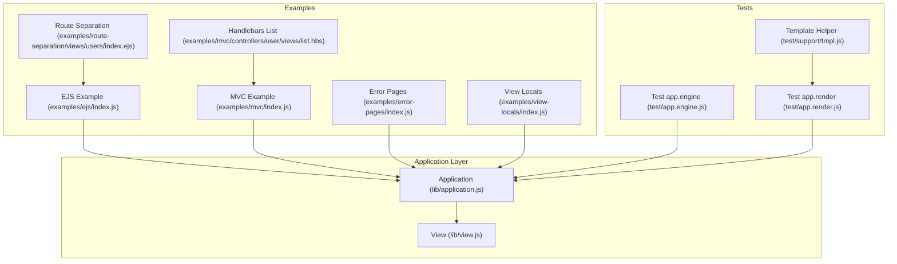
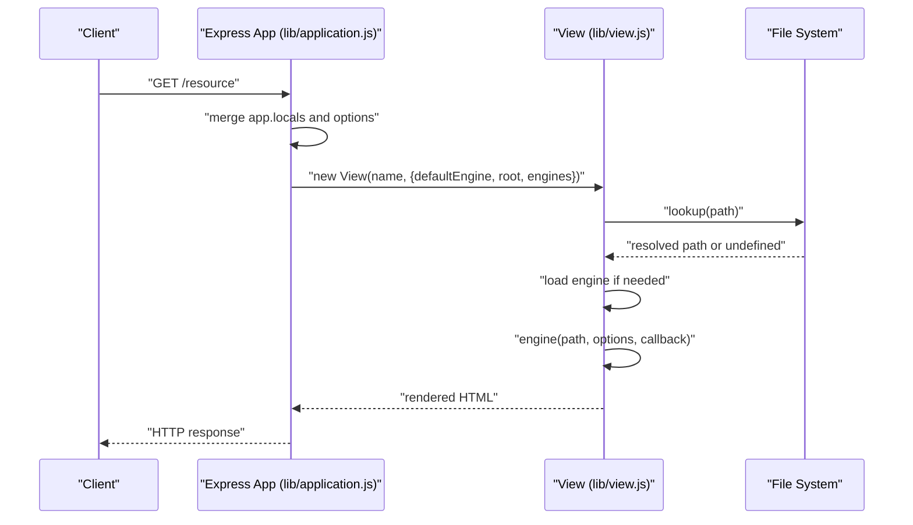
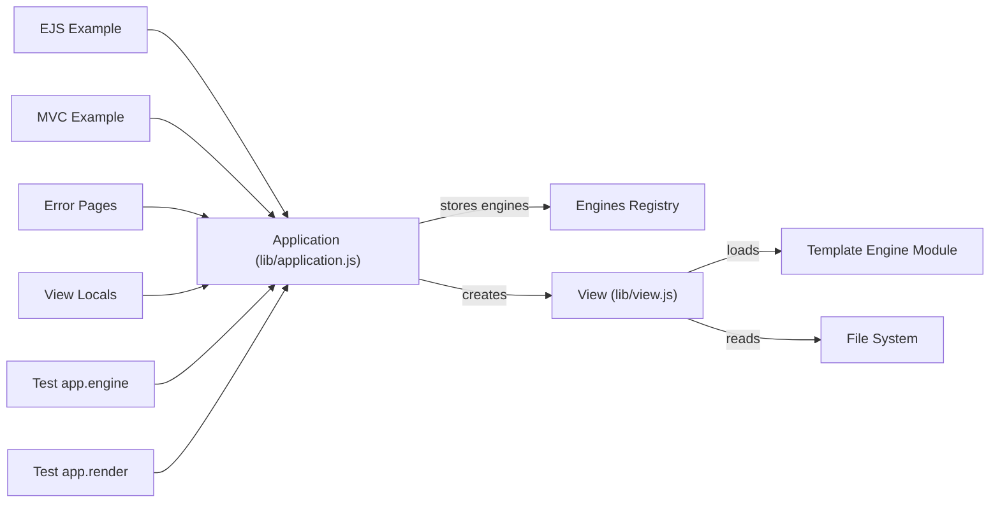
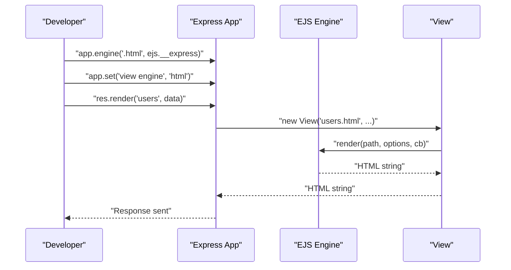

# Template Engine Integration

<cite>
**Referenced Files in This Document**
- [lib/application.js](file://lib/application.js)
- [lib/view.js](file://lib/view.js)
- [examples/ejs/index.js](file://examples/ejs/index.js)
- [examples/mvc/index.js](file://examples/mvc/index.js)
- [examples/error-pages/index.js](file://examples/error-pages/index.js)
- [examples/route-separation/views/users/index.ejs](file://examples/route-separation/views/users/index.ejs)
- [examples/view-locals/index.js](file://examples/view-locals/index.js)
- [examples/view-locals/views/index.ejs](file://examples/view-locals/views/index.ejs)
- [examples/mvc/controllers/user/views/list.hbs](file://examples/mvc/controllers/user/views/list.hbs)
- [test/app.engine.js](file://test/app.engine.js)
- [test/app.render.js](file://test/app.render.js)
- [test/support/tmpl.js](file://test/support/tmpl.js)
</cite>

## Table of Contents
1. [Introduction](#introduction)
2. [Project Structure](#project-structure)
3. [Core Components](#core-components)
4. [Architecture Overview](#architecture-overview)
5. [Detailed Component Analysis](#detailed-component-analysis)
6. [Dependency Analysis](#dependency-analysis)
7. [Performance Considerations](#performance-considerations)
8. [Troubleshooting Guide](#troubleshooting-guide)
9. [Conclusion](#conclusion)
10. [Appendices](#appendices)

## Introduction
This document explains how Express.js integrates template engines, focusing on the app.engine() registration mechanism, the template engine interface requirements, and how views are resolved and rendered. It also covers integration patterns for popular engines (EJS, Handlebars, Pug/Jade, and Mustache), engine-specific configuration, building custom engines, performance considerations, and practical examples drawn from the repository.

## Project Structure
The repository organizes template engine integration around three core areas:
- Application-level engine registration and rendering orchestration
- View resolution and rendering pipeline
- Examples and tests demonstrating real-world usage and edge cases

**Diagram sources**
- [lib/application.js:294-308](file://lib/application.js#L294-L308)
- [lib/view.js:52-95](file://lib/view.js#L52-L95)
- [examples/ejs/index.js:10-36](file://examples/ejs/index.js#L10-L36)
- [examples/mvc/index.js:13-17](file://examples/mvc/index.js#L13-L17)
- [examples/error-pages/index.js:9-15](file://examples/error-pages/index.js#L9-L15)
- [examples/route-separation/views/users/index.ejs:1-15](file://examples/route-separation/views/users/index.ejs#L1-L15)
- [examples/view-locals/index.js:10-13](file://examples/view-locals/index.js#L10-L13)
- [examples/mvc/controllers/user/views/list.hbs:1-19](file://examples/mvc/controllers/user/views/list.hbs#L1-L19)
- [test/app.engine.js:16-82](file://test/app.engine.js#L16-L82)
- [test/app.render.js:8-290](file://test/app.render.js#L8-L290)
- [test/support/tmpl.js:1-37](file://test/support/tmpl.js#L1-L37)

**Section sources**
- [lib/application.js:59-141](file://lib/application.js#L59-L141)
- [lib/view.js:52-95](file://lib/view.js#L52-L95)

## Core Components
- app.engine(ext, fn): Registers a template engine for a given file extension. The function must accept (path, options, callback) and is stored in app.engines keyed by extension.
- app.render(name, options, callback): Resolves a view, merges locals, applies caching, and delegates rendering to the appropriate engine.
- View(name, options): Encapsulates view lookup, engine loading, and rendering. It resolves the filesystem path and ensures the engine exposes a compatible render function.

Key behaviors:
- Extension normalization: Leading dot is added if absent.
- Default engine fallback: If no extension is provided, the default engine is used.
- Engine discovery: If an engine is not yet registered for an extension, the View constructor loads it dynamically and expects a default export with a compatible render function.
- Rendering guarantees: The engine’s render function is invoked asynchronously via a wrapper.

**Section sources**
- [lib/application.js:294-308](file://lib/application.js#L294-L308)
- [lib/application.js:522-575](file://lib/application.js#L522-L575)
- [lib/view.js:52-95](file://lib/view.js#L52-L95)
- [lib/view.js:133-159](file://lib/view.js#L133-L159)

## Architecture Overview
The template rendering pipeline connects HTTP requests to view resolution and engine rendering.

**Diagram sources**
- [lib/application.js:522-575](file://lib/application.js#L522-L575)
- [lib/view.js:52-95](file://lib/view.js#L52-L95)
- [lib/view.js:133-159](file://lib/view.js#L133-L159)

## Detailed Component Analysis

### app.engine() Registration
- Purpose: Map a file extension to a rendering function.
- Signature: app.engine(extension, renderFunction)
- Behavior:
  - Validates that the second argument is a function.
  - Normalizes extension to include a leading dot.
  - Stores the function in app.engines for later lookup during view resolution.

Common patterns:
- Using a built-in engine’s default export (e.g., EJS’s __express).
- Mapping an existing engine’s renderFile to a different extension.
- Registering a custom engine that follows the expected signature.

**Section sources**
- [lib/application.js:294-308](file://lib/application.js#L294-L308)
- [examples/ejs/index.js:23](file://examples/ejs/index.js#L23)
- [test/app.engine.js:18-30](file://test/app.engine.js#L18-L30)
- [test/app.engine.js:39-51](file://test/app.engine.js#L39-L51)
- [test/app.engine.js:53-66](file://test/app.engine.js#L53-L66)

### View Resolution and Rendering
- View(name, options):
  - Determines extension and default engine.
  - Loads engine if not present in app.engines.
  - Resolves the filesystem path using configured root(s).
  - Renders by invoking the engine with normalized options.

Important behaviors:
- If no extension is provided and no default engine is set, an error is thrown.
- If the engine lacks a compatible render function, an error is thrown.
- Lookup supports single or multiple root paths and falls back to index.<ext>.

**Section sources**
- [lib/view.js:52-95](file://lib/view.js#L52-L95)
- [lib/view.js:104-123](file://lib/view.js#L104-L123)
- [lib/view.js:133-159](file://lib/view.js#L133-L159)

### Rendering Orchestration (app.render)
- Merges app.locals, per-render _locals, and explicit options.
- Applies view caching based on app settings or per-call cache option.
- Creates a View instance and renders synchronously via a wrapper that ensures asynchronous callback semantics.

**Section sources**
- [lib/application.js:522-575](file://lib/application.js#L522-L575)

### Practical Integration Patterns

#### EJS Integration
- Register EJS for a custom extension or use the default engine.
- Configure views directory and default engine.
- Render with shared locals and partials.

References:
- [examples/ejs/index.js:23-36](file://examples/ejs/index.js#L23-L36)
- [examples/mvc/index.js:15-17](file://examples/mvc/index.js#L15-L17)
- [examples/view-locals/index.js:12-13](file://examples/view-locals/index.js#L12-L13)
- [examples/route-separation/views/users/index.ejs:1-15](file://examples/route-separation/views/users/index.ejs#L1-L15)

**Section sources**
- [examples/ejs/index.js:23-36](file://examples/ejs/index.js#L23-L36)
- [examples/mvc/index.js:15-17](file://examples/mvc/index.js#L15-L17)
- [examples/view-locals/index.js:12-13](file://examples/view-locals/index.js#L12-L13)
- [examples/route-separation/views/users/index.ejs:1-15](file://examples/route-separation/views/users/index.ejs#L1-L15)

#### Handlebars Integration
- Register the Handlebars engine for .hbs extension.
- Use helpers and partials in templates.
- Expose shared data via res.locals or middleware.

References:
- [examples/mvc/controllers/user/views/list.hbs:13-15](file://examples/mvc/controllers/user/views/list.hbs#L13-L15)
- [examples/mvc/index.js:15-17](file://examples/mvc/index.js#L15-L17)

**Section sources**
- [examples/mvc/controllers/user/views/list.hbs:1-19](file://examples/mvc/controllers/user/views/list.hbs#L1-L19)
- [examples/mvc/index.js:15-17](file://examples/mvc/index.js#L15-L17)

#### Pug/Jade Integration
- Register the Pug engine for .pug or .jade extension.
- Configure views directory and default engine.
- Use mixins, includes, and layout blocks.

References:
- [examples/error-pages/index.js:14-15](file://examples/error-pages/index.js#L14-L15)

**Section sources**
- [examples/error-pages/index.js:14-15](file://examples/error-pages/index.js#L14-L15)

#### Mustache Integration
- Register a Mustache-compatible engine for .mustache or .mu.
- Provide data via res.render locals; partials depend on engine support.

References:
- [examples/mvc/index.js:15-17](file://examples/mvc/index.js#L15-L17)

**Section sources**
- [examples/mvc/index.js:15-17](file://examples/mvc/index.js#L15-L17)

### Global Variables and Shared Data
Express exposes app.locals globally to all views. Middleware can populate res.locals for route-specific data. Tests demonstrate precedence and merging of locals.

References:
- [examples/view-locals/index.js:52-73](file://examples/view-locals/index.js#L52-L73)
- [examples/view-locals/index.js:86-108](file://examples/view-locals/index.js#L86-L108)
- [test/app.render.js:35-46](file://test/app.render.js#L35-L46)
- [test/app.render.js:320-332](file://test/app.render.js#L320-L332)

**Section sources**
- [examples/view-locals/index.js:52-73](file://examples/view-locals/index.js#L52-L73)
- [examples/view-locals/index.js:86-108](file://examples/view-locals/index.js#L86-L108)
- [test/app.render.js:35-46](file://test/app.render.js#L35-L46)
- [test/app.render.js:320-332](file://test/app.render.js#L320-L332)

### Custom Engine Development
To build a custom engine:
- Implement a render function with the signature (path, options, callback).
- Register it with app.engine('ext', renderFunction).
- Optionally support caching via options.cache.

References:
- [test/app.engine.js:8-14](file://test/app.engine.js#L8-L14)
- [test/app.engine.js:18-30](file://test/app.engine.js#L18-L30)
- [test/support/tmpl.js:5-23](file://test/support/tmpl.js#L5-L23)

**Section sources**
- [test/app.engine.js:8-14](file://test/app.engine.js#L8-L14)
- [test/app.engine.js:18-30](file://test/app.engine.js#L18-L30)
- [test/support/tmpl.js:5-23](file://test/support/tmpl.js#L5-L23)

### Engine-Specific Configuration Options
- EJS: Supports include/partial mechanisms and custom delimiters; configure via options passed to res.render.
- Handlebars: Supports helpers and partials; register helpers before rendering.
- Pug: Supports filters, mixins, and inheritance; configure via options.
- Mustache: Supports lambdas and partials; configure via options.

References:
- [examples/route-separation/views/users/index.ejs:1-15](file://examples/route-separation/views/users/index.ejs#L1-L15)
- [examples/mvc/controllers/user/views/list.hbs:13-15](file://examples/mvc/controllers/user/views/list.hbs#L13-L15)

**Section sources**
- [examples/route-separation/views/users/index.ejs:1-15](file://examples/route-separation/views/users/index.ejs#L1-L15)
- [examples/mvc/controllers/user/views/list.hbs:1-19](file://examples/mvc/controllers/user/views/list.hbs#L1-L19)

### Migration Between Engines
- Change default engine via app.set('view engine').
- Reconfigure views directory if needed.
- Update template syntax and helpers accordingly.
- Keep res.render calls unchanged; the engine abstraction remains consistent.

References:
- [examples/mvc/index.js:15-17](file://examples/mvc/index.js#L15-L17)
- [examples/error-pages/index.js:14-15](file://examples/error-pages/index.js#L14-L15)

**Section sources**
- [examples/mvc/index.js:15-17](file://examples/mvc/index.js#L15-L17)
- [examples/error-pages/index.js:14-15](file://examples/error-pages/index.js#L14-L15)

## Dependency Analysis
The template engine subsystem exhibits low coupling and clear separation of concerns:
- Application layer manages settings, engines registry, and rendering orchestration.
- View layer encapsulates filesystem lookup and engine invocation.
- Examples and tests demonstrate usage patterns and edge cases.

**Diagram sources**
- [lib/application.js:62-64](file://lib/application.js#L62-L64)
- [lib/view.js:75-88](file://lib/view.js#L75-L88)
- [examples/ejs/index.js:10-36](file://examples/ejs/index.js#L10-L36)
- [examples/mvc/index.js:13-17](file://examples/mvc/index.js#L13-L17)
- [examples/error-pages/index.js:9-15](file://examples/error-pages/index.js#L9-L15)
- [examples/view-locals/index.js:10-13](file://examples/view-locals/index.js#L10-L13)
- [test/app.engine.js:16-82](file://test/app.engine.js#L16-L82)
- [test/app.render.js:8-290](file://test/app.render.js#L8-L290)

**Section sources**
- [lib/application.js:62-64](file://lib/application.js#L62-L64)
- [lib/view.js:75-88](file://lib/view.js#L75-L88)

## Performance Considerations
- View caching: Enable app.set('view cache', true) in production to avoid repeated view lookups.
- Per-call cache override: Pass { cache: true } to app.render for selective caching.
- Engine-level caching: Some engines support internal template compilation caches; consult engine documentation.
- Minimize synchronous work inside templates; defer heavy computations to middleware or pre-render hooks.

References:
- [test/app.render.js:229-289](file://test/app.render.js#L229-L289)

**Section sources**
- [test/app.render.js:229-289](file://test/app.render.js#L229-L289)

## Troubleshooting Guide
Common issues and resolutions:
- No default engine and no extension: Ensure app.set('view engine') is set or provide an extension in res.render calls.
- Engine not found: Verify app.engine registration and that the engine module exports a compatible render function.
- View not found: Confirm app.set('views') points to correct directory and template exists; multiple roots are supported.
- Rendering errors: Errors thrown by templates are captured and passed to the callback; inspect error.name and message.

References:
- [lib/view.js:60-62](file://lib/view.js#L60-L62)
- [lib/view.js:83-85](file://lib/view.js#L83-L85)
- [lib/application.js:558-565](file://lib/application.js#L558-L565)
- [test/app.render.js:82-93](file://test/app.render.js#L82-L93)
- [test/app.render.js:95-107](file://test/app.render.js#L95-L107)

**Section sources**
- [lib/view.js:60-62](file://lib/view.js#L60-L62)
- [lib/view.js:83-85](file://lib/view.js#L83-L85)
- [lib/application.js:558-565](file://lib/application.js#L558-L565)
- [test/app.render.js:82-93](file://test/app.render.js#L82-L93)
- [test/app.render.js:95-107](file://test/app.render.js#L95-L107)

## Conclusion
Express’s template engine integration centers on a simple, consistent interface: app.engine() registers renderers, app.render() orchestrates view resolution and rendering, and View encapsulates filesystem and engine interactions. With this foundation, you can integrate EJS, Handlebars, Pug/Jade, Mustache, and custom engines while leveraging shared locals, caching, and robust error handling.

## Appendices

### Template Engine Interface Requirements
- Function signature: (path, options, callback)
- Asynchronous completion: Callback must be invoked once with (error, result) semantics.
- Error propagation: Throw or pass errors to the callback; Express captures and surfaces them.

**Section sources**
- [lib/view.js:133-159](file://lib/view.js#L133-L159)
- [test/support/tmpl.js:5-23](file://test/support/tmpl.js#L5-L23)

### Example Workflows

#### EJS Setup and Rendering

**Diagram sources**
- [examples/ejs/index.js:23-36](file://examples/ejs/index.js#L23-L36)
- [lib/view.js:133-159](file://lib/view.js#L133-L159)