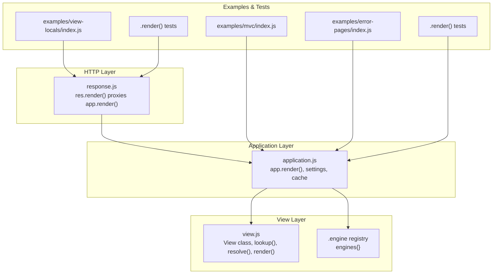
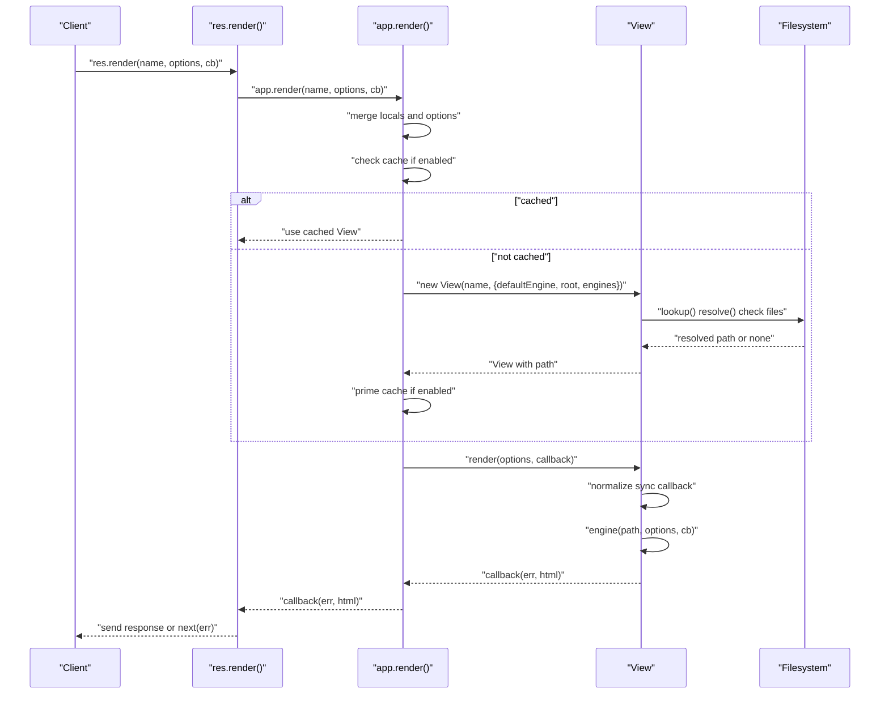
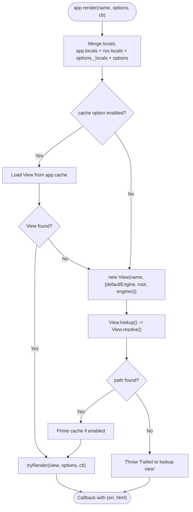
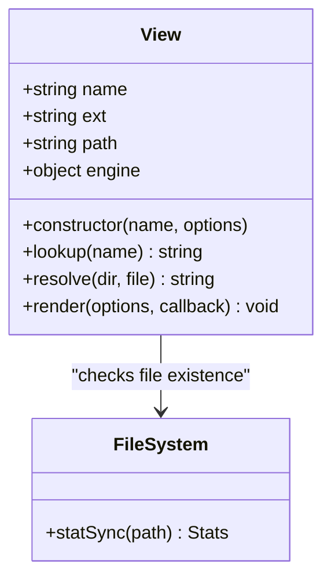
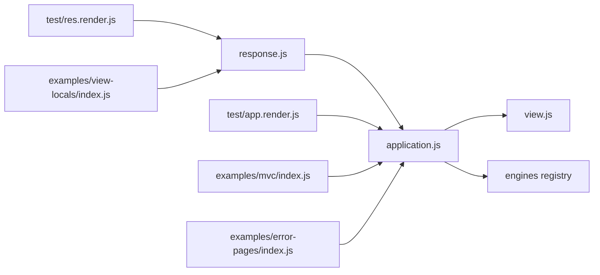

# View Rendering and Caching

<cite>
**Referenced Files in This Document**
- [view.js](file://lib/view.js)
- [application.js](file://lib/application.js)
- [response.js](file://lib/response.js)
- [app.render.js](file://test/app.render.js)
- [res.render.js](file://test/res.render.js)
- [index.js](file://examples/mvc/index.js)
- [index.js](file://examples/error-pages/index.js)
- [index.js](file://examples/view-locals/index.js)
- [index.ejs](file://examples/view-locals/views/index.ejs)
- [tmpl.js](file://test/support/tmpl.js)
- [user.tmpl](file://test/fixtures/default_layout/user.tmpl)
- [user.tmpl](file://test/fixtures/local_layout/user.tmpl)
- [index.tmpl](file://test/fixtures/blog/post/index.tmpl)
</cite>

## Table of Contents
1. [Introduction](#introduction)
2. [Project Structure](#project-structure)
3. [Core Components](#core-components)
4. [Architecture Overview](#architecture-overview)
5. [Detailed Component Analysis](#detailed-component-analysis)
6. [Dependency Analysis](#dependency-analysis)
7. [Performance Considerations](#performance-considerations)
8. [Troubleshooting Guide](#troubleshooting-guide)
9. [Conclusion](#conclusion)
10. [Appendices](#appendices)

## Introduction
This document explains the view rendering system in Express.js with a focus on app.render(), view resolution, template compilation, caching, and runtime behavior. It covers how Express locates views across multiple directories, how engines are registered and invoked, how render options and local variables are merged, and how errors are handled. Practical examples from the repository illustrate configuration, middleware-driven locals, and error pages.

## Project Structure
The view rendering system spans three core modules:
- Application-level rendering orchestration and settings
- View resolution and engine loading
- Response-level convenience wrapper around application rendering

**Diagram sources**
- [application.js:522-575](file://lib/application.js#L522-L575)
- [view.js:52-95](file://lib/view.js#L52-L95)
- [response.js:1-200](file://lib/response.js#L1-L200)
- [index.js:1-96](file://examples/mvc/index.js#L1-L96)
- [index.js:1-104](file://examples/error-pages/index.js#L1-L104)
- [index.js:1-156](file://examples/view-locals/index.js#L1-L156)
- [app.render.js:1-393](file://test/app.render.js#L1-L393)
- [res.render.js:1-368](file://test/res.render.js#L1-L368)

**Section sources**
- [application.js:522-575](file://lib/application.js#L522-L575)
- [view.js:52-95](file://lib/view.js#L52-L95)
- [response.js:1-200](file://lib/response.js#L1-L200)

## Core Components
- Application rendering entry point: app.render() merges locals, resolves the view, caches the View instance, and invokes the template engine.
- View class: encapsulates engine selection, path lookup across multiple roots, and synchronous-to-asynchronous normalization during render.
- Engine registry: app.engines maps file extensions to render functions; engines are cached per extension.
- Response wrapper: res.render() delegates to app.render() and integrates with middleware error handling.

Key behaviors:
- View lookup supports arrays of root directories and index fallback.
- Render options precedence: app.locals < res.locals < render options.
- Caching controlled by app setting and per-call option.

**Section sources**
- [application.js:522-575](file://lib/application.js#L522-L575)
- [view.js:52-95](file://lib/view.js#L52-L95)
- [view.js:104-123](file://lib/view.js#L104-L123)
- [view.js:133-159](file://lib/view.js#L133-L159)
- [response.js:1-200](file://lib/response.js#L1-L200)

## Architecture Overview
The rendering flow begins at app.render() or res.render(), proceeds through view resolution and engine invocation, and returns HTML via a callback or error-first pattern.

**Diagram sources**
- [application.js:522-575](file://lib/application.js#L522-L575)
- [view.js:104-123](file://lib/view.js#L104-L123)
- [view.js:133-159](file://lib/view.js#L133-L159)

## Detailed Component Analysis

### app.render(): Orchestration and Options
- Accepts name, options, and callback; supports optional options as second argument.
- Merges locals in precedence order: app.locals, res.locals (when called via res.render), and render options.
- Determines cache behavior from app setting or explicit cache option.
- Creates a View instance if not cached, throws a descriptive error if the view cannot be resolved.
- Invokes the view renderer with a safe callback wrapper.

**Diagram sources**
- [application.js:522-575](file://lib/application.js#L522-L575)
- [view.js:104-123](file://lib/view.js#L104-L123)

**Section sources**
- [application.js:522-575](file://lib/application.js#L522-L575)
- [app.render.js:320-382](file://test/app.render.js#L320-L382)

### View Class: Resolution and Compilation
- Constructor sets defaultEngine, extension, name, root, loads engine if needed, and computes path via lookup().
- lookup() iterates roots, resolves absolute path, and delegates to resolve() to check exact file and index fallback.
- resolve() checks for exact file existence and falls back to index.<ext> if present.
- render() normalizes synchronous engine callbacks to asynchronous via process.nextTick and forwards to engine(path, options, cb).

**Diagram sources**
- [view.js:52-95](file://lib/view.js#L52-L95)
- [view.js:104-123](file://lib/view.js#L104-L123)
- [view.js:133-159](file://lib/view.js#L133-L159)
- [view.js:169-187](file://lib/view.js#L169-L187)

**Section sources**
- [view.js:52-95](file://lib/view.js#L52-L95)
- [view.js:104-123](file://lib/view.js#L104-L123)
- [view.js:133-159](file://lib/view.js#L133-L159)
- [view.js:169-187](file://lib/view.js#L169-L187)

### Template Engines and Registration
- Engines are registered via app.engine(ext, fn). Express normalizes extension to include leading dot and stores in app.engines.
- During View construction, if the extension is not yet in engines, the module is required and the exported __express or provided function is cached.
- The engine function signature is (path, options, callback).

Practical registration and usage:
- Examples register a minimal template engine for .tmpl files and render views accordingly.

**Section sources**
- [application.js:294-308](file://lib/application.js#L294-L308)
- [view.js:75-91](file://lib/view.js#L75-L91)
- [tmpl.js:5-23](file://test/support/tmpl.js#L5-L23)
- [app.render.js:386-392](file://test/app.render.js#L386-L392)

### View Resolution Across Multiple Roots
- app.set('views', [...]) accepts an array of directories. View.lookup() iterates roots in order and resolves the first matching file.
- Index fallback is supported: if the requested file does not exist, the resolver tries <dir>/<basename_without_ext>/index<ext>.
- Tests demonstrate precedence across multiple roots and error reporting when a file is not found.

**Section sources**
- [application.js:134-135](file://lib/application.js#L134-L135)
- [view.js:104-123](file://lib/view.js#L104-L123)
- [view.js:169-187](file://lib/view.js#L169-L187)
- [app.render.js:152-203](file://test/app.render.js#L152-L203)
- [res.render.js:164-201](file://test/res.render.js#L164-L201)

### Render Options, Local Variables, and Precedence
- app.locals are always available to templates.
- When using res.render(), res.locals are merged after app.locals.
- Final render options override previous values in the order: app.locals < res.locals < render options.
- Tests confirm precedence and demonstrate passing locals via res.render().

**Section sources**
- [application.js:536](file://lib/application.js#L536)
- [res.render.js:204-298](file://test/res.render.js#L204-L298)
- [app.render.js:292-350](file://test/app.render.js#L292-L350)

### Error Handling During Rendering
- app.render() wraps view.render() in a try/catch and passes exceptions to the callback.
- If View.lookup() fails to find a path, a descriptive error is thrown indicating the attempted roots.
- Tests simulate engine errors and missing files, asserting error propagation and helpful messages.

**Section sources**
- [application.js:625-631](file://lib/application.js#L625-L631)
- [application.js:558-565](file://lib/application.js#L558-L565)
- [app.render.js:82-93](file://test/app.render.js#L82-L93)
- [res.render.js:112-130](file://test/res.render.js#L112-L130)

### Caching Mechanisms and Invalidation Strategies
- app.cache stores View instances keyed by template name.
- Cache behavior is controlled by app setting 'view cache' and overridden by render option cache.
- Tests verify that disabling cache creates a new View each time, while enabling cache reuses the instance.

Invalidation strategies:
- Clear the app.cache entry for a specific view name to force reload.
- Disable 'view cache' globally in development to avoid stale views.
- Use cache: false in individual render calls for dynamic content.

**Section sources**
- [application.js:62](file://lib/application.js#L62)
- [application.js:539-541](file://lib/application.js#L539-L541)
- [application.js:544-571](file://lib/application.js#L544-L571)
- [app.render.js:229-289](file://test/app.render.js#L229-L289)

### Practical Examples and Patterns
- MVC example: Sets view engine and views, exposes session-based messages via res.locals, and renders error pages.
- Error pages example: Demonstrates rendering 404 and 500 pages with different content negotiation.
- View locals example: Shows multiple approaches to populate res.locals and render templates with fewer arguments.

**Section sources**
- [index.js:1-96](file://examples/mvc/index.js#L1-L96)
- [index.js:1-104](file://examples/error-pages/index.js#L1-L104)
- [index.js:1-156](file://examples/view-locals/index.js#L1-L156)
- [index.ejs:1-21](file://examples/view-locals/views/index.ejs#L1-L21)

## Dependency Analysis

**Diagram sources**
- [application.js:522-575](file://lib/application.js#L522-L575)
- [view.js:52-95](file://lib/view.js#L52-L95)
- [response.js:1-200](file://lib/response.js#L1-L200)
- [app.render.js:1-393](file://test/app.render.js#L1-L393)
- [res.render.js:1-368](file://test/res.render.js#L1-L368)
- [index.js:1-96](file://examples/mvc/index.js#L1-L96)
- [index.js:1-104](file://examples/error-pages/index.js#L1-L104)
- [index.js:1-156](file://examples/view-locals/index.js#L1-L156)

**Section sources**
- [application.js:522-575](file://lib/application.js#L522-L575)
- [view.js:52-95](file://lib/view.js#L52-L95)
- [response.js:1-200](file://lib/response.js#L1-L200)

## Performance Considerations
- Enable 'view cache' in production to reuse View instances and avoid repeated filesystem lookups.
- Prefer absolute paths for views to bypass directory traversal when appropriate.
- Keep template engines efficient; avoid heavy synchronous work inside engines.
- Minimize large template sizes and complex nested includes to reduce render time.
- Use cache: false selectively for dynamic content that must reflect frequent changes.

[No sources needed since this section provides general guidance]

## Troubleshooting Guide
Common issues and resolutions:
- No default engine specified and no extension provided: Ensure app.set('view engine') is set or include an extension in the template name.
- Module does not provide a view engine: Verify the engine module exports a function compatible with Express’s expected signature.
- Failed to lookup view: Confirm app.set('views') points to the correct directory or directories; check that the file exists or that index fallback applies.
- Render errors: Wrap res.render() callbacks to inspect err.name and message; in production, centralize error handling middleware to render friendly pages.

**Section sources**
- [app.render.js:39-60](file://test/app.render.js#L39-L60)
- [res.render.js:39-65](file://test/res.render.js#L39-L65)
- [application.js:558-565](file://lib/application.js#L558-L565)
- [res.render.js:112-130](file://test/res.render.js#L112-L130)

## Conclusion
Express’s view rendering system cleanly separates concerns: application-level orchestration, view resolution, and engine invocation. With predictable local variable precedence, robust error handling, and flexible caching, applications can efficiently render templates across single or multiple directories. Use the provided examples and tests as references for configuring engines, managing locals, and handling errors.

[No sources needed since this section summarizes without analyzing specific files]

## Appendices

### Appendix A: Settings and Defaults
- view: defaults to the built-in View class
- views: defaults to a directory named views
- view engine: defaults to undefined; must be set to enable extensionless templates
- view cache: enabled in production, disabled otherwise

**Section sources**
- [application.js:134-141](file://lib/application.js#L134-L141)

### Appendix B: Example Fixtures and Templates
- .tmpl engine implementation used in tests
- Default and local layout templates for testing precedence
- Nested index fallback template

**Section sources**
- [tmpl.js:5-23](file://test/support/tmpl.js#L5-L23)
- [user.tmpl:1-1](file://test/fixtures/default_layout/user.tmpl#L1-L1)
- [user.tmpl:1-1](file://test/fixtures/local_layout/user.tmpl#L1-L1)
- [index.tmpl:1-1](file://test/fixtures/blog/post/index.tmpl#L1-L1)