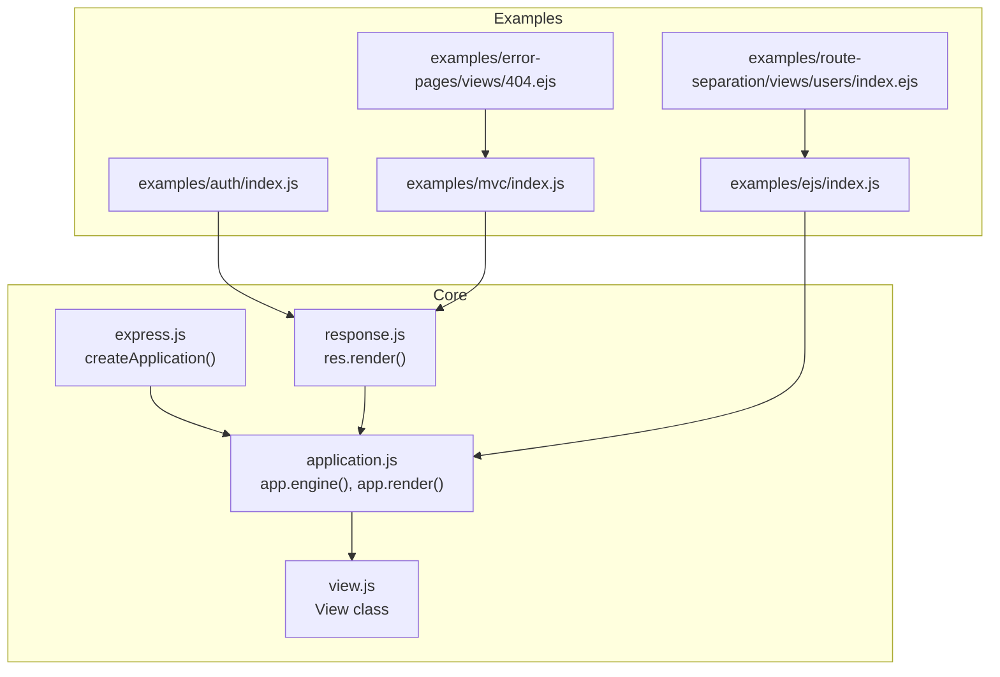
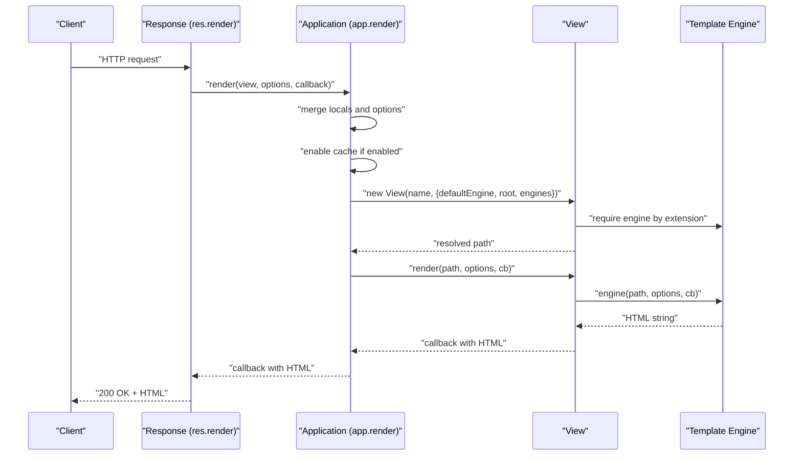
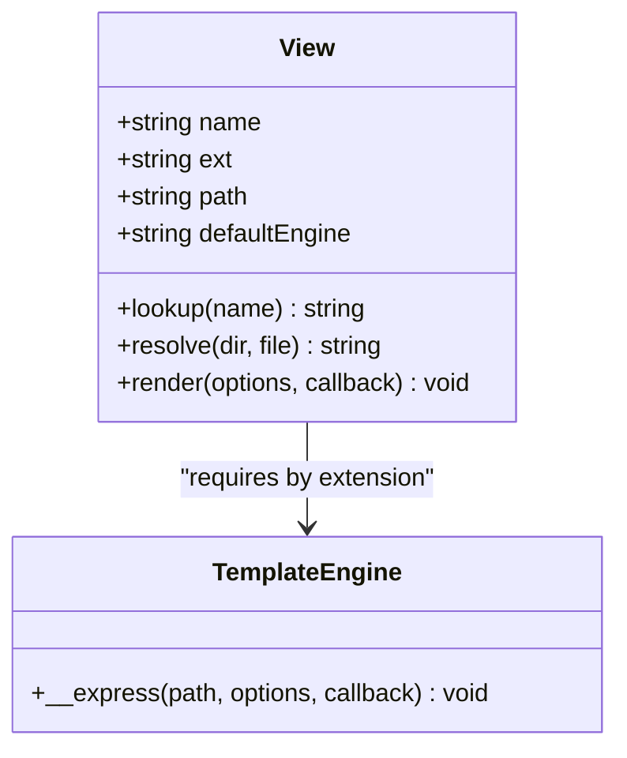
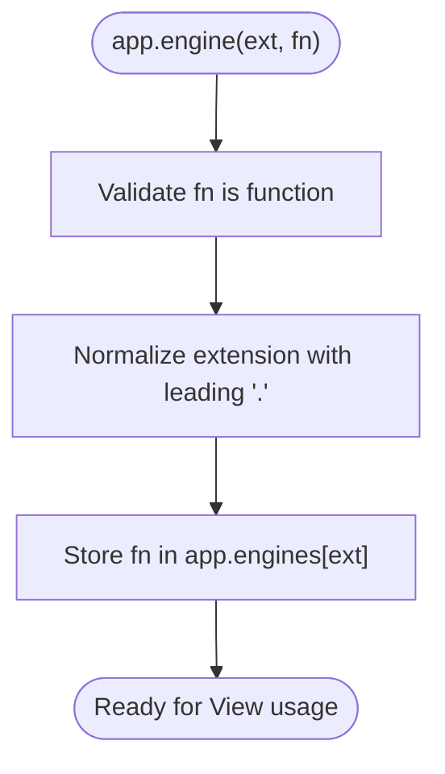
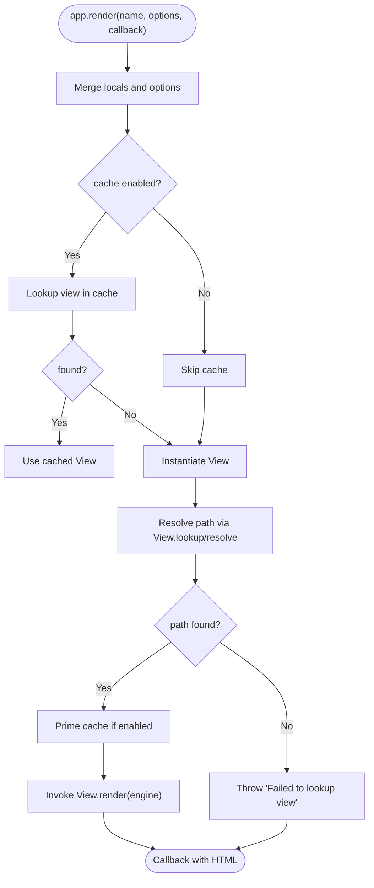
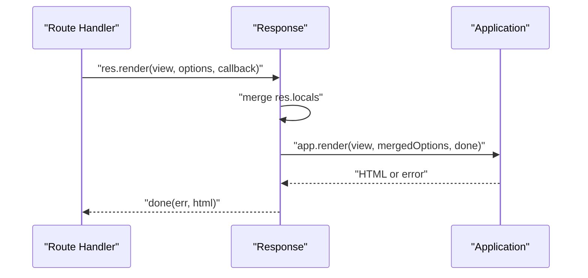
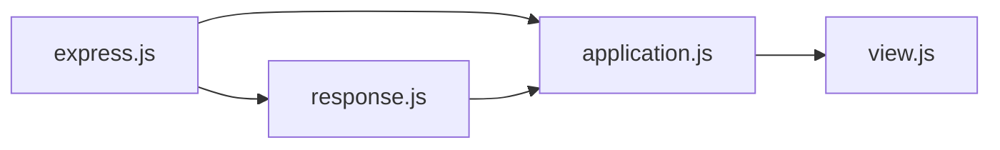

# Templates and Views

<cite>
**Referenced Files in This Document**
- [view.js](file://lib/view.js)
- [application.js](file://lib/application.js)
- [express.js](file://lib/express.js)
- [response.js](file://lib/response.js)
- [index.js](file://examples/ejs/index.js)
- [index.js](file://examples/auth/index.js)
- [login.ejs](file://examples/auth/views/login.ejs)
- [index.js](file://examples/mvc/index.js)
- [index.ejs](file://examples/route-separation/views/users/index.ejs)
- [404.ejs](file://examples/error-pages/views/404.ejs)
- [github-view.js](file://examples/view-constructor/github-view.js)
- [app.engine.js](file://test/app.engine.js)
- [app.render.js](file://test/app.render.js)
- [res.render.js](file://test/res.render.js)
</cite>

## Table of Contents
1. [Introduction](#introduction)
2. [Project Structure](#project-structure)
3. [Core Components](#core-components)
4. [Architecture Overview](#architecture-overview)
5. [Detailed Component Analysis](#detailed-component-analysis)
6. [Dependency Analysis](#dependency-analysis)
7. [Performance Considerations](#performance-considerations)
8. [Troubleshooting Guide](#troubleshooting-guide)
9. [Conclusion](#conclusion)
10. [Appendices](#appendices)

## Introduction
This document explains how Express.js implements its view system and template engine integration. It covers the rendering pipeline, view registration, template compilation hooks, and rendering options. It also documents layout and partial patterns, caching strategies, and practical examples using EJS, Handlebars, and Jade-like templates. The goal is to help you set up maintainable templating systems, bind data effectively, and optimize performance.

## Project Structure
Express’s view system is implemented in core modules and demonstrated across example applications:
- Core runtime: application bootstrap, view resolution, and rendering orchestration
- View renderer: encapsulates template loading, engine selection, and synchronous-to-asynchronous normalization
- Response integration: exposes res.render() to render views and send responses
- Examples: demonstrate EJS, Handlebars, and Jade-style templates, partials, and layouts

**Diagram sources**
- [express.js:36-56](file://lib/express.js#L36-L56)
- [application.js:522-575](file://lib/application.js#L522-L575)
- [response.js:894-918](file://lib/response.js#L894-L918)
- [view.js:52-95](file://lib/view.js#L52-L95)
- [index.js:10-51](file://examples/ejs/index.js#L10-L51)
- [index.js:12-128](file://examples/auth/index.js#L12-L128)
- [index.js:13-89](file://examples/mvc/index.js#L13-L89)
- [index.ejs:1-15](file://examples/route-separation/views/users/index.ejs#L1-L15)
- [404.ejs:1-4](file://examples/error-pages/views/404.ejs#L1-L4)

**Section sources**
- [express.js:36-56](file://lib/express.js#L36-L56)
- [application.js:522-575](file://lib/application.js#L522-L575)
- [response.js:894-918](file://lib/response.js#L894-L918)
- [view.js:52-95](file://lib/view.js#L52-L95)

## Core Components
- View class: resolves view paths, selects engines, and renders synchronously-normalized callbacks
- Application engine registry: registers template engines per extension and sets defaults
- Rendering pipeline: merges locals, applies caching, constructs View, and invokes engine
- Response render: convenience wrapper around app.render()

Key responsibilities:
- View resolution: supports root directories, index fallback, and extension resolution
- Engine selection: lazy require via registered engines keyed by extension
- Rendering: ensures asynchronous callback semantics regardless of engine sync behavior

**Section sources**
- [view.js:52-95](file://lib/view.js#L52-L95)
- [view.js:104-123](file://lib/view.js#L104-L123)
- [view.js:133-159](file://lib/view.js#L133-L159)
- [application.js:294-308](file://lib/application.js#L294-L308)
- [application.js:522-575](file://lib/application.js#L522-L575)
- [response.js:894-918](file://lib/response.js#L894-L918)

## Architecture Overview
The rendering pipeline integrates request lifecycle, application settings, and template engines.

**Diagram sources**
- [response.js:894-918](file://lib/response.js#L894-L918)
- [application.js:522-575](file://lib/application.js#L522-L575)
- [view.js:52-95](file://lib/view.js#L52-L95)
- [view.js:133-159](file://lib/view.js#L133-L159)

## Detailed Component Analysis

### View Resolution and Rendering
The View class encapsulates:
- Extension inference from default engine when none is provided
- Root directory traversal and index fallback resolution
- Lazy engine loading and synchronous-to-asynchronous callback normalization

**Diagram sources**
- [view.js:52-95](file://lib/view.js#L52-L95)
- [view.js:104-123](file://lib/view.js#L104-L123)
- [view.js:133-159](file://lib/view.js#L133-L159)

**Section sources**
- [view.js:52-95](file://lib/view.js#L52-L95)
- [view.js:104-123](file://lib/view.js#L104-L123)
- [view.js:133-159](file://lib/view.js#L133-L159)

### Application Engine Registration
Applications register engines via app.engine(ext, fn). Engines are cached by extension and used by View instances.

**Diagram sources**
- [application.js:294-308](file://lib/application.js#L294-L308)

**Section sources**
- [application.js:294-308](file://lib/application.js#L294-L308)
- [app.engine.js:18-30](file://test/app.engine.js#L18-L30)

### Rendering Pipeline
The pipeline merges app.locals, res.locals, and per-render options, applies caching, constructs View, and renders.

**Diagram sources**
- [application.js:522-575](file://lib/application.js#L522-L575)
- [view.js:104-123](file://lib/view.js#L104-L123)
- [view.js:133-159](file://lib/view.js#L133-L159)

**Section sources**
- [application.js:522-575](file://lib/application.js#L522-L575)
- [app.render.js:10-33](file://test/app.render.js#L10-L33)

### Response Render Integration
res.render(view, options?, callback?) is a thin wrapper around app.render(). It merges res.locals, sets a default callback to send the result, and delegates to app.render().

**Diagram sources**
- [response.js:894-918](file://lib/response.js#L894-L918)
- [res.render.js:15-37](file://test/res.render.js#L15-L37)

**Section sources**
- [response.js:894-918](file://lib/response.js#L894-L918)
- [res.render.js:15-37](file://test/res.render.js#L15-L37)

### Template Engine Integration Patterns

#### EJS Integration
- Register engine for .html and set default view engine to html
- Render views with data passed via options
- Use partials via include directives

Practical example references:
- [index.js:23-51](file://examples/ejs/index.js#L23-L51)
- [index.ejs:1-15](file://examples/route-separation/views/users/index.ejs#L1-L15)

**Section sources**
- [index.js:23-51](file://examples/ejs/index.js#L23-L51)
- [index.ejs:1-15](file://examples/route-separation/views/users/index.ejs#L1-L15)

#### Handlebars Integration
- Register engine for .hbs extension
- Use helpers and block helpers in templates
- Pass data via options and res.locals

Practical example references:
- [show.hbs:1-32](file://examples/mvc/controllers/user/views/show.hbs#L1-L32)

**Section sources**
- [show.hbs:1-32](file://examples/mvc/controllers/user/views/show.hbs#L1-L32)

#### Jade/Pug Integration
- Register engine for .pug/.jade extension
- Use indentation-based syntax and mixins
- Pass data via options and res.locals

Note: While the repository does not include a dedicated Jade example, the same registration and rendering patterns apply.

### Layouts and Partials
Layouts and partials are commonly achieved by:
- Using include directives to compose templates
- Structuring views with shared header/footer partials
- Leveraging res.locals to share reusable data across views

Example references:
- [login.ejs:2-21](file://examples/auth/views/login.ejs#L2-L21)
- [index.ejs:1-15](file://examples/route-separation/views/users/index.ejs#L1-L15)
- [404.ejs:1-4](file://examples/error-pages/views/404.ejs#L1-L4)

**Section sources**
- [login.ejs:2-21](file://examples/auth/views/login.ejs#L2-L21)
- [index.ejs:1-15](file://examples/route-separation/views/users/index.ejs#L1-L15)
- [404.ejs:1-4](file://examples/error-pages/views/404.ejs#L1-L4)

### Custom View Constructor
Express allows replacing the default View constructor to support remote or dynamic templates.

Example reference:
- [github-view.js:23-53](file://examples/view-constructor/github-view.js#L23-L53)

**Section sources**
- [github-view.js:23-53](file://examples/view-constructor/github-view.js#L23-L53)

## Dependency Analysis
The view system exhibits low coupling and clear separation of concerns:
- express.js creates the application and mixes in application/request/response prototypes
- application.js manages settings, engines, and rendering orchestration
- response.js provides the HTTP-facing render method
- view.js encapsulates filesystem and engine integration

**Diagram sources**
- [express.js:36-56](file://lib/express.js#L36-L56)
- [application.js:522-575](file://lib/application.js#L522-L575)
- [response.js:894-918](file://lib/response.js#L894-L918)
- [view.js:52-95](file://lib/view.js#L52-L95)

**Section sources**
- [express.js:36-56](file://lib/express.js#L36-L56)
- [application.js:522-575](file://lib/application.js#L522-L575)
- [response.js:894-918](file://lib/response.js#L894-L918)
- [view.js:52-95](file://lib/view.js#L52-L95)

## Performance Considerations
- Enable view cache in production to avoid repeated View instantiation and filesystem lookups
- Keep templates modular to reduce duplication and improve maintainability
- Minimize heavy computations inside templates; precompute data in controllers
- Use partials judiciously to avoid deep nesting and excessive I/O
- Prefer streaming responses for large datasets when applicable

[No sources needed since this section provides general guidance]

## Troubleshooting Guide
Common issues and resolutions:
- No default engine and no extension: ensure either a default engine is set or the view name includes an extension
- Module does not provide a view engine: verify the engine exports the expected render function
- Failed to lookup view: confirm the views directory setting and that the template exists with supported extensions
- Callback not invoked: ensure the engine passes results to the provided callback

Evidence from tests and examples:
- Error thrown when no extension and no default engine: [view.js:60-62](file://lib/view.js#L60-L62)
- Error when engine lacks __express: [res.render.js:39-51](file://test/res.render.js#L39-L51)
- Lookup failure error message and view object attached: [application.js:558-565](file://lib/application.js#L558-L565)
- Callback invoked on error: [res.render.js:340-357](file://test/res.render.js#L340-L357)

**Section sources**
- [view.js:60-62](file://lib/view.js#L60-L62)
- [res.render.js:39-51](file://test/res.render.js#L39-L51)
- [application.js:558-565](file://lib/application.js#L558-L565)
- [res.render.js:340-357](file://test/res.render.js#L340-L357)

## Conclusion
Express’s view system cleanly separates concerns between application configuration, view resolution, and template engine integration. By registering engines, organizing views, and leveraging res.locals, you can build scalable and maintainable templating systems. Use caching in production, keep templates modular, and follow the established patterns for EJS, Handlebars, and Jade-like engines.

[No sources needed since this section summarizes without analyzing specific files]

## Appendices

### Practical Setup Recipes

- Configure EJS with .html extension and default engine:
  - Register engine and set default engine
  - Reference: [index.js:23-36](file://examples/ejs/index.js#L23-L36)

- Authentication flow with EJS:
  - Set view engine and views directory
  - Use res.render() in routes
  - Reference: [index.js:16-102](file://examples/auth/index.js#L16-L102)

- MVC-style with Handlebars:
  - Register .hbs engine
  - Use helpers and partials in views
  - Reference: [show.hbs:1-32](file://examples/mvc/controllers/user/views/show.hbs#L1-L32)

- Error pages with partials:
  - Compose 404 page from shared partials
  - Reference: [404.ejs:1-4](file://examples/error-pages/views/404.ejs#L1-L4)

- Custom View for remote templates:
  - Replace View constructor to fetch templates from external sources
  - Reference: [github-view.js:23-53](file://examples/view-constructor/github-view.js#L23-L53)

**Section sources**
- [index.js:23-36](file://examples/ejs/index.js#L23-L36)
- [index.js:16-102](file://examples/auth/index.js#L16-L102)
- [show.hbs:1-32](file://examples/mvc/controllers/user/views/show.hbs#L1-L32)
- [404.ejs:1-4](file://examples/error-pages/views/404.ejs#L1-L4)
- [github-view.js:23-53](file://examples/view-constructor/github-view.js#L23-L53)