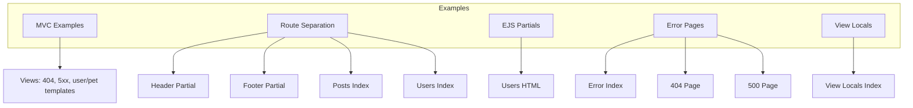
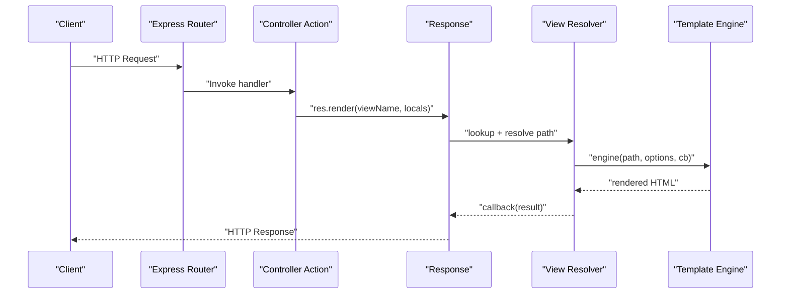
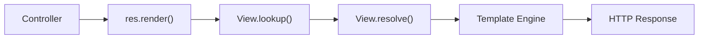

# View Rendering Patterns

<cite>
**Referenced Files in This Document**
- [view.js](file://lib/view.js)
- [index.js](file://examples/mvc/controllers/main/index.js)
- [index.js](file://examples/mvc/index.js)
- [db.js](file://examples/mvc/db.js)
- [index.js](file://examples/mvc/views/index.js)
- [404.ejs](file://examples/mvc/views/404.ejs)
- [5xx.ejs](file://examples/mvc/views/5xx.ejs)
- [index.js](file://examples/route-separation/index.js)
- [header.ejs](file://examples/route-separation/views/header.ejs)
- [footer.ejs](file://examples/route-separation/views/footer.ejs)
- [index.ejs](file://examples/route-separation/views/posts/index.ejs)
- [index.ejs](file://examples/route-separation/views/users/index.ejs)
- [index.js](file://examples/ejs/index.js)
- [users.html](file://examples/ejs/views/users.html)
- [header.html](file://examples/ejs/views/header.html)
- [footer.html](file://examples/ejs/views/footer.html)
- [index.js](file://examples/error-pages/index.js)
- [index.ejs](file://examples/error-pages/views/index.ejs)
- [404.ejs](file://examples/error-pages/views/404.ejs)
- [500.ejs](file://examples/error-pages/views/500.ejs)
- [index.js](file://examples/view-locals/index.js)
- [index.ejs](file://examples/view-locals/views/index.ejs)
</cite>

## Table of Contents
1. [Introduction](#introduction)
2. [Project Structure](#project-structure)
3. [Core Components](#core-components)
4. [Architecture Overview](#architecture-overview)
5. [Detailed Component Analysis](#detailed-component-analysis)
6. [Dependency Analysis](#dependency-analysis)
7. [Performance Considerations](#performance-considerations)
8. [Troubleshooting Guide](#troubleshooting-guide)
9. [Conclusion](#conclusion)
10. [Appendices](#appendices)

## Introduction
This document explains view rendering patterns and best practices in Express.js using real examples from the repository. It covers direct rendering, layout inheritance via partials, conditional rendering, dynamic template selection, view helpers, and organizational strategies for maintainable, scalable applications. It also outlines performance and memory considerations grounded in the framework’s view resolution and rendering pipeline.

## Project Structure
The repository organizes rendering examples under the examples directory, grouped by concept:
- MVC pattern with EJS and Handlebars templates
- Route separation with shared header/footer partials
- EJS partial inclusion
- Error pages with custom layouts
- View locals and data binding
- Basic Express app initialization

[No sources needed since this diagram shows conceptual structure, not a direct code mapping]

## Core Components
Express’s view rendering is implemented in a dedicated view module that:
- Resolves template engines by extension
- Looks up view files across configured root paths
- Supports index fallback resolution
- Renders synchronously or asynchronously via a normalized callback

Key behaviors:
- Engine discovery and caching via an internal engines registry
- Path resolution with fallback to index files
- Normalized asynchronous rendering callback

**Section sources**
- [view.js:52-95](file://lib/view.js#L52-L95)
- [view.js:104-123](file://lib/view.js#L104-L123)
- [view.js:133-159](file://lib/view.js#L133-L159)
- [view.js:169-187](file://lib/view.js#L169-L187)

## Architecture Overview
The rendering pipeline integrates routing, controller actions, and view rendering. Controllers prepare data and call response.render with a view name and locals. The view module resolves the template, loads the appropriate engine, and renders to a stream or buffer.

**Diagram sources**
- [view.js:104-123](file://lib/view.js#L104-L123)
- [view.js:133-159](file://lib/view.js#L133-L159)

**Section sources**
- [view.js:104-187](file://lib/view.js#L104-L187)

## Detailed Component Analysis

### Direct Rendering Pattern
Direct rendering occurs when a controller passes a view name and data to response.render. The view module resolves the file and renders immediately. Examples demonstrate this in MVC controllers and route-separated views.

- MVC main controller redirects to a users route, which triggers a render with locals.
- Route separation includes a posts/users index that renders with data passed from the controller.

Best practices:
- Keep controllers thin; delegate rendering to views.
- Pass only required data to views to minimize payload and improve cacheability.

**Section sources**
- [index.js:3-5](file://examples/mvc/controllers/main/index.js#L3-L5)
- [index.ejs:1-13](file://examples/route-separation/views/posts/index.ejs#L1-L13)
- [index.ejs:1-15](file://examples/route-separation/views/users/index.ejs#L1-L15)

### Layout Inheritance via Partials
Layout inheritance is achieved by splitting common markup into partials and including them in page templates. The route-separation example includes a shared header and footer partials, while the EJS example uses include directives to compose pages.

Patterns:
- Define reusable header/footer partials.
- Include partials at the top and bottom of page templates.
- Pass page-specific data (e.g., title) to partials.

**Section sources**
- [header.ejs:1-10](file://examples/route-separation/views/header.ejs#L1-L10)
- [footer.ejs:1-3](file://examples/route-separation/views/footer.ejs#L1-L3)
- [index.ejs:1-13](file://examples/route-separation/views/posts/index.ejs#L1-L13)
- [index.ejs:1-15](file://examples/route-separation/views/users/index.ejs#L1-L15)
- [users.html:1-11](file://examples/ejs/views/users.html#L1-L11)

### Partial Templates and Composition
Partials encapsulate reusable UI segments. The EJS example composes a users page by including a header and footer partial. This promotes DRY and modularity.

Guidelines:
- Use include directives for partials.
- Keep partials self-contained and predictable.
- Pass minimal data to partials to reduce coupling.

**Section sources**
- [users.html:1-11](file://examples/ejs/views/users.html#L1-L11)
- [header.html](file://examples/ejs/views/header.html)
- [footer.html](file://examples/ejs/views/footer.html)

### Conditional Rendering and Dynamic Selection
Templates can conditionally render content and dynamically select templates based on runtime conditions. The MVC user show template demonstrates conditional blocks and iteration, while error pages provide distinct templates per status.

Patterns:
- Use conditional statements in templates to branch rendering.
- Select different templates based on data presence or flags.
- Centralize error page selection in routes or middleware.

**Section sources**
- [show.hbs:12-29](file://examples/mvc/controllers/user/views/show.hbs#L12-L29)
- [404.ejs:1-14](file://examples/mvc/views/404.ejs#L1-L14)
- [500.ejs:1-14](file://examples/error-pages/views/500.ejs)

### Data Binding and View Helpers
Data binding is straightforward in Express: controllers pass locals to views. The view-locals example binds title and users arrays to the template. Helpers can be implemented as functions attached to app.locals or res.locals.

Recommendations:
- Expose helper functions via app.locals/res.locals.
- Keep helpers pure and stateless.
- Avoid heavy computation in views; precompute in controllers.

**Section sources**
- [index.ejs:1-21](file://examples/view-locals/views/index.ejs#L1-L21)
- [index.js:1-21](file://examples/view-locals/index.js#L1-L21)

### Template Utilities and Engines
Express supports multiple engines. The view module discovers engines by extension and caches them. The MVC example mixes EJS and Handlebars templates, demonstrating how to configure and use different engines.

Notes:
- Configure engines with app.engine if needed.
- Ensure engine modules export a compatible render function.
- Use consistent naming and extensions for clarity.

**Section sources**
- [view.js:75-88](file://lib/view.js#L75-L88)
- [edit.hbs:1-28](file://examples/mvc/controllers/user/views/edit.hbs#L1-L28)
- [list.hbs:1-19](file://examples/mvc/controllers/user/views/list.hbs#L1-L19)

### Error Page Rendering
Error pages are rendered with dedicated templates. The error-pages example includes a main index and separate 404/500 pages. Routes can trigger these pages to provide user-friendly error experiences.

Practices:
- Separate error templates by status.
- Include contextual information without exposing internals.
- Use consistent layout partials for error pages.

**Section sources**
- [index.ejs:1-21](file://examples/error-pages/views/index.ejs#L1-L21)
- [404.ejs:1-14](file://examples/error-pages/views/404.ejs#L1-L14)
- [500.ejs:1-14](file://examples/error-pages/views/500.ejs#L1-L14)

### MVC Organization and Naming Conventions
The MVC example organizes views by domain (user, pet) and uses descriptive filenames. Controllers redirect or render with consistent naming, aiding maintainability.

Convention guidelines:
- Group views by domain/controller.
- Use descriptive filenames (show, edit, list).
- Keep view names aligned with controller actions.

**Section sources**
- [index.js:3-5](file://examples/mvc/controllers/main/index.js#L3-L5)
- [edit.ejs:1-18](file://examples/mvc/controllers/pet/views/edit.ejs#L1-L18)
- [show.ejs:1-16](file://examples/mvc/controllers/pet/views/show.ejs#L1-L16)
- [show.hbs:1-32](file://examples/mvc/controllers/user/views/show.hbs#L1-L32)

## Dependency Analysis
The rendering pipeline depends on:
- View resolution and engine loading
- Template engine compatibility
- Controller-to-view contract (locals and view name)

**Diagram sources**
- [view.js:104-123](file://lib/view.js#L104-L123)
- [view.js:169-187](file://lib/view.js#L169-L187)
- [view.js:133-159](file://lib/view.js#L133-L159)

**Section sources**
- [view.js:104-187](file://lib/view.js#L104-L187)

## Performance Considerations
- Engine caching: The view module caches engines by extension, reducing repeated require overhead.
- Path resolution: Efficiently resolving files and index fallback minimizes filesystem checks.
- Minimizing data: Pass only necessary data to views to reduce rendering cost and memory footprint.
- Partial reuse: Shared partials reduce duplication and improve consistency.
- Asynchronous rendering: The renderer normalizes callbacks to be asynchronous, preventing blocking.

[No sources needed since this section provides general guidance]

## Troubleshooting Guide
Common issues and remedies:
- Missing default engine or extension: Ensure either a default engine is set or the view name includes an extension.
- Engine not found: Verify the engine module exports a compatible render function.
- View not found: Confirm the view path exists under configured roots and consider index fallback behavior.
- Incorrect locals: Validate controller-provided data and ensure keys match template expectations.

**Section sources**
- [view.js:60-62](file://lib/view.js#L60-L62)
- [view.js:83-85](file://lib/view.js#L83-L85)
- [view.js:176-186](file://lib/view.js#L176-L186)

## Conclusion
Express’s view rendering model is flexible and engine-agnostic. By combining direct rendering, layout inheritance via partials, conditional logic, and structured MVC organization, teams can build maintainable, scalable UIs. Performance benefits come from engine caching, efficient path resolution, and mindful data passing. Adopting consistent naming and separation of concerns further improves long-term maintainability.

[No sources needed since this section summarizes without analyzing specific files]

## Appendices

### Practical Scenarios and Patterns
- Conditional rendering: Use template conditionals to render lists or messages based on data presence.
- Dynamic template selection: Choose different templates depending on user roles or feature flags.
- Partial composition: Build pages from shared header/footer and reusable components.
- Error handling: Route errors to dedicated templates with consistent layout.

[No sources needed since this section provides general guidance]