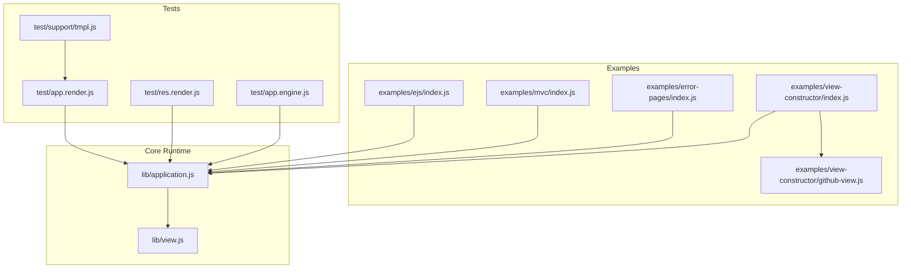
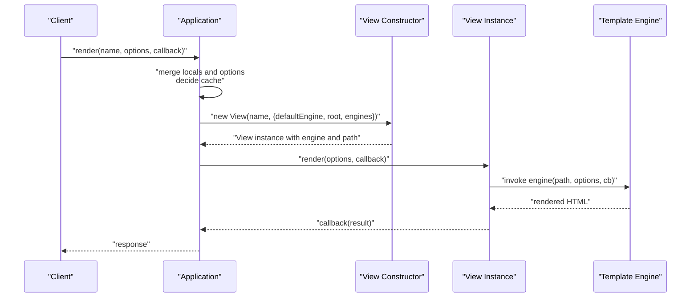
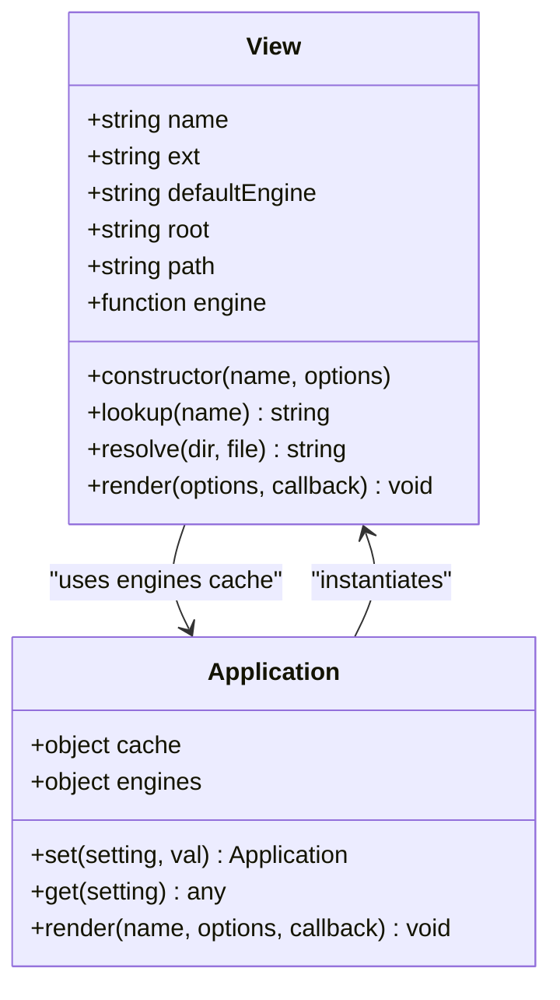
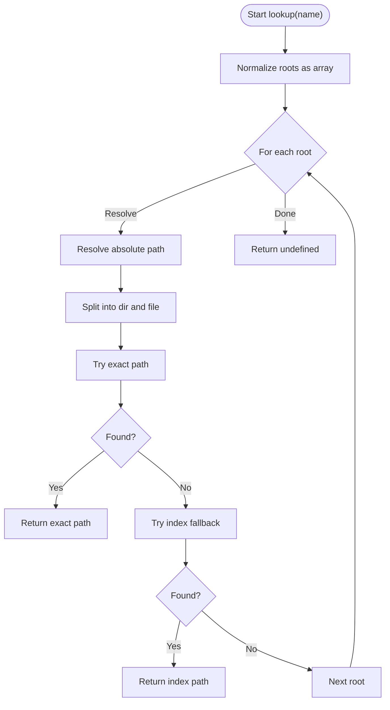
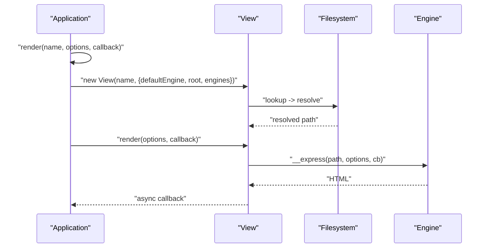
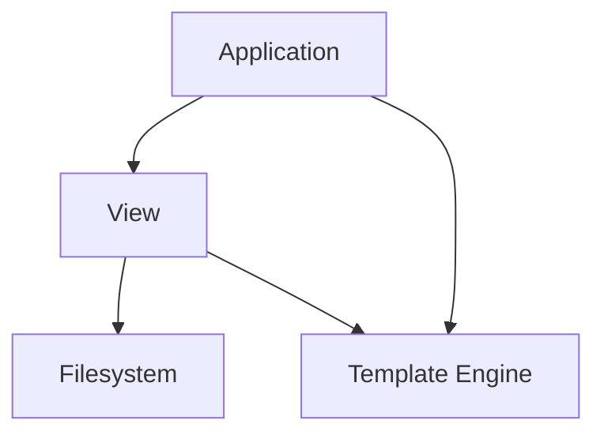

# View System Fundamentals

<cite>
**Referenced Files in This Document**
- [view.js](file://lib/view.js)
- [application.js](file://lib/application.js)
- [index.js](file://examples/ejs/index.js)
- [index.js](file://examples/mvc/index.js)
- [index.js](file://examples/error-pages/index.js)
- [index.js](file://examples/view-constructor/index.js)
- [github-view.js](file://examples/view-constructor/github-view.js)
- [app.render.js](file://test/app.render.js)
- [res.render.js](file://test/res.render.js)
- [app.engine.js](file://test/app.engine.js)
- [tmpl.js](file://test/support/tmpl.js)
</cite>

## Table of Contents
1. [Introduction](#introduction)
2. [Project Structure](#project-structure)
3. [Core Components](#core-components)
4. [Architecture Overview](#architecture-overview)
5. [Detailed Component Analysis](#detailed-component-analysis)
6. [Dependency Analysis](#dependency-analysis)
7. [Performance Considerations](#performance-considerations)
8. [Troubleshooting Guide](#troubleshooting-guide)
9. [Conclusion](#conclusion)
10. [Appendices](#appendices)

## Introduction
This document explains the Express.js view system fundamentals: the View class architecture, view lookup mechanisms, and the rendering pipeline. It documents the view resolution algorithm, path resolution logic, and file system operations. It also covers view instantiation, engine loading, and template compilation, along with practical examples of configuration, custom view engines, and caching strategies. Finally, it addresses path resolution, directory traversal protection, and performance optimization techniques, and explains how the view system integrates with the Express application lifecycle.

## Project Structure
The view system spans three primary areas:
- Core runtime: the View class and application integration
- Examples: real-world configurations for EJS, MVC, error pages, and custom view engines
- Tests: behavioral specifications for rendering, caching, and error handling

**Diagram sources**
- [view.js](file://lib/view.js)
- [application.js](file://lib/application.js)
- [index.js](file://examples/ejs/index.js)
- [index.js](file://examples/mvc/index.js)
- [index.js](file://examples/error-pages/index.js)
- [index.js](file://examples/view-constructor/index.js)
- [github-view.js](file://examples/view-constructor/github-view.js)
- [app.render.js](file://test/app.render.js)
- [res.render.js](file://test/res.render.js)
- [app.engine.js](file://test/app.engine.js)
- [tmpl.js](file://test/support/tmpl.js)

**Section sources**
- [view.js](file://lib/view.js)
- [application.js](file://lib/application.js)

## Core Components
- View class: encapsulates view metadata, engine loading, path resolution, and synchronous-to-asynchronous normalization during rendering.
- Application integration: exposes settings for view engine and views, registers template engines, and orchestrates rendering with caching and error propagation.

Key responsibilities:
- View instantiation: constructs with name and options, determines extension, loads engine if needed, and resolves path.
- Rendering: delegates to the loaded engine and ensures asynchronous callback semantics.
- Resolution: supports direct file lookup and index fallback within a single root or multiple roots.

**Section sources**
- [view.js](file://lib/view.js)
- [application.js](file://lib/application.js)

## Architecture Overview
The Express view system integrates with the application lifecycle as follows:
- Application initialization sets default view settings and caches.
- Rendering is triggered via app.render or res.render.
- The application resolves view options, optionally caches the View instance, and invokes the view’s render method.
- The View class loads the appropriate template engine and performs filesystem-based resolution.

**Diagram sources**
- [application.js](file://lib/application.js)
- [view.js](file://lib/view.js)

## Detailed Component Analysis

### View Class Architecture
The View class encapsulates:
- Metadata: name, extension, default engine, root paths
- Engine loading: lazy require of the engine module and caching in the application’s engines registry
- Path resolution: resolves absolute path and falls back to index.<ext> if applicable
- Rendering: normalizes synchronous engine callbacks to asynchronous ones

**Diagram sources**
- [view.js](file://lib/view.js)
- [application.js](file://lib/application.js)

Implementation highlights:
- Extension inference: if no extension is present, the default engine is used to construct a filename.
- Engine loading: requires the engine module and verifies the presence of the expected render interface.
- Path resolution: tries exact file match first, then index fallback within the same directory.
- Rendering normalization: ensures callbacks are invoked asynchronously regardless of engine behavior.

**Section sources**
- [view.js](file://lib/view.js)

### View Lookup Mechanism and Resolution Algorithm
The lookup algorithm:
- Accepts a root path and a view name.
- Resolves the absolute location of the requested file.
- Attempts direct file resolution; if not found, attempts index fallback.
- Supports multiple roots; iteration stops upon first successful resolution.

**Diagram sources**
- [view.js](file://lib/view.js)

**Section sources**
- [view.js](file://lib/view.js)

### Rendering Pipeline
The rendering pipeline:
- app.render merges locals and options, decides whether to cache the View instance, and instantiates View if needed.
- The View instance loads the engine and resolves the path.
- The View.render method invokes the engine and normalizes callback invocation to asynchronous.

**Diagram sources**
- [application.js](file://lib/application.js)
- [view.js](file://lib/view.js)

**Section sources**
- [application.js](file://lib/application.js)
- [view.js](file://lib/view.js)

### Template Engine Registration and Loading
Express supports registering template engines with app.engine. Engines can be mapped by extension and must conform to the expected signature.

Practical examples:
- Registering EJS for .html files and setting the default view engine
- Using a custom engine via app.engine

**Section sources**
- [application.js](file://lib/application.js)
- [index.js](file://examples/ejs/index.js)
- [app.engine.js](file://test/app.engine.js)

### Custom View Engines and View Constructor
Express allows replacing the default View class with a custom constructor via app.set('view', CustomView). The custom constructor receives name and options and must set this.path and this.engine.

Example: a GitHub-backed view that fetches templates from raw.githubusercontent.com and renders them with the appropriate engine.

**Section sources**
- [index.js](file://examples/view-constructor/index.js)
- [github-view.js](file://examples/view-constructor/github-view.js)

### View Caching Strategies
The application caches View instances when the view cache setting is enabled. This avoids repeated instantiation and path resolution for frequently used views.

Behavior:
- app.render checks cache and primes it after instantiation when caching is enabled.
- Options can override cache behavior per-render.

**Section sources**
- [application.js](file://lib/application.js)
- [app.render.js](file://test/app.render.js)
- [res.render.js](file://test/res.render.js)

### Practical Configuration Examples
- EJS example: demonstrates registering an engine for .html, setting views directory, and using a default view engine.
- MVC example: shows defaulting to EJS, serving static assets, and rendering error pages.
- Error pages example: illustrates rendering different error pages based on status codes.

**Section sources**
- [index.js](file://examples/ejs/index.js)
- [index.js](file://examples/mvc/index.js)
- [index.js](file://examples/error-pages/index.js)

## Dependency Analysis
The view system depends on:
- Application settings for view engine and views directory
- Template engines registered via app.engine
- Filesystem operations for path resolution and index fallback
- Asynchronous callback normalization

**Diagram sources**
- [application.js](file://lib/application.js)
- [view.js](file://lib/view.js)

**Section sources**
- [application.js](file://lib/application.js)
- [view.js](file://lib/view.js)

## Performance Considerations
- Enable view cache in production to avoid repeated View instantiation and path resolution.
- Prefer relative paths within configured views directories to minimize filesystem overhead.
- Choose lightweight template engines suited to your workload.
- Avoid excessive nesting in views to reduce index fallback checks.

[No sources needed since this section provides general guidance]

## Troubleshooting Guide
Common issues and remedies:
- No default engine and no extension: ensure either app.set('view engine') is set or the view name includes an extension.
- Module does not provide a view engine: verify the engine module exports the expected render interface.
- View not found: confirm the views directory setting and that the file exists or matches the index fallback pattern.
- Rendering errors: errors thrown by engines are captured and passed to the callback; wrap res.render calls to handle them gracefully.

**Section sources**
- [res.render.js](file://test/res.render.js)
- [app.render.js](file://test/app.render.js)

## Conclusion
The Express view system centers on a compact View class that handles engine loading, path resolution, and rendering normalization. The application integrates this system through settings, caching, and error propagation. With proper configuration—such as setting the view engine, configuring views directories, and registering engines—the system provides flexible, performant rendering. Custom view constructors enable advanced scenarios like remote template fetching, while built-in caching and robust error handling support production-grade applications.

[No sources needed since this section summarizes without analyzing specific files]

## Appendices

### Appendix A: Settings and Defaults
- view: defaults to the built-in View class
- views: defaults to the current working directory named views
- view engine: default template engine name used when resolving extensions

**Section sources**
- [application.js](file://lib/application.js)

### Appendix B: Example Workflows
- Rendering with default engine and views directory
- Rendering with absolute path and default engine
- Rendering with multiple views directories and index fallback

**Section sources**
- [app.render.js](file://test/app.render.js)
- [res.render.js](file://test/res.render.js)