# Acceptance Testing

<cite>
**Referenced Files in This Document**
- [auth.js](file://test/acceptance/auth.js)
- [content-negotiation.js](file://test/acceptance/content-negotiation.js)
- [downloads.js](file://test/acceptance/downloads.js)
- [mvc.js](file://test/acceptance/mvc.js)
- [web-service.js](file://test/acceptance/web-service.js)
- [cookies.js](file://test/acceptance/cookies.js)
- [error-pages.js](file://test/acceptance/error-pages.js)
- [route-separation.js](file://test/acceptance/route-separation.js)
- [utils.js](file://test/support/utils.js)
- [env.js](file://test/support/env.js)
- [package.json](file://package.json)
- [index.js](file://examples/auth/index.js)
- [index.js](file://examples/downloads/index.js)
- [index.js](file://examples/mvc/index.js)
- [index.js](file://examples/web-service/index.js)
</cite>

## Table of Contents
1. [Introduction](#introduction)
2. [Project Structure](#project-structure)
3. [Core Components](#core-components)
4. [Architecture Overview](#architecture-overview)
5. [Detailed Component Analysis](#detailed-component-analysis)
6. [Dependency Analysis](#dependency-analysis)
7. [Performance Considerations](#performance-considerations)
8. [Troubleshooting Guide](#troubleshooting-guide)
9. [Conclusion](#conclusion)
10. [Appendices](#appendices)

## Introduction
This document provides comprehensive acceptance testing guidance for Express.js applications. It focuses on end-to-end testing scenarios that validate complete user workflows, real-world application behavior, and system integration. The repository’s acceptance tests demonstrate robust patterns for validating authentication systems, content negotiation, file downloads, multi-component interactions, and error handling across diverse Express.js examples.

The testing strategy leverages Supertest for HTTP assertions, Mocha for test orchestration, and a shared test support utility for reusable assertions. The examples under test illustrate typical Express.js features such as sessions, routing, middleware, static file serving, and API key validation.

## Project Structure
The acceptance tests reside under test/acceptance and target example applications under examples/. Each acceptance test file corresponds to a specific example and validates end-to-end behavior, including redirects, content types, cookies, and error pages.

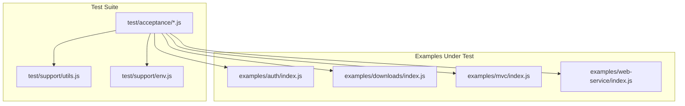

**Diagram sources**
- [auth.js](file://test/acceptance/auth.js)
- [downloads.js](file://test/acceptance/downloads.js)
- [mvc.js](file://test/acceptance/mvc.js)
- [web-service.js](file://test/acceptance/web-service.js)
- [utils.js](file://test/support/utils.js)
- [env.js](file://test/support/env.js)
- [index.js](file://examples/auth/index.js)
- [index.js](file://examples/downloads/index.js)
- [index.js](file://examples/mvc/index.js)
- [index.js](file://examples/web-service/index.js)

**Section sources**
- [auth.js](file://test/acceptance/auth.js)
- [downloads.js](file://test/acceptance/downloads.js)
- [mvc.js](file://test/acceptance/mvc.js)
- [web-service.js](file://test/acceptance/web-service.js)
- [cookies.js](file://test/acceptance/cookies.js)
- [error-pages.js](file://test/acceptance/error-pages.js)
- [route-separation.js](file://test/acceptance/route-separation.js)
- [utils.js](file://test/support/utils.js)
- [env.js](file://test/support/env.js)
- [package.json](file://package.json)

## Core Components
- Supertest-driven HTTP assertions: Tests issue requests and assert status codes, headers, and response bodies.
- Mocha test suites: Each example has a dedicated describe block with focused tests per route or feature.
- Shared test utilities: Helper functions encapsulate common assertions (e.g., presence/absence of headers/body).
- Environment configuration: Test environment variables ensure deterministic behavior during acceptance runs.

Key acceptance test patterns demonstrated:
- Authentication flows with session cookies and redirects.
- Content negotiation via Accept headers.
- File downloads with Content-Disposition and error handling.
- MVC-style CRUD interactions with form submissions and redirects.
- Web service API validation with API key checks and JSON responses.
- Cookie lifecycle management and clearing.
- Error page rendering across HTML, JSON, and plain text media types.
- Route separation and method override patterns.

**Section sources**
- [auth.js](file://test/acceptance/auth.js)
- [content-negotiation.js](file://test/acceptance/content-negotiation.js)
- [downloads.js](file://test/acceptance/downloads.js)
- [mvc.js](file://test/acceptance/mvc.js)
- [web-service.js](file://test/acceptance/web-service.js)
- [cookies.js](file://test/acceptance/cookies.js)
- [error-pages.js](file://test/acceptance/error-pages.js)
- [route-separation.js](file://test/acceptance/route-separation.js)
- [utils.js](file://test/support/utils.js)
- [env.js](file://test/support/env.js)

## Architecture Overview
The acceptance testing architecture centers on isolated test suites that import example applications and validate end-to-end behavior. The following diagram maps the relationship between test files and the example applications they exercise.

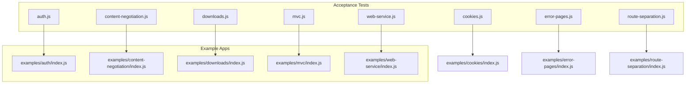

**Diagram sources**
- [auth.js](file://test/acceptance/auth.js)
- [content-negotiation.js](file://test/acceptance/content-negotiation.js)
- [downloads.js](file://test/acceptance/downloads.js)
- [mvc.js](file://test/acceptance/mvc.js)
- [web-service.js](file://test/acceptance/web-service.js)
- [cookies.js](file://test/acceptance/cookies.js)
- [error-pages.js](file://test/acceptance/error-pages.js)
- [route-separation.js](file://test/acceptance/route-separation.js)
- [index.js](file://examples/auth/index.js)
- [index.js](file://examples/downloads/index.js)
- [index.js](file://examples/mvc/index.js)
- [index.js](file://examples/web-service/index.js)

## Detailed Component Analysis

### Authentication Acceptance Testing
This suite validates login, logout, and restricted-area access using sessions and redirects. It demonstrates:
- Redirects from root to login.
- Rendering of login forms.
- Error handling for invalid credentials.
- Successful login leading to restricted access.
- Logout redirect behavior.

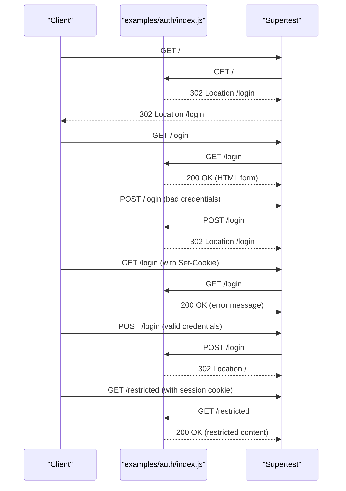

**Diagram sources**
- [auth.js](file://test/acceptance/auth.js)
- [index.js](file://examples/auth/index.js)

**Section sources**
- [auth.js](file://test/acceptance/auth.js)
- [index.js](file://examples/auth/index.js)

### Content Negotiation Acceptance Testing
This suite verifies content negotiation via Accept headers, ensuring the server responds with appropriate formats:
- Default HTML for root and users routes.
- Plain text responses when Accept is text/plain.
- JSON responses when Accept is application/json.

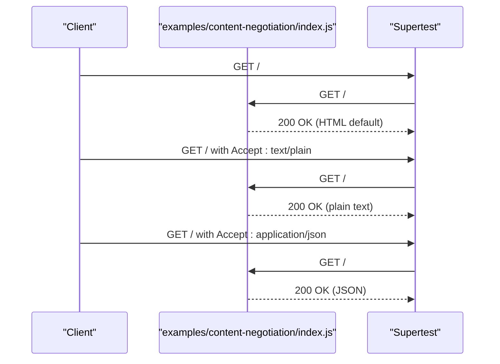

**Diagram sources**
- [content-negotiation.js](file://test/acceptance/content-negotiation.js)
- [index.js](file://examples/content-negotiation/index.js)

**Section sources**
- [content-negotiation.js](file://test/acceptance/content-negotiation.js)
- [index.js](file://examples/content-negotiation/index.js)

### Downloads Acceptance Testing
This suite validates file download behavior, including:
- Link generation for downloadable files.
- Content-Disposition headers for downloads.
- 404 for missing files.
- 403 for forbidden paths.

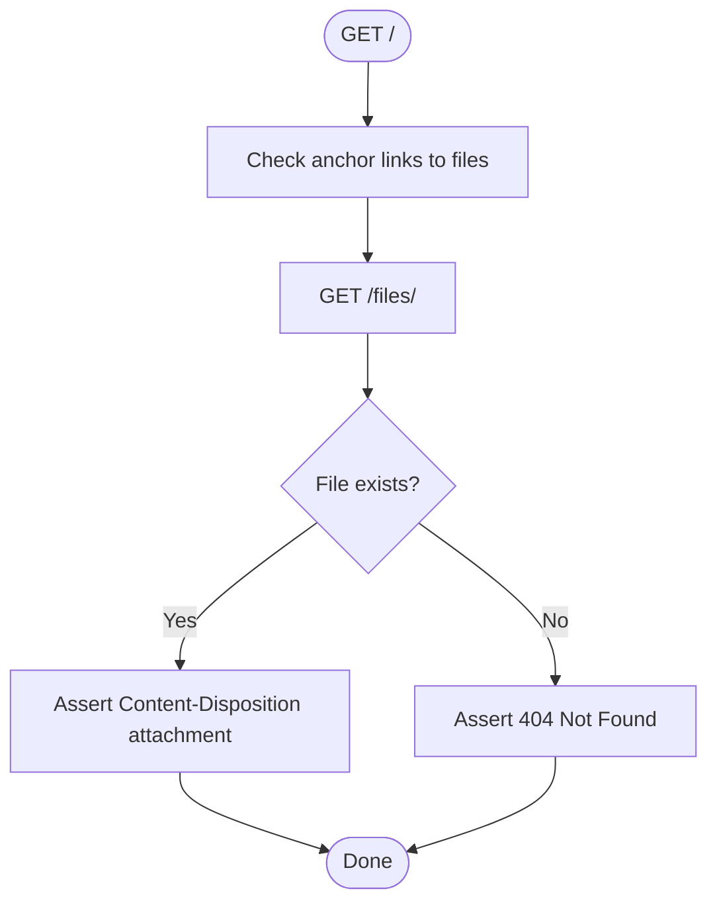

**Diagram sources**
- [downloads.js](file://test/acceptance/downloads.js)
- [index.js](file://examples/downloads/index.js)

**Section sources**
- [downloads.js](file://test/acceptance/downloads.js)
- [index.js](file://examples/downloads/index.js)

### MVC CRUD Acceptance Testing
This suite exercises MVC-style interactions:
- Redirect from root to users listing.
- Viewing and editing user records.
- Updating users and pets with form submissions.
- Handling errors and redirects after updates.

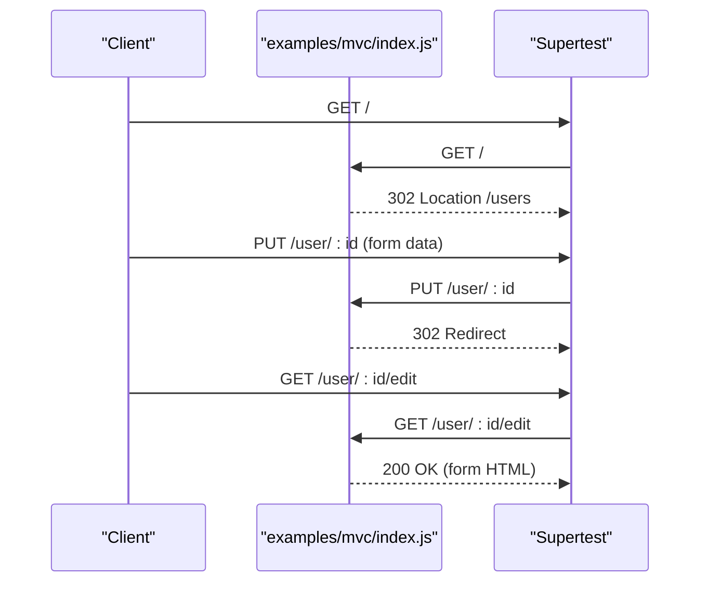

**Diagram sources**
- [mvc.js](file://test/acceptance/mvc.js)
- [index.js](file://examples/mvc/index.js)

**Section sources**
- [mvc.js](file://test/acceptance/mvc.js)
- [index.js](file://examples/mvc/index.js)

### Web Service API Acceptance Testing
This suite validates API key authentication and JSON responses:
- 400 for missing API key.
- 401 for invalid API key.
- 200 with JSON for valid API key.
- 404 JSON for invalid routes.

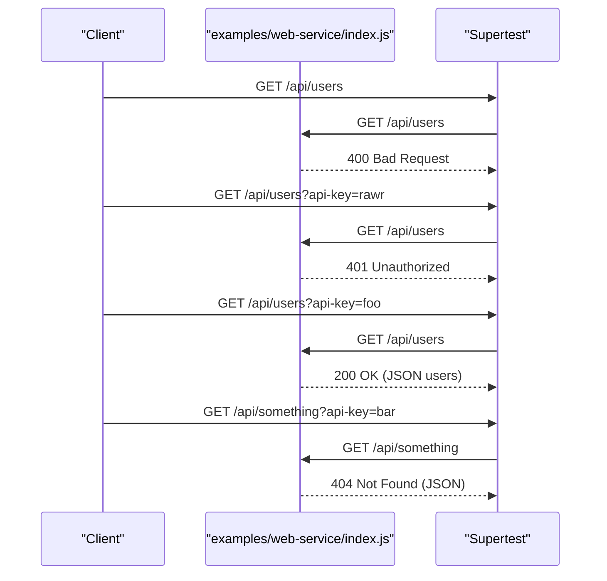

**Diagram sources**
- [web-service.js](file://test/acceptance/web-service.js)
- [index.js](file://examples/web-service/index.js)

**Section sources**
- [web-service.js](file://test/acceptance/web-service.js)
- [index.js](file://examples/web-service/index.js)

### Cookies Acceptance Testing
This suite covers cookie lifecycle:
- Setting cookies via form submission.
- Verifying cookie presence on subsequent requests.
- Clearing cookies with a dedicated endpoint.

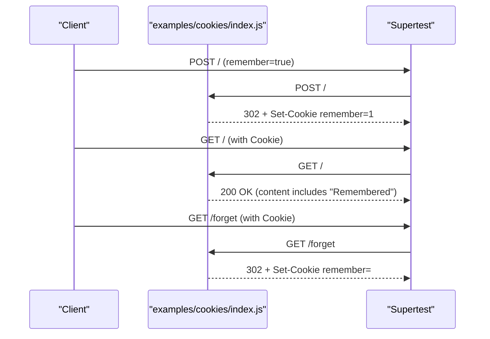

**Diagram sources**
- [cookies.js](file://test/acceptance/cookies.js)
- [index.js](file://examples/cookies/index.js)

**Section sources**
- [cookies.js](file://test/acceptance/cookies.js)
- [index.js](file://examples/cookies/index.js)

### Error Pages Acceptance Testing
This suite validates error handling across media types:
- 403, 404, 500 status codes.
- HTML, JSON, and plain text responses depending on Accept header.

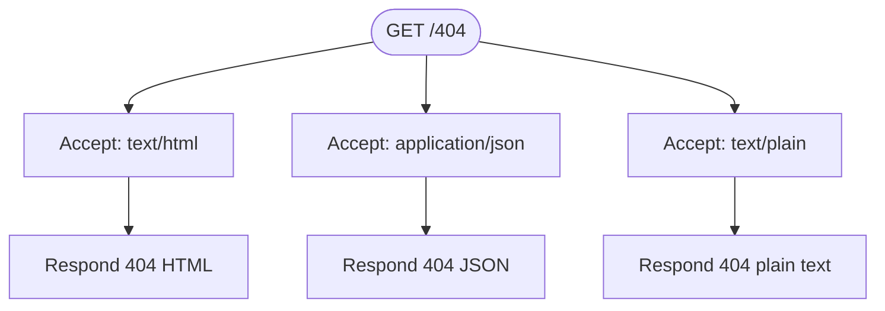

**Diagram sources**
- [error-pages.js](file://test/acceptance/error-pages.js)
- [index.js](file://examples/error-pages/index.js)

**Section sources**
- [error-pages.js](file://test/acceptance/error-pages.js)
- [index.js](file://examples/error-pages/index.js)

### Route Separation Acceptance Testing
This suite validates route separation and method override:
- Listing users and viewing user details.
- Editing users via PUT and POST with method override.
- Handling 404 for missing resources.

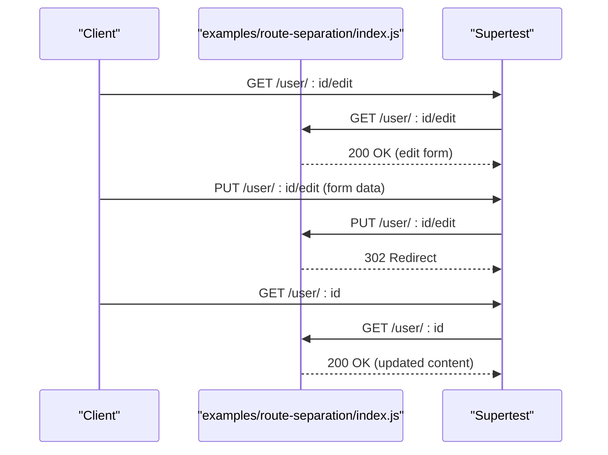

**Diagram sources**
- [route-separation.js](file://test/acceptance/route-separation.js)
- [index.js](file://examples/route-separation/index.js)

**Section sources**
- [route-separation.js](file://test/acceptance/route-separation.js)
- [index.js](file://examples/route-separation/index.js)

## Dependency Analysis
The acceptance tests rely on:
- Supertest for HTTP assertions.
- Mocha for test execution.
- Shared utilities for header/body assertions.
- Environment configuration for consistent test runs.

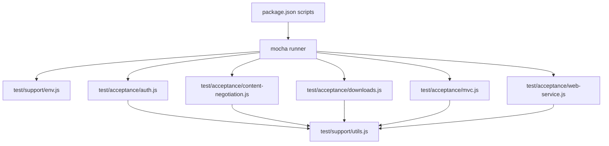

**Diagram sources**
- [package.json](file://package.json)
- [env.js](file://test/support/env.js)
- [utils.js](file://test/support/utils.js)
- [auth.js](file://test/acceptance/auth.js)
- [content-negotiation.js](file://test/acceptance/content-negotiation.js)
- [downloads.js](file://test/acceptance/downloads.js)
- [mvc.js](file://test/acceptance/mvc.js)
- [web-service.js](file://test/acceptance/web-service.js)

**Section sources**
- [package.json](file://package.json)
- [env.js](file://test/support/env.js)
- [utils.js](file://test/support/utils.js)
- [auth.js](file://test/acceptance/auth.js)
- [content-negotiation.js](file://test/acceptance/content-negotiation.js)
- [downloads.js](file://test/acceptance/downloads.js)
- [mvc.js](file://test/acceptance/mvc.js)
- [web-service.js](file://test/acceptance/web-service.js)

## Performance Considerations
- Prefer lightweight assertions (status codes, headers) over heavy body parsing when possible.
- Reuse Supertest agents cautiously; each test should operate independently for isolation.
- Avoid unnecessary network calls; stub or mock external services when applicable.
- Keep example apps minimal to reduce startup overhead during acceptance runs.

## Troubleshooting Guide
Common issues and resolutions:
- Missing or malformed cookies: Ensure Set-Cookie headers are captured and reused in subsequent requests.
- Content type mismatches: Verify Accept headers and server-side content negotiation logic.
- File download failures: Confirm file paths, root directory configuration, and error handling for missing files.
- API key validation errors: Validate query parameter extraction and error propagation.
- Method override problems: Confirm method-override middleware and form submission patterns.

Validation utilities:
- Header/body assertions: Use shared helpers to assert presence/absence of headers and bodies consistently across tests.

**Section sources**
- [utils.js](file://test/support/utils.js)
- [auth.js](file://test/acceptance/auth.js)
- [content-negotiation.js](file://test/acceptance/content-negotiation.js)
- [downloads.js](file://test/acceptance/downloads.js)
- [mvc.js](file://test/acceptance/mvc.js)
- [web-service.js](file://test/acceptance/web-service.js)
- [cookies.js](file://test/acceptance/cookies.js)
- [error-pages.js](file://test/acceptance/error-pages.js)
- [route-separation.js](file://test/acceptance/route-separation.js)

## Conclusion
The acceptance tests in this repository provide a comprehensive blueprint for validating Express.js applications end-to-end. They cover authentication, content negotiation, file downloads, MVC workflows, API key validation, cookies, error pages, and route separation. By following these patterns—using Supertest for HTTP assertions, organizing tests per example, and leveraging shared utilities—you can build reliable acceptance suites that validate complete user journeys and system integrations.

## Appendices
- Test execution: Run acceptance tests using the configured Mocha script in the project’s package.json.
- Environment setup: The test environment is initialized via the env loader to ensure consistent behavior.

**Section sources**
- [package.json](file://package.json)
- [env.js](file://test/support/env.js)