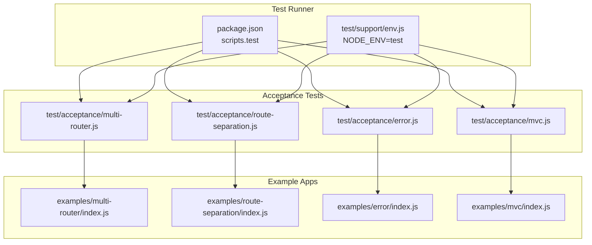
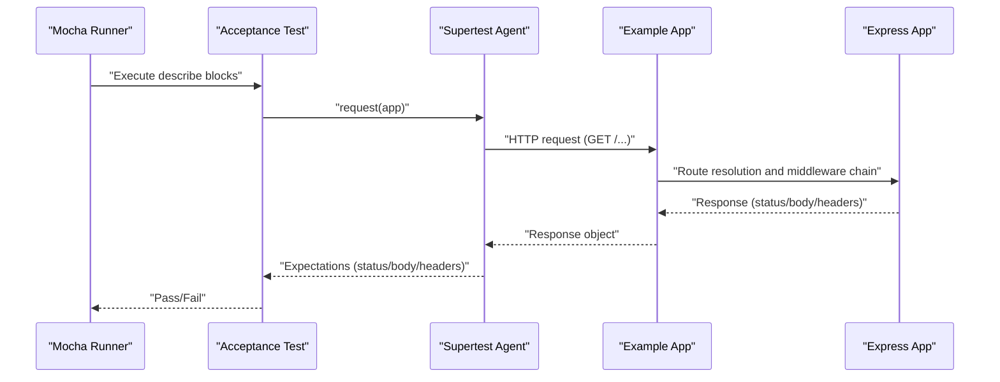
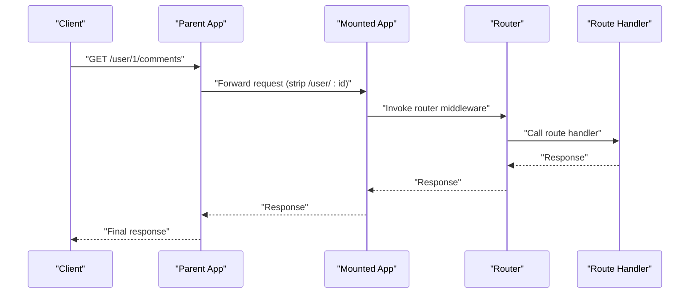
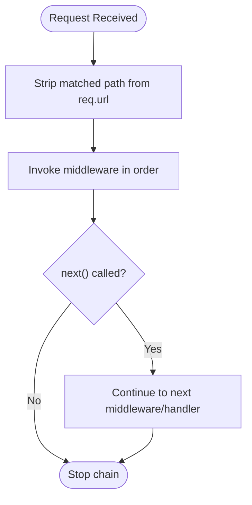
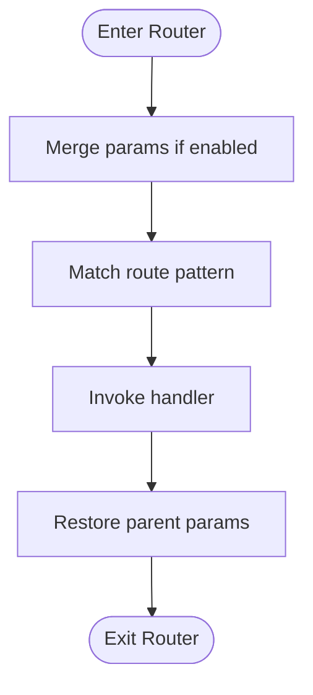
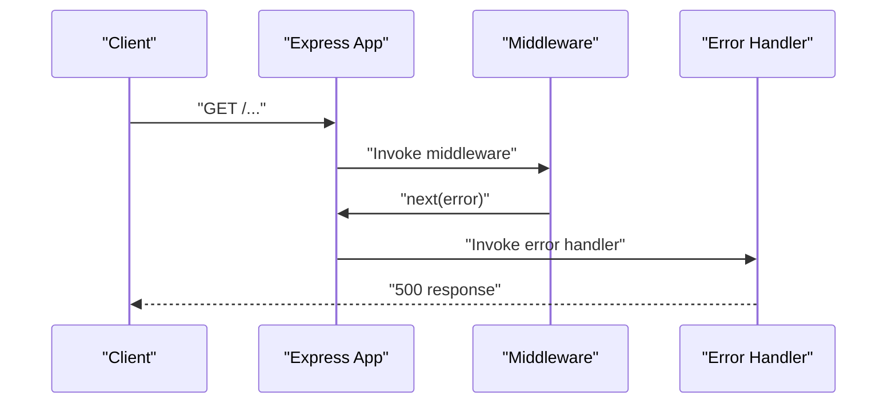
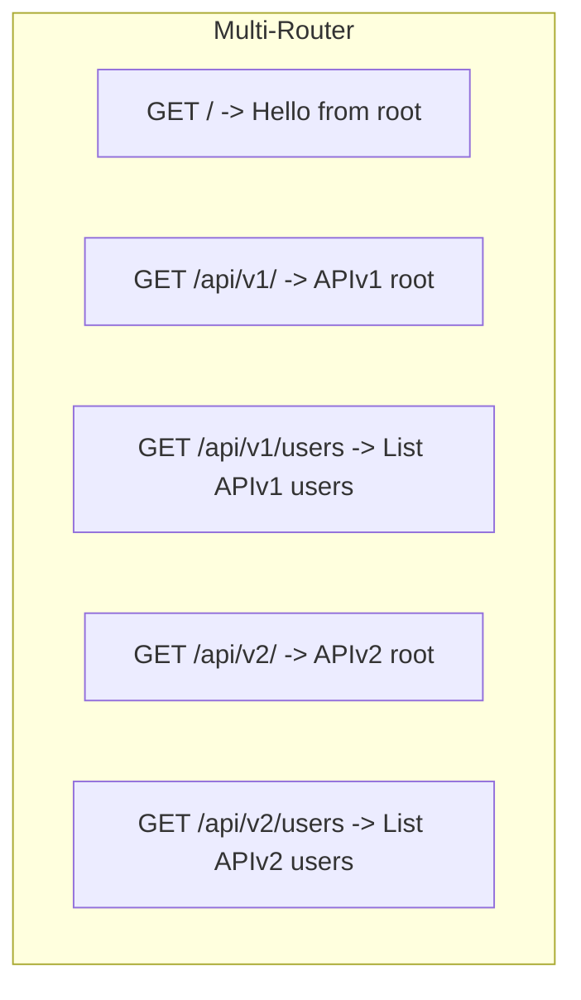
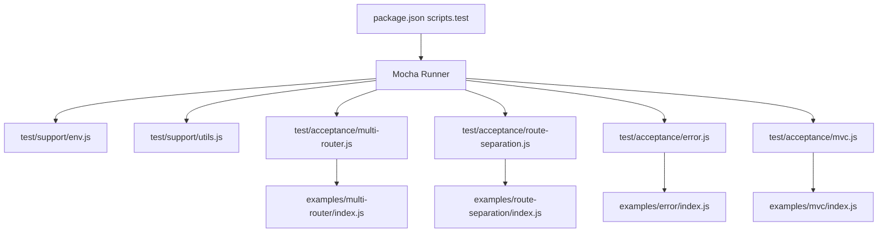

# Integration Testing

<cite>
**Referenced Files in This Document**
- [package.json](file://package.json)
- [test/support/env.js](file://test/support/env.js)
- [test/support/utils.js](file://test/support/utils.js)
- [test/app.js](file://test/app.js)
- [test/app.use.js](file://test/app.use.js)
- [test/app.router.js](file://test/app.router.js)
- [test/app.routes.error.js](file://test/app.routes.error.js)
- [test/config.js](file://test/config.js)
- [test/acceptance/multi-router.js](file://test/acceptance/multi-router.js)
- [test/acceptance/route-separation.js](file://test/acceptance/route-separation.js)
- [test/acceptance/error.js](file://test/acceptance/error.js)
- [test/acceptance/mvc.js](file://test/acceptance/mvc.js)
- [examples/multi-router/index.js](file://examples/multi-router/index.js)
- [examples/route-separation/index.js](file://examples/route-separation/index.js)
- [examples/error/index.js](file://examples/error/index.js)
- [examples/mvc/index.js](file://examples/mvc/index.js)
</cite>

## Table of Contents
1. [Introduction](#introduction)
2. [Project Structure](#project-structure)
3. [Core Components](#core-components)
4. [Architecture Overview](#architecture-overview)
5. [Detailed Component Analysis](#detailed-component-analysis)
6. [Dependency Analysis](#dependency-analysis)
7. [Performance Considerations](#performance-considerations)
8. [Troubleshooting Guide](#troubleshooting-guide)
9. [Conclusion](#conclusion)
10. [Appendices](#appendices)

## Introduction
This document provides comprehensive integration testing guidance for Express.js application components. It focuses on testing complete request/response cycles, middleware chains, router integration, and error handling scenarios. It explains how to test application mounting, route composition, middleware execution order, and error propagation through the system. It also covers testing utilities and helpers for integration scenarios, test environment setup, and realistic HTTP request simulation. Practical examples from the codebase demonstrate integration test patterns, middleware testing, router testing, and error handling validation, along with strategies for complex application flows and component interactions.

## Project Structure
The repository organizes integration tests under the test directory, with acceptance tests validating example applications and unit-style tests validating framework internals. The test runner configuration and environment setup are defined in package.json and test/support.

**Diagram sources**
- [package.json:94-97](file://package.json#L94-L97)
- [test/support/env.js:1-4](file://test/support/env.js#L1-L4)
- [test/acceptance/multi-router.js:1-45](file://test/acceptance/multi-router.js#L1-L45)
- [test/acceptance/route-separation.js:1-98](file://test/acceptance/route-separation.js#L1-L98)
- [test/acceptance/error.js:1-30](file://test/acceptance/error.js#L1-L30)
- [test/acceptance/mvc.js:1-133](file://test/acceptance/mvc.js#L1-L133)
- [examples/multi-router/index.js:1-19](file://examples/multi-router/index.js#L1-L19)
- [examples/route-separation/index.js:1-56](file://examples/route-separation/index.js#L1-L56)
- [examples/error/index.js:1-54](file://examples/error/index.js#L1-L54)
- [examples/mvc/index.js:1-96](file://examples/mvc/index.js#L1-L96)

**Section sources**
- [package.json:94-97](file://package.json#L94-L97)
- [test/support/env.js:1-4](file://test/support/env.js#L1-L4)

## Core Components
This section outlines the primary testing utilities and helpers used in integration tests.

- Test environment setup
  - Sets NODE_ENV to test and disables deprecation warnings for specific modules to stabilize test runs.
  - Reference: [test/support/env.js:1-4](file://test/support/env.js#L1-L4)

- Assertion helpers for supertest responses
  - Body assertions: shouldHaveBody, shouldNotHaveBody
  - Header assertions: shouldHaveHeader, shouldNotHaveHeader
  - Query support guard: shouldSkipQuery (skips HTTP QUERY tests below Node 22)
  - Reference: [test/support/utils.js:15-85](file://test/support/utils.js#L15-L85)

- Application lifecycle and environment toggles
  - Verifies app inherits from EventEmitter, is callable, and 404s without routes
  - Environment-specific behavior: development disables view cache; production enables it; default is development when unset
  - Reference: [test/app.js:7-121](file://test/app.js#L7-L121)

- Mounting and middleware chain behavior
  - Emits “mount” on child apps; sets parent and mountpath; supports dynamic routes and middleware arrays
  - Middleware invocation order across mounted apps and paths
  - Reference: [test/app.use.js:8-543](file://test/app.use.js#L8-L543)

- Router integration and route composition
  - Router usage within app; param restoration; case sensitivity and strict routing; regex and param merging
  - Method-based routes and method alteration behavior
  - Reference: [test/app.router.js:11-800](file://test/app.router.js#L11-L800)

- Error handling validation
  - Routes without error handlers propagate errors; error-handling callbacks activate only when errors are thrown or passed
  - Reference: [test/app.routes.error.js:7-63](file://test/app.routes.error.js#L7-L63)

- Configuration inheritance and precedence
  - get/set/enable/disable/enabled/disabled behaviors; mounted app configuration inheritance and precedence
  - Reference: [test/config.js:6-208](file://test/config.js#L6-L208)

**Section sources**
- [test/support/env.js:1-4](file://test/support/env.js#L1-L4)
- [test/support/utils.js:15-85](file://test/support/utils.js#L15-L85)
- [test/app.js:7-121](file://test/app.js#L7-L121)
- [test/app.use.js:8-543](file://test/app.use.js#L8-L543)
- [test/app.router.js:11-800](file://test/app.router.js#L11-L800)
- [test/app.routes.error.js:7-63](file://test/app.routes.error.js#L7-L63)
- [test/config.js:6-208](file://test/config.js#L6-L208)

## Architecture Overview
The integration testing architecture centers on acceptance tests that drive example applications through realistic HTTP requests. These tests rely on supertest to simulate HTTP traffic and validate responses. The test runner enforces a consistent environment and uses assertion helpers to verify response bodies, headers, and status codes.

**Diagram sources**
- [package.json:94-97](file://package.json#L94-L97)
- [test/acceptance/multi-router.js:1-45](file://test/acceptance/multi-router.js#L1-L45)
- [test/acceptance/route-separation.js:1-98](file://test/acceptance/route-separation.js#L1-L98)
- [test/acceptance/error.js:1-30](file://test/acceptance/error.js#L1-L30)
- [test/acceptance/mvc.js:1-133](file://test/acceptance/mvc.js#L1-L133)

## Detailed Component Analysis

### Testing Application Mounting and Router Integration
This section demonstrates how to validate application mounting, route composition, and middleware execution order.

- Mounting behavior
  - Verifies parent-child relationships and mountpath resolution for nested apps
  - Confirms “mount” events fire with correct parent references
  - Reference: [test/app.use.js:21-123](file://test/app.use.js#L21-L123), [test/app.js:26-57](file://test/app.js#L26-L57)

- Middleware execution order across mounts
  - Validates that middleware around a mounted app executes in the expected order
  - Reference: [test/app.use.js:86-122](file://test/app.use.js#L86-L122)

- Router integration within app.use
  - Ensures routers can be composed within middleware chains and that req.params are restored after router exit
  - Reference: [test/app.router.js:12-37](file://test/app.router.js#L12-L37)

**Diagram sources**
- [test/app.use.js:12-35](file://test/app.use.js#L12-L35)
- [test/app.router.js:12-37](file://test/app.router.js#L12-L37)

**Section sources**
- [test/app.use.js:21-123](file://test/app.use.js#L21-L123)
- [test/app.use.js:86-122](file://test/app.use.js#L86-L122)
- [test/app.router.js:12-37](file://test/app.router.js#L12-L37)
- [test/app.js:26-57](file://test/app.js#L26-L57)

### Testing Middleware Chains and Execution Order
This section focuses on verifying middleware invocation across various configurations and paths.

- Multiple middleware invocation
  - Validates middleware arrays and mixed arrays are executed in order
  - Reference: [test/app.use.js:173-255](file://test/app.use.js#L173-L255)

- Path-based middleware behavior
  - Ensures middleware is invoked for URLs matching the path prefix and that req.url is stripped appropriately
  - Reference: [test/app.use.js:284-294](file://test/app.use.js#L284-L294), [test/app.use.js:322-341](file://test/app.use.js#L322-L341)

- Regexp and array of paths
  - Validates middleware activation for regexp paths and arrays of paths
  - Reference: [test/app.use.js:505-528](file://test/app.use.js#L505-L528), [test/app.use.js:448-467](file://test/app.use.js#L448-L467)

**Diagram sources**
- [test/app.use.js:284-294](file://test/app.use.js#L284-L294)
- [test/app.use.js:322-341](file://test/app.use.js#L322-L341)

**Section sources**
- [test/app.use.js:173-255](file://test/app.use.js#L173-L255)
- [test/app.use.js:284-294](file://test/app.use.js#L284-L294)
- [test/app.use.js:322-341](file://test/app.use.js#L322-L341)
- [test/app.use.js:505-528](file://test/app.use.js#L505-L528)
- [test/app.use.js:448-467](file://test/app.use.js#L448-L467)

### Testing Router Integration and Param Handling
This section validates router behavior, param merging, and route composition.

- Router usage within app
  - Ensures routers can be mounted and used as middleware
  - Reference: [test/app.router.js:144-167](file://test/app.router.js#L144-L167)

- Param merging and restoration
  - Validates mergeParams option and restoration of req.params after router exit
  - Reference: [test/app.router.js:287-421](file://test/app.router.js#L287-L421)

- Case sensitivity and strict routing
  - Verifies default case-insensitive behavior and strict routing effects
  - Reference: [test/app.router.js:243-285](file://test/app.router.js#L243-L285), [test/app.router.js:423-575](file://test/app.router.js#L423-L575)

- Method-based routes and method alteration
  - Validates all HTTP methods and method alteration behavior
  - Reference: [test/app.router.js:39-92](file://test/app.router.js#L39-L92)

**Diagram sources**
- [test/app.router.js:287-421](file://test/app.router.js#L287-L421)

**Section sources**
- [test/app.router.js:144-167](file://test/app.router.js#L144-L167)
- [test/app.router.js:287-421](file://test/app.router.js#L287-L421)
- [test/app.router.js:243-285](file://test/app.router.js#L243-L285)
- [test/app.router.js:423-575](file://test/app.router.js#L423-L575)
- [test/app.router.js:39-92](file://test/app.router.js#L39-L92)

### Testing Error Handling Scenarios
This section explains how to validate error propagation and error-handling middleware behavior.

- Error propagation without error handler
  - Ensures routes without error handlers propagate errors and return 500
  - Reference: [test/app.routes.error.js:9-23](file://test/app.routes.error.js#L9-L23)

- Error-handling callback activation
  - Validates that error-handling routing callbacks activate only when errors are propagated
  - Reference: [test/app.routes.error.js:25-60](file://test/app.routes.error.js#L25-L60)

- Example error handling in an application
  - Demonstrates placing error-handling middleware after routes and responding with appropriate status codes
  - Reference: [examples/error/index.js:14-47](file://examples/error/index.js#L14-L47)

**Diagram sources**
- [test/app.routes.error.js:9-23](file://test/app.routes.error.js#L9-L23)
- [examples/error/index.js:14-47](file://examples/error/index.js#L14-L47)

**Section sources**
- [test/app.routes.error.js:9-23](file://test/app.routes.error.js#L9-L23)
- [test/app.routes.error.js:25-60](file://test/app.routes.error.js#L25-L60)
- [examples/error/index.js:14-47](file://examples/error/index.js#L14-L47)

### Acceptance Tests for Realistic Workflows
This section presents acceptance tests that validate complete application flows using example apps.

- Multi-router composition
  - Validates root route and API v1/v2 routes
  - Reference: [test/acceptance/multi-router.js:4-45](file://test/acceptance/multi-router.js#L4-L45), [examples/multi-router/index.js:7-12](file://examples/multi-router/index.js#L7-L12)

- Route separation and CRUD operations
  - Validates listing users, viewing/editing users, updating via PUT and method override
  - Reference: [test/acceptance/route-separation.js:5-98](file://test/acceptance/route-separation.js#L5-L98), [examples/route-separation/index.js:36-50](file://examples/route-separation/index.js#L36-L50)

- MVC example with sessions and rendering
  - Validates redirects, user/pet CRUD, and error handling
  - Reference: [test/acceptance/mvc.js:5-133](file://test/acceptance/mvc.js#L5-L133), [examples/mvc/index.js:75-89](file://examples/mvc/index.js#L75-L89)

**Diagram sources**
- [test/acceptance/multi-router.js:4-45](file://test/acceptance/multi-router.js#L4-L45)
- [examples/multi-router/index.js:7-12](file://examples/multi-router/index.js#L7-L12)

**Section sources**
- [test/acceptance/multi-router.js:4-45](file://test/acceptance/multi-router.js#L4-L45)
- [examples/multi-router/index.js:7-12](file://examples/multi-router/index.js#L7-L12)
- [test/acceptance/route-separation.js:5-98](file://test/acceptance/route-separation.js#L5-L98)
- [examples/route-separation/index.js:36-50](file://examples/route-separation/index.js#L36-L50)
- [test/acceptance/mvc.js:5-133](file://test/acceptance/mvc.js#L5-L133)
- [examples/mvc/index.js:75-89](file://examples/mvc/index.js#L75-L89)

## Dependency Analysis
This section maps the relationships among testing utilities, environment setup, and example applications.

**Diagram sources**
- [package.json:94-97](file://package.json#L94-L97)
- [test/support/env.js:1-4](file://test/support/env.js#L1-L4)
- [test/support/utils.js:15-85](file://test/support/utils.js#L15-L85)
- [test/acceptance/multi-router.js:1-45](file://test/acceptance/multi-router.js#L1-L45)
- [test/acceptance/route-separation.js:1-98](file://test/acceptance/route-separation.js#L1-L98)
- [test/acceptance/error.js:1-30](file://test/acceptance/error.js#L1-L30)
- [test/acceptance/mvc.js:1-133](file://test/acceptance/mvc.js#L1-L133)
- [examples/multi-router/index.js:1-19](file://examples/multi-router/index.js#L1-L19)
- [examples/route-separation/index.js:1-56](file://examples/route-separation/index.js#L1-L56)
- [examples/error/index.js:1-54](file://examples/error/index.js#L1-L54)
- [examples/mvc/index.js:1-96](file://examples/mvc/index.js#L1-L96)

**Section sources**
- [package.json:94-97](file://package.json#L94-L97)
- [test/support/env.js:1-4](file://test/support/env.js#L1-L4)
- [test/support/utils.js:15-85](file://test/support/utils.js#L15-L85)
- [test/acceptance/multi-router.js:1-45](file://test/acceptance/multi-router.js#L1-L45)
- [test/acceptance/route-separation.js:1-98](file://test/acceptance/route-separation.js#L1-L98)
- [test/acceptance/error.js:1-30](file://test/acceptance/error.js#L1-L30)
- [test/acceptance/mvc.js:1-133](file://test/acceptance/mvc.js#L1-L133)
- [examples/multi-router/index.js:1-19](file://examples/multi-router/index.js#L1-L19)
- [examples/route-separation/index.js:1-56](file://examples/route-separation/index.js#L1-L56)
- [examples/error/index.js:1-54](file://examples/error/index.js#L1-L54)
- [examples/mvc/index.js:1-96](file://examples/mvc/index.js#L1-L96)

## Performance Considerations
- Prefer lightweight assertions and avoid unnecessary supertest expectations to reduce test runtime.
- Group related acceptance tests to minimize repeated server startup costs.
- Use environment variables to disable noisy middleware during tests to keep logs concise and focused.

## Troubleshooting Guide
Common issues and resolutions when writing integration tests:

- Environment-dependent behavior
  - Ensure NODE_ENV is set to test to avoid environment-specific differences.
  - Reference: [test/support/env.js:1-4](file://test/support/env.js#L1-L4)

- Query parameter support in older Node versions
  - Skip QUERY-related tests on Node versions below 22 using the provided helper.
  - Reference: [test/support/utils.js:75-85](file://test/support/utils.js#L75-L85)

- Middleware argument validation
  - Verify that app.use rejects non-function middleware and handles arrays properly.
  - Reference: [test/app.use.js:258-282](file://test/app.use.js#L258-L282)

- Router param merging anomalies
  - Confirm that invalid incoming req.params are ignored and params are restored after router exit.
  - Reference: [test/app.router.js:383-400](file://test/app.router.js#L383-L400), [test/app.router.js:402-420](file://test/app.router.js#L402-L420)

- Error handling placement
  - Place error-handling middleware after all routes to ensure it receives errors.
  - Reference: [examples/error/index.js:44-47](file://examples/error/index.js#L44-L47)

**Section sources**
- [test/support/env.js:1-4](file://test/support/env.js#L1-L4)
- [test/support/utils.js:75-85](file://test/support/utils.js#L75-L85)
- [test/app.use.js:258-282](file://test/app.use.js#L258-L282)
- [test/app.router.js:383-400](file://test/app.router.js#L383-L400)
- [test/app.router.js:402-420](file://test/app.router.js#L402-L420)
- [examples/error/index.js:44-47](file://examples/error/index.js#L44-L47)

## Conclusion
This guide outlined how to design and execute integration tests for Express.js applications. It covered testing application mounting, middleware chains, router integration, and error handling using the repository’s acceptance and unit-style tests as references. By leveraging the provided environment setup, assertion helpers, and example applications, teams can validate complex application flows and component interactions effectively.

## Appendices

### Practical Testing Patterns
- Use supertest to simulate HTTP requests and assert status codes, headers, and bodies.
- Validate middleware execution order by setting headers or flags in each middleware and asserting their presence in the response.
- Test router composition by mounting routers within middleware chains and ensuring param restoration.
- Validate error handling by throwing errors in routes and asserting that error-handling middleware responds appropriately.

### Test Environment Setup
- Set NODE_ENV to test and disable deprecation warnings for consistent test runs.
- Reference: [test/support/env.js:1-4](file://test/support/env.js#L1-L4)

### Example Applications Used in Acceptance Tests
- Multi-router: Demonstrates route composition under mount points.
  - Reference: [examples/multi-router/index.js:7-12](file://examples/multi-router/index.js#L7-L12)
- Route separation: Demonstrates modular routing and method override.
  - Reference: [examples/route-separation/index.js:36-50](file://examples/route-separation/index.js#L36-L50)
- Error handling: Demonstrates error-handling middleware placement and behavior.
  - Reference: [examples/error/index.js:14-47](file://examples/error/index.js#L14-L47)
- MVC: Demonstrates session handling, rendering, and CRUD flows.
  - Reference: [examples/mvc/index.js:75-89](file://examples/mvc/index.js#L75-L89)