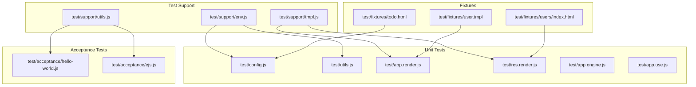
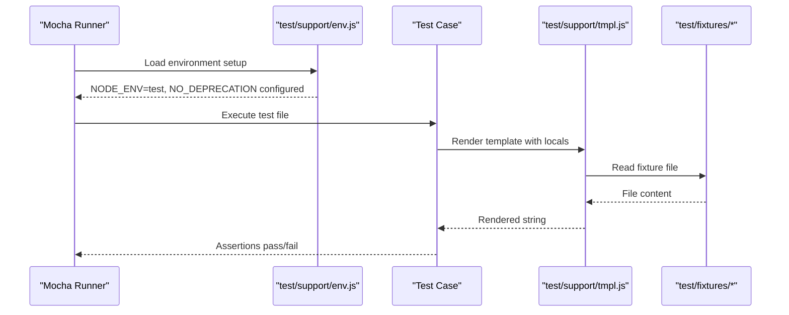
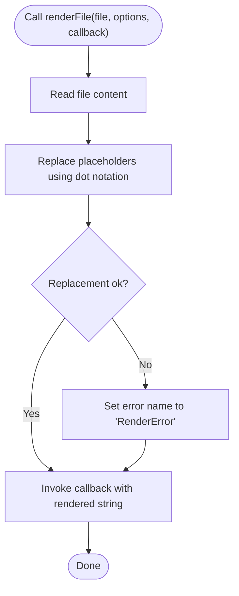
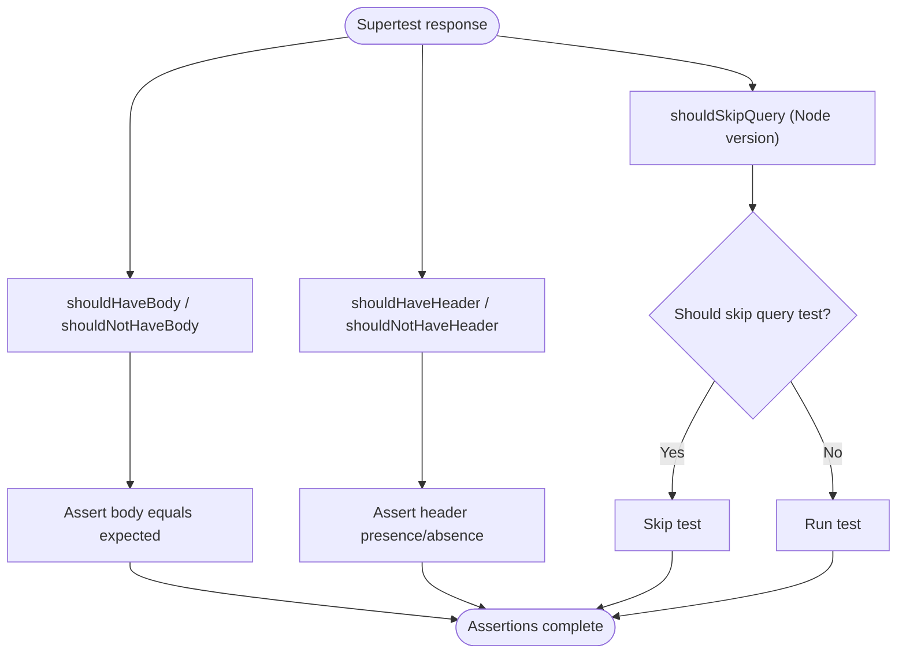
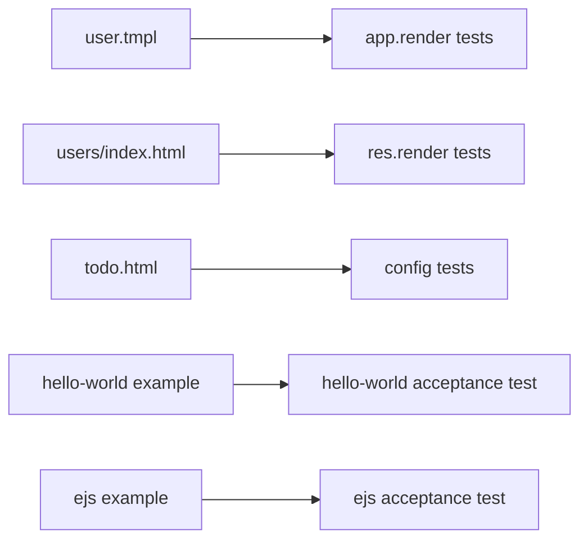
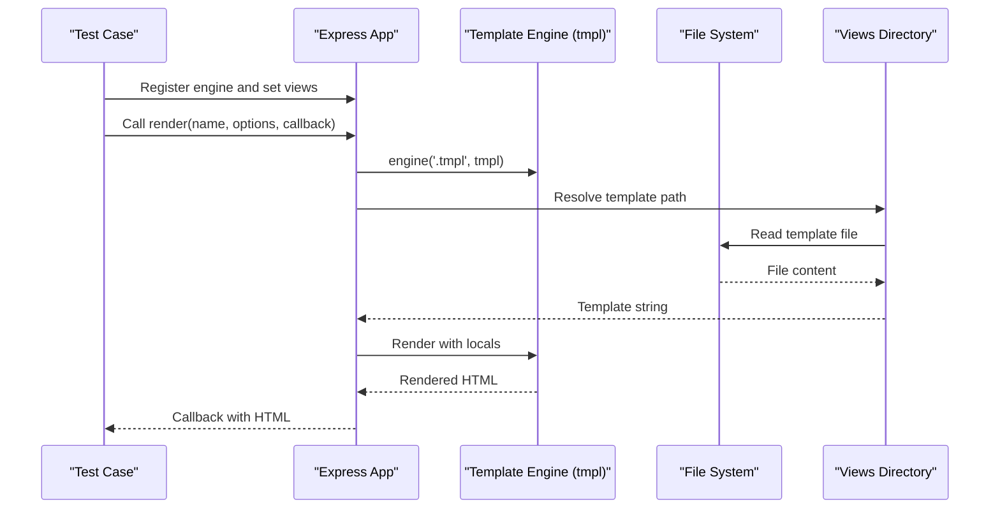
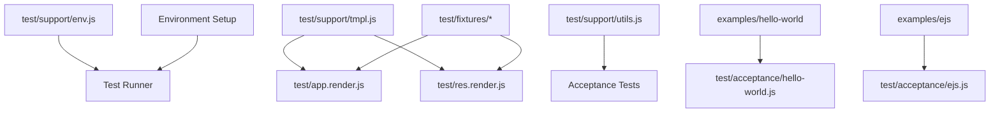

# Test Utilities & Helpers

<cite>
**Referenced Files in This Document**
- [env.js](file://test/support/env.js)
- [tmpl.js](file://test/support/tmpl.js)
- [utils.js](file://test/support/utils.js)
- [config.js](file://test/config.js)
- [utils.js](file://test/utils.js)
- [app.render.js](file://test/app.render.js)
- [res.render.js](file://test/res.render.js)
- [app.engine.js](file://test/app.engine.js)
- [app.use.js](file://test/app.use.js)
- [hello-world.js](file://test/acceptance/hello-world.js)
- [ejs.js](file://test/acceptance/ejs.js)
- [user.tmpl](file://test/fixtures/user.tmpl)
- [users/index.html](file://test/fixtures/users/index.html)
- [todo.html](file://test/fixtures/todo.html)
- [package.json](file://package.json)
</cite>

## Table of Contents
1. [Introduction](#introduction)
2. [Project Structure](#project-structure)
3. [Core Components](#core-components)
4. [Architecture Overview](#architecture-overview)
5. [Detailed Component Analysis](#detailed-component-analysis)
6. [Dependency Analysis](#dependency-analysis)
7. [Performance Considerations](#performance-considerations)
8. [Troubleshooting Guide](#troubleshooting-guide)
9. [Conclusion](#conclusion)
10. [Appendices](#appendices)

## Introduction
This document explains the Express.js testing utilities and helper functions used across the test suite. It covers:
- Test environment management via environment variables
- Template rendering helpers for testing views
- Utility functions for assertion patterns in HTTP response testing
- Fixture management for test data and templates
- Practical examples from the codebase showing how to configure test environments, manage fixtures, and reuse helpers for common testing patterns

The goal is to help contributors and maintainers understand how the test infrastructure is organized, how to extend it, and how to write reliable, maintainable tests.

## Project Structure
The test suite is organized into:
- Support utilities under test/support for environment setup, template rendering, and assertion helpers
- Unit and integration tests under test/ for core APIs and behaviors
- Acceptance tests under test/acceptance for example-driven scenarios
- Fixtures under test/fixtures for shared test data and templates

**Diagram sources**
- [env.js:1-4](file://test/support/env.js#L1-L4)
- [tmpl.js:1-37](file://test/support/tmpl.js#L1-L37)
- [utils.js:1-87](file://test/support/utils.js#L1-L87)
- [config.js:1-208](file://test/config.js#L1-L208)
- [utils.js:1-116](file://test/utils.js#L1-L116)
- [app.render.js:1-393](file://test/app.render.js#L1-L393)
- [res.render.js:1-368](file://test/res.render.js#L1-L368)
- [app.engine.js:1-84](file://test/app.engine.js#L1-L84)
- [app.use.js:1-543](file://test/app.use.js#L1-L543)
- [hello-world.js:1-22](file://test/acceptance/hello-world.js#L1-L22)
- [ejs.js:1-18](file://test/acceptance/ejs.js#L1-L18)
- [user.tmpl:1-1](file://test/fixtures/user.tmpl#L1-L1)
- [users/index.html:1-1](file://test/fixtures/users/index.html#L1-L1)
- [todo.html:1-1](file://test/fixtures/todo.html#L1-L1)

**Section sources**
- [package.json:91-98](file://package.json#L91-L98)

## Core Components
- Environment setup: Ensures consistent test runtime behavior by configuring environment variables before tests run.
- Template rendering helper: Provides a minimal template renderer used in unit tests to evaluate view rendering logic.
- Assertion helpers: Offers reusable assertion functions for common Supertest response checks (headers, bodies, and query behavior).
- Fixture management: Organizes test data and templates in a dedicated fixtures directory for reuse across tests.

Key responsibilities:
- test/support/env.js: Sets NODE_ENV to test and disables deprecation warnings for specific modules during test runs.
- test/support/tmpl.js: Reads a file, replaces placeholders using dot-notation paths, and returns rendered content or an error.
- test/support/utils.js: Exports assertion helpers for response bodies, headers, and Node.js version-aware query skipping logic.
- test/fixtures: Houses reusable templates and HTML files used by rendering and acceptance tests.

**Section sources**
- [env.js:1-4](file://test/support/env.js#L1-L4)
- [tmpl.js:1-37](file://test/support/tmpl.js#L1-L37)
- [utils.js:1-87](file://test/support/utils.js#L1-L87)
- [user.tmpl:1-1](file://test/fixtures/user.tmpl#L1-L1)
- [users/index.html:1-1](file://test/fixtures/users/index.html#L1-L1)
- [todo.html:1-1](file://test/fixtures/todo.html#L1-L1)

## Architecture Overview
The testing architecture follows a layered pattern:
- Test runner invokes mocha with a global environment setup script
- Tests import support utilities for environment, template rendering, and assertions
- Rendering tests use a custom template engine to validate view resolution and locals precedence
- Acceptance tests validate example applications using Supertest assertions

**Diagram sources**
- [env.js:1-4](file://test/support/env.js#L1-L4)
- [tmpl.js:1-37](file://test/support/tmpl.js#L1-L37)
- [user.tmpl:1-1](file://test/fixtures/user.tmpl#L1-L1)

## Detailed Component Analysis

### Environment Management
Purpose:
- Standardize test environment by setting NODE_ENV and suppressing noisy deprecations for specific modules.

Usage:
- The test command loads the environment setup before running tests.

Best practices:
- Keep environment setup centralized to avoid inconsistent test behavior.
- Limit suppression to known modules to prevent hiding real issues.

**Section sources**
- [package.json:91-98](file://package.json#L91-L98)
- [env.js:1-4](file://test/support/env.js#L1-L4)

### Template Rendering Helper
Purpose:
- Provide a lightweight template engine for tests that supports placeholder replacement using dot notation.

Behavior:
- Reads a file asynchronously
- Replaces placeholders matching a variable pattern with values resolved from options using dot notation
- Returns an error with a specific name when replacement fails

Common use cases:
- Rendering templates in unit tests for app.render and res.render
- Validating locals precedence and view resolution logic

**Diagram sources**
- [tmpl.js:1-37](file://test/support/tmpl.js#L1-L37)

**Section sources**
- [tmpl.js:1-37](file://test/support/tmpl.js#L1-L37)
- [app.render.js:1-393](file://test/app.render.js#L1-L393)
- [res.render.js:1-368](file://test/res.render.js#L1-L368)

### Assertion Helpers for HTTP Responses
Purpose:
- Provide reusable assertion functions for Supertest-based tests to check response bodies, headers, and query behavior.

Functions:
- shouldHaveBody: Asserts a response has a specific body (buffer or text)
- shouldHaveHeader: Asserts a response includes a specific header
- shouldNotHaveBody: Asserts a response has no body
- shouldNotHaveHeader: Asserts a response does not include a specific header
- shouldSkipQuery: Skips certain tests based on Node.js major version

Usage:
- Import from test/support/utils and apply to Supertest expectations

**Diagram sources**
- [utils.js:1-87](file://test/support/utils.js#L1-L87)

**Section sources**
- [utils.js:1-87](file://test/support/utils.js#L1-L87)

### Fixture Management
Purpose:
- Organize reusable test data and templates for rendering and acceptance tests.

Structure:
- test/fixtures contains templates and HTML files used by rendering tests
- Acceptance tests reference example applications and validate HTTP responses

Examples:
- user.tmpl renders a user’s name using a placeholder
- users/index.html contains a list of users
- todo.html provides a simple list item for tests

**Diagram sources**
- [user.tmpl:1-1](file://test/fixtures/user.tmpl#L1-L1)
- [users/index.html:1-1](file://test/fixtures/users/index.html#L1-L1)
- [todo.html:1-1](file://test/fixtures/todo.html#L1-L1)
- [hello-world.js:1-22](file://test/acceptance/hello-world.js#L1-L22)
- [ejs.js:1-18](file://test/acceptance/ejs.js#L1-L18)

**Section sources**
- [user.tmpl:1-1](file://test/fixtures/user.tmpl#L1-L1)
- [users/index.html:1-1](file://test/fixtures/users/index.html#L1-L1)
- [todo.html:1-1](file://test/fixtures/todo.html#L1-L1)
- [hello-world.js:1-22](file://test/acceptance/hello-world.js#L1-L22)
- [ejs.js:1-18](file://test/acceptance/ejs.js#L1-L18)

### Acceptance Testing Patterns
Purpose:
- Validate example applications using Supertest to assert HTTP responses.

Patterns:
- Require example app and use Supertest to send requests
- Assert status codes, headers, and response bodies
- Use assertion helpers for consistent response checks

Examples:
- hello-world acceptance validates basic routing and 404 handling
- ejs acceptance validates content type and rendered content

**Section sources**
- [hello-world.js:1-22](file://test/acceptance/hello-world.js#L1-L22)
- [ejs.js:1-18](file://test/acceptance/ejs.js#L1-L18)

### Rendering Engine and View Resolution
Purpose:
- Validate view engine registration, template resolution, and locals precedence.

Key areas covered:
- app.engine registration and usage
- app.render and res.render with absolute paths, extensions, and view directories
- Multiple views directories and lookup precedence
- Error handling for missing views and render errors
- Caching behavior controlled by settings

**Diagram sources**
- [app.engine.js:1-84](file://test/app.engine.js#L1-L84)
- [app.render.js:1-393](file://test/app.render.js#L1-L393)
- [res.render.js:1-368](file://test/res.render.js#L1-L368)
- [tmpl.js:1-37](file://test/support/tmpl.js#L1-L37)

**Section sources**
- [app.engine.js:1-84](file://test/app.engine.js#L1-L84)
- [app.render.js:1-393](file://test/app.render.js#L1-L393)
- [res.render.js:1-368](file://test/res.render.js#L1-L368)

### Middleware and Mounting Behavior
Purpose:
- Validate app.use behavior, middleware invocation order, and mounting semantics.

Coverage:
- Mounting apps and emitting mount events
- Mount points, dynamic routes, and middleware arrays
- Path handling, regular expressions, and multiple paths

**Section sources**
- [app.use.js:1-543](file://test/app.use.js#L1-L543)

## Dependency Analysis
The test suite exhibits clear separation of concerns:
- Environment setup depends on process environment
- Rendering tests depend on the template helper and fixtures
- Acceptance tests depend on example applications and Supertest
- Assertion helpers are standalone and reusable across tests

**Diagram sources**
- [env.js:1-4](file://test/support/env.js#L1-L4)
- [tmpl.js:1-37](file://test/support/tmpl.js#L1-L37)
- [utils.js:1-87](file://test/support/utils.js#L1-L87)
- [app.render.js:1-393](file://test/app.render.js#L1-L393)
- [res.render.js:1-368](file://test/res.render.js#L1-L368)
- [hello-world.js:1-22](file://test/acceptance/hello-world.js#L1-L22)
- [ejs.js:1-18](file://test/acceptance/ejs.js#L1-L18)

**Section sources**
- [package.json:91-98](file://package.json#L91-L98)

## Performance Considerations
- Template rendering helper reads files synchronously; while acceptable for tests, avoid heavy filesystem operations in hot paths
- Use caching settings judiciously in rendering tests to validate behavior without impacting performance
- Keep fixtures small and focused to minimize I/O overhead during tests

## Troubleshooting Guide
Common issues and resolutions:
- Missing view engine: When rendering without a default engine, tests expect a specific error message; ensure view engine is registered or explicitly set
- Render errors: Template rendering failures surface as RenderError; confirm fixture content and placeholder syntax
- Header/body assertions: Use assertion helpers to avoid brittle checks; verify header names are lowercase and bodies are compared by hex for buffers
- Node version compatibility: Some query-related tests are skipped on older Node versions; confirm environment and Node version before investigating failures

**Section sources**
- [res.render.js:1-368](file://test/res.render.js#L1-L368)
- [utils.js:1-87](file://test/support/utils.js#L1-L87)

## Conclusion
The Express.js test utilities and helpers provide a robust foundation for testing application behavior, rendering, and middleware. By centralizing environment setup, using a consistent template rendering helper, and leveraging reusable assertion helpers, the test suite remains maintainable and reliable. Proper fixture organization further improves clarity and reduces duplication across tests.

## Appendices
- Test command and scripts are defined in the project configuration and load the environment setup automatically before running tests.

**Section sources**
- [package.json:91-98](file://package.json#L91-L98)