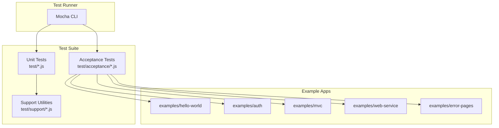
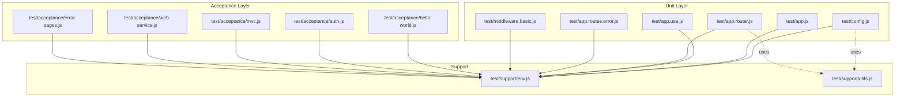
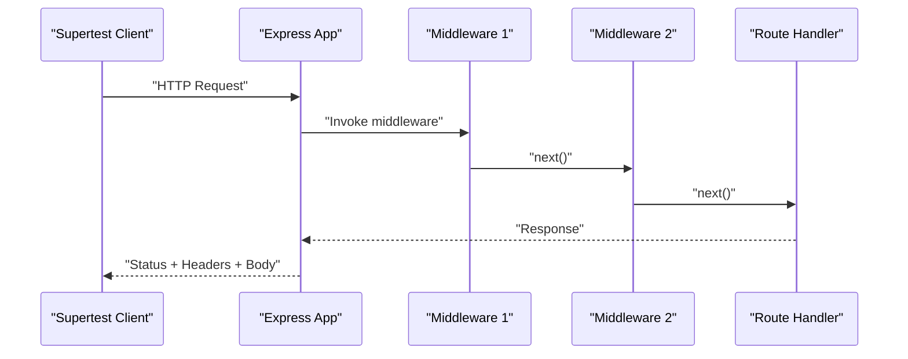
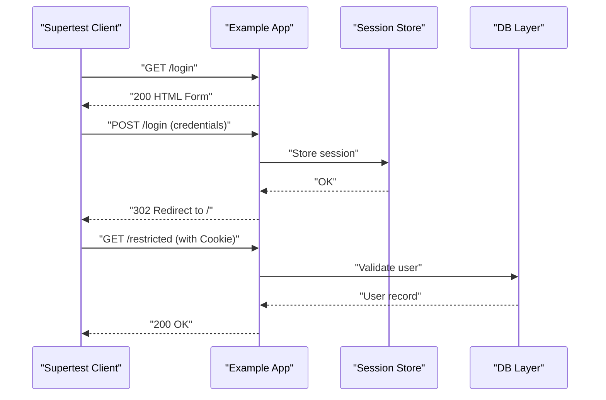
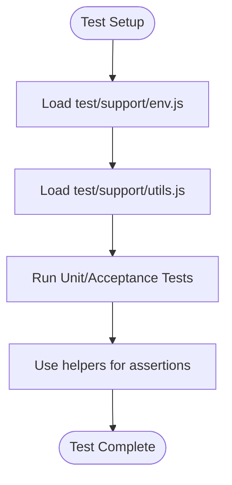
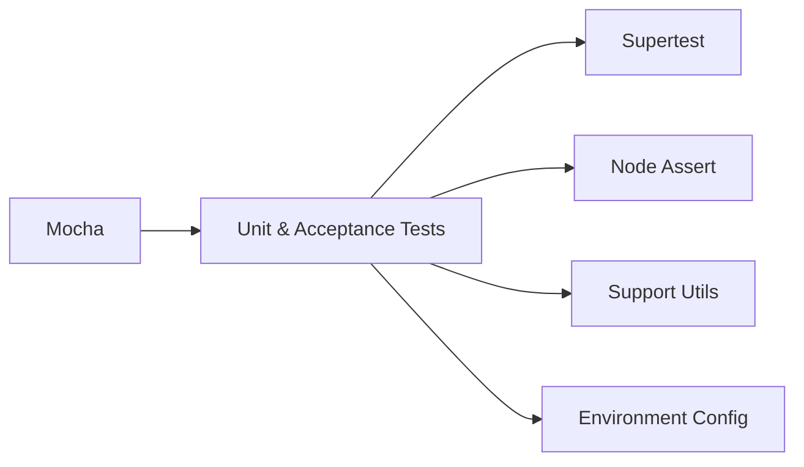

# Testing Strategies

<cite>
**Referenced Files in This Document**
- [package.json](file://package.json)
- [Readme.md](file://Readme.md)
- [test/config.js](file://test/config.js)
- [test/app.js](file://test/app.js)
- [test/app.use.js](file://test/app.use.js)
- [test/app.router.js](file://test/app.router.js)
- [test/app.routes.error.js](file://test/app.routes.error.js)
- [test/middleware.basic.js](file://test/middleware.basic.js)
- [test/support/env.js](file://test/support/env.js)
- [test/support/utils.js](file://test/support/utils.js)
- [test/acceptance/hello-world.js](file://test/acceptance/hello-world.js)
- [test/acceptance/auth.js](file://test/acceptance/auth.js)
- [test/acceptance/mvc.js](file://test/acceptance/mvc.js)
- [test/acceptance/web-service.js](file://test/acceptance/web-service.js)
- [test/acceptance/error-pages.js](file://test/acceptance/error-pages.js)
</cite>

## Table of Contents
1. [Introduction](#introduction)
2. [Project Structure](#project-structure)
3. [Core Components](#core-components)
4. [Architecture Overview](#architecture-overview)
5. [Detailed Component Analysis](#detailed-component-analysis)
6. [Dependency Analysis](#dependency-analysis)
7. [Performance Considerations](#performance-considerations)
8. [Troubleshooting Guide](#troubleshooting-guide)
9. [Conclusion](#conclusion)
10. [Appendices](#appendices)

## Introduction
This document presents comprehensive testing strategies for Express.js web applications, grounded in the repository’s test suite. It covers unit testing patterns for individual components, integration testing for complete request/response cycles, and acceptance testing for end-to-end scenarios. It also explains test utilities and helpers, mock strategies for external dependencies, test environment configuration, and how to test middleware, routes, controllers, and database interactions. Practical examples from the codebase demonstrate test setup, assertion patterns, and test organization. Finally, it addresses best practices, continuous integration setup, and test coverage measurement strategies.

## Project Structure
The repository organizes tests into three primary categories:
- Unit tests under test/ for core framework behavior (configuration, application lifecycle, middleware, router, and error handling).
- Acceptance tests under test/acceptance/ for end-to-end scenarios using real example applications.
- Support utilities under test/support/ for environment setup and shared assertion helpers.

Key scripts and tools:
- Test runner: mocha
- Assertion library: node:assert
- HTTP assertions: supertest
- Coverage: nyc (Istanbul)
- Environment configuration: NODE_ENV=test and NO_DEPRECATION flags

**Diagram sources**
- [package.json:94-98](file://package.json#L94-L98)
- [test/support/env.js:1-4](file://test/support/env.js#L1-L4)
- [test/support/utils.js:1-87](file://test/support/utils.js#L1-L87)

**Section sources**
- [package.json:91-98](file://package.json#L91-L98)
- [Readme.md:159-171](file://Readme.md#L159-L171)

## Core Components
This section outlines the foundational testing components and their roles in the Express.js test suite.

- Test harness and environment
  - Environment initialization sets NODE_ENV to test and disables noisy deprecations to keep logs clean during CI runs.
  - Scripts define how to run tests, coverage, and TAP output consistently.

- Assertion helpers
  - Shared helpers encapsulate common supertest assertions for bodies, headers, and query handling, reducing duplication across tests.

- Acceptance test apps
  - Real example applications are imported directly into acceptance tests to validate end-to-end behavior.

Practical examples:
- Environment setup: [test/support/env.js:1-4](file://test/support/env.js#L1-L4)
- Assertion helpers: [test/support/utils.js:15-87](file://test/support/utils.js#L15-L87)
- Test scripts: [package.json:94-98](file://package.json#L94-L98)

**Section sources**
- [test/support/env.js:1-4](file://test/support/env.js#L1-L4)
- [test/support/utils.js:15-87](file://test/support/utils.js#L15-L87)
- [package.json:94-98](file://package.json#L94-L98)

## Architecture Overview
The testing architecture combines unit and acceptance tests with a shared support layer. Unit tests validate isolated framework features, while acceptance tests exercise real example applications to simulate production-like behavior.

**Diagram sources**
- [test/config.js:1-208](file://test/config.js#L1-L208)
- [test/app.js:1-121](file://test/app.js#L1-L121)
- [test/app.use.js:1-543](file://test/app.use.js#L1-L543)
- [test/app.router.js:1-800](file://test/app.router.js#L1-L800)
- [test/app.routes.error.js:1-63](file://test/app.routes.error.js#L1-L63)
- [test/middleware.basic.js:1-43](file://test/middleware.basic.js#L1-L43)
- [test/acceptance/hello-world.js:1-22](file://test/acceptance/hello-world.js#L1-L22)
- [test/acceptance/auth.js:1-118](file://test/acceptance/auth.js#L1-L118)
- [test/acceptance/mvc.js:1-133](file://test/acceptance/mvc.js#L1-L133)
- [test/acceptance/web-service.js:1-106](file://test/acceptance/web-service.js#L1-L106)
- [test/acceptance/error-pages.js:1-100](file://test/acceptance/error-pages.js#L1-L100)
- [test/support/env.js:1-4](file://test/support/env.js#L1-L4)
- [test/support/utils.js:1-87](file://test/support/utils.js#L1-L87)

## Detailed Component Analysis

### Unit Testing Patterns
Unit tests validate isolated framework behavior. They focus on:
- Application configuration and lifecycle
- Middleware registration and invocation order
- Router behavior, parameter handling, and path matching
- Error propagation and handling

Representative patterns:
- Event emitter inheritance and basic app callable shape: [test/app.js:7-121](file://test/app.js#L7-L121)
- Mounting behavior and parent-child relationships: [test/app.use.js:8-123](file://test/app.use.js#L8-L123)
- Middleware chaining and array-based composition: [test/app.use.js:125-256](file://test/app.use.js#L125-L256)
- Router methods, params, and case/strict routing: [test/app.router.js:11-800](file://test/app.router.js#L11-L800)
- Error handling in routes: [test/app.routes.error.js:7-63](file://test/app.routes.error.js#L7-L63)
- Basic middleware behavior: [test/middleware.basic.js:7-43](file://test/middleware.basic.js#L7-L43)

Assertion patterns:
- Status expectations: [test/app.js:19-23](file://test/app.js#L19-L23), [test/app.use.js:322-341](file://test/app.use.js#L322-L341)
- Header assertions: [test/middleware.basic.js:25-39](file://test/middleware.basic.js#L25-L39)
- Body and text assertions: [test/support/utils.js:28-61](file://test/support/utils.js#L28-L61)

Environment setup:
- NODE_ENV and deprecation flags: [test/support/env.js:2-3](file://test/support/env.js#L2-L3)

**Section sources**
- [test/app.js:7-121](file://test/app.js#L7-L121)
- [test/app.use.js:8-256](file://test/app.use.js#L8-L256)
- [test/app.router.js:11-800](file://test/app.router.js#L11-L800)
- [test/app.routes.error.js:7-63](file://test/app.routes.error.js#L7-L63)
- [test/middleware.basic.js:7-43](file://test/middleware.basic.js#L7-L43)
- [test/support/env.js:2-3](file://test/support/env.js#L2-L3)
- [test/support/utils.js:28-61](file://test/support/utils.js#L28-L61)

### Integration Testing for Request/Response Cycles
Integration tests validate complete request/response flows through middleware and routers. They use supertest to send HTTP requests and assert responses.

Patterns:
- Supertest usage for GET/POST/OPTIONS: [test/app.use.js:152-171](file://test/app.use.js#L152-L171)
- Path stripping and middleware invocation: [test/app.use.js:284-294](file://test/app.use.js#L284-L294)
- Array-based middleware composition: [test/app.use.js:364-390](file://test/app.use.js#L364-L390)
- Regexp and dynamic routes: [test/app.router.js:169-241](file://test/app.router.js#L169-L241)
- Parameter merging and restoration: [test/app.router.js:287-421](file://test/app.router.js#L287-L421)

**Diagram sources**
- [test/app.use.js:125-199](file://test/app.use.js#L125-L199)
- [test/app.router.js:144-167](file://test/app.router.js#L144-L167)

**Section sources**
- [test/app.use.js:125-256](file://test/app.use.js#L125-L256)
- [test/app.router.js:144-241](file://test/app.router.js#L144-L241)

### Acceptance Testing for End-to-End Scenarios
Acceptance tests import example applications and validate end-to-end behavior, including redirects, form submissions, and JSON responses.

Patterns:
- Hello world example: [test/acceptance/hello-world.js:5-21](file://test/acceptance/hello-world.js#L5-L21)
- Authentication flow with cookies: [test/acceptance/auth.js:8-117](file://test/acceptance/auth.js#L8-L117)
- MVC CRUD operations: [test/acceptance/mvc.js:5-132](file://test/acceptance/mvc.js#L5-L132)
- Web service API with API keys: [test/acceptance/web-service.js:5-105](file://test/acceptance/web-service.js#L5-L105)
- Error pages with content negotiation: [test/acceptance/error-pages.js:5-99](file://test/acceptance/error-pages.js#L5-L99)

**Diagram sources**
- [test/acceptance/auth.js:8-117](file://test/acceptance/auth.js#L8-L117)
- [test/acceptance/mvc.js:32-45](file://test/acceptance/mvc.js#L32-L45)

**Section sources**
- [test/acceptance/hello-world.js:5-21](file://test/acceptance/hello-world.js#L5-L21)
- [test/acceptance/auth.js:8-117](file://test/acceptance/auth.js#L8-L117)
- [test/acceptance/mvc.js:5-132](file://test/acceptance/mvc.js#L5-L132)
- [test/acceptance/web-service.js:5-105](file://test/acceptance/web-service.js#L5-L105)
- [test/acceptance/error-pages.js:5-99](file://test/acceptance/error-pages.js#L5-L99)

### Testing Middleware, Routes, Controllers, and Database Interactions
- Middleware
  - Verify invocation order and data flow: [test/middleware.basic.js:9-40](file://test/middleware.basic.js#L9-L40)
  - Multiple middleware composition: [test/app.use.js:125-256](file://test/app.use.js#L125-L256)

- Routes and Controllers
  - Router methods and param handling: [test/app.router.js:39-142](file://test/app.router.js#L39-L142)
  - Dynamic routes and path matching: [test/app.use.js:71-84](file://test/app.use.js#L71-L84)

- Database Interactions
  - Example apps simulate DB interactions (e.g., MVC example): [test/acceptance/mvc.js:32-45](file://test/acceptance/mvc.js#L32-L45)
  - Use in-memory or lightweight stores in tests to avoid external dependencies.

- Error Handling
  - Error propagation and error handlers: [test/app.routes.error.js:8-62](file://test/app.routes.error.js#L8-L62)

**Section sources**
- [test/middleware.basic.js:9-40](file://test/middleware.basic.js#L9-L40)
- [test/app.use.js:71-256](file://test/app.use.js#L71-L256)
- [test/app.router.js:39-142](file://test/app.router.js#L39-L142)
- [test/app.routes.error.js:8-62](file://test/app.routes.error.js#L8-L62)
- [test/acceptance/mvc.js:32-45](file://test/acceptance/mvc.js#L32-L45)

### Test Utilities and Helpers
Shared utilities streamline assertions and environment setup:
- Body and header assertions: [test/support/utils.js:28-73](file://test/support/utils.js#L28-L73)
- Query skip logic for Node versions: [test/support/utils.js:75-85](file://test/support/utils.js#L75-L85)
- Environment setup: [test/support/env.js:2-3](file://test/support/env.js#L2-L3)

**Diagram sources**
- [test/support/env.js:1-4](file://test/support/env.js#L1-L4)
- [test/support/utils.js:15-87](file://test/support/utils.js#L15-L87)

**Section sources**
- [test/support/env.js:1-4](file://test/support/env.js#L1-L4)
- [test/support/utils.js:15-87](file://test/support/utils.js#L15-L87)

### Mock Strategies for External Dependencies
- In-process mocking
  - Replace or wrap external modules (e.g., session stores, DB clients) with in-memory mocks during tests.
  - Example pattern: stub app.use(...) with a mock middleware that simulates network/database behavior.

- Example-driven testing
  - Use example applications as fixtures to validate behavior without spinning up external systems.

- Environment isolation
  - Set NODE_ENV=test and disable deprecations to reduce noise and side effects.

Note: The repository demonstrates importing example apps directly into acceptance tests, which implicitly avoids heavy external dependencies by relying on minimal, contained logic.

**Section sources**
- [test/acceptance/mvc.js:1-133](file://test/acceptance/mvc.js#L1-L133)
- [test/support/env.js:2-3](file://test/support/env.js#L2-L3)

### Test Environment Configuration
- Scripted execution
  - Run tests with mocha and load the environment module before running tests.
  - Coverage and CI scripts leverage nyc to produce lcov and html reports.

- Environment variables
  - NODE_ENV=test ensures consistent behavior across environments.
  - NO_DEPRECATION suppresses noisy deprecations for cleaner output.

**Section sources**
- [package.json:94-98](file://package.json#L94-L98)
- [test/support/env.js:2-3](file://test/support/env.js#L2-L3)

## Dependency Analysis
The test suite depends on:
- Mocha for test execution
- Supertest for HTTP assertions
- Node built-ins (assert, buffer) for core assertions
- Shared support utilities for environment and helpers

**Diagram sources**
- [package.json:94-98](file://package.json#L94-L98)
- [test/app.use.js:5](file://test/app.use.js#L5)
- [test/support/utils.js:7-8](file://test/support/utils.js#L7-L8)

**Section sources**
- [package.json:94-98](file://package.json#L94-L98)
- [test/app.use.js:5](file://test/app.use.js#L5)
- [test/support/utils.js:7-8](file://test/support/utils.js#L7-L8)

## Performance Considerations
- Keep tests fast by avoiding real network calls and heavy I/O.
- Use in-process mocks and lightweight example apps.
- Leverage shared helpers to minimize repeated assertions and setup.
- Run tests in parallel where appropriate (mocha supports parallelization via flags).

## Troubleshooting Guide
Common issues and resolutions:
- Unexpected 404 responses
  - Verify route definitions and path matching; check for trailing slash strictness and case sensitivity settings.
  - Reference: [test/app.router.js:423-575](file://test/app.router.js#L423-L575)

- Middleware not invoked
  - Ensure middleware is registered before routes and that next() is called.
  - Reference: [test/app.use.js:125-171](file://test/app.use.js#L125-L171)

- Parameter handling errors
  - Confirm param merging and restoration behavior when using nested routers.
  - Reference: [test/app.router.js:287-421](file://test/app.router.js#L287-L421)

- Environment-specific failures
  - Ensure NODE_ENV=test is loaded before tests.
  - Reference: [test/support/env.js:2-3](file://test/support/env.js#L2-L3)

**Section sources**
- [test/app.router.js:423-575](file://test/app.router.js#L423-L575)
- [test/app.use.js:125-171](file://test/app.use.js#L125-L171)
- [test/app.router.js:287-421](file://test/app.router.js#L287-L421)
- [test/support/env.js:2-3](file://test/support/env.js#L2-L3)

## Conclusion
The Express.js repository demonstrates a robust testing strategy combining unit, integration, and acceptance tests. By leveraging supertest, shared support utilities, and example applications, it achieves comprehensive coverage of middleware, routing, error handling, and end-to-end workflows. The scripts and environment configuration ensure reliable, repeatable test execution suitable for CI and coverage measurement.

## Appendices

### Best Practices
- Prefer acceptance tests for user journeys and integration tests for component interactions.
- Use shared helpers for common assertions to maintain consistency.
- Keep environment configuration explicit and minimal.
- Mock external dependencies to isolate tests and improve reliability.

### Continuous Integration Setup
- Use the CI script to run tests and collect coverage.
- Produce lcov and html reports for visibility.

**Section sources**
- [package.json:95-97](file://package.json#L95-L97)

### Test Coverage Measurement
- The coverage scripts exclude examples and test directories to focus on library code.
- Reports are generated in both text and HTML formats.

**Section sources**
- [package.json:95-97](file://package.json#L95-L97)