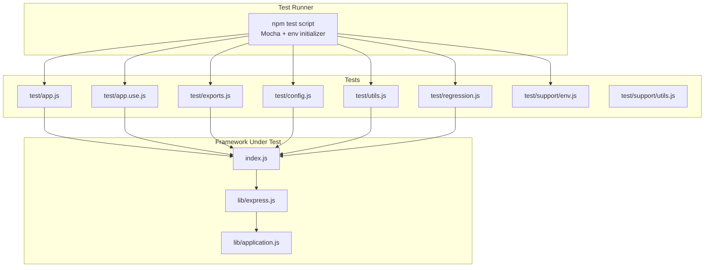
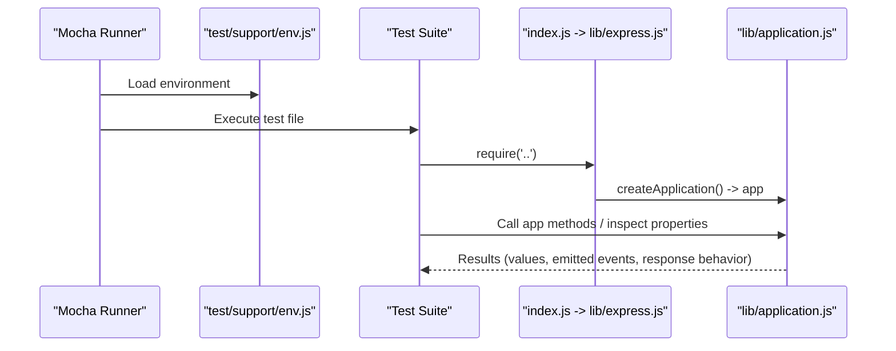
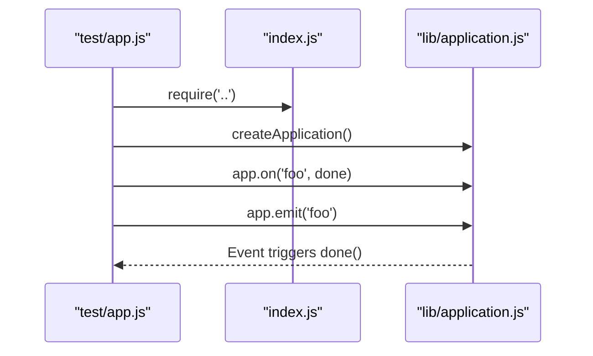
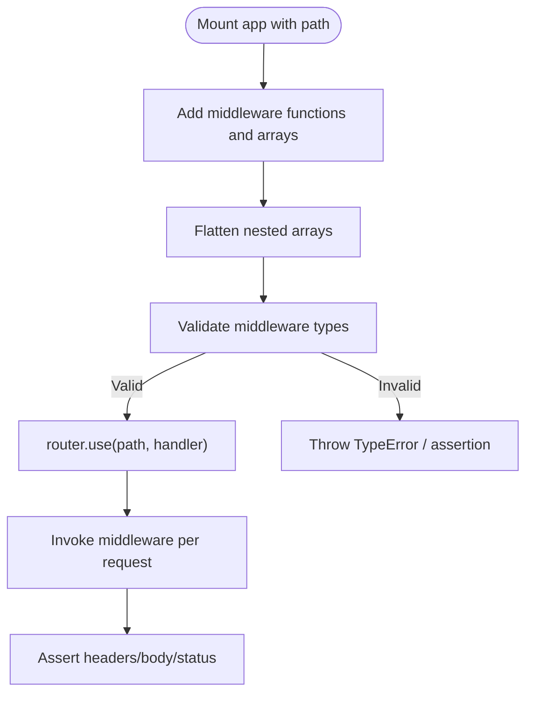
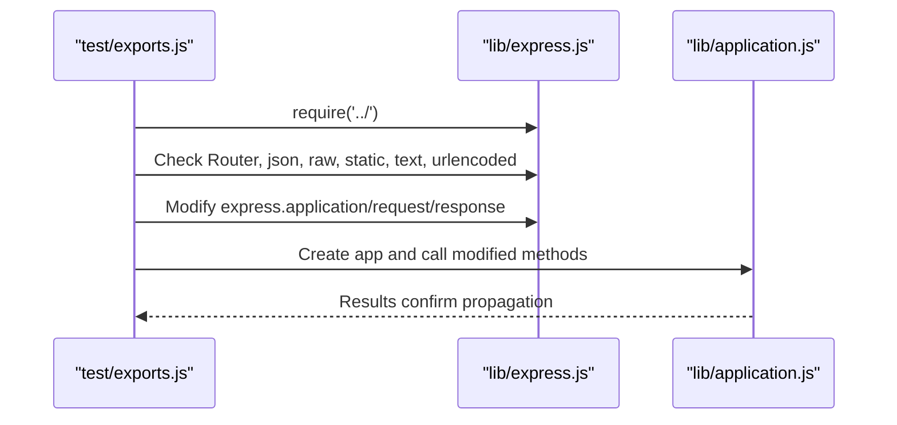
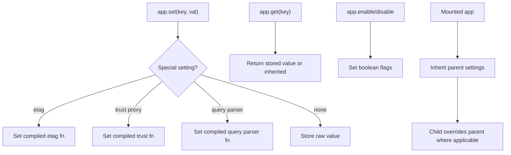
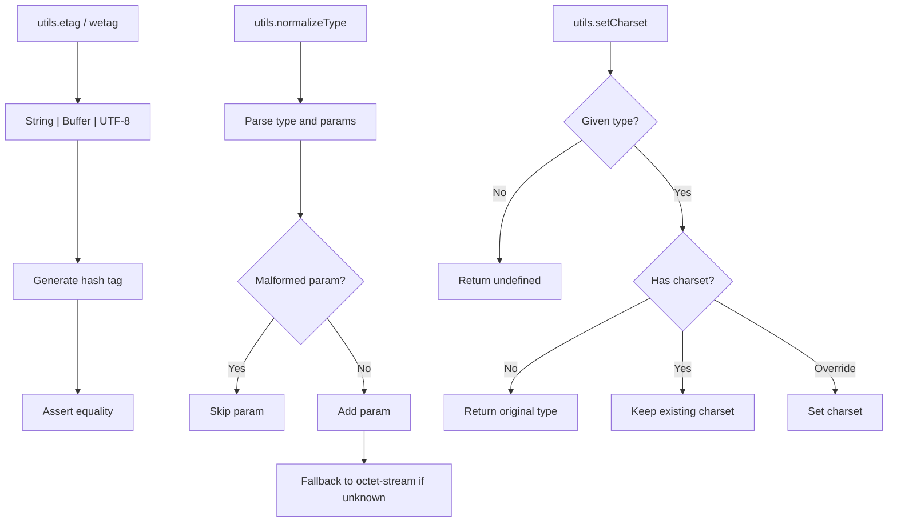
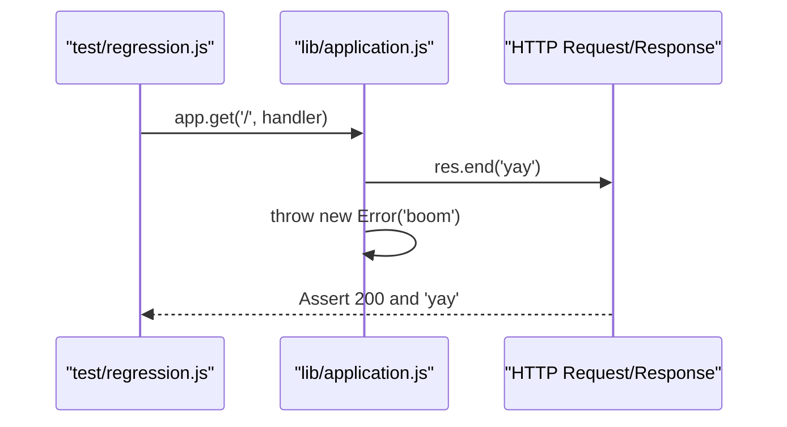
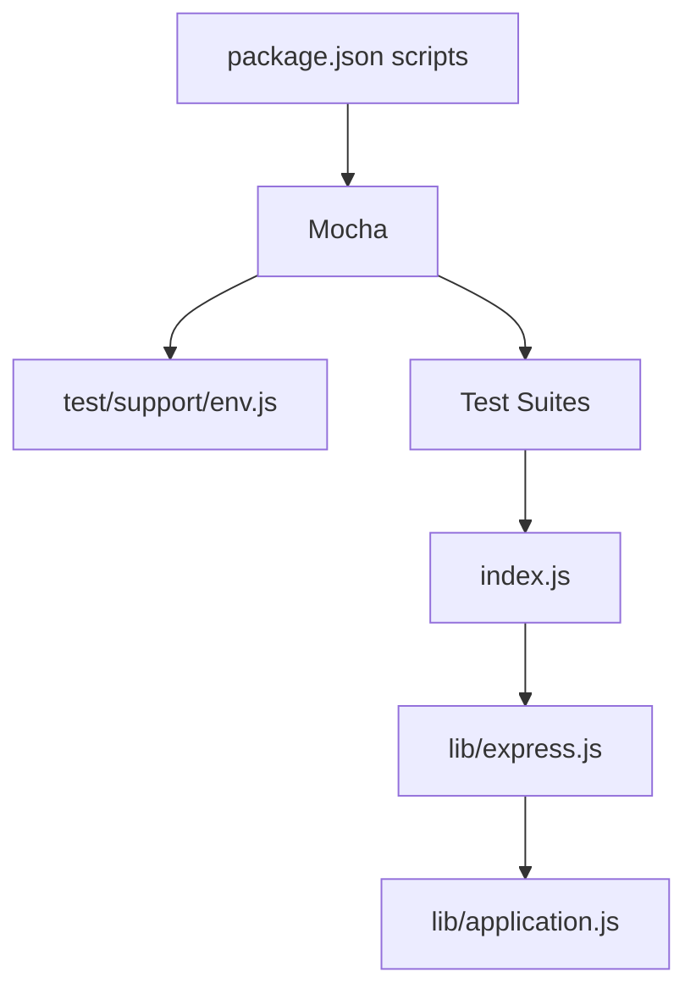

# Unit Testing

<cite>
**Referenced Files in This Document**
- [package.json](file://package.json)
- [index.js](file://index.js)
- [lib/express.js](file://lib/express.js)
- [lib/application.js](file://lib/application.js)
- [test/support/env.js](file://test/support/env.js)
- [test/support/utils.js](file://test/support/utils.js)
- [test/app.js](file://test/app.js)
- [test/app.use.js](file://test/app.use.js)
- [test/exports.js](file://test/exports.js)
- [test/config.js](file://test/config.js)
- [test/regression.js](file://test/regression.js)
- [test/utils.js](file://test/utils.js)
</cite>

## Table of Contents
1. [Introduction](#introduction)
2. [Project Structure](#project-structure)
3. [Core Components](#core-components)
4. [Architecture Overview](#architecture-overview)
5. [Detailed Component Analysis](#detailed-component-analysis)
6. [Dependency Analysis](#dependency-analysis)
7. [Performance Considerations](#performance-considerations)
8. [Troubleshooting Guide](#troubleshooting-guide)
9. [Conclusion](#conclusion)
10. [Appendices](#appendices)

## Introduction
This document provides comprehensive unit testing guidance for Express.js components. It focuses on testing:
- Application creation and instantiation
- Export verification of constructors, middleware, and prototypes
- Configuration validation and environment-dependent behaviors
- Regression testing for critical behaviors
- Assertion patterns using Node.js assert
- Test setup procedures and isolated testing of framework components
- Practical examples drawn from the repository’s test suite

The goal is to help contributors write reliable unit tests that validate Express internals and ensure consistent behavior across versions and environments.

## Project Structure
Express organizes tests into focused suites grouped by concern:
- Core app behavior: [test/app.js](file://test/app.js)
- Mounting and middleware usage: [test/app.use.js](file://test/app.use.js)
- Exports verification: [test/exports.js](file://test/exports.js)
- Configuration and settings: [test/config.js](file://test/config.js)
- Utilities and helpers: [test/utils.js](file://test/utils.js)
- Regression scenarios: [test/regression.js](file://test/regression.js)
- Support utilities and environment setup: [test/support/env.js](file://test/support/env.js), [test/support/utils.js](file://test/support/utils.js)

The test runner is configured via npm scripts to use Mocha with a shared environment initializer.

**Diagram sources**
- [package.json:94-98](file://package.json#L94-L98)
- [test/support/env.js:1-4](file://test/support/env.js#L1-L4)
- [index.js:11](file://index.js#L11)
- [lib/express.js:15-82](file://lib/express.js#L15-L82)
- [lib/application.js:40-141](file://lib/application.js#L40-L141)

**Section sources**
- [package.json:94-98](file://package.json#L94-L98)
- [test/support/env.js:1-4](file://test/support/env.js#L1-L4)

## Core Components
This section outlines the primary areas covered by unit tests and how to approach them.

- Application creation and lifecycle
  - Verify app is a function, inherits from EventEmitter, and handles requests with default 404 behavior.
  - Validate environment-dependent defaults (e.g., view cache) and mount path semantics.
  - Reference: [test/app.js](file://test/app.js)

- Middleware mounting and routing
  - Validate mounting apps, path prefixes, dynamic routes, and middleware arrays.
  - Ensure proper error handling for invalid middleware types and path stripping.
  - Reference: [test/app.use.js](file://test/app.use.js)

- Exports verification
  - Confirm constructors, middleware factories, and prototype objects are exposed and functional.
  - Validate that prototype modifications propagate to app instances.
  - Reference: [test/exports.js](file://test/exports.js)

- Configuration and settings
  - Test setting/getting values, enabling/disabling flags, and environment-specific behaviors.
  - Validate special settings like etag, trust proxy, and query parser compilation.
  - Reference: [test/config.js](file://test/config.js)

- Utilities and helpers
  - Validate utility functions for ETag generation, charset handling, and MIME normalization.
  - Reference: [test/utils.js](file://test/utils.js)

- Regression testing
  - Ensure graceful handling of errors thrown after response end.
  - Reference: [test/regression.js](file://test/regression.js)

**Section sources**
- [test/app.js:1-121](file://test/app.js#L1-L121)
- [test/app.use.js:1-543](file://test/app.use.js#L1-L543)
- [test/exports.js:1-83](file://test/exports.js#L1-L83)
- [test/config.js:1-208](file://test/config.js#L1-L208)
- [test/utils.js:1-116](file://test/utils.js#L1-L116)
- [test/regression.js:1-21](file://test/regression.js#L1-L21)

## Architecture Overview
The testing architecture centers on Mocha-driven unit tests that import Express via the main entry point and validate behavior against the application prototype and middleware stack.

**Diagram sources**
- [package.json:94](file://package.json#L94)
- [test/support/env.js:1-4](file://test/support/env.js#L1-L4)
- [index.js:11](file://index.js#L11)
- [lib/express.js:36-56](file://lib/express.js#L36-L56)
- [lib/application.js:59-83](file://lib/application.js#L59-L83)

## Detailed Component Analysis

### Application Creation and Lifecycle Tests
Key goals:
- Verify app is a function and inherits EventEmitter
- Validate default 404 behavior without routes
- Confirm environment-dependent settings and mount path semantics

Patterns:
- Use the main entry point to instantiate an app
- Emit and listen for events to validate EventEmitter inheritance
- Use Supertest to assert HTTP responses

**Diagram sources**
- [test/app.js:7-12](file://test/app.js#L7-L12)
- [index.js:11](file://index.js#L11)
- [lib/application.js:109-122](file://lib/application.js#L109-L122)

Practical examples:
- Event emitter inheritance and default 404: [test/app.js:7-24](file://test/app.js#L7-L24)
- Mount path and parent-child relationships: [test/app.js:26-72](file://test/app.js#L26-L72)
- Environment-dependent view cache: [test/app.js:74-120](file://test/app.js#L74-L120)

**Section sources**
- [test/app.js:1-121](file://test/app.js#L1-L121)
- [index.js:11](file://index.js#L11)
- [lib/application.js:59-141](file://lib/application.js#L59-L141)

### Middleware Mounting and Routing Tests
Key goals:
- Validate mounting nested apps and path prefixes
- Ensure middleware arrays and mixed arguments are flattened and invoked
- Verify path stripping and route matching semantics
- Guard against invalid middleware types

Patterns:
- Use Supertest to assert headers and bodies
- Use after helper to coordinate multiple assertions
- Validate error messages for invalid middleware

**Diagram sources**
- [test/app.use.js:8-543](file://test/app.use.js#L8-L543)
- [lib/application.js:190-244](file://lib/application.js#L190-L244)

Practical examples:
- Mounting apps and dynamic routes: [test/app.use.js:21-123](file://test/app.use.js#L21-L123)
- Middleware arrays and mixed arguments: [test/app.use.js:125-256](file://test/app.use.js#L125-L256)
- Path prefixes and path stripping: [test/app.use.js:258-541](file://test/app.use.js#L258-L541)

**Section sources**
- [test/app.use.js:1-543](file://test/app.use.js#L1-L543)
- [lib/application.js:190-244](file://lib/application.js#L190-L244)

### Exports Verification Tests
Key goals:
- Confirm constructors and middleware factories are exported
- Validate prototype objects are exposed and callable
- Ensure prototype modifications propagate to app instances

Patterns:
- Assert typeof and arity for middleware factories
- Modify prototypes and verify behavior via request/response

**Diagram sources**
- [test/exports.js:7-82](file://test/exports.js#L7-L82)
- [lib/express.js:62-82](file://lib/express.js#L62-L82)

Practical examples:
- Middleware factory exports and arity: [test/exports.js:12-35](file://test/exports.js#L12-L35)
- Prototype exposure and modification: [test/exports.js:37-81](file://test/exports.js#L37-L81)

**Section sources**
- [test/exports.js:1-83](file://test/exports.js#L1-L83)
- [lib/express.js:62-82](file://lib/express.js#L62-L82)

### Configuration and Settings Tests
Key goals:
- Validate set/get, enable/disable, enabled/disabled semantics
- Ensure environment-dependent settings and mounted inheritance
- Test special settings compilation (etag, trust proxy, query parser)

Patterns:
- Use assert.equal/assert.strictEqual for equality checks
- Use assert.throws for invalid configuration values
- Validate mounted child precedence over parent

**Diagram sources**
- [test/config.js:6-207](file://test/config.js#L6-L207)
- [lib/express.js:36-56](file://lib/express.js#L36-L56)
- [lib/application.js:351-383](file://lib/application.js#L351-L383)

Practical examples:
- Setting and retrieving values: [test/config.js:7-40](file://test/config.js#L7-L40)
- ETag and trust proxy compilation: [test/config.js:41-62](file://test/config.js#L41-L62)
- Mounted inheritance and precedence: [test/config.js:82-141](file://test/config.js#L82-L141)

**Section sources**
- [test/config.js:1-208](file://test/config.js#L1-L208)
- [lib/application.js:351-383](file://lib/application.js#L351-L383)

### Utilities and Helpers Tests
Key goals:
- Validate ETag generation (strong/weak) and charset handling
- Normalize MIME types and handle malformed parameters
- Ensure robust defaults for unknown types

Patterns:
- Compare hex-encoded buffers for body equality
- Assert deep equality for normalized types
- Use assert.throws for invalid inputs

**Diagram sources**
- [test/utils.js:7-115](file://test/utils.js#L7-L115)
- [test/support/utils.js:28-73](file://test/support/utils.js#L28-L73)

Practical examples:
- ETag and weak ETag generation: [test/utils.js:7-90](file://test/utils.js#L7-L90)
- MIME normalization and charset handling: [test/utils.js:29-68](file://test/utils.js#L29-L68)
- Utility helpers for response assertions: [test/support/utils.js:28-73](file://test/support/utils.js#L28-L73)

**Section sources**
- [test/utils.js:1-116](file://test/utils.js#L1-L116)
- [test/support/utils.js:1-87](file://test/support/utils.js#L1-L87)

### Regression Testing
Key goals:
- Ensure errors thrown after response end do not crash the process unexpectedly
- Validate HTTP 200 response and body content

Patterns:
- Use Supertest to assert response body and status
- Wrap error-throwing handlers to validate graceful failure

**Diagram sources**
- [test/regression.js:6-20](file://test/regression.js#L6-L20)
- [lib/application.js:152-178](file://lib/application.js#L152-L178)

Practical examples:
- Graceful handling after .end(): [test/regression.js:7-20](file://test/regression.js#L7-L20)

**Section sources**
- [test/regression.js:1-21](file://test/regression.js#L1-L21)

## Dependency Analysis
Testing dependencies and runtime dependencies are managed via npm scripts and devDependencies. The test harness loads a shared environment initializer and runs Mocha with reporter options.

**Diagram sources**
- [package.json:94-98](file://package.json#L94-L98)
- [test/support/env.js:1-4](file://test/support/env.js#L1-L4)
- [index.js:11](file://index.js#L11)
- [lib/express.js:15-21](file://lib/express.js#L15-L21)
- [lib/application.js:16-26](file://lib/application.js#L16-L26)

**Section sources**
- [package.json:94-98](file://package.json#L94-L98)
- [test/support/env.js:1-4](file://test/support/env.js#L1-L4)

## Performance Considerations
- Prefer lightweight assertions and avoid heavy I/O in unit tests.
- Use Supertest judiciously; limit network-bound assertions to integration tests.
- Keep test suites focused and isolated to reduce flakiness and improve speed.
- Reuse shared environment initialization to avoid repeated setup costs.

## Troubleshooting Guide
Common issues and resolutions:
- Environment mismatch
  - Symptom: Unexpected NODE_ENV or deprecation warnings.
  - Resolution: Ensure the environment initializer sets NODE_ENV and deprecation flags before tests run.
  - Reference: [test/support/env.js:1-4](file://test/support/env.js#L1-L4)

- Supertest assertion helpers
  - Symptom: Confusion around response body/header assertions.
  - Resolution: Use provided helpers to compare buffers and headers consistently.
  - Reference: [test/support/utils.js:28-73](file://test/support/utils.js#L28-L73)

- Invalid middleware types
  - Symptom: Tests failing with TypeError or unexpected handler behavior.
  - Resolution: Validate middleware argument types and arrays; ensure flattening works as expected.
  - Reference: [test/app.use.js:258-283](file://test/app.use.js#L258-L283)

- Configuration validation
  - Symptom: Unknown etag/trust proxy values causing failures.
  - Resolution: Use assert.throws to validate invalid values and ensure correct compilation functions are applied.
  - Reference: [test/config.js:42-45](file://test/config.js#L42-L45), [test/config.js:103-105](file://test/config.js#L103-L105)

**Section sources**
- [test/support/env.js:1-4](file://test/support/env.js#L1-L4)
- [test/support/utils.js:28-73](file://test/support/utils.js#L28-L73)
- [test/app.use.js:258-283](file://test/app.use.js#L258-L283)
- [test/config.js:42-45](file://test/config.js#L42-L45)
- [test/config.js:103-105](file://test/config.js#L103-L105)

## Conclusion
Express’s test suite demonstrates a robust pattern for validating application creation, exports, configuration, middleware mounting, and utilities. By leveraging Mocha, Supertest, and shared environment setup, contributors can write precise, isolated unit tests that verify both behavior and regressions. Following the patterns outlined here ensures consistent coverage and maintainability across the framework.

## Appendices

### Assertion Patterns Using Node.js assert
- Equality and identity: Use equal and strictEqual for primitive comparisons.
- Type checks: Use typeof assertions for middleware factories and constructors.
- Error assertions: Use throws to validate invalid inputs and configuration.
- Buffer comparisons: Use hex encoding to compare response bodies reliably.

References:
- [test/config.js:8-34](file://test/config.js#L8-L34)
- [test/exports.js:12-35](file://test/exports.js#L12-L35)
- [test/app.use.js:258-283](file://test/app.use.js#L258-L283)
- [test/support/utils.js:28-36](file://test/support/utils.js#L28-L36)

### Test Setup Procedures
- Environment initialization: Load the environment initializer before running tests.
- Test runner command: Use the npm test script to execute all unit and acceptance tests.
- Reporter options: Choose reporters (spec, tap) via npm scripts for different output preferences.

References:
- [test/support/env.js:1-4](file://test/support/env.js#L1-L4)
- [package.json:94-98](file://package.json#L94-L98)

### Isolated Testing of Framework Components
- Application prototype: Focus on lib/application.js methods and lifecycle hooks.
- Express entry point: Validate exports and constructor behavior via lib/express.js.
- Middleware stack: Test mounting and invocation semantics in isolation.

References:
- [lib/application.js:59-141](file://lib/application.js#L59-L141)
- [lib/express.js:36-56](file://lib/express.js#L36-L56)
- [index.js:11](file://index.js#L11)