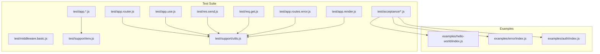
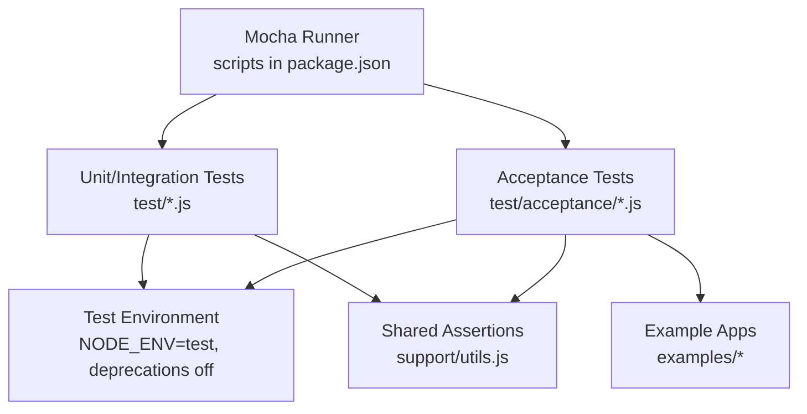
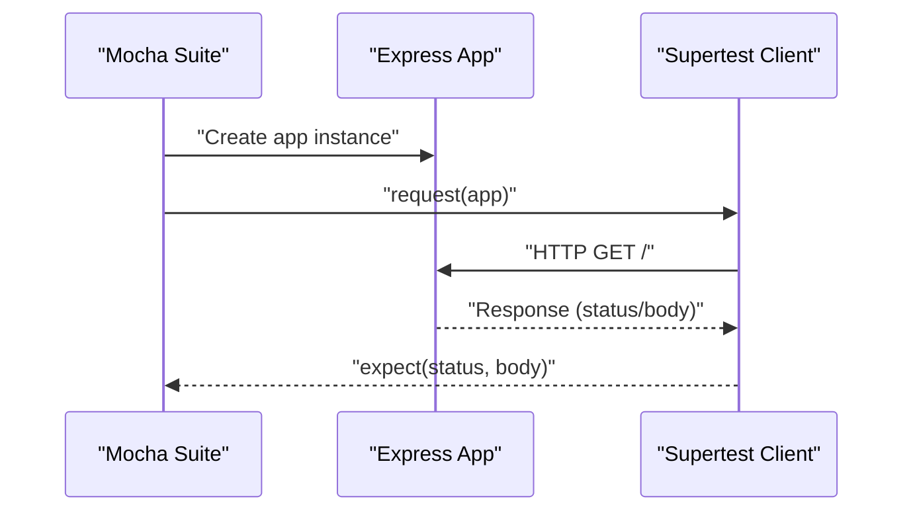
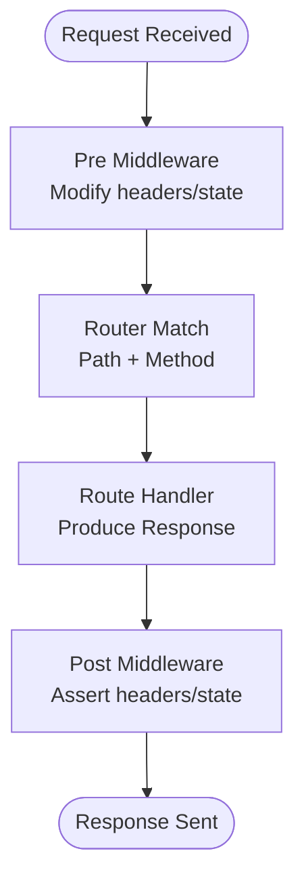
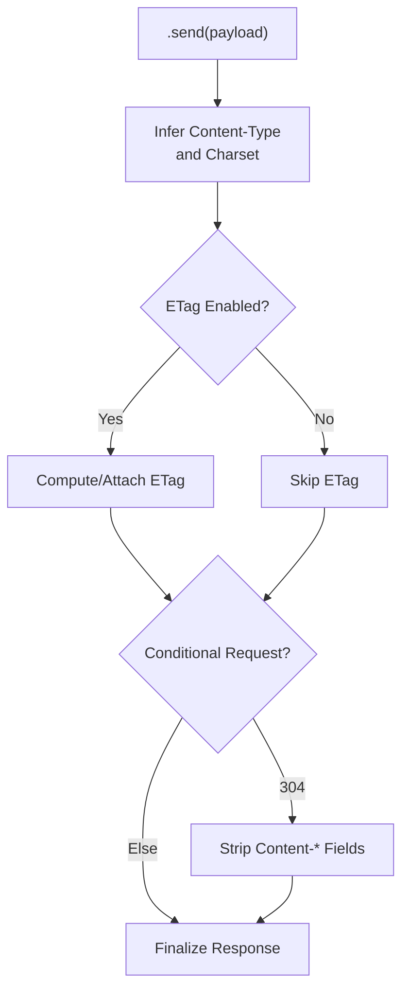
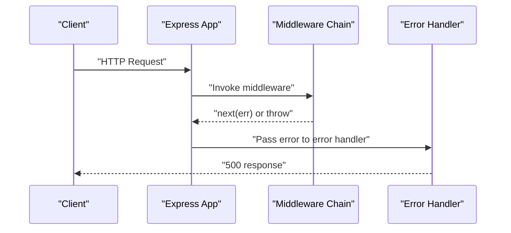
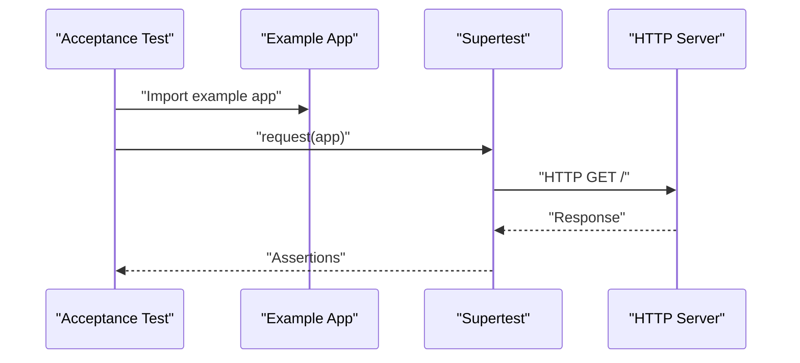
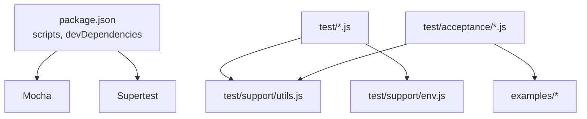

# Testing and Debugging

<cite>
**Referenced Files in This Document**
- [package.json](file://package.json)
- [test/support/env.js](file://test/support/env.js)
- [test/support/utils.js](file://test/support/utils.js)
- [test/app.js](file://test/app.js)
- [test/app.listen.js](file://test/app.listen.js)
- [test/app.use.js](file://test/app.use.js)
- [test/app.router.js](file://test/app.router.js)
- [test/middleware.basic.js](file://test/middleware.basic.js)
- [test/res.send.js](file://test/res.send.js)
- [test/req.get.js](file://test/req.get.js)
- [test/app.routes.error.js](file://test/app.routes.error.js)
- [test/app.render.js](file://test/app.render.js)
- [test/acceptance/hello-world.js](file://test/acceptance/hello-world.js)
- [examples/hello-world/index.js](file://examples/hello-world/index.js)
- [examples/error/index.js](file://examples/error/index.js)
- [examples/auth/index.js](file://examples/auth/index.js)
</cite>

## Table of Contents
1. [Introduction](#introduction)
2. [Project Structure](#project-structure)
3. [Core Components](#core-components)
4. [Architecture Overview](#architecture-overview)
5. [Detailed Component Analysis](#detailed-component-analysis)
6. [Dependency Analysis](#dependency-analysis)
7. [Performance Considerations](#performance-considerations)
8. [Troubleshooting Guide](#troubleshooting-guide)
9. [Conclusion](#conclusion)
10. [Appendices](#appendices)

## Introduction
This document provides a comprehensive guide to testing and debugging Express.js applications, grounded in the repository’s test suite and example applications. It covers unit testing, integration testing, and end-to-end testing strategies, along with debugging tools, logging strategies, and performance profiling techniques. Practical examples demonstrate test setup, reusable test utilities, and debugging workflows. Continuous integration and production debugging considerations are addressed to help teams maintain reliability and observability.

## Project Structure
The repository organizes testing and examples to illustrate different aspects of Express behavior and testing patterns:
- Unit and integration tests under test/ validate individual modules and interactions (e.g., app lifecycle, middleware, routing, rendering, error handling).
- Acceptance tests under test/acceptance/ validate complete example apps via HTTP requests.
- Example applications under examples/ demonstrate real-world scenarios (e.g., authentication, error handling, static content).
- Test support utilities under test/support/ provide shared helpers for assertions and environment configuration.

**Diagram sources**
- [test/app.js:1-121](file://test/app.js#L1-L121)
- [test/app.listen.js:1-56](file://test/app.listen.js#L1-L56)
- [test/app.use.js:1-543](file://test/app.use.js#L1-L543)
- [test/app.router.js:1-800](file://test/app.router.js#L1-L800)
- [test/middleware.basic.js:1-43](file://test/middleware.basic.js#L1-L43)
- [test/res.send.js:1-570](file://test/res.send.js#L1-L570)
- [test/req.get.js:1-61](file://test/req.get.js#L1-L61)
- [test/app.routes.error.js:1-63](file://test/app.routes.error.js#L1-L63)
- [test/app.render.js:1-393](file://test/app.render.js#L1-L393)
- [test/acceptance/hello-world.js:1-22](file://test/acceptance/hello-world.js#L1-L22)
- [test/support/env.js:1-4](file://test/support/env.js#L1-L4)
- [test/support/utils.js:1-87](file://test/support/utils.js#L1-L87)
- [examples/hello-world/index.js:1-16](file://examples/hello-world/index.js#L1-L16)
- [examples/error/index.js:1-54](file://examples/error/index.js#L1-L54)
- [examples/auth/index.js:1-135](file://examples/auth/index.js#L1-L135)

**Section sources**
- [package.json:91-98](file://package.json#L91-L98)
- [test/support/env.js:1-4](file://test/support/env.js#L1-L4)
- [test/support/utils.js:1-87](file://test/support/utils.js#L1-L87)
- [test/app.js:1-121](file://test/app.js#L1-L121)
- [test/app.listen.js:1-56](file://test/app.listen.js#L1-L56)
- [test/app.use.js:1-543](file://test/app.use.js#L1-L543)
- [test/app.router.js:1-800](file://test/app.router.js#L1-L800)
- [test/middleware.basic.js:1-43](file://test/middleware.basic.js#L1-L43)
- [test/res.send.js:1-570](file://test/res.send.js#L1-L570)
- [test/req.get.js:1-61](file://test/req.get.js#L1-L61)
- [test/app.routes.error.js:1-63](file://test/app.routes.error.js#L1-L63)
- [test/app.render.js:1-393](file://test/app.render.js#L1-L393)
- [test/acceptance/hello-world.js:1-22](file://test/acceptance/hello-world.js#L1-L22)
- [examples/hello-world/index.js:1-16](file://examples/hello-world/index.js#L1-L16)
- [examples/error/index.js:1-54](file://examples/error/index.js#L1-L54)
- [examples/auth/index.js:1-135](file://examples/auth/index.js#L1-L135)

## Core Components
This section outlines the testing and debugging building blocks used across the repository.

- Test runner and scripts
  - Mocha is configured as the test runner with reporter options and leak detection.
  - Scripts include standard test, coverage, and CI-friendly reporting.

- Test environment setup
  - Environment variables are set to enforce a consistent test environment and suppress deprecation warnings during tests.

- Supertest-driven HTTP assertions
  - Tests use Supertest to make HTTP requests against Express apps and assert status codes, headers, and bodies.

- Shared assertion utilities
  - Utilities encapsulate common checks for response bodies, headers, and Node.js version-dependent behaviors.

- Example applications
  - Examples demonstrate real-world Express usage patterns suitable for acceptance testing and manual debugging.

Key references:
- Test scripts and environment configuration
  - [package.json:91-98](file://package.json#L91-L98)
  - [test/support/env.js:1-4](file://test/support/env.js#L1-L4)
- Supertest usage and assertions
  - [test/app.js:1-24](file://test/app.js#L1-L24)
  - [test/acceptance/hello-world.js:1-22](file://test/acceptance/hello-world.js#L1-L22)
- Assertion helpers
  - [test/support/utils.js:1-87](file://test/support/utils.js#L1-L87)

**Section sources**
- [package.json:91-98](file://package.json#L91-L98)
- [test/support/env.js:1-4](file://test/support/env.js#L1-L4)
- [test/support/utils.js:1-87](file://test/support/utils.js#L1-L87)
- [test/app.js:1-24](file://test/app.js#L1-L24)
- [test/acceptance/hello-world.js:1-22](file://test/acceptance/hello-world.js#L1-L22)

## Architecture Overview
The testing architecture leverages Mocha suites with Supertest clients to validate Express behavior across multiple layers: application lifecycle, middleware chains, routing, response handling, request parsing, error propagation, and view rendering. Acceptance tests run against example applications to simulate end-to-end flows.

**Diagram sources**
- [package.json:91-98](file://package.json#L91-L98)
- [test/support/env.js:1-4](file://test/support/env.js#L1-L4)
- [test/support/utils.js:1-87](file://test/support/utils.js#L1-L87)
- [test/app.js:1-121](file://test/app.js#L1-L121)
- [test/acceptance/hello-world.js:1-22](file://test/acceptance/hello-world.js#L1-L22)
- [examples/hello-world/index.js:1-16](file://examples/hello-world/index.js#L1-L16)

## Detailed Component Analysis

### Unit Testing: Application Lifecycle and Configuration
- Focus areas
  - Event emitter inheritance, function callability, default 404 behavior.
  - Mount path resolution and parent-child relationships.
  - Environment-specific behavior (development vs production view caching).

- Practical patterns
  - Use Mocha’s describe/it blocks to isolate behaviors.
  - Leverage Supertest to assert HTTP outcomes without starting a persistent server.
  - Temporarily modify environment variables around tests to validate behavior differences.

- Example references
  - [test/app.js:1-121](file://test/app.js#L1-L121)
  - [test/app.listen.js:1-56](file://test/app.listen.js#L1-L56)

**Diagram sources**
- [test/app.js:1-24](file://test/app.js#L1-L24)
- [test/app.listen.js:1-56](file://test/app.listen.js#L1-L56)

**Section sources**
- [test/app.js:1-121](file://test/app.js#L1-L121)
- [test/app.listen.js:1-56](file://test/app.listen.js#L1-L56)

### Integration Testing: Middleware Chains and Routing
- Focus areas
  - Middleware registration and invocation order.
  - Path-based mounting and dynamic routes.
  - Method-based routing and parameter decoding.
  - Case sensitivity and strict routing behavior.
  - Parameter merging and restoration across nested routers.

- Practical patterns
  - Compose middleware arrays and verify side effects via headers or response bodies.
  - Validate route matching with regular expressions and parameterized paths.
  - Assert environment-dependent behaviors (e.g., case sensitivity) using beforeEach/afterEach.

- Example references
  - [test/app.use.js:1-543](file://test/app.use.js#L1-L543)
  - [test/app.router.js:1-800](file://test/app.router.js#L1-L800)
  - [test/middleware.basic.js:1-43](file://test/middleware.basic.js#L1-L43)

**Diagram sources**
- [test/app.use.js:125-256](file://test/app.use.js#L125-L256)
- [test/app.router.js:144-167](file://test/app.router.js#L144-L167)

**Section sources**
- [test/app.use.js:1-543](file://test/app.use.js#L1-L543)
- [test/app.router.js:1-800](file://test/app.router.js#L1-L800)
- [test/middleware.basic.js:1-43](file://test/middleware.basic.js#L1-L43)

### Integration Testing: Response Handling and Content Negotiation
- Focus areas
  - Body type handling (string, buffer, JSON) and Content-Type inference.
  - ETag generation and conditional responses.
  - HEAD requests and status-specific body stripping (204/205/304).
  - Charset normalization and custom ETag functions.

- Practical patterns
  - Use shared assertion helpers to compare hex-encoded buffers and detect absence of headers/body.
  - Enable/disable ETag behavior via app settings to validate caching semantics.

- Example references
  - [test/res.send.js:1-570](file://test/res.send.js#L1-L570)
  - [test/support/utils.js:1-87](file://test/support/utils.js#L1-L87)

**Diagram sources**
- [test/res.send.js:139-206](file://test/res.send.js#L139-L206)
- [test/res.send.js:239-287](file://test/res.send.js#L239-L287)
- [test/support/utils.js:28-36](file://test/support/utils.js#L28-L36)

**Section sources**
- [test/res.send.js:1-570](file://test/res.send.js#L1-L570)
- [test/support/utils.js:1-87](file://test/support/utils.js#L1-L87)

### Integration Testing: Request Parsing and Validation
- Focus areas
  - Header retrieval via req.get with special-case handling.
  - Type validation and error signaling for invalid header names.

- Practical patterns
  - Assert header presence and values, and validate error responses for invalid inputs.

- Example references
  - [test/req.get.js:1-61](file://test/req.get.js#L1-L61)

**Section sources**
- [test/req.get.js:1-61](file://test/req.get.js#L1-L61)

### Integration Testing: Error Handling and Propagation
- Focus areas
  - Error propagation through middleware and into error-handling routes.
  - Behavior differences when error handlers are present versus absent.
  - Ensuring error handlers are ordered correctly to intercept thrown or passed errors.

- Practical patterns
  - Throw synchronous or asynchronous errors and assert appropriate status codes.
  - Verify that error handlers receive the error and can transform responses.

- Example references
  - [test/app.routes.error.js:1-63](file://test/app.routes.error.js#L1-L63)
  - [examples/error/index.js:1-54](file://examples/error/index.js#L1-L54)

**Diagram sources**
- [test/app.routes.error.js:8-23](file://test/app.routes.error.js#L8-L23)
- [examples/error/index.js:20-27](file://examples/error/index.js#L20-L27)

**Section sources**
- [test/app.routes.error.js:1-63](file://test/app.routes.error.js#L1-L63)
- [examples/error/index.js:1-54](file://examples/error/index.js#L1-L54)

### Integration Testing: View Rendering and Locals
- Focus areas
  - Rendering templates with app.locals and per-render options.
  - Lookup paths, extensions, and view engine registration.
  - Caching behavior controlled by settings and per-call options.

- Practical patterns
  - Register custom engines and assert rendered output.
  - Validate error paths when view files are missing or engines misconfigured.

- Example references
  - [test/app.render.js:1-393](file://test/app.render.js#L1-L393)

**Section sources**
- [test/app.render.js:1-393](file://test/app.render.js#L1-L393)

### End-to-End Testing: Example Applications
- Focus areas
  - Complete HTTP flows for example apps (e.g., hello-world, error handling, authentication).
  - Acceptance tests validate real deployments without manual intervention.

- Practical patterns
  - Import example apps directly and test via Supertest.
  - Assert expected status codes and messages for happy and error paths.

- Example references
  - [test/acceptance/hello-world.js:1-22](file://test/acceptance/hello-world.js#L1-L22)
  - [examples/hello-world/index.js:1-16](file://examples/hello-world/index.js#L1-L16)
  - [examples/error/index.js:1-54](file://examples/error/index.js#L1-L54)
  - [examples/auth/index.js:1-135](file://examples/auth/index.js#L1-L135)

**Diagram sources**
- [test/acceptance/hello-world.js:2-12](file://test/acceptance/hello-world.js#L2-L12)
- [examples/hello-world/index.js:1-16](file://examples/hello-world/index.js#L1-L16)

**Section sources**
- [test/acceptance/hello-world.js:1-22](file://test/acceptance/hello-world.js#L1-L22)
- [examples/hello-world/index.js:1-16](file://examples/hello-world/index.js#L1-L16)
- [examples/error/index.js:1-54](file://examples/error/index.js#L1-L54)
- [examples/auth/index.js:1-135](file://examples/auth/index.js#L1-L135)

## Dependency Analysis
The test suite depends on Mocha, Supertest, and shared utilities. Example applications depend on Express and optional middleware packages. The following diagram highlights these relationships.

**Diagram sources**
- [package.json:64-81](file://package.json#L64-L81)
- [package.json:91-98](file://package.json#L91-L98)
- [test/support/utils.js:1-87](file://test/support/utils.js#L1-L87)
- [test/support/env.js:1-4](file://test/support/env.js#L1-L4)
- [test/app.js:1-24](file://test/app.js#L1-L24)
- [test/acceptance/hello-world.js:1-22](file://test/acceptance/hello-world.js#L1-L22)
- [examples/hello-world/index.js:1-16](file://examples/hello-world/index.js#L1-L16)

**Section sources**
- [package.json:64-81](file://package.json#L64-L81)
- [package.json:91-98](file://package.json#L91-L98)
- [test/support/utils.js:1-87](file://test/support/utils.js#L1-L87)
- [test/support/env.js:1-4](file://test/support/env.js#L1-L4)
- [test/app.js:1-24](file://test/app.js#L1-L24)
- [test/acceptance/hello-world.js:1-22](file://test/acceptance/hello-world.js#L1-L22)
- [examples/hello-world/index.js:1-16](file://examples/hello-world/index.js#L1-L16)

## Performance Considerations
- Test performance
  - Use minimal app setups in unit tests; avoid unnecessary middleware to reduce overhead.
  - Prefer Supertest for in-process HTTP testing to eliminate network latency.
  - Run focused suites for specific modules to speed up feedback loops.

- Coverage and profiling
  - Use nyc for coverage reports and HTML/text reporters to identify untested paths.
  - CI scripts exclude examples and benchmarks to focus coverage on core logic.

- Observability in examples
  - Morgan logs are conditionally enabled in non-test environments to aid debugging.
  - Consider structured logging and metrics in production apps to track request latencies and error rates.

**Section sources**
- [package.json:95-96](file://package.json#L95-L96)
- [examples/error/index.js:10-12](file://examples/error/index.js#L10-L12)

## Troubleshooting Guide
- Environment isolation
  - Set NODE_ENV to test and suppress deprecation warnings to ensure deterministic behavior across tests.

- Common assertion pitfalls
  - Use shared helpers to compare response bodies and headers consistently.
  - Account for Node.js version differences when testing features like HTTP QUERY support.

- Error handling debugging
  - Place error-handling middleware after routes to intercept thrown or passed errors.
  - Log stack traces in non-test environments to accelerate diagnosis.

- Logging strategies
  - Conditionally enable logging middleware (e.g., Morgan) in development and non-test environments.
  - Ensure logs include request IDs and contextual metadata for correlation.

- Example references
  - [test/support/env.js:1-4](file://test/support/env.js#L1-L4)
  - [test/support/utils.js:75-85](file://test/support/utils.js#L75-L85)
  - [examples/error/index.js:10-27](file://examples/error/index.js#L10-L27)

**Section sources**
- [test/support/env.js:1-4](file://test/support/env.js#L1-L4)
- [test/support/utils.js:75-85](file://test/support/utils.js#L75-L85)
- [examples/error/index.js:10-27](file://examples/error/index.js#L10-L27)

## Conclusion
The repository demonstrates a robust testing and debugging ecosystem for Express applications. By combining Mocha suites, Supertest-driven assertions, shared utilities, and real-world example apps, teams can implement reliable unit, integration, and end-to-end tests. Proper environment configuration, logging, and coverage practices ensure maintainability and observability across development and production lifecycles.

## Appendices
- Quick-start commands
  - Run tests: see scripts in [package.json:91-98](file://package.json#L91-L98)
  - Generate coverage: see scripts in [package.json:95-96](file://package.json#L95-L96)
- Test utilities reference
  - Shared assertion helpers: [test/support/utils.js:1-87](file://test/support/utils.js#L1-L87)
  - Test environment setup: [test/support/env.js:1-4](file://test/support/env.js#L1-L4)
- Example applications
  - Hello world: [examples/hello-world/index.js:1-16](file://examples/hello-world/index.js#L1-L16)
  - Error handling: [examples/error/index.js:1-54](file://examples/error/index.js#L1-L54)
  - Authentication: [examples/auth/index.js:1-135](file://examples/auth/index.js#L1-L135)